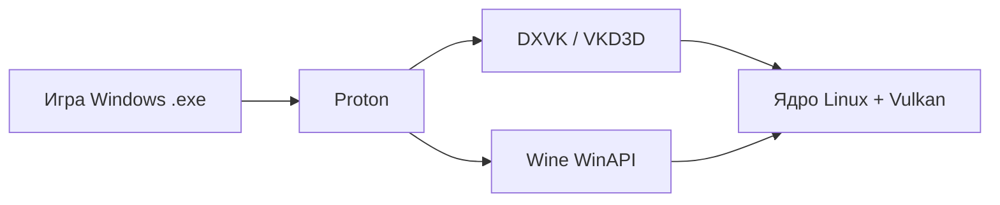

# Linux-гейминг и Proton

  ОБЯЗАТЕЛЬНО
  ДЛЯ НОВИЧКОВ

Всем

Большинство игр в Steam пишутся под **Windows**. На **Linux** их запускают через совместимостьный слой — главным образом **Proton** от Valve. Тот же стек стоит на **Steam Deck** — см. [Steam Deck](/encyclopedia/9-spinoff/9-03-igrovaya-industriya/11432) и [Steam](/encyclopedia/9-spinoff/9-03-igrovaya-industriya/11435). Для разработчиков Linux — целевая платформа indie и live-service с нативными билдами.

---

## Словарь

- **Wine** — слой совместимости WinAPI на Linux без Windows.
- **Proton** — форк Wine от Valve с патчами под игры + DXVK/VKD3D.
- **DXVK** — перевод DirectX 9/10/11 в Vulkan.
- **VKD3D-Proton** — перевод DirectX 12 в Vulkan.
- **D9VK / wined3d** — старые DX paths; реже primary сейчас.
- **Steam Play** — функция Steam включить Proton для Windows games.
- **SteamOS** — дистрибутив на Deck на базе Arch.
- **ProtonDB** — crowd reports совместимости ([protondb.com](https://www.protondb.com/)).
- **Steam Deck Verified** — официальный статус Valve совместимости.
- **Shader cache** — кэш скомпилированных шейдеров; ускоряет повторные запуски.
- **Prefix / bottle** — isolated Wine environment с fake C: drive.
- **Winetricks** — helper install DLLs, fonts.
- **Lutris** — game launcher managing Wine runners.
- **Heroic** — Epic Games Store open source client.
- **Bottles** — GUI Wine prefix manager.
- **EAC** — Easy Anti-Cheat.
- **BattlEye** — anti-cheat kernel driver.
- **Fsr / FSR** — AMD upscaling; Deck uses often.
- **Gamemode** — Feral daemon CPU/GPU priority tweak.
- **MangoHud** — overlay FPS, frametime, GPU stats.
- **Native port** — game binary compiled for Linux directly.

---

## История Wine и Proton

| Год | Событие |
|-----|---------|
| 1993 | Wine project starts — Wine Is Not an Emulator |
| 2000s | Wine runs early DirectX games with limitations |
| 2010 | Steam Linux client launch; native Linux games push |
| 2016 | Vulkan API — foundation for DXVK later |
| 2017 | DXVK by Philip Reichl — DX11 → Vulkan revolution |
| 2018 | Valve announces Proton; Steam Play beta |
| 2019 | Proton 4.x; DXVK integrated; thousands playable |
| 2022 | Steam Deck launch SteamOS 3; Proton experimental default |
| 2023+ | VKD3D-Proton mature for DX12 AAA |
| 2024–26 | Anti-cheat Proton support expands; still gaps |

Valve investment changed Linux gaming from hobby to **viable PC gaming OS** for many users.

---

## Цепочка технологий

- **Wine** translates Windows syscalls and APIs.
- **DXVK/VKD3D** translate graphics to Vulkan drivers.
- **Proton** adds game-specific patches, media codecs, launcher fixes.

---

## Steam Deck

### Hardware summary

- AMD APU Zen 2 + RDNA 2; 800p screen.
- Fixed TDP budget; FSR upscaling common.

### Software

- **SteamOS 3** — read-only root, immutable-ish updates.
- **Proton** default for non-Linux games.
- **Desktop mode** — full KDE for Lutris, browsers.

### Verified tiers

- **Verified** — works out of box UI readable.
- **Playable** — works with minor issues.
- **Unsupported** — may run via Proton manual anyway.
- **Unknown** — not tested by Valve.

См. [Steam Deck article](/encyclopedia/9-spinoff/9-03-igrovaya-industriya/11432), [портативные устройства](/encyclopedia/9-spinoff/9-03-igrovaya-industriya/123).

---

## ProtonDB — как пользоваться

### Рейтинги

- **Platinum** — perfect out of box.
- **Gold** — minor tweaks (proton version, launch options).
- **Silver** — issues but playable.
- **Bronze** — significant problems.
- **Borked** — unplayable.

### Как читать отчёты

- Filter by **GPU** (NVIDIA vs AMD) and **distro**.
- Read **recent** reports after game updates.
- Launch options copied from community: `PROTON_USE_WINED3D=1` etc. — use cautiously.

### Limitations

- Community-sourced; not official Valve warranty.
- Online anti-cheat status changes with patches.

### Before purchase checklist

1. Search game on ProtonDB.
2. Check Steam Deck badge if Deck user.
3. Read anti-cheat section below for multiplayer.
4. Search Reddit r/linux_gaming recent thread.

---

## Включение Proton в Steam

1. **Steam → Settings → Compatibility**.
2. Enable **Enable Steam Play for all other titles** (optional global).
3. Default Proton version: **Proton Experimental** for new releases.
4. Per-game: **Properties → Compatibility → Force specific version**.

### Launch options examples

- `PROTON_LOG=1 %command%` — debug log home directory.
- `DXVK_HUD=fps` — FPS overlay DXVK.
- `WINEESYNC=1` — sync optimization some games.

### Proton versions

- **Proton Experimental** — bleeding edge fixes.
- **Proton GE** (Community GloriousEggroll) — third-party enhanced build via ProtonUp-Qt.

---

## Настройка по GPU

### AMD (recommended on Linux)

- **Mesa** open drivers in kernel; RADV Vulkan.
- Works out of box most distros.
- `radeontop` monitor usage.

### NVIDIA

- **Proprietary driver** required for performance; install from distro or NVIDIA website.
- **Wayland** vs X11 — check game compatibility; XWayland common.
- Newer drivers improve DX12 via VKD3D.
- Issues historically more common than AMD; improving.

### Intel integrated

- **Arc discrete** — Mesa ANV Vulkan; gaming viable mid settings.
- **Integrated Iris** — light games, indie, older AAA low settings.
- Steam Deck class APU = Intel competitor product AMD in Deck.

### General GPU tips

- Update Mesa/NVIDIA driver after major Proton release.
- Vulkan supported mandatory for DXVK path.

См. [Linux admin](/encyclopedia/2-system-network/2-06-sistemnoe-administrirovanie/93).

---

## Античит — EAC и BattlEye

### Problem

- Kernel-level anti-cheat blocked Wine historically.
- Multiplayer **may refuse to launch** even if single-player works.

### Valve initiative

- Epic (EAC) and BattlEye pledged Proton support if dev enables flag.
- **Developer must enable** Linux support in anti-cheat dashboard — not automatic.

### How to check

- ProtonDB reports "anticheat works" or not.
- Official game news patch notes "Steam Deck / Linux".
- [Are We Anti-Cheat Yet](https://areweanticheatyet.com/) community tracker.

### Typical status categories

- **Running** — works on Proton.
- **Planned** — dev announced.
- **Denied** — no Linux support (many competitive shooters).

### Single-player

- Often fine without anti-cheat server connection.
- Some games still fail if launcher loads EAC at start — workarounds vary.

См. [киберспорт](./125) — pro tournaments use Windows overwhelmingly.

---

## Lutris, Heroic, Bottles

### Lutris

- Open source game library.
- **Install scripts** community for GOG, Epic, Battle.net (WoW etc.).
- Wine runners bundled; version management.
- Useful non-Steam games.

### Heroic Games Launcher

- Epic Games Store client.
- Free games weekly; Proton integration.
- Legendary CLI backend.

### Bottles

- Per-app Wine prefix with dependency installer.
- Good for launchers stubborn on default Proton.

### ProtonUp-Qt

- GUI install Proton GE into Steam compatibilitytools folder.

---

## Gaming distros

| Distro | Notes |
|--------|-------|
| **SteamOS** | Deck default; immutable |
| **Bazzite** | Fedora atomic gaming; Deck-like desktop |
| **Nobara** | Fedora tuned NVIDIA/Multimedia |
| **Pop!_OS** | System76; NVIDIA ISO |
| **EndeavourOS / Arch** | Rolling latest Mesa |
| **Ubuntu LTS** | Stable; slightly older drivers unless PPAs |

No single "best"; Arch rolling popular among enthusiasts.

---

## Kernel tweaks

### Gamemode

- Install `gamemode`; Steam launch option `gamemoderun %command%`.
- Requests CPU governor performance, optional GPU clock.

### CPU schedulers

- Most users default kernel fine.
- **CFS** tweaks niche; measure before chasing.

### Low latency kernel

- `linux-lowlatency` optional on Ubuntu for audio; minor gaming effect.

### Huge pages / sysctl

- Advanced; rarely needed consumer gaming.

---

## Shader cache

### Why stutter first launch

- DX12/Vulkan pipeline compile hitch first time area loaded.
- **Shader pre-caching** Steam builds cache in background after download.

### Locations

- `~/.steam/steam/steamapps/shadercache/` per game.
- Copy cache when migrating install optional.

### Deck / SteamOS

- Pre-cache during download if enabled Settings.

### Clear cache troubleshooting

- Delete shadercache folder if corruption after driver update.

---

## Performance tuning

### MangoHud

- Overlay: FPS, frametime graph, GPU temp.
- Launch: `MANGOHUD=1 %command%`.

### FSR

- AMD FidelityFX Super Resolution upscaling in compatible Proton games or via MangoHud variable.

### Esync / Fsync

- Wine synchronization primitives; Proton enables improved defaults.

### CPU cores

- Some old games break on many cores; `taskset` or launch limit affinity.

### Windows vs Linux same game

- DX12 AAA sometimes -5–15% FPS Linux; gap closing.
- Older DX9 games may run **better** Linux DXVK.

### RAM and swap

- 16 GB minimum comfortable AAA.
- **zswap** or **zram** on Deck 16GB helps.

См. [оптимизация игр](/encyclopedia/9-spinoff/9-04-razrabotka-igr/123).

---

## Нативные Linux-игры — примеры

### Native on Steam (examples, list evolves)

- **Counter-Strike 2** — Linux native Vulkan.
- **Dota 2** — native long time.
- **Valheim** — native.
- **Terraria, Stardew Valley** — native.
- **Civilization VI, Borderlands 3** — native builds exist.
- **XCOM 2, Total War entries** — Feral ports.
- **Rocket League** — removed Linux native historically caution example.

### Indies

- **Godot games** often export Linux trivially.
- **Unity / Unreal** — export template if dev enables.

### How to find

- Steam store filter **SteamOS + Linux** tab.
- Icon **Runs on Steam Deck**.

---

## Разработчикам — экспорт Linux

### Why ship Linux

- Steam Deck market; passionate community.
- CI Linux headless server builds.

### Engines

- **Godot** — one-click export .x86_64 binary.
- **Unity** — Linux build target IL2CPP/Mono.
- **Unreal** — Linux cross-compile from Windows or build on Linux.
- **GameMaker** — Linux export paid tier history.

### Testing

- Test Proton **and** native if both offered.
- Ship Vulkan renderer when possible.

См. [платформы геймдева](/encyclopedia/9-spinoff/9-04-razrabotka-igr/118), [Godot](/encyclopedia/9-spinoff/9-04-razrabotka-igr/3).

### Anti-cheat for devs

- Enable EAC/BattlEye Proton flags if multiplayer title.

---

## RetroArch на Linux

- Excellent native port; see [эмуляция](./128).

---

## Чек-лист переезд на Linux

- [ ] Pick distro (Nobara, Bazzite, or existing Ubuntu).
- [ ] Install GPU drivers (NVIDIA proprietary if NVIDIA).
- [ ] Install Steam; enable Proton Experimental.
- [ ] Install Gamemode, MangoHud optional.
- [ ] Check ProtonDB for your game library top 10.
- [ ] Backup saves from Windows cloud or manual.
- [ ] Test multiplayer titles anti-cheat separately.
- [ ] SSD space for shader cache.

---

## FAQ

**Linux gaming viable 2026?**
Yes for large Steam library; check specific titles.

**Что такое Proton?**
Valve Wine fork for Steam games.

**Что такое Wine?**
Windows API compatibility layer.

**Нужна ли Windows license?**
No for Proton path.

**Steam Deck works all Steam games?**
No; Verified subset; many others still run.

**Что такое DXVK?**
DirectX 11 to Vulkan layer.

**Что такое VKD3D-Proton?**
DirectX 12 to Vulkan for Proton.

**Что такое ProtonDB?**
Community compatibility database.

**Platinum vs Gold ProtonDB?**
Platinum perfect; Gold minor tweaks.

**Как force Proton version?**
Game Properties → Compatibility.

**Proton Experimental vs stable?**
Experimental gets fixes first.

**Что такое Proton GE?**
Community enhanced Proton build.

**NVIDIA Linux gaming OK?**
Yes with proprietary drivers; more setup than AMD.

**AMD Linux gaming?**
Excellent Mesa open drivers default.

**Intel Arc Linux?**
Improving; Mesa ANV.

**Почему не запускается EAC game?**
Dev didn't enable Proton anti-cheat.

**BattlEye работает на Proton?**
If developer enabled; check Are We Anti-Cheat Yet.

**Что такое Lutris?**
Launcher for non-Steam Wine games.

**Что такое Heroic?**
Epic Store open client Linux.

**Что такое Bottles?**
Wine prefix manager GUI.

**Что такое Winetricks?**
Install Windows DLL dependencies.

**Что такое prefix?**
Fake C: drive Wine environment.

**Что такое shader stutter?**
Pipeline compile hitch first run.

**Как fix shader stutter?**
Let Steam build shader cache; update drivers.

**Что такое Gamemode?**
Feral CPU/GPU performance daemon.

**Что такое MangoHud?**
Performance overlay.

**Launch option gamemoderun?**
Wraps game with Gamemode.

**Wayland или X11 gaming?**
Varies; XWayland common still.

**Что такое Steam Play?**
Steam feature run Windows games Linux.

**Что такое SteamOS?**
Valve Linux distro Deck.

**Bazzite vs Nobara?**
Both gaming-focused Fedora-based; try both FAQs.

**Native vs Proton performance?**
Native usually better if quality port.

**CS2 native Linux?**
Yes Vulkan native.

**Dota 2 Linux?**
Native long-standing.

**Rocket League Linux?**
Native removed; Proton only.

**Как Epic games Linux?**
Heroic + Proton or Lutris scripts.

**GOG Linux?**
Lutris installers or manual Wine.

**Battle.net Wine?**
WoW often works; Blizzard breaks sometimes.

**Что такое ProtonUp-Qt?**
Install Proton GE GUI.

**Что такое FSR Deck?**
Upscale lower render res.

**Сколько RAM нужно?**
16 GB AAA comfortable.

**Proton log debug?**
PROTON_LOG=1 launch option.

**Игра не видит controller?**
Steam Input settings; SDL gamepad.

**Что такое esync fsync?**
Wine synchronization improvements.

**Export Linux Godot?**
One-click export template.

**Export Linux Unity?**
Build target in build settings.

**Unreal Linux build?**
Cross-compile documentation Epic.

**Anti-cheat dev enable Proton?**
Epic Online Services dashboard EAC flag.

**Что такое r/linux_gaming?**
Main community subreddit.

**Что такое Steam Deck Verified?**
Valve tested compatibility badge.

**Playable vs Verified?**
Playable minor issues; Verified best.

**Windows only game single-player?**
Often works Proton if no kernel anticheat.

**Multiplayer Linux risk?**
Account ban if anticheat triggers; verify support first.

**Dual boot alternative?**
Keep Windows partition for unsupported titles.

**Flatpak Steam issues?**
Sandbox permissions; native package sometimes easier.

**Что такое zram Deck?**
Compressed RAM swap SteamOS.

**Vulkan required?**
Yes for modern Proton DX path.

**OpenGL old games?**
Still works; less optimal path.

**Proton fix launchers?**
Epic/Ubisoft inside Steam add non-Steam game.

**Что такое DXVK_HUD?**
DXVK debug overlay environment var.

**Wine vs Proton difference?**
Proton game-tested Wine + DXVK patches.

**Steam Linux market share?**
Growing with Deck; Valve publishes survey stats.

**Разработчик стоит ли Linux port?**
Deck + goodwill; Proton may suffice first.

**Что такое pressure-vessel Steam?**
Container runtime Steam Linux client.

**Snap Steam on Ubuntu?**
Works; some prefer .deb native.

**Gaming on Fedora?**
Nobara variant popular tuned.

**Arch for gaming?**
Rolling Mesa latest; manual maintenance.

**Pop OS NVIDIA?**
Preinstalled NVIDIA driver ISO easy.

**Что такое Gamescope?**
Compositor scaling Deck; microstutter help.

**Remote Play Linux?**
Steam Link app streams from Windows host alternative.

**Proton and modding?**
Most mod managers Wine; read ProtonDB.

**VR Linux?**
SteamVR Linux experimental niche.

**Что такое vkd3d-proton vs dxvk?**
DX12 vs DX11 translation respectively.

**Secure Boot Linux gaming?**
May block NVIDIA driver signing; disable or enroll MOK.

**TPM Linux gaming?**
Irrelevant most games; Windows 11 reqs separate.

**Best first step new Linux gamer?**
Install Steam enable Proton check ProtonDB library.

---

## Gamescope и compositor

- **Gamescope** — Wayland micro-compositor от Valve; frame limiting, scaling, FSR injection.
- Steam Deck uses Gamescope internally for smooth frame pacing.
- Desktop Linux: `gamescope -W 1920 -H 1080 -f -- steam -gamepadui` experimental setups.

Полезно когда game raw fullscreen misbehaves on multi-monitor.

---

## Dual boot и passthrough (кратко)

- **Dual boot Windows + Linux** — fallback для titles with kernel anti-cheat denied.
- GRUB bootloader; separate NTFS data partition optional shared saves where cloud sync absent.
- **VFIO GPU passthrough** — Windows VM dedicated GPU; advanced, second GPU needed; out of scope beginner but exists for purists.

Most users: Proton first, dual boot second, passthrough niche.

---

## Troubleshooting Proton

| Проблема | Решение |
|----------|---------|
| Launcher hangs | Proton Experimental; Proton GE |
| No audio | Pavucontrol set output; `%command%` pulse env |
| Missing DLL | Winetricks vcrun2019; game protontricks |
| DX12 crash | Update VKD3D-Proton via Proton GE |
| Online won't connect | Check EAC status; may be unsupported |
| CJK fonts boxes | Winetricks cjkfonts |
| Ultra-wide broken | Gamescope force resolution |

Community: r/linux_gaming sticky wiki, Steam community guides per appid.

---

## Дополнительные native и Gold titles (примеры)

- **Hollow Knight, Celeste, Stardew Valley** — indie native staples.
- **Risk of Rain 2, Factorio** — native multiplayer stable.
- **Larian titles (Baldur's Gate 3)** — native Linux day-one example AAA.
- **id software historical** — DOOM engines open; modern id via Proton often Platinum.

Always re-check ProtonDB after major game patch — status flips.

---

## См. также

- [Steam](/encyclopedia/9-spinoff/9-03-igrovaya-industriya/11435)
- [Steam Deck](/encyclopedia/9-spinoff/9-03-igrovaya-industriya/11432)
- [PC как платформа](/encyclopedia/9-spinoff/9-03-igrovaya-industriya/1141)
- [Эмуляция ретро](./128)
- [Киберспорт](./125)
- [Администрирование Linux](/encyclopedia/2-system-network/2-06-sistemnoe-administrirovanie/93)
- [ОС — intro](/encyclopedia/2-system-network/2-01-operatsionnaya-sistema/intro)

---
