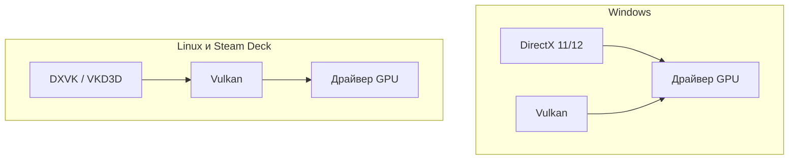

# История DirectX — от DOS до нейросетей

  ОБЯЗАТЕЛЬНО
  ДЛЯ НОВИЧКОВ

Всем

**DirectX** — набор библиотек Microsoft для графики, звука, ввода и сетевой игры на [Windows](/encyclopedia/2-system-network/2-01-operatsionnaya-sistema/2) и [Xbox](/encyclopedia/9-spinoff/9-03-igrovaya-industriya/11431). С 1995 года эта технология шла рука об руку с тем, как [ПК стал игровой платформой](/encyclopedia/9-spinoff/9-03-igrovaya-industriya/114), как менялись [видеокарты](/encyclopedia/2-system-network/2-10-zhelezo/2) и как в [игре](/encyclopedia/1-basics/1-18-kompyuternye-igry/1) вообще появляется картинка на экране.

Краткий словарь для чтения — в [DirectX, OpenGL и Vulkan — простыми словами](/encyclopedia/1-basics/1-18-kompyuternye-igry/7). Практика программирования на C++ — [DirectX — графика и мультимедиа на Windows](/encyclopedia/5-languages/5-06-cpp/2746).

---

## Словарь терминов

| Термин | Что это |
|--------|---------|
| **API** | Набор готовых команд, через которые программа обращается к железу. Игра не пишет драйвер сама — она вызывает API. |
| **GPU** | Графический процессор на [видеокарте](/encyclopedia/2-system-network/2-10-zhelezo/2). Считает треугольники, текстуры, освещение. |
| **Драйвер** | Программа от NVIDIA, AMD или Intel, которая переводит команды API в работу конкретной карты. |
| **Шейдер** | Небольшая программа на GPU. Описывает, как выглядят поверхность, вода, тени. |
| **FPS** | Кадров в секунду. Чем выше, тем плавнее движение на экране. |
| **Полигон** | Плоский треугольник. Из тысяч полигонов собирают 3D-модели. |
| **Текстура** | Картинка, натянутая на полигоны (кирпич, кожа, металл). |
| **Растеризация** | Классический способ рисования 3D — разложение сцены на пиксели без симуляции лучей света. |

Цепочка, общая для DirectX, OpenGL и Vulkan:

Подробнее о стеке — [Графические данные](/encyclopedia/1-basics/1-16-grafika/1) и [компьютерная графика](/encyclopedia/9-spinoff/9-08-kompyuternaya-grafika/1).

---

## PC-гейминг в начале 1990-х

В середине 1990-х консоли **Sega** и **Nintendo** забирали большую долю рынка. **ПК** чаще ассоциировали с офисом и пошаговыми стратегиями. Причина — в устройстве систем.

**MS-DOS** давала играм прямой доступ к железу.

- Видеобуферу — куда писать картинку.
- Звуковой и сетевой карте.
- Клавиатуре и мыши без лишних слоёв.

Платой служила ручная настройка.

- прерывания **IRQ**;
- каналы **DMA**;
- правки файлов `autoexec.bat` и `config.sys`.

Зато игра могла выжать из машины максимум производительности.

**Windows 3.x** и ранний **Windows 95** работали в защищённом режиме поверх DOS. Прямой доступ к железу ограничивали. Часть ресурсов уходила на саму ОС. Разработчики и игроки считали Windows слишком медленной для динамичных игр.

Microsoft понимала, что без игр Windows не станет домашней платформой. Нужен был способ рисовать быстро внутри ОС без возврата к ручной настройке DOS.

---

## WinG в 1994 году

В 1994 году Microsoft выпустила **WinG** — библиотеку для ускоренного вывода **двумерной графики** в окне Windows. Задача — показать, что в ОС можно играть без полного отказа от Windows.

Для демонстрации Microsoft бесплатно портировала **Doom** (**WinDoom**). Демоверсия умела только выводить изображение. Не работали:

- звук;
- сеть;
- джойстики.

Индустрия не поверила в WinG. Проект закрыли с многомиллионными убытками.

Вывод для Microsoft: урезанного порта мало. Игре на Windows нужен полный набор.

- графика;
- звук;
- ввод;
- сеть;
- реальные хиты с полным функционалом.

---

## Рождение DirectX в 1995 году

Параллельно с официальными проектами трое инженеров Microsoft — **Крейг Эйслер**, **Алекс Сент-Джон** и **Эрик Энгстром** — вели разработку под кодовым именем "Манхэттенский проект". Сначала продукт назывался **Windows Games SDK**. В сентябре **1995** он вышел как **DirectX 1.0**.

Идея шире, чем у WinG. DirectX — целый **набор API** для игры на Windows.

| Компонент | Назначение |
|-----------|------------|
| **DirectDraw** | 2D-графика, доступ к видеобуферу |
| **Direct3D** | 3D-примитивы; позже ядро всего стека |
| **DirectSound** | Звук |
| **DirectInput** | Клавиатура, мышь, геймпады |
| **DirectPlay** | Сетевая игра |

Индустрия сначала проигнорировала DirectX. Причины:

- лишняя прослойка между игрой и железом;
- сырые драйверы;
- **FPS** ниже, чем в DOS.

Убедить индустрию помогли готовые игры — в первую очередь Doom 95.

---

## Doom 95 и Windows 95

Осенью 1995 года Microsoft снова обратилась в **id Software** — за полноценным портом **Doom** со звуком и сетью через DirectX. Продюсером порта стал **Гейб Ньюэлл** (позже основатель [Valve](/encyclopedia/9-spinoff/9-03-igrovaya-industriya/11435) и Steam), тогда сотрудник Microsoft.

**Doom 95** показал стабильную картинку и удобный мультиплеер без ручной настройки сети. **Джон Кармак**, технический автор Doom, отнёсся скептически, но порт убедил часть индустрии. Вместе с масштабным релизом **Windows 95** это закрепило образ ОС как платформы для игр. DirectX перестали воспринимать как эксперимент.

---

## DirectX 2 и 3, ранний OpenGL

В **1996** Microsoft купила **Render Morphics** и встроила их движок в **DirectX 2.0** как **Direct3D**.

**Джон Кармак** публично раскритиковал ранний Direct3D. Для одного треугольника требовались громоздкие **execute buffers** — специальные буферы команд. В **OpenGL** хватало нескольких строк кода. Кармак оставался на OpenGL в id Software ещё много лет.

**DirectX 3.0** (1997) закрыл дыры предыдущих версий и принёс для геймеров:

- **DirectPlay** — сеть без ручной настройки IP-адресов и портов;
- **DirectInput** — единая поддержка геймпадов и рулей.

### Пропуск DirectX 4

Четвёртой версии в официальной линейке нет. По одной версии событий фичи не успели к сроку. По другой — цифра **4** в ряде азиатских рынков считается несчастливой, и номер пропустили. Следующим вышел **DirectX 5.0**.

---

## Эпоха 3D — Glide, 3dfx, DirectX 5–7

В конце 1990-х сильную позицию занимала **3dfx** с API **Glide**. Он был быстрым, но закрытым и работал только на картах **Voodoo**. Многие игры лучше всего шли именно на Glide.

Microsoft продвигала **DirectX** как единый стандарт для всех производителей. **NVIDIA** и **ATI** (позже **AMD**) встроили Direct3D в драйверы. 3dfx отказалась от компромисса. К **2000** году компания обанкротилась. NVIDIA заняла лидирующие позиции на рынке.

| Версия | Год | Что изменилось |
|--------|-----|----------------|
| **DirectX 5–6** | 1997–1998 | Развитие Direct3D, несколько текстур на поверхности, сглаживание |
| **DirectX 7** | 1999 | Аппаратная **T&L** — геометрия на GPU |
| **GeForce 256** | 1999 | Первая массовая карта, которую назвали **GPU** |

**T&L** (transform and lighting) переносит на видеокарту расчёт положения вершин и освещения. Раньше этим занимался [процессор](/encyclopedia/1-basics/1-08-kak-rabotaet-kompyuter/4). Без T&L современные 3D-миры на домашнем ПК были бы слишком тяжёлыми.

---

## DirectX 8 и 9, эра шейдеров

### DirectX 8 (2000)

**Программируемые шейдеры** — главный сдвиг десятилетия. Раньше эффекты были зашиты в железо. Теперь разработчик пишет маленькие программы для GPU:

- **вершинный шейдер** — форма и положение модели;
- **пиксельный шейдер** — цвет и материал каждого пикселя.

Первый **Xbox** (2001) — по сути ПК с **DirectX 8** в корпусе. Отсюда имя **DirectX Box**, сокращённое до Xbox. Подробнее — [Xbox Series X и Series S](/encyclopedia/9-spinoff/9-03-igrovaya-industriya/11431).

### DirectX 9 (2002)

**DirectX 9** долго оставался эталоном PC-гейминга.

- **Shader Model 2.0** и язык **HLSL** — шейдеры на понятном языке вместо ассемблера GPU.
- Игры вроде **Half-Life 2** (вода, освещение) и **Far Cry** (большие открытые локации).
- **DirectX 9.0c** (2004) добавил **Shader Model 3.0**, **HDR** (расширенный динамический диапазон яркости), **инстансинг** — отрисовку тысяч одинаковых объектов одной командой. Без инстансинга трудно было бы сделать толпы в *Left 4 Dead* или леса в *Oblivion*.

Многие [киберспортивные](/encyclopedia/9-spinoff/9-03-igrovaya-industriya/125) тайтлы (**CS:GO**, **Dota 2**) годами оставались на DirectX 9. API был стабилен, железо разнообразно, драйверы отлажены.

---

## DirectX 10, Vista и Crysis

**DirectX 10** (2006) вышел вместе с **Windows Vista**. API переписали под **унифицированную шейдерную архитектуру** — один тип шейдерного блока на все задачи. Добавили **геометрические шейдеры**, которые генерируют новую геометрию на GPU.

Технически шаг вперёд. На практике Microsoft жёстко привязала DX10 к Vista. Реклама сводилась к схеме "новая графика — новая ОС и новая видеокарта". Vista на старте критиковали за производительность и совместимость.

**Crysis** (2007) стала витриной DX10. Реклама обещала ультра-настройки только на Vista и DirectX 10. Через несколько недель энтузиасты нашли в конфиге игры заблокированные эффекты. Их включали на **Windows XP** с DirectX 9 — скриншоты совпадали. Метка "только DX10" иногда означала маркетинг, а не реальное ограничение железа.

---

## DirectX 11 и спор вокруг Crysis 2

**DirectX 11** (2009, **Windows 7**) работал и на относительно старом железе. Ключевые новинки:

- **Тесселяция** — разбиение грубых полигонов на мелкие. Нужна для рельефа камней и неровных поверхностей.
- **DirectCompute** — вычисления на GPU. Физика волос, воды, постобработка.
- **Многопоточная запись команд** — лучше загрузка многоядерных CPU.

Патч **Crysis 2** с ультра-настройками для DX11 вызвал расследования в прессе. На плоских стенах включали экстремальную тесселяцию. Под картой Нью-Йорка лежал скрытый объём воды с максимальной детализацией — игрок его не видел, GPU считал каждый кадр.

Карты **NVIDIA Fermi** справлялись с избыточной геометрией лучше **AMD**. Crytek тесно сотрудничала с NVIDIA. AMD позже добавила в драйверы ограничение тесселяции — **FPS** вырос без потери видимого качества.

Так API-фичи и бенчмарки иногда используют для сравнения вендоров, а не только для картинки.

---

## DirectX 12 и новые обязанности разработчика

**DirectX 12** (2015, Windows 10) даёт разработчикам прямой доступ к GPU. Драйвер делает меньше работы "за кулисами". Все ядра CPU могут отправлять команды видеокарте. В удачных сценариях **CPU bottleneck** (узкое место на процессоре) снижается на 50–60 %.

Обратная сторона:

- писать эффективный код под DX12 могут немногие студии;
- издатели требовали галочку "DX12" на старых движках без полноценной переработки;
- **компиляция шейдеров** — в DX11 драйвер собирал шейдеры в фоне; в DX12 это задача игры. При первом появлении объекта возможны **фризы (stutter)**, если кэш шейдеров не прогрет.

На [Linux](/encyclopedia/2-system-network/2-01-operatsionnaya-sistema/5) те же игры часто идут через **VKD3D-Proton** — перевод DX12 в Vulkan. См. [Linux-гейминг и Proton](/encyclopedia/9-spinoff/9-03-igrovaya-industriya/11438).

---

## OpenGL и Vulkan, параллельная линия

DirectX — один из путей от игры к видеокарте. С **1990-х** параллельно развивались открытые кроссплатформенные API.

### OpenGL

**OpenGL** (Open Graphics Library) появился в **1992** на базе IRIS GL компании **Silicon Graphics**. Стандарт открытый — одни и те же команды на разных ОС и у разных производителей GPU.

В середине 1990-х **id Software** рендерила *Quake* и следующие шутеры через OpenGL. Кармак тогда предпочитал его раннему Direct3D.

| Период | Роль OpenGL |
|--------|-------------|
| **1996–2005** | Игры id, Valve, Blizzard; порты на Linux и Mac |
| **2000-е** | **OpenGL ES** — облегчённая версия для мобильных |
| **2010-е** | Архитектура "глобального состояния" мешает многопоточности |
| **2018** | Apple объявила устаревание OpenGL на macOS в пользу **Metal** |
| **2019+** | Khronos Group перевела классический OpenGL в режим поддержки |

OpenGL проще войти новичку. Драйвер скрывает детали, разработчик описывает, *что* нарисовать. Минус — непредсказуемая производительность и слабая работа с несколькими ядрами CPU.

### От Mantle к Vulkan

В **2013** AMD представила **Mantle** — низкоуровневый API с минимальными накладными расходами драйвера, близкий по идее к будущему DirectX 12. Mantle не стал массовым стандартом, но показал запрос на кроссплатформенный низкоуровневый API.

В **2016** консорциум **Khronos Group** выпустил **Vulkan**. Открытый преемник OpenGL по духу, близкий к DX12 по уровню контроля.

- Явное управление памятью и синхронизацией.
- Многопоточная запись команд с CPU.
- Предсказуемая производительность.
- Один API на Windows, Linux, Android, Nintendo Switch.

Шейдеры в Vulkan компилируют в **SPIR-V** или пишут на **GLSL** / **HLSL**. На Windows игра на Vulkan обходит Direct3D, но всё равно идёт через драйвер NVIDIA, AMD или Intel.

### Какие API где встречаются

| API | Кто развивает | Где видит игрок |
|-----|---------------|-----------------|
| **DirectX** | Microsoft | Windows, Xbox; пункты DX11/DX12 в меню |
| **Vulkan** | Khronos Group | Linux, Android, Switch; опция в настройках PC-игр |
| **Metal** | Apple | iPhone, iPad, Mac — единственный путь к GPU |
| **OpenGL** | Наследие | Старые игры, инди, эмуляторы |

На Windows большинство AAA по-прежнему на DirectX. **Vulkan** берут, когда нужен один рендер на PC и Linux (*DOOM Eternal*, движки с Vulkan-бэкендом).

На Linux DirectX напрямую недоступен. **Proton** переводит вызовы DirectX в Vulkan через **DXVK** (DX9–11) и **VKD3D-Proton** (DX12).

Практика для C++ — [OpenGL](/encyclopedia/5-languages/5-06-cpp/2745), [Vulkan](/encyclopedia/5-languages/5-06-cpp/29), [DirectX](/encyclopedia/5-languages/5-06-cpp/2746). Сравнение для разработчиков — [Графические API в разработке игр](/encyclopedia/9-spinoff/9-04-razrabotka-igr/114).

---

## Лучи, нейросети и DirectX 12 Ultimate

### DirectX Raytracing (DXR), 2018

В **DirectX 12** добавили **DXR** — аппаратную **трассировку лучей**. GPU симулирует путь света.

- отражения;
- мягкие тени;
- глобальное освещение.

Раньше такие кадры считали часами на рендер-фермах. В *Cyberpunk 2077* и других AAA — в реальном времени, с оговорками по **FPS**.

Трассировка сильно снижает кадровую частоту. На помощь пришли апскейлеры:

- **DLSS** (NVIDIA) — нейросеть достраивает картинку;
- **FSR** (AMD) — алгоритмический и нейросетевой апскейл;
- **XeSS** (Intel) — аналог для карт Intel.

Игра рендерит кадр в меньшем разрешении, апскейлер увеличивает его до разрешения монитора.

### DirectX 12 Ultimate (2020)

Единый бренд для набора технологий.

| Технология | Смысл |
|------------|--------|
| **Variable Rate Shading** | Меньше детализации в периферии кадра — экономия GPU |
| **Mesh Shaders** | Новая модель геометрии; используется в [Unreal Engine 5](/encyclopedia/9-spinoff/9-04-razrabotka-igr/121) |
| **DirectStorage** | Загрузка с NVMe-диска в GPU в обход CPU — быстрее экраны загрузки |
| **DXR 1.1** | Улучшенная трассировка лучей |

**Xbox Series X|S** и современные PC-игры опираются на этот стек.

---

## DirectX сегодня

DirectX остаётся главным API для игр на Windows и Xbox. На других платформах ту же роль играют **Vulkan** и **Metal**. Классический **OpenGL** — наследие; подробнее в разделе [OpenGL и Vulkan](#opengl-и-vulkan-параллельная-линия).

**DirectX 13** на момент написания не анонсирован. Следующий скачок связывают с **нейросетевым рендерингом** — frame generation, реконструкция освещения. Значительная доля пикселей на экране уже рождается нейросетью, а классическая растеризация дополняет картинку. Игры смешивают обычный рендер, трассировку и DLSS/FSR.

Связанные темы — [ПК как игровая платформа](/encyclopedia/9-spinoff/9-03-igrovaya-industriya/114), [графика](/encyclopedia/1-basics/1-16-grafika/intro), [железо](/encyclopedia/2-system-network/2-10-zhelezo/intro).

---

## Хронология

| Год | Событие |
|-----|---------|
| 1992 | OpenGL — открытый стандарт 3D-графики |
| 1994 | WinG и урезанный WinDoom |
| 1995 | DirectX 1.0; Doom 95; Windows 95 |
| 1996–97 | Direct3D в DX2–3; критика Кармака; DirectPlay/DirectInput |
| — | DirectX 4 пропущен |
| 1999 | DX7, T&L, GeForce 256 |
| 2000 | DX8, программируемые шейдеры; Xbox |
| 2002–04 | DX9 / 9.0c, HLSL, HDR, инстансинг |
| 2006–07 | DX10, Vista, спор вокруг Crysis |
| 2009 | DX11, тесселяция, DirectCompute |
| 2015 | DX12, низкий overhead, stutter шейдеров |
| 2016 | Vulkan |
| 2018+ | DXR, DLSS, FSR |
| 2020 | DirectX 12 Ultimate |

---

## См. также

- [DirectX, OpenGL и Vulkan — простыми словами](/encyclopedia/1-basics/1-18-kompyuternye-igry/7)
- [DirectX — графика и мультимедиа на Windows](/encyclopedia/5-languages/5-06-cpp/2746)
- [Графические API в разработке игр](/encyclopedia/9-spinoff/9-04-razrabotka-igr/114)
- [Компьютерная графика](/encyclopedia/9-spinoff/9-08-kompyuternaya-grafika/1)
- [Linux-гейминг и Proton](/encyclopedia/9-spinoff/9-03-igrovaya-industriya/11438)
- [Steam](/encyclopedia/9-spinoff/9-03-igrovaya-industriya/11435)
- [Игровая индустрия — о разделе](/encyclopedia/9-spinoff/9-03-igrovaya-industriya/intro)
- [Компьютерные игры — о разделе](/encyclopedia/1-basics/1-18-kompyuternye-igry/intro)

---
