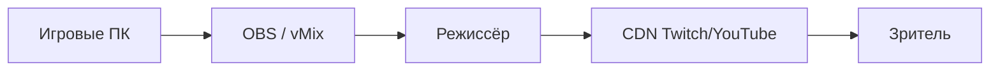

# Киберспорт — как устроена индустрия

  ОБЯЗАТЕЛЬНО
  ДЛЯ НОВИЧКОВ

Всем

**Киберспорт (esports)** — соревновательная игра на профессиональном уровне: команды, лиги, призовые, трансляции, контракты и инфраструктура вокруг мультиплеерных дисциплин. Это отдельная индустрия на стыке спорта, медиа и IT. Деньги, аудитория и правила зависят от издателя игры, региона и дисциплины. Связанные темы: [игровая индустрия](./1), [монетизация](./115), [сообщество](./117), [OBS](/encyclopedia/9-spinoff/9-09-media-kontent/14), [работа в индустрии](./118), [Linux-гейминг](./11438).

---

## Словарь

- **Дисциплина** — конкретная игра в турнирной сетке (CS2, Dota 2, LoL и т.д.).
- **Мета (metagame)** — доминирующие стратегии, персонажи и билды после патча.
- **Скрим (scrim)** — тренировочный матч против команды сопоставимого уровня.
- **LAN** — офлайн-турнир на арене с локальной сетью и минимальной задержкой.
- **Online qualifier** — отборочный этап через интернет до closed qualifier или основного этапа.
- **Closed qualifier** — закрытый отбор с приглашёнными или прошедшими open-командами.
- **Кастер (caster)** — комментатор трансляции; бывает play-by-play и color (аналитик).
- **Desk / analyst desk** — студийный блок с экспертами между матчами.
- **Observer / observer slot** — игрок-наблюдатель для трансляции; отдельная роль в продакшене.
- **Бенч (bench)** — запасной игрок в составе; может выходить при заменах по правилам лиги.
- **Stand-in** — временная замена основного игрока на турнире.
- **Tier 1 / 2 / 3** — уровень лиги и призовых; верхушка — миллионы, большинство команд живёт скромнее.
- **Franchise league** — лига с постоянными слотами клубов (LEC, LCS, VCT partnership).
- **Open circuit** — открытые квалификации без постоянного членства (часть CS, Dota).
- **Prize pool** — призовой фонд турнира; часто дополняется краудфандингом (Compendium Dota).
- **Org (organization)** — организация, владеющая брендом, контрактами и спонсорами.
- **Bootcamp** — интенсивная тренировочная сессия перед турниром, часто на базе org.
- **VOD** — запись матча для разбора.
- **Demo / replay** — файл реплея (CS) или in-game replay (Dota, LoL) для аналитики.
- **Anti-cheat** — VAC, Vanguard, Faceit AC; критично для competitive integrity.
- **Transfer window** — период, когда разрешены переходы между org.
- **Buyout clause** — сумма выкупа игрока из контракта.
- **Streaming rights** — права на трансляцию; часто у издателя или лиги.
- **Merch and branding** — мерч, спонсорские логотипы на форме.
- **Collegiate esports** — университетские лиги и стипендии (США, частично Европа).
- **Sim racing / fighting / mobile esports** — смежные дисциплины с отдельными лигами.

---

## История киберспорта — хронология

| Год | Событие |
|-----|---------|
| 1972 | Spacewar-турнир в Stanford — ранний прецедент соревновательной игры |
| 1980 | Space Invaders Championship от Atari — массовый турнир в США |
| 1997 | Red Annihilation (Quake) — один из первых крупных FPS-турниров |
| 1997 | Основание CPL (Cyberathlete Professional League) |
| 2000 | WCG (World Cyber Games) — глобальные олимпийские форматы |
| 2001 | Основание Major League Gaming (MLG) |
| 2002 | Release Counter-Strike; зарождение CS как дисциплины |
| 2003 | EVO (fighting games) набирает масштаб |
| 2004 | Release World of Warcraft — киберспорт MMO ограничен, но raiding culture |
| 2009 | Release League of Legends; Riot строит экосystem лиг |
| 2011 | The International (Dota 2) — рекordный prize pool через Compendium |
| 2013 | Release CS:GO; ESL One, Majors от Valve |
| 2014 | Twitch acquisition Amazon — инфраструктура стриминга |
| 2016 | Overwatch League анонс franchise model ($20M slots) |
| 2018 | Fortnite World Cup — кроссовер battle royale и esports |
| 2020 | COVID — переход на online; LAN возвращается позже |
| 2020 | Valorant launch; VCT структура от Riot |
| 2023 | CS2 release — замена CS:GO на Source 2 |
| 2024–26 | Консолидация org, кризис части franchise-моделей, рост mobile (MLBB) |

Ключевой урок истории: **дисциплина живёт, пока издатель и аудитория инвестируют**. Quake и StarCraft остались нишами; LoL, CS, Dota держатся на постоянных патчах и лигах.

---

## Крупные дисциплины — обзор

### Counter-Strike 2 (CS2)

- **Жанр** — тактический 5v5 FPS.
- **Издатель / оператор** — Valve; Majors и экosystem через партнёров (ESL, BLAST, PGL).
- **Формат** — MR12, pick/ban карт, economy rounds, coach slot на Majors (правила меняются).
- **Экосистема** — FACEIT, ESEA, региональные лиги; путь через open qualifiers к Major.
- **Регионы** — EU, NA, SA, Asia, Oceania; разная глубина talent pool.
- **Особенности** — демо-файлы для аналитики; высокая ценность aim и teamplay; coach voice rules на LAN.
- **Медиа** — HLTV.org как статистический хаб; рейтинги игроков и команд.

### Dota 2

- **Жанр** — MOBA 5v5.
- **Издатель** — Valve; The International — flagship event.
- **Формат** — draft phase, best-of-3/5 в плей-офф; длинные матчи (30–60+ мин).
- **Prize pool** — частично от продаж Battle Pass (Compendium); historically largest single-event pools.
- **Регионы** — EU, CIS, CN, SEA, SA; DPC (ранее) и open circuit эволюционировали.
- **Роли** — pos 1–5 (carry, mid, offlane, soft/hard support).
- **Аналитика** — OpenDota, Stratz, in-game replay parser.

### League of Legends (LoL)

- **Жанр** — MOBA 5v5.
- **Издатель** — Riot Games; полный контроль franchise-лиг.
- **Лиги** — LCK (Korea), LEC (EMEA), LCS (NA), LPL (China), CBLOL, PCS и др.
- **Worlds** — сезонный финал; региональные слоты по performance.
- **Academy / ERL** — вторые составы и региональные лиги для talent pipeline.
- **Особенности** — salary floor/cap в некоторых регионах; долгий сезон, много матчей.

### Valorant

- **Жанр** — тактический 5v5 hero shooter.
- **Издатель** — Riot; VCT (Valorant Champions Tour).
- **Формат** — agents abilities + gunplay; bo3/bo5 в плей-офф.
- **Структура** — partnership leagues (Americas, EMEA, Pacific, China) + Challengers.
- **Особенности** — моложе CS; быстрый рост prizing; anti-cheat Vanguard на клиенте.

### Другие заметные дисциплины

- **Rocket League** — Psyonix/Epic; 3v3, высокий skill ceiling.
- **Fighting games** — Street Fighter, Tekken; EVO как главный ивент.
- **Mobile Legends / MLBB** — сильный рост в SEA; отдельная экосистема.
- **EA FC / sports** — FIFA/EA FC Ultimate Team и pro clubs; лицензии и сезонность.
- **StarCraft II** — legacy; Korea как исторический центр.
- **Rainbow Six Siege, Apex, PUBG, Overwatch 2** — region-dependent popularity.

Подробнее о платформах и аудитории — [сообщество и контент](./117), [мобильные игры](./1142).

---

## Участники экосистемы

### Издатель (game publisher)

- Владеет IP игры, патчами, античитом, иногда официальной лигой.
- Задаёт правила competitive integrity (cheating, match-fixing bans).
- Распределяет слоты на Majors / Worlds / VCT.
- Примеры: Valve (CS, Dota), Riot (LoL, Valorant), Blizzard (Overwatch), Epic (Fortnite comp).

### Организатор турниров (TO)

- ESL (IEM, Pro League), BLAST, PGL, DreamHack, Riot internal events.
- Продакшн: арена, OBS, observers, casters, prize handling.
- Контракты с org на участие; DMCA и broadcast rights.

### Организация (org / club)

Типичная структура Tier 1 org:

- **CEO / General Manager** — бизнес, спонсоры, бюджет.
- **Team Manager** — логистика, travel, visas, bootcamps.
- **Head Coach** — стратегия, scrim schedule, draft prep.
- **Assistant coach / analyst** — demos, heatmaps, opponent prep.
- **Performance coach / psychologist** — ментал, routines (на топ-уровне).
- **Content creator / social** — YouTube, TikTok; часть monetization org.
- **Players** — 5 основ + 1–2 bench (зависит от дисциплины и контракта).

Org может иметь несколько дисциплин (multigaming): CS + Dota + Valorant под одним брендом (Team Liquid, FaZe, G2, NAVI, T1 и т.д.).

### Игрок

- Ranked grind → semi-pro stack → open qual → signed.
- Обязанности: scrims, official matches, content (по контракту), media days.
- Карьера часто 5–10 лет на топ-уровне; реакция и мotor skills decline с возрастом.

### Трансляция и медиа

- **Play-by-play caster** — описывает действие.
- **Color commentator** — анализ, meta context.
- **Host** — студия, интервью.
- **Observer** — переключает камеры in-game для зрителя.
- **Director** — переключает feed в production truck / remote production.
- **Replay operator** — instant replays.

### Спонсоры и партнёры

- Периферия (мыши, клавиатуры, мониторы).
- Энергетики, телеком, автомобильные бренды.
- Букмекеры — где легально; отдельный блок регулирования ниже.
- Betting sponsors часто запрещены на uniform minors leagues.

### Фанаты и community

- Discord servers org, subreddits, wiki sites (Liquipedia).
- Fantasy leagues, pick'em challenges (Valve, Riot).

---

## Структура org — детально

### Финансы org

- **Revenue**: sponsorships, merch, prize share, content monetization, franchised league revenue share (если есть).
- **Costs**: salaries, facilities, travel, bootcamp housing, coaching staff, legal.
- Многие org **убыточны** годами; инвестиции от VC или кросс-продажа медиа.

### Контракты игроков — типовые пункты

- **Base salary** — фикс в месяц.
- **Prize split** — процент от winnings (часто org берёт 10–30% + org покрывает expenses).
- **Streaming obligation** — часы стрима; revenue split с org.
- **Image rights** — использование likeness в рекламе org.
- **Non-compete / buyout** — условия выхода в другую org.
- **Duration** — 1–3 года типично; renewal options.
- **Termination** — за misconduct, breach; severance varies.
- **Visa support** — для international rosters (особенно NA).

  
Важно

  

  Контракты — юридические документы. Игрокам рекомендуют lawyer review; в CIS и EU практика разная. Мы не даём юридических консультаций.
  

### Bench и roster rules

- LoL: academy roster separate from LEC main.
- CS: 7-man roster на некоторых турнирах с coach as 6th/7th.
- Замены mid-tournament — только если правила и контракт позволяют stand-in.

---

## Зарплаты и призовые — реалистичная картина

### Tier 1 (топ-20 мира)

- **Salaries**: от $15k–50k+ в месяц на игрока в franchise LoL/Valorant (регион зависит; LPL/LCK выше).
- **CS top**: $20k–40k/month для star players в топ-org (оценки сообщества; публичных данных мало).
- **Prize**: Major winner split между 5 + org cut; TI winner — millions per player возможно при historic pool.

### Tier 2

- **Salaries**: $2k–8k/month или semi-pro с part-time job.
- **Prizes** — основной доход; без стабильного контракта.

### Tier 3 / open scene

- Часто **без salary**; только prize и FACEIT/ESEA earnings.
- Игроки совмещают с учёбой или стримом.

### Мифы и факты

- Миф: все про-игроки миллионеры. Факт: медиана **ниже** IT-зарплаты middle dev в том же городе.
- Миф: достаточно быть топ-500 ranked. Факт: нужны networking, stack, luck в qual, org scouting.
- Стриминг: s1mple, TenZ, Shroud — brand **больше**, чем salary многих.

Дополнительно: [работа в игровой индустрии](./118), [выгорание](/encyclopedia/9-spinoff/9-02-kak-ponyat-chto-pora-menyat-rabotu/5).

---

## Тренировки, коучинг и аналитика

### Распорядок дня (типичный bootcamp)

- 10:00 — individual aim / warmup (CS: DM, Aim Lab; LoL: solo queue).
- 12:00 — team scrim block 1 (best-of-3 maps / drafts).
- 14:00 — VOD review с coach.
- 16:00 — team scrim block 2 или theory (map pools, execs).
- 19:00 — ranked или rest; gym / mental по расписанию.

### Скримы

- Booking через Discord contacts других org.
- **Scrim leaks** — NDA между org; penalty за stream sniping scrims.
- Quality scrims > quantity; Tier 1 ищет equal skill.

### Коучинг

- **Head coach** — macro, team culture, draft.
- **Strategist** — set plays, anti-strats на конкретного opponent.
- **Analyst** — data pipeline: demos, ward maps (LoL/Dota), utility usage (CS).

### Аналитика — инструменты

| Дисциплина | Инструменты |
|------------|-------------|
| CS2 | HLTV demos, NadeKing lineups, Skybox, Momentum (сторонние) |
| Dota 2 | OpenDota, Stratz, in-game replay, teamfight breakdown |
| LoL | Oracle's Elixir, Leaguepedia, proprietary scrim tools |
| Valorant | VLR.gg stats, replay review, heatmaps |

### Data roles в IT-смысле

- **Backend** — APIs для scrim booking, stats aggregation.
- **Data engineer** — парсинг replays, ETL в warehouse.
- **Frontend** — dashboards для coach.
- **ML** — opponent tendency prediction (experimental в pro).

См. [тестирование игр](/encyclopedia/9-spinoff/9-04-razrabotka-igr/124), [Python для данных](/encyclopedia/5-languages/5-02-python/intro).

---

## Форматы турниров

### Лига + плей-офф

- Regular season (round-robin) → top N в playoffs.
- Пример: LEC Spring Split → MSI / Worlds qualification.

### Swiss system

- CS Majors: teams с одинаковым record матчатся; 3 wins advance, 3 losses out.

### Double elimination

- Upper и lower bracket; common в open events.

### GSL groups

- 4 teams; winners/losers bracket в группе.

### Battle royale / multi-team

- Points over series (Apex, PUBG); отличается от head-to-head.

### LAN logistics

- **Player PCs** — standardized specs; no internet on stage machines.
- **Admin PCs** — pause, crash restart.
- **Sound** — noise-canceling headsets + white noise on stage.
- **Anti-cheat** — fresh install, USB restrictions.

---

## Трансляции и broadcast tech

### Цепочка сигнала

### OBS и продакшн

- **OBS Studio** — бесплатный стандарт для overlay, scenes, browser sources.
- **vMix / Wirecast** — pro broadcast на LAN finals.
- **NDI** — передача video по сети между machines.
- Подробный гайд: [OBS — стрим и запись](/encyclopedia/9-spinoff/9-09-media-kontent/14), [стриминг](/encyclopedia/9-spinoff/9-09-media-kontent/12).

### In-game observer

- Dedicated observer client (CS GOTV, Dota broadcaster, LoL spectator API).
- Delay 6–10 min на публичных трансляциях anti-ghosting.

### Overlay и graphics

- **HUD** — HP, economy, timers; частично game native, частично broadcast package.
- **Spider charts, gold graphs** — Dota/LoL production plugins.

### Задержка (delay)

- Stream delay vs live audience in arena.
- Coaches на LAN без доступа к stream.

### Аудио

- Comms игроков **не** всегда в эфире (тактика); selective comms clips post-match.

---

## Ставки и регулирование

### Легальность по регионам

- **UK, Malta, некоторые EU** — лицензированные операторы; partnerships с TO.
- **США** — state-by-state; Nevada, New Jersey и др. отдельно.
- **Россия** — букмекерская деятельность лицензируется; реклама ограничена законом.
- **Многие страны Азии** — строгие запреты или серые зоны.

### Integrity

- **Match-fixing** — lifetime bans; примеры scandals в CS:GO history (iBUYPOWER legacy).
- **ESIC** (Esports Integrity Commission) — расследования, cooperation с TO.
- Игрокам **запрещено** ставить на свои матчи по contract и law.

### Реклама букмекеров

- На форме minors tournaments — often prohibited.
- Twitch policies менялись; regional restrictions.

### Возраст

- Турниры 16+ или 18+ depending on game rating и local law.
- Parental consent для minors contracts.

### Антидопинг

- ESL и другие TO тестируют stimulants на LAN.
- Caffeine allowed; amphetamine class — violation.

### Harassment и conduct code

- Riot competitive rulebook; Valve Major handbook.
- Penalties: fines, forfeits, bans for toxic behavior, cheating.

---

## Женский киберспорт

### Текущее состояние

- Большинство top-tier дисциплин **mixed** без gender separation.
- **VCT Game Changers** — отдельная circuit для women Valorant.
- **LoL** — occasional women-only tournaments; основная LEC mixed.
- **CS** — редкие women teams (Nigma Galaxy Female и др.); prize pool меньше.

### Барьеры (обсуждаемые в индустрии)

- Harassment online; toxicity in ranked.
- Pipeline: fewer girls in competitive ranked at youth level.
- Role models и visibility растут медленно.

### Инициативы

- AnyKey diversity guidelines (legacy).
- Riot, ESL women programs и workshops.
- Community leagues: ESL Impact (CS).

### Карьера

- Те же пути: ranked → team → qual; parallel Game Changers path в Valorant.

---

## Collegiate esports (университетский)

### США

- **NACE** (National Association of Collegiate Esports).
- Varsity programs: scholarships для LoL, Rocket League, Overwatch и др.
- Universities: Harrisburg, Maryville, UC Irvine — known programs.
- Path: high school → collegiate → amateur → pro (редко прямой jump).

### Европа

- **British Esports Student Champs** (UK).
- Меньше scholarships; club-based.

### СНГ

- Локальные студенческие лиги; меньше institutional funding.
- Университетские клубы Discord-based.

### IT-пересечение

- Студент CS faculty + esports club = pipeline в broadcast tech, game dev.

---

## Карьерные пути — IT и киберспорт

### Прямо в competitive

1. High ranked + visible stack.
2. Open qualifier run.
3. Tier 3 org → Tier 2 → Tier 1 или streamer path.

### Смежные роли (стабильнее)

| Роль | Навыки | Ссылка на базу |
|------|--------|----------------|
| Broadcast engineer | OBS, vMix, NDI, audio | [OBS](/encyclopedia/9-spinoff/9-09-media-kontent/14) |
| Esports analyst | SQL, Python, replay tools | [Python](/encyclopedia/5-languages/5-02-python/intro) |
| Backend platform dev | Go, Node, PostgreSQL | [разработка](/encyclopedia/4-code-dev/code-dev) |
| Anti-cheat engineer | C++, kernel, security | [C++](/encyclopedia/5-languages/5-06-cpp/intro) |
| Tournament admin | Rulesets, spreadsheets, calm under pressure | [коммуникация](/encyclopedia/1-basics/1-22-kommunikatsiya-i-obschenie/intro) |
| Community manager | Discord, crisis comms | [Discord/Telegram](/encyclopedia/9-spinoff/9-10-internet-kultura/135) |
| Coach / analyst | Game knowledge + soft skills | [гейм-дизайн](/encyclopedia/9-spinoff/9-04-razrabotka-igr/117) |
| Journalist / content | Writing, video editing | [медиа](/encyclopedia/9-spinoff/9-09-media-kontent/intro) |

### Образование

- Game design programs не обязательны; portfolio matters.
- Computer Science → infra roles в TO и publishers.
- Self-taught casters через tier-3 online cups.

### Networking

- Liquipedia contributions, volunteer at local LAN.
- Discord communities org; **не** spam pros for tryouts без track record.

---

## Метагейм и патчи

- Balance patches shift meta weekly/monthly.
- Pro teams on **private patch access** иногда (closed beta PTR).
- **Patch notes literacy** — core skill для analyst.
- Off-season roster changes после disappointing season.

---

## Мобильный киберспорт

- **MLBB (Mobile Legends)** — Southeast Asia stadium finals.
- **PUBG Mobile, Free Fire** — massive viewership in BR, MENA, India.
- Separate org structures; device standardization on LAN.

См. [мобильные игры](./1142).

---

## Кризисы индустрии

- Org shutdowns (2023–24 wave): budget cuts, sponsor pullback.
- Franchise fee burden (OWL historical example).
- Developer layoffs не равны esports death, но связаны.

См. [кризис игровой индустрии](./11).

---

## Практический чек-лист для новичка

- [ ] Выбрать одну дисциплину и довести ranked до competitive threshold.
- [ ] Найти stack с fixed schedule scrims.
- [ ] Записать demo/VOD review habit.
- [ ] Следить Liquipedia calendar open quals.
- [ ] Параллельно — skill IT (OBS, Python, Discord admin) как plan B.
- [ ] Physical health: sleep, wrist care, eye breaks.

---

## FAQ

**Что такое киберспорт простыми словами?**
Профессиональные соревнования в видеоиграх с командами, призами и трансляциями.

**С какого возраста можно начинать?**
Зависит от игры и региона; многие pros начинают в 15–17, peak 18–24.

**Сколько зарабатывает про-игрок?**
От нуля на open scene до десятков тысяч USD в месяц в Tier 1; медиана скромнее мифов.

**Нужно ли учиться в универе?**
Не обязательно для pro path; полезно для IT-fallback и collegiate scholarships в США.

**CS2 или Valorant для старта в 2026?**
Оба живы; CS глубже legacy, Valorant растёт с Riot infrastructure.

**Как попасть в Tier 1 org?**
Ranked visibility + tier-2 results + networking; иногда через academy.

**Что такое скрим?**
Тренировочный матч команда на команду вне официального турнира.

**Чем LAN отличается от online?**
Нулевая ping variance, stage pressure, другой mental stack.

**Что такое Major в CS?**
Championship от Valve с stickers, high prize, legend status.

**Что такое The International?**
Главный турнир Dota 2 от Valve, часто с огромным prize pool.

**Что такое Worlds в LoL?**
Финал сезона Riot; regional champions compete.

**Кто такой observer на трансляции?**
Человек, переключающий in-game camera для зрителей.

**Нужен ли OBS для про-игрока?**
Для стрим-обязательств org — да; для gameplay — нет.

**Легальны ли ставки на киберспорт?**
Зависит от страны; всегда проверяйте local law.

**Можно ли ставить на свой матч?**
Нет; match-fixing ban и criminal liability.

**Есть ли женская лига?**
Да в Valorant Game Changers; в других дисциплинах — отдельные ивенты или mixed only.

**Что такое Game Changers?**
Women circuit в Valorant от Riot.

**Что такое bench player?**
Запасной в roster; может заменить основного по правилам.

**Сколько длится карьера?**
Часто 5–10 лет на top; transition в coach/analyst/stream common.

**Что такое мета?**
Доминирующие стратегии текущего патча.

**Как стать кастером?**
Практика на tier-3 streams, demo reel, networking с TO.

**Что такое franchise league?**
Постоянные слоты org за fee; пример — LEC, VCT partnership.

**Что такое open qualifier?**
Открытый отбор для любых команд по регистрации.

**Нужен ли античит на LAN?**
Да; VAC live, fresh installs, admin control.

**Как связаны Twitch и киберспорт?**
Основная платформа broadcast; exclusivity deals на ивенты.

**Что такое HLTV?**
Статистика и новости CS; рейтинг teams/players.

**Что такое Liquipedia?**
Community wiki турниров и roster history.

**Как burnout влияет на pros?**
Chronic grind без rest → performance drop; orgs add psychologists.

**Можно ли совмещать учёбу и pro?**
На Tier 3 часто да; Tier 1 full-time expected.

**Что такое bootcamp?**
Сбор команды на gaming house перед турниром.

**Какие IT-skills полезны в esports?**
Python analytics, OBS, backend для stats sites, Discord bots.

**Что такое prize split?**
Деление призовых между игроками и org по контракту.

**Что такое buyout?**
Сумма для release игрока из контракта в другую org.

**Работает ли киберспорт в России?**
Локальные турниры и CIS scene; international travel зависит от visas и events.

**Что такое ESL Pro League?**
Premium CS league; long season, many top teams.

**Чем отличается coach от analyst?**
Coach leads strategy and team; analyst focuses data and prep.

**Нужна ли команда для старта?**
Solo queue path exists но team games требуют stack of 5.

**Что такое tier list команд?**
Неофициальный ranking силы; HLTV для CS, VLR для Valorant.

**Как смотреть матчи бесплатно?**
Twitch, YouTube official channels турниров.

**Что такое VCT?**
Valorant Champions Tour — структура турниров Riot.

**Почему org закрываются?**
High costs, weak sponsorship ROI, investor pullback.

**Есть ли киберспорт в школах?**
Растёт club activity; formal programs region-dependent.

**Что такое performance coach?**
Специалист по mental prep, routines, stress на LAN.

**Как записать demo CS2?**
Automatic match download; `.dem` files for review.

**Что такое DPC в Dota?**
Dota Pro Circuit — historical ranking system для TI invites (rules evolved).

**Можно ли играть на Linux pro?**
Редко на турнирах; стандарт Windows. См. [Linux gaming](./11438).

**Что такое content creator в org?**
Игрок или отдельный person creating YouTube/TikTok under org brand.

**Какие дисциплины самые богатые?**
LoL, CS, Dota, Valorant в top; mobile huge by viewership in Asia.

**Что такое stand-in?**
Temporary replacement player на турнире.

**Как работает anti-ghosting?**
Stream delay; no crowd info to players on stage.

**Что такое pick/ban?**
Фаза выбора и запрета карт или героев перед матчем.

**Нужен ли gaming house?**
Tier 1 often yes для synergy; Tier 3 remote common.

**Как начать volunteer на турнире?**
Local LAN events, TO applications, production assistant roles.

---

## См. также

- [Игровая индустрия](./1)
- [Монетизация](./115)
- [Сообщество и контент](./117)
- [Работа в игровой индустрии](./118)
- [Мобильные игры](./1142)
- [OBS — стрим и запись](/encyclopedia/9-spinoff/9-09-media-kontent/14)
- [Linux-гейминг и Proton](./11438)
- [Discord и Telegram для IT](/encyclopedia/9-spinoff/9-10-internet-kultura/135)

---
