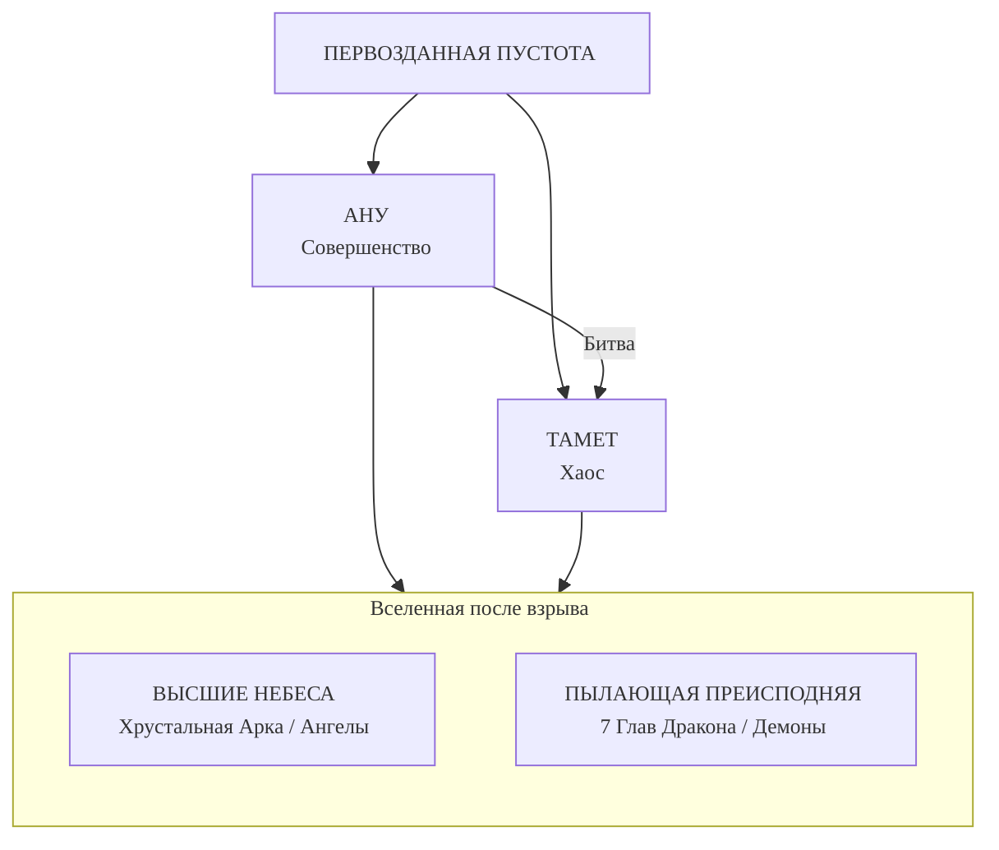
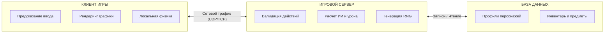

# Diablo

  ОБЯЗАТЕЛЬНО
  ДЛЯ НОВИЧКОВ

Всем

---

## Что такое Diablo?

**Diablo** — серия [компьютерных игр](/encyclopedia/1-basics/1-18-kompyuternye-igry/intro) в жанре [Action RPG](/glossary/R#rpg) (ролевой экшен с прокачкой уровня и навыков; бой идёт в реальном времени, без пошаговых ходов). Издатель и правообладатель — [Blizzard Entertainment](/encyclopedia/9-spinoff/9-03-igrovaya-industriya/intro). Серия задала канон для поджанра [Hack and Slash](/glossary/H#hack-and-slash) и [диаблоидов](/glossary/Д#диаблоид) — игр с [изометрической](/glossary/И#изометрия) камерой, [лутом](/glossary/Л#лут) и процедурными подземельями.

Действие разворачивается в мире **Санктуарий**. Игрок ведёт героя через подземелья, убивает монстров, получает опыт, улучшает характеристики и собирает экипировку со случайными свойствами. Сюжет строится вокруг войны Небес, [Пылающего Ада](#лор-и-мифология) и [Великих воплощений зла](/glossary/Д#диабло), главное из которых — [Диабло](/glossary/Д#диабло), повелитель ужаса.

---

## История серий и дополнений

Хронология релизов:

| Часть | Год | Студия | Кратко |
| :--- | :--- | :--- | :--- |
| Diablo | 1996 | Condor → Blizzard North | Три класса, [Battle.net](/glossary/B#battlenet), рождение Action RPG |
| Diablo II + Lord of Destruction | 2000–2001 | Blizzard North | Пять актов, [гринд](/glossary/Г#гринд), рунные слова |
| Diablo III + Reaper of Souls | 2012–2014 | Blizzard Irvine | Онлайн-обязательность, рифты, Loot 2.0 |
| Diablo Immortal | 2022 | NetEase + Blizzard | Мобильная free-to-play |
| Diablo IV | 2023+ | Blizzard | Открытый мир, возврат к мрачному тону |

Первые две части создавала **Blizzard North** (бывшая Condor) в Калифорнии; с третьей части основную разработку вела штаб-квартира Blizzard в Irvine.

---

## Diablo (1996)

Первая часть вышла 31 декабря 1996 года и стала эталоном [Action RPG](/glossary/R#rpg). Игрок спускается из деревни **Тристрам** в шестнадцать уровней подземелий и выбирает одного из трёх классов — **Воина**, **Разбойницу** или **Волшебника**. За игрой стоит история студии **Condor**, которая упростила хардкорный [рогалик](/glossary/Р#рогалик) до формата, понятного широкой аудитории.

---

### Истоки Condor и рождение идеи

**Дэвид Брейвик** (род. 1968) с детства программировал и играл в настольные [RPG](/glossary/R#rpg) вроде Dungeons & Dragons. Название "Diablo" он придумал в 1984 году, живя в Калифорнии у горы Mount Diablo.

Соратники — братья **Эрик** и **Макс Шифер**. Макс отвечал за архитектуру локаций, Эрик проектировал подземелья. В компании FMB Ives троица сделала платформер **Gordo 106** (Atari Lynx, 1993). Продажи провалились, но команда основала **Condor Software** (1993).

Чтобы платить зарплаты, Condor взяла заказ на файтинг **Justice League Task Force** (Sunsoft). В штат пришёл композитор **Мэтт Ульман**. На выставке CES 1994 команда показывала заказную игру и параллельно искала издателя для Diablo по **дизайн-документу** — текстовому описанию механик, сюжета и технических требований.

---

### Rogue, кризис RPG и новая формула

В середине 1990-х издатели опасались перегруженных партийных [RPG](/glossary/R#rpg) с длинным текстом и багами. При этом аудитория D&D давно делилась на ролевиков и на тех, кто предпочитает "рубить и собирать золото".

Из второй группы в 1980 году выросла текстовая игра **Rogue** — прародитель [рогаликов](/glossary/Р#рогалик). Типичные правила жанра:

- одна жизнь — при смерти сохранение удаляется;
- [процедурная генерация](/glossary/П#процедурная-генерация) этажей и предметов;
- пошаговый бой — враг и герой ходят по очереди.

Diablo взяла эту основу и упростила управление:

- **Мышь** заменила длинные комбинации клавиш Rogue.
- **Три класса** вместо десятков рас и профессий.
- **Сохранения в городе** смягчили permadeath (полная потеря персонажа при одной смерти).

Брейвик шутливо называл результат "рогаликом для мам" — вход в жанр стал заметно ниже.

---

### Слияние с Blizzard и переход в реальное время

На CES 1994 Condor познакомилась со студией **Silicon & Synapse**, которая делала другую версию Justice League. Обе команды сблизились из-за любви к ПК. Silicon & Synapse переименовалась в **Blizzard Entertainment**, заработала на WarCraft и **купила Condor**, переименовав её в **Blizzard North**.

Брейвик изначально программировал **пошаговый** бой. Blizzard настаивала на **real-time** — действия происходят непрерывно, без очереди ходов. Брейвик переписал прототип за несколько часов и убедился, что темп стал выше. Так оформился поджанр **Action RPG**.

Атмосферу усилили кат-сцены от художников Blizzard. В финале герой вонзает **камень души** себе в лоб — один из самых обсуждаемых моментов серии. Популярность подстегнул диск Microsoft с демо DirectX (около двух миллионов копий).

**Мультиплеер** добавили в последний момент. Код был сырой, но за первый год на [Battle.net](/glossary/B#battlenet) зарегистрировалось полтора миллиона аккаунтов; весь сервис работал на одном физическом сервере.

---

### Особенности игрового процесса

- **Процедурные подземелья** — планировка, монстры и [лут](/glossary/Л#лут) меняются при каждом новом спуске ([процедурная генерация](/glossary/П#процедурная-генерация)).
- **Автокарта** — игра сама рисует пройденные коридоры; новичку не нужно заранее знать лабиринт.
- **Четыре зоны** — у каждой свой алгоритм генерации (монастырь, катакомбы, пещеры, ад).
- **Прокачка** — за уровень даётся 5 очков в характеристики:
  - **сила** — урон в ближнем бою;
  - **ловкость** — точность и броня;
  - **интеллект** — запас маны;
  - **живучесть** — запас здоровья.
- **Заклинания** лежат в подземелье свитками и книгами; игра не выдаёт их автоматически с уровнем.

---

### Классы персонажей

- **Воин** — ближний бой, много здоровья, умеет чинить оружие и броню. Проще всего для новичка, но страдает от лучников на ранних этажах.
- **Разбойница** — лук, дистанция, обнаружение ловушек. Требует тактики (выманивать врагов в узкие проходы). Обычно качает только ловкость.
- **Волшебник** — магия на расстоянии. В начале не хватает маны, к концу игры становится самым сильным классом.

---

### Лут, инвентарь и психология добычи

Главный мотиватор — **случайная награда**. Из Rogue переняли **неопознанные предметы**: пока вещь не идентифицирована у торговца, свойства скрыты, и каждый дроп ощущается как "лотерея".

Цвета редкости:

- **белый** — обычный предмет без бонусов;
- **синий** — магический, с одним-двумя свойствами;
- **золотой** — уникальный, с фиксированным набором свойств.

Имена генерировались процедурно: к "мечу" добавлялись суффиксы вроде "быстроты" или "огня". Игра почти не наказывала игрока голодом или безумием — каждый следующий скелет мог принести редкий топор. Так работает **переменное подкрепление** (variable reward): награда не гарантирована, но ожидается постоянно.

**Инвентарь** — сетка как в Tetris, идею позаимствовали из X-COM. Крупное оружие занимает несколько клеток, зелья — одну. Мало места заставляет выбирать, что нести дальше.

---

### Сюжет, локации и монстры

**Тристрам** — деревня-хаб с церковью на окраине. Отсюда игрок спускается в подземелья.

| Зона | Что внутри |
| :--- | :--- |
| Монастырь | Самая "чистая" зона; комната босса **Мясника** |
| Катакомбы | Хаотичные коридоры |
| Пещеры | Лава, узкие проходы |
| Ад | Финальные уровни перед **Diablo** |

**Сюжет.** [Диабло](/glossary/Д#диабло) веками спал в камне души. Он подчинил архиепископа **Лазаря**, свёл с ума короля **Леорика**. Сын короля **Альбрехт** стал телом для демона; вокруг Тристрама расплодились нежить и черти.

**Монстры** — скелеты, суккубы, адвокаты дьявола. Из-за лимита памяти один спрайт перекрашивали в разные цвета, меняя силу врага. На одном этаже могло быть не больше **трёх типов** монстров.

**Коровий уровень** — мем из кликов по декоративным коровам в Тристраме. Blizzard ответила чит-кодом в StarCraft ("there is no cow level"); полноценный секретный уровень появился в Diablo II.

---

### Музыка и мультиплеер

**Мэтт Ульман** случайно набрал знаменитый аккорд темы Тристрама на 12-струнной гитаре. В подземельях звучит эмбиент с криками и ударами — давящая атмосфера.

В **кооперативе**:

- здоровье монстров умножается на четыре;
- действует **friendly fire** — свои заклинания и стрелы бьют союзников;
- несмотря на сырой сетевой код, кооп стал частью успеха игры.

---

### Как игра ощущается сегодня

- персонаж **не бегает**, только ходит;
- **пиксель-хантинг** — лут в темноте ищут кликами по полу;
- у врагов **нет полоски здоровья**.

Механики 1996 года до сих пор определяют [диаблоиды](/glossary/Д#диаблоид).

---

### Hellfire (1997)

После релиза команда выгорела за восьмимесячный **кранч** (режим сверхурочной работы перед дедлайном) и передала дополнение студии **Synergistic Software**.

Hellfire добавил:

- зоны **Склеп** и **Улей**;
- класс **Монах**;
- быструю ходьбу по Тристраму.

В коде остались вырезанные **Бард** и **Варвар** (доступны через моды). Battle.net дополнение официально не поддерживало. Лор Hellfire в основной канон не входит, но механики повлияли на серию.

---

### Порт на PlayStation (1998)

[Electronic Arts](/encyclopedia/9-spinoff/9-03-igrovaya-industriya/112) выпустила порт на PS1:

- разрешение **320×200** (PC-версия — 640×480);
- управление на **геймпаде**;
- **локальный кооператив** на одном экране.

Для российских игроков известен пиратский "пацанский" перевод Kudos с переосмысленными диалогами.

---

## Diablo II (2000)

Вторая часть — одна из самых влиятельных [Action RPG](/glossary/R#rpg) в истории. Сюжет продолжается через несколько лет: герой первой части, одержимый [Диабло](/glossary/Д#диабло), уходит на восток **Тёмным странником**. Игрок идёт по его следу и параллельно слушает рассказ старика **Мариуса** в кат-сценах.

Разработка шла без формального дизайн-документа: идеи рождались на собраниях, часть механик Брейвик придумывал в душе.

---

### Разработка в Blizzard North

После Diablo I команда взяла полугодовой отпуск, затем села за сиквел.

- **Воксельный движок** — эксперимент с объёмными пикселями; герои и монстры выглядели плохо, от идеи отказались.
- **2D-спрайты** с продвинутым освещением и [изометрией](/glossary/И#изометрия) — финальный визуальный стиль.
- **"Бумажная кукла"** — каждый предмет на персонаже виден на модели; то же для некоторых врагов.
- Релиз перенесли с 1999 на **2000 год**; разработчики жили в офисе. **Эрик Шифер** уехал на свадьбу прямо с рабочего места.

---

### Что изменилось по сравнению с первой частью

| Аспект | Diablo (1996) | Diablo II (2000) |
| :--- | :--- | :--- |
| Темп боя | Псевдо-пошаговый | Полный real-time |
| Передвижение | Только ходьба | **Бег** и шкала выносливости (стamina) |
| Локации | Подземелья | Подземелья **и** открытые зоны |
| Навыки | Случайные книги | **Древо навыков** (30 на класс) |
| Смерть | Перезагрузка сейва | Возрождение в городе, **corp run** за телом |

**Открытый воздух** в студии обсуждали спорно: боялись потерять гнетущий хоррор тесных коридоров. Компромисс дал смену дня и ночи, погоду и контраст между полем и склепом.

**Бесшовные акты** — карта генерируется целиком для одного акта, без экранов загрузки между зонами. **ИИ по дистанции** — враги "просыпаются" только рядом с игроком, иначе процессор не тянул бы огромные карты. От активированного врага можно убежать.

---

### Древо навыков и классы

В первой части книги заклинаний выпадали случайно. Во второй каждый класс получил **три ветки по десять навыков** (всего 30), по аналогии с деревом технологий Civilization.

- **Амазонка** — лук, арбалет, дротики; боезапас ограничен.
- **Паладин** — ауры, усиливающие группу (идею подсмотрели у Барда в EverQuest); популяризировал классовые щиты.
- **Волшебница** — огонь, лёд, молнии; топовые посохи стоят очень дорого.
- **Некромант** — призыв и проклятия; навык **"Взрыв трупа"** начался как шутка на совещании.
- **Варвар** — двуручное оружие, высокая скорость; "ману" назвали **энергией**, заклинания — **способностями**; появились **гнёзда** под камни.

**Смерть в одиночной игре.** Персонаж воскресает голым в городе, теряет часть золота. За телом и экипировкой нужно вернуться самому — **corpse run** через толпу врагов.

---

### Сюжет по актам

Две линии идут параллельно: действия игрока и исповедь **Мариуса** о пути за Тёмным странником.

**Акт I — Лагерь разбойниц**

- кладбище и босс **Кровавая ворона** (отсылка к первой части);
- спасение **Декарда Каина** из руин Тристрама;
- труп **Вирта** с деревянной ногой — ключ к коровьему уровню;
- финальный босс **Андариэль** (споры с цензурой из-за дизайна).

**Акт II — Лут-Голейн**

- восточная пустыня, **Хорадрический куб** для крафта;
- **Тайное святилище** — лабиринт "в космосе";
- босс **Дуриэль** в тесной комнате с ледяным уроном.

**Акт III — Кураст**

- болота-лабиринт;
- квест с органами жреца **Калима** (изначально планировали "съедобные" органы — отказались);
- враги **фетиши** с шаманами;
- босс **Мефисто**.

**Акт IV — Преисподняя**

- всего четыре локации — самый короткий акт;
- **Адская кузня**, пять печатей, финальный **Diablo**.

---

### Лут, гринд и сложности

Новые типы предметов:

- **серый** — с гнездом под камень;
- **тёмно-золотой** — уникальный;
- **зелёный** — часть **сета** (бонус за полный комплект);
- **руны** — комбинируются в **рунные слова** на предметах.

**Хорадрический куб**, **талисманы** и **камни** расширили крафт.

Мир **обновляется** при каждом заходе; боссов можно убивать снова и снова (**фарм**). Blizzard добавила штраф к опыту и [луту](/glossary/Л#лут) при повторных убийствах одного босса.

Постоянный фарм превратил "может, сейчас выпадет" в расчёт вероятностей — так закрепился **[гринд](/glossary/Г#гринд)**. Сложности **Nightmare** и **Hell** дают врагам **иммунитеты** к физике или магии.

---

### Мультиплеер, звук и патчи

- **Ладдер** — таблица топ-1000 игроков на [Battle.net](/glossary/B#battlenet).
- Гонка за **99 уровнем** породила тактику "добить босса через портал в следующей сессии".
- **Мэтт Ульман** и **Скотт Питерсон** добились **аудио-читаемости** — по звуку понятно, что упало и какой удар прошёл. Звук камней записывали разбиванием бокалов.
- Версия **1.01** — наёмников нельзя воскрешать, маленький сундук, нет "починить всё". Патчи до **1.14** добавили ману у торговцев и ивенты **Uber Diablo**, **Pandemonium**.

---

### Lord of Destruction (2001)

Расширение завершает сюжет **Баала**. Разрабатывалось около года без кранча первой игры.

**Акт V — горы варваров**

- снег и финальный босс **Baal**;
- **Шенк Надзиратель** — пасхалка в честь продюсера Фила Шенка;
- бой с **тремя древними варварами** на вершине;
- **Тираэль** уничтожает осквернённый **Камень мира**.

**Новые классы**

- **Ассасин** — когти, ловушки, невидимость;
- **Друид** — волк и медведь (формы птицы и оленя отвергли как неугрожающие).

---

## Diablo III (2012)

Третья часть вышла в **мае 2012 года** — через десять лет после анонса (2008). За это время распалась **Blizzard North**, ушли Брейвик и Шиферы, новая команда **переписала игру с нуля**. Релиз сопровождался перегрузкой серверов и скандалом с аукционом; спасение принесло дополнение **Reaper of Souls** (2014).

---

### Кризис в Blizzard North и "Проект ИКС"

После Diablo II студия ушла в длительный отпуск. Основатели не хотели бесконечно делать один и тот же сиквел и искали новые IP в рамках **"Проекта ИКС"**.

Отменённые или замороженные идеи:

- второе дополнение к Diablo II с классом **клирик** (лекарь);
- **Iron Monkey** — классическая [RPG](/glossary/R#rpg);
- **Titan City** — супергерои;
- **Project Head Hunter** — [MMO](/glossary/M#mmo) в духе Blade Runner;
- **Star Blo / Diablo Star** — sci-fi экшен с полётами между планетами;
- **Dragon's** — эпизодическая игра про драконов (закрыта после внутреннего скандала и проблем с артом).

Пока решения не принимались, часть команды играла в Counter-Strike. Штат вырос до 60+ человек; Брейвик перестал знать сотрудников в лицо, начались конфликты.

---

### Конец Blizzard North и новая команда

В 2003 **Vivendi** (владелец Blizzard) урезала бюджеты. Брейвик и Шиферы попытались уйти как рычаг давления — как перед релизом Diablo II. На этот раз Vivendi приняла отставку **30 июня 2003 года**. Blizzard North закрыли, сотрудников переводили в Irvine по одному.

Новая команда полностью переделала Diablo III. На релизе фанаты увидели знакомые архетипы:

- **Варвар** и **Чародей** — прямые наследники D2;
- **Охотник на демонов** — дальний бой Амазонки + ловушки Ассасина;
- **Колдун** (Witch Doctor) — вуду-версия Некроманта;
- **Монах** — отсылка к Hellfire.

Структура актов повторяла D2 (город → пустыня → снег). Главное техническое новшество — полностью **3D-движок** ([3D-графика](/glossary/3#3d-графика)).

---

### Смена стиля и механик

**Визуальный стиль** после World of Warcraft стал ярче и "мультяшнее", чем мрачная готика первых частей. Много цветных спецэффектов — в больших боях экран перегружается. Камеру приблизили.

**Навыки**

- дерева навыков нет;
- способности открываются с уровнем автоматически;
- игрок назначает их на **6 кнопок**;
- **руны** меняют эффект умения;
- **билд** можно сбросить в любой момент.

**Ресурсы и лечение**

- пояс с десятками зелий убрали;
- зелье — способность с **кулдауном** (перезарядкой);
- из врагов падают **сферы здоровья**;
- у каждого класса свой ресурс (**ярость**, **энергия**, **дух** и т.д.).

**Инвентарь**

- предметы занимают **одну ячейку** — Tetris-упаковки нет;
- классовые ограничения на оружие сняты.

Семь классов: **Варвар**, **Колдун**, **Чародей**, **Монах**, **Охотник на демонов**, **Крестоносец** (Reaper of Souls), **Некромант** (2017).

---

### Сюжет, лор и проблемы запуска

**Сюжет кампании**

- на собор падает "звезда" — ангел **Тираэль**;
- герой собирает его меч, сражается с **Мясником**, **Леориком**, **Белиалом**, **Азмоданом**;
- **Адрия** предаёт группу; её дочь **Лия** — сосуд для [Диабло](/glossary/Д#диабло);
- **Чёрный камень души** объединяет силу семи воплощений зла; финал — штурм Небес.

Игрока называют **нефалемом** — потомком ангелов и демонов. Это контрастирует с первыми частями, где герой был "простым" человеком.

**Лор (кратко).** Ангел **Инарий** и **Лилит** создали **Санктуарий** и спрятали его **Камнем мира**. Подробнее — в разделе [Лор и мифология](#лор-и-мифология).

**Error 37.** Игра требует **постоянного онлайна**, даже в одиночной кампании. В первые дни серверы легли; клиент показывал **Error 37** ("игровые серверы недоступны"). План продать 7 млн копий за год выполнили за несколько дней — инфраструктура не выдержала.

**Аукционный дом.** Онлайн частично оправдывали защитой торговли за **реальные деньги** и игровое золото. Игроки фармили золото на статичных маршрутах (например, разбивали горшки в акте), а не сражались с монстрами. Аукцион закрыли **осенью 2013 года**.

---

### Reaper of Souls (2014)

Дополнение перезапустило репутацию игры.

- **Малтаэль** — бывший ангел мудрости, ставший ангелом смерти;
- локации **Вестмарш** и **Пандемонium** вернули мрачный тон;
- класс **Крестоносец**;
- **Loot 2.0** — [лут](/glossary/Л#лут) привязан к классу, легендарки сильно меняют билд;
- **Парагон 2.0** — прогресс после 70 уровня;
- **Режим приключений** — бесконечные **рифты** (Nephalem Rifts) без сюжета; появились **сезоны**.

**Консоли** (PS3, Xbox 360, позже PS4/Xbox One): радиальное меню предметов, **перекаты**, упрощённый инвентарь — удобнее для игры с геймпада.

---

### Rise of the Necromancer (2017)

DLC вернул **Некроманта**, добавил уникальные предметы и режим **Портал дерзаний** для проверки билдов.

---

### Судьба основателей Blizzard North

- **Дэвид Брейвик** — Flagship Studios, **Hellgate: London**; позже **Marvel Heroes**, инди **It Lurks Below**.
- **Эрик и Макс Шифер** — **Runic Games**, серия **Torchlight**. Вторую часть фанаты часто сравнивают с "ожидаемой" Diablo III.

После ухода основателей серию продолжила команда Blizzard в Irvine — с другим визуальным языком, другой экономикой и упором на бесконечный эндгейм.

**Смотрите также:** [Diablo IV (2023)](#diablo-iv-2023), [Diablo Immortal (2022)](#diablo-immortal-2022), [122 — обзор инноваций в индустрии](/encyclopedia/9-spinoff/9-03-igrovaya-industriya/122).

---

## Diablo II Resurrected (2021)

Ремастер Diablo II (2021): оригинальный геймплей сохранён, [3D-графика](/glossary/3#3d-графика) и модели перерисованы в высоком разрешении.

---

### Технические особенности

- **Графика** — перерисовка спрайтов и окружения до 4K.
- **Режимы** — переключение между классической 2D-картинкой и новой 3D-моделью.
- **Мультиплеер** — кроссплатформенная игра.
- **Общий сундук** — хранилище предметов на весь аккаунт.

---

## Diablo IV (2023)

Четвёртая часть (2023) вернула мрачный тон первых игр и добавила **открытый мир** без загрузок между регионами. Подробнее о тренде open world — в [обзоре инноваций](/encyclopedia/9-spinoff/9-03-igrovaya-industriya/122).

---

### Особенности мира

- **Открытый мир** — пять крупных регионов без загрузочных экранов между зонами.
- **Процедурные подземелья** — [процедурная генерация](/glossary/П#процедурная-генерация) планировки при каждом заходе.
- **Динамические события** — активности в мире меняют поведение монстров и награды.
- **Классы** — Варвар, Чародей, Друид, Разбойник, Некромант (+ Наследник духов в дополнении).

---

### Vessel of Hatred (2024)

Первое крупное дополнение к четвертой части, продолжающее сюжетную линию.

---

#### Нововведения
*   **Новый регион** — Наханту, джунгли, полные древних тайн и опасностей.
*   **Новый класс**: Наследник духов, использующий силы четырех духов-хранителей.
*   **Захват Мефисто**: Сюжетная линия, связанная с попыткой заточить Владыку Ненависти в камень души.
*   **Новые механики**: Внедрение системы путешествий между регионами и новых типов заданий.

---

### Lord of Hatred (2026)

Второе крупное дополнение к игре, выпущенное 28 апреля 2026 года, которое завершает противостояние с воплощением зла.

---

#### Нововведения

**Новые классы**

- **Паладин** — защитник со Священным светом, может принимать облик ангела.
- **Чернокнижник** — демонология и превращение в исполинское чудовище.

**Новый регион** — Острова Сковоса (Skovos), родина амазонок; земли осквернены влиянием Мефисто.

**Сюжет** — Мефисто восстаёт в теле пророка Акарата; экспедиция к Купелям Творения и изгнание в Бездну.

**Механики**

- **Хорадримский куб** — крафт и настройка экипировки;
- **талисманы и сетовые бонусы**;
- **War Plans** — пользовательские цепочки эндгейм-активностей;
- **Echoing Hatred** — волны врагов для проверки билда;
- **рыбалка** как нес боевая активность;
- переработка древ умений, рост cap уровня, **Loot Filter**.

---

## Diablo Immortal (2022)

Мобильная версия серии, ориентированная на быструю игру и микроплатежи.

---

### Особенности платформы

- **Управление** — виртуальные стики и кнопки на сенсорном экране.
- **Онлайн** — постоянное подключение к интернету, кооператив.
- **Классы** — восемь архетипов, включая Бурю и Рыцаря крови.
- **Монетизация** — внутриигровые покупки и [лутбоксы](/glossary/Л#лутбокс); см. [DLC и монетизация](/encyclopedia/9-spinoff/9-03-igrovaya-industriya/115).

---

## Сравнительная таблица частей серии

| Название | Год выхода | Основной движок | Ключевая особенность | Количество классов |
| :--- | :--- | :--- | :--- | :--- |
| **Diablo** | 1996 | Proprietary | Процедурная генерация, 3 класса | 3 |
| **Diablo II** | 2000 | Proprietary | Ветки навыков, куб, руны | 5 (+2 в LoD) |
| **Diablo III** | 2012 | Proprietary | Полоса действий, аукцион, парогон | 7 |
| **Diablo IV** | 2023 | Proprietary | Открытый мир, динамические события | 5 (+1 в дополнении) |
| **Immortal** | 2022 | Mobile | Сенсорное управление, онлайн-экономика | 8 |

Каждая часть серии Diablo развивает идеи предшественников, сохраняя ядро жанра — убийство монстров, получение опыта и поиск легендарной экипировки. Развитие технологий позволяет студиям предлагать всё более глубокие миры и сложные механики, оставаясь верными духу тёмного фэнтези.

---

## Лор и мифология

**Лор** — внутренняя история и правила вымышленного мира. В Diablo лор строится на противостоянии **Небес** (порядок) и **Пылающего Ада** (хаос); люди живут в скрытом мире **Санктуарий**.

---

### Космогония. Рождение вселенной

В начале существовала лишь Пустота. Из неё возникло первое совершенное существо, известное как **Ану**, или Идеальный Алмаз. Ану содержал в себе всё сущее — и добро, и зло, и свет, и тьму.

Познание себя привело к тому, что Ану изверг из себя всё негативное и дисгармоничное. Это действие породило его противника — семиглавого дракона **Татамета**, Первородное Зло. Дракон состоял исключительно из хаоса и разрушения.

Между Ану и Татаметом произошла космическая битва, которая закончилась взаимным уничтожением обоих божеств. Взрыв их энергий создал саму вселенную. Останки Ану образовали Высшие Небеса и Хрустальную Арку, на которой покоятся ангелы. Тело Татамета превратилось в Пылающую Преисподнюю, ставшую обителью демонов.

---

### Слы Вселенной

#### Ангелы

Ангелы — сущности, рожденные из остатков **Ану**. Они олицетворяют порядок и живут на **Хрустальной арке** под управлением **Ангельского совета** (Ангирис).

---

#### Демоны

Демоны произошли из голов дракона Татамета. Они являются воплощением Хаоса, страсти и разрушения. Демоны правят Пылающим Адом и постоянно стремятся захватить контроль над миром смертных, чтобы распространить свой хаос на всё сущее.

---

### Воплощения Зла

Ад разделен на иерархию повелителей демонов, известных как Великие Воплощения Зла. Эти сущности обладают огромной властью и представляют различные аспекты зла.

| Имя | Статус | Описание |
| :--- | :--- | :--- |
| **Диабло** | Владыка Ужаса | Олицетворяет страх и ужас. Главный антагонист первой части серии. |
| **Баал** | Владыка Разрушения | Олицетворяет разрушение и безумие. Стремится уничтожить Камень Мироздания. |
| **Мефисто** | Владыка Ненависти | Олицетворяет ненависть и корысть. Мастер манипуляций и интриг. |
| **Андариэль** | Дева Мучений | Младшее Воплощение, олицетворяющее боль и страдание. |
| **Дюриэль** | Владыка Боли | Младшее Воплощение, отвечающее за физическую боль и пытки. |
| **Белиал** | Владыка Лжи | Младшее Воплощение, использующее обман и иллюзии. |
| **Азмодан** | Владыка Греха | Младшее Воплощение, поощряющее пороки и грехи смертных. |

---

### Санктуарий. Тайный мир

Санктуарий — скрытый мир, который ангел **Инарий** и демонисса **Лилит** создали вдали от Вечной войны. Их дети — **нефалемы** (потомки ангелов и демонов) стали предками людей; в Diablo III главный герой тоже называется нефалемом.

Для сокрытия Санктуария от наблюдения высших сил был создан **Камень Мироздания**. Этот артефакт скрывал мир в небытии, делая его невидимым для ангелов и демонов.

---

#### Война Греха

В истории Санктуария шла тайная война двух сил:

- **Триединство** — культ трёх Великих воплощений зла (Diablo, Baal, Mefisto).
- **Собор Света** — организация Инария для защиты людей.

Эта война привела к гибели многих магов-хорадримов, которые пытались заключать демонов в камни душ, чтобы предотвратить их возвращение в мир смертных.

---

## Геймплей и механики

Цикл **"убей → собери → повтори"** (kill-loot-repeat) лежит в основе всей серии:

1. Убить монстров и получить **опыт** (уровень персонажа).
2. Подобрать **[лут](/glossary/Л#лут)** — оружие и броню со случайными свойствами.
3. Стать сильнее и пройти сложнее контент или **[фармить](/glossary/Г#гринд)** редкие вещи.

Подробнее о [процедурной генерации](/glossary/П#процедурная-генерация) подземелий — в разделах про Diablo I и II выше.

---

### Классы Героев

Каждый класс в Diablo представляет собой специфический подход к решению задач боя и управления ресурсами. Выбор класса определяет стиль прохождения и тактику.

| Класс | Игры серии | Тип урона / Роль | Ключевые особенности |
|---|---|---|---|
| Воин (Warrior) | Diablo I | Ближний бой (Melee) | Мастер холодного оружия и щитов. Имеет самый высокий показатель защиты и здоровья в первой части. |
| Разбойница (Rogue) | Diablo I | Дальний бой (Ranged) | Эксперт в стрельбе из лука. Быстро обнаруживает и обезвреживает ловушки на уровнях подземелья. |
| Маг (Sorcerer) | Diablo I | Магический (Caster) | Обладает наибольшим запасом маны. Эффективно изучает и применяет заклинания из найденных книг. |
| Монах (Monk) | D1: Hellfire | Ближний бой (Melee) | Сражается посохами или голыми руками. Способен атаковать сразу нескольких врагов по дуге. |
| Бард (Bard) | D1: Hellfire | Гибридный (Melee/Ranged) | Скрытый класс. Может эффективно использовать два оружия одновременно (по одному в каждой руке). |
| Варвар (Barbarian) | D1: Hellfire, DII, DIII, DIV | Ближний бой (Melee) | Использует ресурс "Ярость". Наносит огромный физический урон вблизи и выдерживает сильные удары. |
| Амазонка (Amazon) | Diablo II | Дальний / Средний бой | Специализируется на луках, арбалетах, дротиках и копьях. Призывает валькирию себе на помощь. |
| Некромант (Necromancer) | DII, DIII, DIV | Призыв / Магия | Поднимает армии скелетов и големов из трупов врагов. Использует проклятия, костяную магию и яд. |
| Паладин (Paladin) | Diablo II | Ближний бой / Защита | Использует священные ауры для усиления себя и союзников. Эффективно блокирует удары щитом. |
| Волшебница (Sorceress) | Diablo II, DIV | Магический (Caster) | Повелительница стихий огня, льда и молнии. Зависима от маны, обладает высокой мобильностью за счет телепортации. |
| Ассасин (Assassin) | DII: LoD | Ближний бой / Ловушки | Использует боевые искусства с механиков заряжающих ударов. Устанавливает автономные смертоносные турели-ловушки. |
| Друид (Druid) | DII: LoD, DIV | Гибридный / Призыв | Принимает облик волка или медведя. Призывает питомцев и повелевает силами природы (земля, буря). |
| Колдун (Witch Doctor) | Diablo III | Призыв / Магия вуду | Использует ресурс "Мана". Призывает зомби и собак, насылает чуму, проклятия и ментальный контроль. |
| Охотник на демонов (Demon Hunter) | Diablo III | Дальний бой (Ranged) | Тратит "Ненависть" на атаку и "Концентрацию" на акробатические трюки, скрытность и расстановку ловушек. |
| Монах (Monk) | Diablo III | Ближний бой (Melee) | Тратит "Дух" на стремительные серии ударов, мантры поддержки и мгновенные перемещения к цели. |
| Чародей (Wizard) | Diablo III | Магический (Caster) | Использует "Магическую энергию". Управляет временем, чистой тайной магией, расщепляющими лучами и метеоритами. |
| Крестоносец (Crusader) | DIII: RoS | Ближний / Средний бой | Тяжелобронированный воин. Накапливает "Гнев", использует огромные ростовые щиты и светлую магию. |
| Разбойник (Rogue) | Diablo IV | Гибридный (Melee/Ranged) | Комбинирует кинжалы и луки. Наносит быстрые серии ударов, использует скрытность, ловушки и ядовитые насыщения. |
| Наследник духов (Spiritborn) | DIV: VoH | Ближний бой (Melee) | Призывает силу четырех латиноамериканских духов-хранителей (Ягуар, Горилла, Орёл, Сороконожка) для быстрых комбо. |

---

### Система Прогрессии

Прогрессия персонажа в Diablo строится на двух основных уровнях:

1.  **Вертикальная прогрессия (Уровни)**:
    *   Игрок получает опыт за убийство монстров и выполнение заданий.
    *   Накопление опыта ведет к повышению уровня персонажа.
    *   Каждый новый уровень открывает доступ к новым навыкам или позволяет улучшить существующие.
    *   Характеристики (сила, ловкость, выносливость, энергия) распределяются вручную или автоматически.

2.  **Горизонтальная прогрессия (Paragon)**:
    *   После достижения максимального уровня персонажа открывается система Парегон.
    *   Опыт продолжает накапливаться, но теперь он идет в общий пул учетной записи.
    *   Игрок получает очки навыков для распределения по категориям — основные характеристики, атакующие, защитные и вспомогательные параметры.
    *   Эта система создает долгосрочную цель для игроков, позволяя бесконечно улучшать своего героя даже после завершения сюжетной кампании.

---

### Система Лута (Loot System)

Генерация предметов в Diablo является одним из самых сложных алгоритмических процессов в игровой индустрии. Она сочетает в себе детерминированные правила и элементы случайности.

| Качество (Редкость) | Diablo I | Diablo II | Diablo III | Diablo IV |
|---|---|---|---|---|
| Обычное (Normal) | Белый | Белый | Белый | Белый |
| Низкое (Low Quality) | — | Серый | — | — |
| Гнездовое (Socketed) | — | Серый | — | — |
| Магическое (Magic) | Синий | Сний | Синий | Сний |
| Редкое (Rare) | — | Желтый | Желтый | Желтый |
| Сет заготовки (Crafted) | — | Оранжевый | — | — |
| Легендарное (Legendary) | — | — | Оранжевый | Оранжевый |
| Комплектное (Set) | — | Зеленый | Зеленый | — |
| Уникальное (Unique) | Золотой | Золотой | — | Уникальный (Светло-золотой) |
| Священное (Sacred) | — | — | — | Редкое / Легендарное / Уникальное |
| Предковое (Ancestral) | — | — | — | Редкое / Легендарное / Уникальное |
| Эфирное (Ethereal) | — | Прозрачное | Прозрачное (Сезонное) | — |
| Древнее (Ancient) | — | — | Оранжевое / Зеленое | — |
| Первозданное (Primal) | — | — | Красная рамка | — |
| Эпохальное (Mythic) | — | — | — | Фиолетовый (Ранее Uber Unique) |

* Diablo I: Простая система. Всего три типа: обычные, синие магические и золотые уникальные предметы.
* Diablo II: Введены серые предметы (с гнездами или сломанные), желтые редкие и зеленые комплекты.
* Diablo III: Уникальные предметы заменены легендарными. Позже добавлены Древние и Первозданные версии для эндгейма.
* Diablo IV: Введены градации мощи мира (Священные и Предковые). Сет-предметы полностью убраны. Самые редкие предметы переименованы из Uber Unique в Мифические.

---

#### Таблицы добычи (Drop Tables)

Каждый монстр в игре привязан к определенному уровню локации (Area Level). Этот уровень определяет максимально возможный уровень выпадающих предметов. Чем выше уровень сложности и локация, тем мощнее может быть найденная экипировка.

---

#### Генератор случайных чисел (RNG)

При убийстве монстра система генерирует предмет на основе следующих параметров:
*   **Тип предмета** — Оружие, броня, украшения или расходные материалы.
*   **Качество** — Обычный, Магический, Редкий, Легендарный или Сетовый.
*   **Уровень**: Определяется уровнем монстра и сложности игры.

---

#### Пул аффиксов

Каждый тип предмета имеет строго определенный набор возможных свойств (аффиксов). Например, меч может иметь свойства, увеличивающие урон, скорость атаки или шанс критического удара. Система выбирает случайное количество свойств из этого пула, создавая уникальный предмет.

---

## Архитектура Выполнения

Серия Diablo, особенно начиная со второй части, представляет собой сложную клиент-серверную архитектуру. Игра не является полностью автономной на стороне клиента; она требует постоянного взаимодействия с центральными серверами для обеспечения целостности данных и безопасности.

---

### Клиент-серверное взаимодействие

Основной принцип архитектуры Diablo — авторитаризм сервера. Клиент играет роль терминала, отправляющего команды ввода, в то время как все критически важные расчеты происходят на сервере.

---

#### Серверная логика
*   **Валидация действий**: Сервер проверяет каждое действие игрока на соответствие правилам игры. Если игрок пытается совершить невозможное действие (например, пройти сквозь стену), сервер блокирует его.
*   **Расчет урона**: Все расчеты урона, попаданий и эффектов заклинаний выполняются на сервере. Это предотвращает использование читов, модифицирующих память клиента.
*   **Генерация случайных чисел (RNG)**: Определение выпадения предметов происходит на сервере. Клиент не знает заранее, какой предмет упадет, что исключает возможность подделки лута.

---

#### Клиентская логика
*   **Предсказание ввода (Client-side Prediction)**: Чтобы минимизировать задержку (пинг), клиент мгновенно отображает движение персонажа при получении команды от клавиатуры или мыши. Если сервер возвращает другие координаты, клиент корректирует позицию ("резиновый банджи-эффект").
*   **Рендеринг**: Отрисовка сотен объектов, эффектов заклинаний и динамического освещения выполняется на стороне клиента с использованием графических API (DirectX, Vulkan).
*   **Локальная физика**: Физика смерти монстров и разрушения окружения часто обрабатывается на клиенте для экономии ресурсов сервера, так как эти процессы не влияют на игровой баланс.

---

### Хранение данных

Прогресс персонажа и его инвентарь хранятся в транзакционных базах данных. Каждый предмет в игре имеет уникальный глобальный идентификатор (GUID), что позволяет системе отслеживать каждую вещь и предотвращать дублирование (дюп) предметов.

Система синхронизирует данные между разными платформами, позволяя игрокам продолжать игру на разных устройствах. Инвентарь персонажа обновляется в реальном времени при взаимодействии с сервером.

---

## Культурное Влияние и Наследие

Diablo изменила ландшафт индустрии видеоигр, внедрив концепции, которые стали стандартом для современных проектов.

---

### Развитие Жанров

Механика Loot-Shooter, основанная на постоянном поиске и улучшении экипировки, была напрямую вдохновлена Diablo. Без этой системы не существовало бы таких успешных серий, как Borderlands, Destiny или The Division.

---

### Геймерский Сленг

Терминология серии прочно вошла в язык игроков:

- **[Фарм](/glossary/Г#гринд)** — повтор одного маршрута ради [лут](/glossary/Л#лут) или опыта.
- **Билд** — набор навыков, характеристик и предметов под один стиль игры.
- **Ран** (run) — одно прохождение локации или босса ради конкретной награды.

---

### Эстетика Grimdark

Музыкальное сопровождение, созданное Мэттом Ульменом, стало культовым. Использование 12-струнной гитары в теме города Тристрам создало эталон мрачной атмосферы, определившей визуальный и звуковой стиль целого поколения игр в жанре темного фэнтези.

---

### Влияние на Экономику Игр

Диалоги вокруг аукциона в Diablo III вызвали широкие дискуссии о роли реальных денег в виртуальной экономике. Закрытие аукциона показало важность баланса между коммерческими интересами разработчиков и сохранением игрового процесса, основанного на усилиях самого игрока.

---
