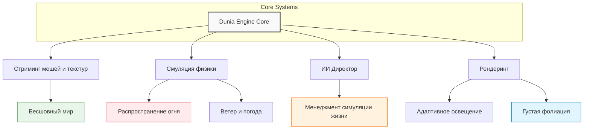

import ExternalPlayEmbed from '@site/src/components/ExternalPlayEmbed';

# Far Cry

<ExternalPlayEmbed example="spinoff/game-franchise-play" title="Игровая франшиза" minHeight={520} playProps={{ franchise: 'far-cry' }} />

  ОБЯЗАТЕЛЬНО
  ДЛЯ НОВИЧКОВ

Всем

---

## Что такое Far Cry

Франшиза **Far Cry** представляет собой серию компьютерных игр в жанре шутера от первого лица и action-adventure. Первая игра, выпущенная в 2004 году немецкой студией Crytek, продемонстрировала возможности инновационного движка CryEngine. Последующие части, созданные канадской студией Ubisoft Montreal и другими дочерними подразделениями компании Ubisoft, предлагают игрокам обширные открытые миры с высокой степенью свободы действий. На 2026 год серия включает шесть основных частей, множество спин-оффов и дополнений, собрав более 90 миллионов игроков по всему миру.

Игры серии не объединены единым сюжетом или персонажами. Каждая часть представляет собой отдельную историю, связанную тематически — герой оказывается в дикой местности, отрезанной от цивилизации, и вынужден бороться за выживание против вооруженных врагов и агрессивной природы. Основной антагонист часто выступает в роли полевого командира или диктатора, захватившего власть в регионе.

---

## Игры серии

| Название игры | Год выхода | Тип релиза | Сеттинг и место действия |
|---|---|---|---|
| Far Cry | 2004 | Основная игра | Тропический архипелаг в Тихом океане |
| Far Cry Instincts | 2005 | Спин-офф / Ремейк для консолей | Переосмысление первой части с суперспособностями |
| Far Cry Instincts: Evolution | 2006 | Дополнение / Сквел к Instincts | Тропические острова, продолжение истории Instincts |
| Far Cry Instincts: Predator | 2006 | Сборник | Компиляция Instincts и Evolution для Xbox 360 |
| Far Cry Vengeance | 2006 | Спин-офф | Эксклюзив для Nintendo Wii на базе Evolution |
| Far Cry: Paradise Lost | 2007 | Спин-офф | Рельсовый шутер для аркадных автоматов |
| Far Cry 2 | 2008 | Основная игра | Вымышленная страна в Центральной Африке |
| Far Cry 3 | 2012 | Основная игра | Тропический остров Рук Айленд |
| Far Cry 3: Blood Dragon | 2013 | Самостоятельный спин-офф | Ретрофутуристический киберпанк в стиле 80-х |
| Far Cry 4 | 2014 | Основная игра | Вымышленный регион Кират в Гималаях |
| Far Cry Primal | 2016 | Самостоятельный спин-офф | Каменный век, Центральная Европа |
| Far Cry 5 | 2018 | Основная игра | Округ Хоуп в штате Монтана, США |
| Far Cry New Dawn | 2019 | Самостоятельный сиквел-спин-офф | Постапокалиптический округ Хоуп спустя 17 лет |
| Far Cry 6 | 2021 | Основная игра | Вымышленный тропический остров Яра в Карибском море |

---

## Лор вселенной

### Концепция изоляции

Каждая часть франшизы строится на идее изоляции. Герой попадает в замкнутую экосистему, где действуют свои законы, а привычные социальные нормы теряют силу. Географическая оторванность — будь то тропический архипелаг, африканская саванна или доисторическая долина — создает условия для испытания человеческой морали.

Замкнутая экосистема работает как катализатор деградации. Острова, долины и саванны становятся ареной, где конфликты обостряются до предела. Цивилизация отсутствует или представлена лишь разрушенными следами прошлого. В таких условиях персонаж сталкивается с необходимостью принимать жесткие решения ради выживания.

Окружающая среда ведет постоянную войну против игрока. Природа не просто фон, она активный участник событий. Дикие животные, климатические явления и отсутствие инфраструктуры создают постоянное давление. Иллюзия полной свободы разбивается о реальность выживания, где каждый шаг требует ресурсов и осторожности.

---

### Персонажи

| Игра | Главный герой (Протагонист) | Главный злодей (Антагонист) | Ключевые союзники / Напарники |
|---|---|---|---|
| Far Cry | Джек Карвер (бывший спецназовец) | Доктор Кригер (безумный ученый) | Валери Кардинал (агент ЦРУ) |
| Far Cry Instincts | Джек Карвер | Доктор Кроу | Ричард "Найтшейд" |
| Far Cry 2 | Один из 9 наёмников на выбор (например, Марти Аленкар) | Шакал (торговец оружием) | Другие наёмники (Пол Кипрес, Флора Гиллен и др.) |
| Far Cry 3 | Джейсон Броди | Ваас Монтенегро / Хойт Волкер | Цитра Талугмай, Денис Роджерс, Сэм Бекер, Лиза Сноу |
| Far Cry 3: Blood Dragon | Рекс "Повер" Кольт (кибер-солдат) | Полковник Слоун | Доктор Элизабет Дарлинг |
| Far Cry 4 | Аджай Гейл | Пэйган Мин | Сабал и Амита (лидеры "Золотого пути"), Херк |
| Far Cry Primal | Таккар (охотник племени винджа) | Улл (удам) / Батари (изила) | Сейла (сборщица), Тенсей (шаман), Вуг (мастер) |
| Far Cry 5 | Помощник шерифа ("Пом") | Иосиф Сд ("Отец") | Ник Рай, Мэри Мэй Фэйргрейв, пастор Джером, Херк |
| Far Cry New Dawn | Капитан безопасности | Микки и Лу (Близняшки) | Кармина Сд, постаревший Иосиф Сд |
| Far Cry 6 | Дани Рохас (мужчина или женщина) | Антон Кастильо | Клара Гарсия, Хуан Кортес, "Liberstad" |

> Примечание: Персонаж по имени Херк Драбмен-младший является неофициальным талисманом серии и в качестве второстепенного героя или пасхалки появляется почти во всех частях, начиная с Far Cry 3.

---

### Роль Острова

Центральное место в нарративе занимает локация. Остров Rook Islands из третьей части стал главным архетипом серии, сочетающим первозданную природу и следы технологического распада. Эта локация демонстрирует, как природа может быть одновременно прекрасной и смертельно опасной.

Остров выступает как живой персонаж. У каждой локации есть собственная мифология, история и уникальная экосистема хищников. Животные не просто заселяют карту, они взаимодействуют друг с другом и с игроком, создавая динамичную среду. Хищники могут нападать на фракции, меняя ход спланированного боя, или становиться союзниками в охоте.

Пространственный нарратив подается через окружение. Сюжет раскрывается не только через диалоги, но и через руины, заброшенные бункеры и найденные артефакты. Игрок исследует мир, находя подсказки о прошлом событий и мотивах персонажей. Архитектура локаций продумана так, чтобы направлять внимание игрока и создавать ощущение тайны.

---

## Геймплей

### Системный дизайн

Основой игрового процесса является эмерджентность. Случайное пересечение механик создает уникальные ситуации, которые невозможно полностью предсказать заранее. Игрок может использовать окружение, поведение животных и логику врагов для достижения целей нестандартными способами.

Формула аванпостов стала центральным циклом игры. Зачистка баз врага представляет собой ключевую активность, предлагающую полную свободу тактического выбора. Игрок сам решает, как подойти к цели: провести разведку, найти слабые места обороны или атаковать лобовой силой. Каждый аванпост становится мини-головоломкой, требующей планирования.

Система предлагает выбор между стелсом и штурмом. Скрытный вариант предполагает незаметное устранение противников, использование укрытий и маскировку. Громкий вариант открывает доступ ко всем видам оружия и позволяет действовать агрессивно. Оба подхода легитимны и влияют на развитие сюжета и реакцию мира на действия героя.

---

### Взаимодействие с миром

Живая природа играет важную роль в геймплее. Дикие животные нападают на вражеские патрули, отвлекая их от игрока или создавая хаос на поле боя. Это позволяет использовать экологические факторы как преимущество в бою. Охота на зверей также дает ресурсы для крафта и улучшения снаряжения.

Огневая динамика реализована на высоком уровне. Огонь распространяется по сухой траве и деревянным постройкам, создавая зоны опасности. Игрок может поджечь лес, чтобы выкурить врагов, или использовать огонь для защиты своей позиции. Физика огня учитывается в расчетах движения и поведения персонажей.

Крафт и прогрессия напрямую связаны с исследованием мира. Сбор ресурсов, охота и добыча материалов необходимы для расширения инвентаря и улучшения оружия. Игрок постоянно ищет новые виды боеприпасов, лекарства и инструменты, что стимулирует изучение карты.

---

## Архитектура выполнения

### Движок Dunia Engine

Для серий Far Cry начиная со второй части был разработан собственный игровой движок **Dunia Engine**. Название происходит от арабского слова "мир" или "земля". Движок представляет собой глубоко модифицированную и переписанную версию технологий CryEngine, адаптированную инженерами Ubisoft для задач создания огромных открытых миров.

Адаптация под Open World потребовала переработки систем стриминга данных. Игра поддерживает бесшовное перемещение между различными типами ландшафта без экранов загрузки. Геометрия и текстуры загружаются динамически в зависимости от положения игрока, что обеспечивает плавность восприятия огромных пространств.

---

### Ключевые подсистемы

Процедурная генерация используется для автоматического распределения растительности и элементов ландшафта. Правила размещения деревьев, камней и воды позволяют создавать реалистичные и разнообразные среды без ручного моделирования каждого объекта. Это сокращает время разработки и увеличивает вариативность миров.

Система ИИ (AI Director) управляет спавном патрулей, хищников и случайных событий вокруг игрока. Система анализирует текущую ситуацию и корректирует сложность, обеспечивая баланс между вызовом и доступностью. Враги реагируют на действия игрока, меняют тактику и координируют атаки.

Многопоточность является основой производительности. Физика ветра, симуляция огня, логика персонажей и рендеринг выполняются параллельно. Распараллеливание задач позволяет поддерживать высокий уровень детализации при сохранении стабильного FPS даже на слабых системах.

---

## Влияние на индустрию

### Формирование стандартов

Франшиза сформировала стиль разработки открытых миров, известный как **Ubisoft-style Open World**. Популяризация механики вышек для открытия карты и зачистки лагерей стала отраслевым стандартом. Многие последующие проекты взяли эту модель за основу, адаптируя её под свои нужды.

UI/UX минимализм в играх серии показал пример интеграции интерфейса в игровой мир. Физическая карта в руках героя, голографические дисплеи и отсутствие лишних значков на экране погружают игрока в атмосферу. Интерфейс не мешает восприятию реальности, а становится частью повествования.

---

### Наследие

Серия заложила вектор на создание харизматичных злодеев. Персонаж Ваас Монтенегро из третьей части изменил подход к созданию антагонистов в AAA-играх. Его глубина, философия и эмоциональное воздействие на игрока стали эталоном для многих разработчиков.

Популяризация шутеров-песочниц сместила фокус с линейных коридоров на свободу действий. Игроки получили возможность выбирать путь прохождения, экспериментировать с тактикой и исследовать мир без ограничений. Этот подход определил развитие жанра на десятилетие вперед.

---

## История игр серии

### Far Cry (2004)

Первая часть серии вышла в 2004 году и была разработана немецкой компанией **Crytek**. Издателем выступила компания Ubisoft. Игра стала демонстрацией возможностей нового движка **CryEngine**, который использовался для создания фотореалистичной графики и сложных физических систем.

---

#### Сюжет и сеттинг

События разворачиваются на таинственном архипелаге в южной части Тихого океана. Главный герой, бывший спецназовец Джек Карвер, ищет пропавшую журналистку Валери Константин. Яхта Джека подвергается атаке наемников, и он оказывается на острове, полном опасностей.

Остров является объектом секретных экспериментов по генетической модификации, финансируемых компанией Krieger Corp. Генеральный директор доктор Кригер создает трайгенов — генетически измененных существ, способных к агрессии и быстрому обучению. Эксперименты выходят из-под контроля, и герои оказываются втянутыми в конфликт между наемниками, мутантами и местными жителями.

Ландшафт острова разнообразен — пляжи, тропические леса, каньоны, болота и действующий вулкан. Интерьеры варьируются от простых хижин до ультрасовременных лабораторий и японских укреплений времен Второй мировой войны.

---

#### Особенности разработки

Crytek создала игру с акцентом на визуальную составляющую и физику. Движок поддерживал технологии PolyBump и High Dynamic Range, что обеспечивало высокое качество освещения и текстур. Карта доступна сразу без загрузок, что было революционным решением для того времени.

Мультиплеер включал три режима: Free For All, Team Death Match и Assault. Режим Assault требовал захвата трех баз за определенное время, что добавляло стратегическую глубину соревновательному процессу.

---

#### Проблемы и цензура

Игра столкнулась с серьезными проблемами в Германии. Федеральное ведомство по оценке средств массовой информации, наносящих вред молодежи, запретило демоверсию из-за высокого уровня насилия. В полной версии были вырезаны кровавые эффекты, включая физику Ragdoll. Немецкая версия получила статус "Только для 18+", что вызвало возмущение игроков. Позже модификации файлов вернули вырезанный контент, что привело к отзыву первой партии игры.

---

#### Продажи и наследие

Far Cry разошлась тиражом более миллиона копий. Игра получила высокие оценки критиков и стала основой для развития франшизы. Права на бренд позже перешли к Ubisoft, которая продолжила разработку сиквелов уже без участия Crytek.

---

### Far Cry Instincts (2005)

Версия для консоли Xbox, разработанная Ubisoft Montreal. Игра существенно отличалась от PC-версии. Карты стали менее открытыми из-за технических ограничений консолей. Разработчики компенсировали это добавлением новых мультиплеерных режимов и функций, включая систему диких способностей героя.

---

### Far Cry 2 (2008)

Вторая часть перенесла действие в Африку. Сюжет сосредоточен на гражданской войне между двумя группировками: Объединенным фронтом освобождения и труда и Союзом народного сопротивления. Главный герой — наемник, нанятый для ликвидации торговца оружием по кличке Шакал.

---

#### Реализм и атмосфера

Игра сделала ставку на реализм и мрачную атмосферу. Герой страдает от малярии, оружие изнашивается и ломается, а враги постоянно патрулируют территорию. Малярия требует приема таблеток, иначе здоровье быстро падает. Оружие нуждается в обслуживании, что добавляет элемент управления ресурсами.

Африканский пейзаж создан на основе реальных фотографий и видео, сделанных разработчиками во время поездок в страну. Звуковое сопровождение и музыка усиливают ощущение жары и напряжения.

---

#### Сюжет и концовки

Шакал объясняет свою мотивацию: он стремится уничтожить всех участников войны, считая их заразой. В финале игроку предлагается выбор — взорвать ящик с динамитом, чтобы перекрыть путь беженцам, или отдать алмазы пограничникам, чтобы спасти людей, после чего покончить с собой. Обе концовки подчеркивают безнадежность ситуации и бессмысленность конфликта.

---

#### Техническая основа

Для игры был создан новый движок **Dunia Engine**. Он поддерживал многопоточность и технологии DirectX 9 и 10. Движок позволял создавать огромные открытые пространства с динамическими погодными условиями и реалистичной симуляцией огня.

---

### Far Cry 3 (2012)

Третья часть стала революционной для серии. Игра вернулась к островному сеттингу и принесла серию коммерческий успех и признание критиков.

---

#### Сюжет

Главный герой Джейсон Броди отправляется на отдых с друзьями на острова Рук. Поездка превращается в кошмар: друзья попадают в плен к пиратам во главе с безумным Ваасом Монтенегро. Джейсон выживает и начинает борьбу за спасение друзей и освобождение острова.

Ваас Монтенегро стал одним из самых запоминающихся злодеев в истории видеоигр. Его философия, харизма и манера речи произвели огромное впечатление на аудиторию. Цитата "Я уже говорил тебе, что такое безумие?" вошла в поп-культуру.

---

#### Геймплей и прогрессия

Игра ввела систему навыков, разделенную на три ветви: Паук, Акула и Цапля. Игрок получает очки опыта за выполнение заданий и убийства врагов, что позволяет улучшать способности героя. Дерево навыков открывает новые приемы скрытности, стрельбы и выживания.

Острова Рук стали живым персонажем. Разработчики добавили множество побочных активностей — охота на животных, сбор растений, освобождение аванпостов и участие в мини-играх. Искусственный интеллект животных имитировал естественное поведение, создавая динамичную экосистему.

---

#### Разработка

Команда потратила много времени на создание острова, назвав его "вторым по важности персонажем". Вдохновением послужили фильмы "Апокалипсис сегодня" и сериал "Остаться в живых". Разработчики стремились создать мир, который уважает выбор игрока и предоставляет свободу действий.

Игра получила награду BAFTA в номинации "Action" и была номинирована на множество других премий. Продажи превысили 10 миллионов копий.

---

### Far Cry 3 — Blood Dragon (2013)

Спин-офф, представляющий собой пародию на фантастические боевики 1980-х годов. Действие происходит в альтернативном 2007 году на островах Тихого океана. Главный герой Рекс "Пауэр" Кольт — киборг, сражающийся с армией роботов и кровожадными драконами.

Игра отличается ярким стилем, неоновой графикой и саундтреком в стиле синтвейв. Сюжет пародирует клише эпохи, а диалоги полны черного юмора. Blood Dragon получила положительные отзывы за уникальный стиль и ностальгию.

---

### Far Cry 4 (2014)

Действие разворачивается в вымышленном государстве Кират в Гималаях. Главный герой Аджай Гейл возвращается на родину, чтобы развеять прах матери, и оказывается вовлечен в гражданскую войну между правительством и повстанцами "Золотой путь".

---

#### Персонажи

Антагонист Пэйган Мин стал культовым персонажем. Его эксцентричность, розовый костюм и непредсказуемое поведение сделали его одним из самых ярких злодеев серии. Изначально команда хотела сделать его панком-рокером, но отказалась от идеи в пользу более загадочного образа.

---

#### Сюжет и выбор

История исследует темы власти, предательства и морального выбора. Игрок принимает решения, влияющие на судьбу Кирата и лидеров повстанцев. Финал игры зависит от выбора лидера "Золотого пути", что приводит к разным последствиям для страны.

---

#### Разработка

Разработчики посетили Непал, чтобы изучить местную культуру и вдохновиться реальными событиями. Мир игры стал более плотным и разнообразным по сравнению с предыдущими частями. Команда добавила чёрный юмор и сократила число закадровых голосов для лучшего погружения.

---

### Far Cry Primal (2016)

Уникальная часть серии, действие которой происходит около 10 000 лет до нашей эры в эпоху мезолита. Обычное оружие и транспорт отсутствуют. Игрок использует каменные орудия, луки и прирученных животных.

---

#### Особенности

Все диалоги записаны на искусственном языке Wenja, основанном на праиндоевропейском. Это требование лингвистов для сохранения аутентичности. Игрок играет за Таккара, охотника, пытающегося восстановить свое племя.

Приручение животных стало ключевой механикой. Саблезубые тигры, пещерные медведи и волки помогают в бою и разведке. Если питомец погибает, его можно воскресить, найдя Красный лист.

Игра получила смешанные отзывы. Критики похвалили мир и атмосферу, но отметили однообразие геймплея и отсутствие запоминающихся злодеев.

---

### Far Cry 5 (2018)

События происходят в округе Хоуп, штат Монтана. Главный герой — помощник шерифа, борющийся с культом "Врата Эдема" во главе с пророком Иосифом Сдом.

---

#### Актуальность

Сеттинг игры вызвал споры из-за отражения современных политических и социальных проблем США. Тема религиозного фанатизма и сепаратизма оказалась актуальной в контексте избрания Дональда Трампа и Brexit.

---

#### Геймплей

Игра ввела систему вербовки местных жителей, которые сражаются вместе с игроком. Также появилась возможность приручать диких животных. Редактор карт позволил создавать собственные миссии.

---

#### Сюжет

Игрок должен освободить регионы округа, победив братьев и сестер Сда. В финале перед игроком стоит выбор: уйти из округа или продолжить сопротивление. Обе концовки ведут к ядерному взрыву, подчеркивая тему неизбежности конца света.

---

### Far Cry New Dawn (2019)

Спин-офф, действие которого происходит через 17 лет после событий Far Cry 5. Мир погрузился в постапокалипсис, но природа восстановилась, создав яркие и красочные пейзажи.

---

#### Особенности

Игра отличается необычной цветовой палитрой, контрастирующей с традиционными мрачными постапокалипсисами. Игрок исследует разрушенные города и ищет ресурсы для восстановления поселений.

---

### Far Cry 6 (2021)

Шестая основная часть серии. Действие происходит в вымышленной латиноамериканской стране Яра, напоминающей Кубу. Главный герой Дани Рохас борется с диктатором Антоном Кастильо.

---

#### Разработка

Игру разрабатывали студии Ubisoft Toronto, Montreal и другие. Двинок Dunia Engine получил улучшения в области графики и физики. Игра включила возможность прятать оружие и скрываться от врагов.

---

#### Сюжет

История рассказывает о революции и борьбе за свободу. Антон Кастильо стал одним из самых сложных и глубоких антагонистов серии. Его отношения с сыном Диего добавляют эмоциональную глубину конфликту.

Игра получила смешанные отзывы. Критики оценили красоту природы и актерскую игру, но указали на повторяемость геймплея и слабый сюжет.

---
