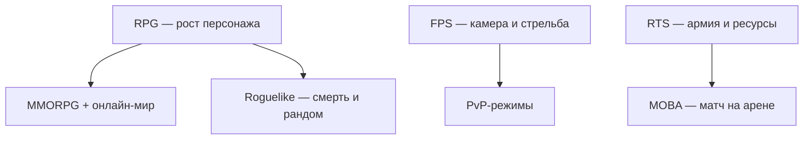

# Жанры видеоигр — маршрут

  НЕ ОБЯЗАТЕЛЬНО
  ДЛЯ НОВИЧКОВ

Всем

---

## Что такое жанр видеоигр?

**Жанр** в видеоиграх — **устойчивая этикетка** магазина, прессы и сообщества — она подсказывает камеру, темп, мультиплеер и ожидания от сюжета. Одна игра часто смешивает метки (action RPG с открытым миром и кооперативом).

Это что-то вроде категории, которая объединяет игры по **игровому процессу (геймплею)** и взаимодействию игрока с миром. В отличие от кино или литературы, где жанр определяется сюжетом или настроением, в играх главное - **ЧТО** и **КАК** вы делаете большую часть времени.

В основном это:
- цель игры (сражаться с противниками, строить город, решать головоломки);
- точка зрения (вид от первого лица, сверху, сбоку, из-за плеча);
- управление и механики (нужно быстро нажимать кнопки, стратегически думать или аккуратно целиться);
- отношение к смерти или поражению (перезапуск уровня, потеря вещей или просто откат до точки сохранения);
- темп (быстрый и динамичный или неспешное обдумывание).

Какие жанры видеоигр вы знаете? Наверняка экшен (Action), ролевые игры (RPG), стратегии (Strategy), головоломки (Puzzle) или симуляторы (Simulator).

И да, если словосочетание "ролевые игры" у вас ассоциируются с пошлятиной из фильмов для взрослых, то в целом ничего такого - это как раз и суть вживания в роль. Ровно как пара выдаёт себя за медсестру и пациента, так же и игрок играет **роль** - рыцаря, злодея, героя, персонажа.

Сюжет - это не жанр. Он в принципе не определяет, и нет такого жанра, как "сюжетная игра", потому что сюжет как таковой есть везде.

Сеттинг - это что-то вроде правил, по которым живёт игровой мир - можно выделить современный, средневековый, фэнтези, космический, футуристический, и много чего ещё. Сеттинг тоже не определяет жанр. Вы можете встретить RPG в космосе, стратегию в современности, или головоломку в фэнтези.

Жанры важно знать, чтобы:
- выбирать игры (если вам нравится определенный жанр, то вам понравятся схожие игры);
- понимать рецензии и обзоры (чтобы примерно определять качество игры по критериям жанра).

Здесь — **маршрут**: нейтральное определение, ссылка на карточку [глоссария](/glossary/intro), куда идти за устройством игры и за культурными штрихами из [рунета](/encyclopedia/9-spinoff/9-10-internet-kultura/120). Ироничные статьи [Неолурка](https://neolurk.org/) — внешний указатель тем, не эталон тона.

Базовые понятия "игра / видеоигра" — [1.18](/encyclopedia/1-basics/1-18-kompyuternye-igry/1). Поиграть с фильтрами по жанрам — [каталог референсов](/tools/games/4).

  
FPS — два значения

  

  **FPS** как жанр — *First-Person Shooter*, шутер от первого лица ([глоссарий](/glossary/F#fps-first-person-shooter)). **FPS** как метрика — *frames per second*, кадры в секунду ([глоссарий](/glossary/F#fps-частота-кадров-frames-per-second)). В чате уточняйте по контексту.
  

---

## Экшен и шутеры

| Жанр | Суть | Глоссарий | Неолурк |
|------|------|-----------|---------|
| **FPS** | Стрельба от первого лица, упор на прицел и реакцию | [FPS (жанр)](/glossary/F#fps-first-person-shooter) | [FPS](https://neolurk.org/wiki/FPS) |
| **PvP** | Игрок против игрока | [PvP](/glossary/П#pvp) | [PvP](https://neolurk.org/wiki/PvP) |
| **PvE** | Игрок против окружения (AI) | [PvE](/glossary/П#pve) | — |

Киберспортивные дисциплины и сленг "фраги", "клатч" чаще идут из шутеров и MOBA — в рабочем IT-чате эти слова обычно не нужны.

---

## Роли, прогресс и мир

| Жанр | Суть | Глоссарий | Неолурк |
|------|------|-----------|---------|
| **RPG** | Развитие персонажа, квесты, инвентарь | [RPG](/glossary/R#rpg) | [RPG](https://neolurk.org/wiki/RPG) |
| **MMORPG** | RPG в persistent-мире с массой игроков онлайн | [MMO](/glossary/M#mmo), [MMORPG](/glossary/M#mmorpg) | [MMORPG](https://neolurk.org/wiki/MMORPG) |
| **Roguelike / roguelite** | Случайные уровни, жёсткая или смягчённая смерть | [Роглайк](/glossary/Р#роглайк-роуглайк), [рогалик](/glossary/Р#рогалик) | [Рогалики](https://neolurk.org/wiki/%D0%A0%D0%BE%D0%B3%D0%B0%D0%BB%D0%B8%D0%BA%D0%B8) |

В MMORPG закрепились **рейды**, **баффы**, **данжи** — те же слова иногда всплывают в метафорах про "сложный релиз" или "фарм задач". Карточки — [рейд](/glossary/Р#рейд), [бафф](/glossary/Б#бафф), [данж](/glossary/Д#данж).

---

## Стратегии и тактика на карте

| Жанр | Суть | Глоссарий | Неолурк |
|------|------|-----------|---------|
| **RTS** | Стратегия в реальном времени, база и армия | [RTS](/glossary/R#rts) | [RTS](https://neolurk.org/wiki/RTS) |
| **MOBA** | Две команды, герои, линии, разрушение базы | [MOBA](/glossary/M#моба-moba-англ) | [MOBA](https://neolurk.org/wiki/MOBA) |
| **Tower Defense** | Оборона от волн врагов башнями | [Tower Defense](/glossary/T#tower-defense) | [Tower Defense](https://neolurk.org/wiki/Tower_Defense) |

MOBA выросла из модов к RTS (Dota как мод *Warcraft III*) — см. [Dota](/glossary/D#dota) в глоссарии.

---

## Онлайн, инди и платформа

| Жанр / тема | Суть | Глоссарий | Неолурк |
|-------------|------|-----------|---------|
| **Онлайн-игра** | Нужен сервер или сеть для прогресса/матчей | [Онлайн-игра](/glossary/О#онлайн-игра) | [Онлайн-игры](https://neolurk.org/wiki/%D0%9E%D0%BD%D0%BB%D0%B0%D0%B9%D0%BD-%D0%B8%D0%B3%D1%80%D1%8B) |
| **Инди** | Небольшая команда, часто без крупного издателя | [Инди](/glossary/И#инди) | [Инди-игры](https://neolurk.org/wiki/%D0%98%D0%BD%D0%B4%D0%B8-%D0%B8%D0%B3%D1%80%D1%8B) |
| **ККИ** | Карточная игра (цифровая или настольная) | [ККИ](/glossary/К#кки) | [ККИ](https://neolurk.org/wiki/%D0%9A%D0%9A%D0%98) |
| **Консоль** | Платформа PlayStation, Xbox, Nintendo и др. | [Консоль](/glossary/К#консоль) | [Игровая консоль](https://neolurk.org/wiki/%D0%98%D0%B3%D1%80%D0%BE%D0%B2%D0%B0%D1%8F_%D0%BA%D0%BE%D0%BD%D1%81%D0%BE%D0%BB%D1%8C) |

Обзор "что такое видеоигра" в мемной подаче — [Неолурк: Видеоигры](https://neolurk.org/wiki/%D0%92%D0%B8%D0%B4%D0%B5%D0%BE%D0%B8%D0%B3%D1%80%D1%8B); учебно — [1.18](/encyclopedia/1-basics/1-18-kompyuternye-igry/1).

### В рунет-дискурсе

На форумах и в Neolurk жанры (**FPS**, **RPG**, **MMORPG**, **MOBA**) — ярлыки **ожиданий** — "фарм", "рейд", "катка", "рандом". В IT-переписке они уместны как метафора ("релиз как рейд"), если аудитория это понимает; в ТЗ и документации — нейтральные формулировки (онлайн-режим, PvP, прогресс персонажа).

**FPS** в чате может означать и жанр, и *frames per second* — уточняйте по контексту (см. callout выше). Культура площадок — [9.10 / 120](/encyclopedia/9-spinoff/9-10-internet-kultura/120), [Роли и идентичность в сети](/encyclopedia/9-spinoff/9-10-internet-kultura/126).

---

## Схема пересечений

Жанры **накладываются**: *Destiny* — шутер с RPG-прогрессом; *Hades* — action с roguelite-циклом. Метка в магазине описывает **акцент**, а не полный список механик.

---

## Жанр и разработка на IT

| Жанр | Что смотреть в коде и инфраструктуре |
|------|--------------------------------------|
| Онлайн / MMO | Серверы, матчмейкинг, [MMR](/glossary/M#mmr), античит |
| FPS | Тикрейт, латентность, [game loop](/encyclopedia/1-basics/1-18-kompyuternye-igry/1) |
| RTS / MOBA | Синхронизация состояния, баланс патчами |
| Инди | Малый scope, часто готовые движки — [разработка игр](/encyclopedia/9-spinoff/9-04-razrabotka-igr/intro) |

---

## Дальше

| Цель | Материал |
|------|----------|
| Устройство игры | [1.18 / 1](/encyclopedia/1-basics/1-18-kompyuternye-igry/1) |
| Консоли и платформы | [Игровые консоли — маршрут](./129) |
| Франшизы и разборы | [game-studies / intro](./intro) |
| Индустрия и бизнес | [9.03](/encyclopedia/9-spinoff/9-03-igrovaya-industriya/intro) |
| Мемы и чаты | [9.10 / 120](/encyclopedia/9-spinoff/9-10-internet-kultura/120) |
| Термины | [глоссарий](/glossary/intro) |

---
