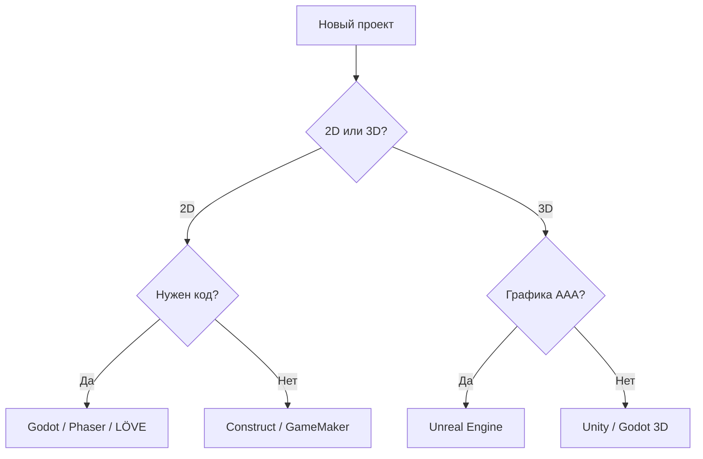

import ExternalPlayEmbed from '@site/src/components/ExternalPlayEmbed';


# Движки

<div class="article-tags">
  <span class="tag tag-notrequired">НЕ ОБЯЗАТЕЛЬНО</span>
  <span class="tag tag-beginner">ДЛЯ НОВИЧКОВ</span>
</div>

**Игровой движок** — программная платформа для разработки видеоигр: рендеринг, физика, звук, скрипты, управление ассетами и сборка билдов. **Фреймворк** (Phaser, LÖVE, MonoGame) даёт библиотеку и цикл игры, но без полноценного редактора уровней — его дополняют своими инструментами.

<ExternalPlayEmbed example="tools-games/game-engine-picker-play" title="Game Engine Picker" />

<ExternalPlayEmbed example="tools-games/game-engine-play" title="Game Engine" />

<div class="callout callout--tip">
  <div class="callout-title">Как выбрать движок</div>

  <div class="callout-body">
  - **Первый проект, 2D** — Godot или GameMaker.
  - **3D, высокая графика** — Unreal Engine.
  - **Мобайл и кроссплатформа "из коробки"** — Unity.
  - **Только браузер** — Phaser или Godot → HTML5.
  - **Учёба и минимализм** — LÖVE, PICO-8.
</div>
  </div>


Подробнее о пайплайне разработки — в разделе [Разработка игр](/encyclopedia/9-spinoff/9-04-razrabotka-igr/intro).

---

## Сводная таблица

| Движок / фреймворк | Языки | Фокус | Лицензия |
| --- | --- | --- | --- |
| [Unity](https://unity.com/download) | C# | 2D/3D, мобайл, VR | Подписка Unity Hub |
| [Unreal Engine](https://www.unrealengine.com/) | C++, Blueprints; UE6 — Verse | AAA 3D, UEFN/Fortnite | 5% после $1M выручки |
| [Godot](https://godotengine.org/download/) | GDScript, C# | 2D и лёгкий 3D | MIT, open source |
| [GameMaker](https://gamemaker.io/) | GML | Быстрый 2D | Платная |
| [Construct](https://www.construct.net/) | События, JS | 2D без кода | Подписка |
| [Defold](https://defold.com/) | Lua | Лёгкий 2D | Apache 2.0 |
| [CryEngine](https://www.cryengine.com/) | C++, Lua | Фотореализм 3D | Pay what you want |
| [LÖVE](https://love2d.org/) | Lua | 2D прототипы | MIT |
| [Phaser](https://phaser.io/) | JavaScript | 2D в браузере | MIT |
| [MonoGame](https://www.monogame.net/) | C# | Наследник XNA | Open source |
| [Bevy](https://bevyengine.org/) | Rust | ECS, data-driven | MIT / Apache |
| [PICO-8](https://www.lexaloffle.com/pico-8.php) | Lua | Ретро 128×128 | Платный (~$15) |
| [RPG Maker](https://www.rpgmakerweb.com/) | JS / Ruby | JRPG | Коммерческая |
| [Solar2D](https://solar2d.com/) | Lua | 2D мобайл | MIT |
| [Armory3D](https://armory3d.org/) | Haxe | 3D в Blender | Open source |
| [Stride](https://github.com/stride3d/stride) | C# | 3D, VR | LGPL |
| [Flixel](https://haxe.org/) | Haxe | 2D | Open source |
| [O3DE](https://o3de.org/) | C++, Lua | Симуляции, 3D | Apache 2.0 |

---

## Установка: основные движки

### Unity

- **Платформы**: Windows, macOS, Linux, iOS, Android, WebGL, консоли, VR/AR.
- **Особенности**: Asset Store, URP/HDRP, DOTS (ECS), PhysX.
- **Установка**: [Unity Hub](https://unity.com/download) — выбор версии редактора и модулей под целевые платформы. CLI — через Hub или Install Assistant.

---

### Unreal Engine

- **Платформы**
  - Windows, macOS, Linux
  - мобильные устройства, консоли, VR
- **Особенности UE5**
  - Nanite, Lumen, Niagara, MetaHuman
  - **UE 5.8** (2026) — экспериментальный MCP-плагин для ИИ-ассистентов в редакторе
- **Unreal Engine 6** (ранний доступ — конец 2027)
  - единый редактор UE5 и UEFN
  - язык Verse, Scene Graph, LLM через MCP
  - [подробный обзор](/encyclopedia/9-spinoff/9-04-razrabotka-igr/129)
- **Установка**
  - [Epic Games Launcher](https://www.unrealengine.com/) (аккаунт Epic)
  - [GitHub UnrealEngine](https://github.com/EpicGames/UnrealEngine) — исходники после привязки аккаунта
  - Linux — чаще сборка из исходников

---

### Godot

- **Платформы**: Windows, macOS, Linux, iOS, Android, HTML5.
- **Особенности**: MIT, дерево сцен, сильный 2D.
- **Установка**:
  - Сайт: [godotengine.org/download](https://godotengine.org/download/)
  - Linux (Flatpak): `flatpak install flathub org.godotengine.Godot`
  - Steam — бесплатное приложение.

---

### GameMaker

- [gamemaker.io](https://gamemaker.io/) — бесплатный уровень с ограничениями, платные Creator / Indie / Enterprise.

---

### Phaser (npm)

```bash
npm init -y
npm install phaser
```

Или CDN: `https://cdn.jsdelivr.net/npm/phaser@3/dist/phaser.min.js`

---

### MonoGame (.NET)

```bash
dotnet new install MonoGame.Templates.CSharp
dotnet new mgdesktopgl -o MyGame
```

---

### Bevy (Rust)

```bash
curl --proto '=https' --tlsv1.2 -sSf https://sh.rustup.rs | sh
cargo new my_game && cd my_game
# В Cargo.toml: bevy = "0.14" (актуальную версию см. на bevyengine.org)
```

---

### LÖVE (Linux)

```bash
sudo apt install love    # Debian/Ubuntu
love /путь/к/проекту
```

---

## Когда что выбирать



---

## См. также

- [Инструменты для видеоигр](/games/9-031-gametools/2) — OBS, Steam, Proton, моды.
- [Игровые магазины](/games/9-031-gametools/3) — лаунчеры и облачный гейминг.
- [Игры, которые должен попробовать каждый](/games/9-031-gametools/4) — каталог хитов, жанровые фильтры и случайная рекомендация.
- [Каталог open-source клонов](/encyclopedia/9-spinoff/9-04-razrabotka-igr/125) — [osgameclones.com](https://osgameclones.com/) для разбора чужих репозиториев.
- [Компьютерные игры](/encyclopedia/1-basics/1-18-kompyuternye-igry/intro) — основы в энциклопедии.

---
