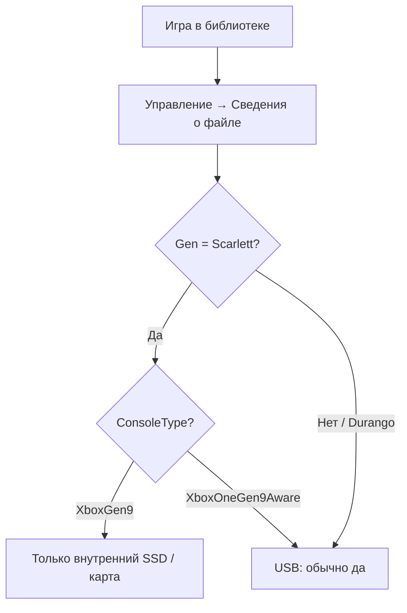

import ExternalPlayEmbed from '@site/src/components/ExternalPlayEmbed';

# Запуск игр на Xbox Series X|S с внешнего жёсткого диска

  НЕ ОБЯЗАТЕЛЬНО
  ДЛЯ НОВИЧКОВ

Консоли **Xbox Series X|S** позволяют подключить внешний USB-накопитель и освободить встроенный SSD. Но **не каждая игра** может работать с такого диска: нативные проекты нового поколения рассчитаны на скорость внутреннего NVMe и **DirectStorage**.

<ExternalPlayEmbed example="tools-games/xbox-storage-compat-play" title="Xbox Storage Compat" />

---

## Почему есть ограничение

Архитектура Series построена вокруг быстрого хранилища. Игры с меткой оптимизации под Series (**Scarlett**, **XboxGen9**) читают ресурсы с диска потоком, который обычный USB не обеспечивает. Microsoft разрешает хранить такие игры только:

- во **внутренней памяти** консоли;
- на **карте расширения Seagate Expansion Card** (тот же интерфейс, что у внутреннего SSD).

Порты с Xbox One и "совместимые" версии чаще запускаются с внешнего HDD или SSD.

---

## Как проверить совместимость

1. Выберите игру в библиотеке.
2. **Управление играми и дополнениями** → **Сведения о файле**.
3. Смотрите поля **Gen** и **ConsoleType**.

| Gen | ConsoleType | Внешний USB |
| --- | --- | --- |
| **Scarlett** | **XboxGen9** | Нет — только внутренний SSD или Expansion Card |
| **Durango** (или не Scarlett) | **XboxOneGen9Aware** | Да |
| Другое / неясно | — | Проверьте перенос: система предупредит, если запуск невозможен |

**XboxOneGen9Aware** — игра изначально для Xbox One, адаптированная для Series **без** полного набора возможностей хранилища нового поколения.

---

## Подтверждённые игры с внешнего диска

По метаданным установленных копий на Series X|S эти проекты **корректно запускаются с USB**:

- Assassin's Creed Odyssey, Assassin's Creed Origins
- Far Cry 4, Far Cry 5, Far Cry New Dawn
- Halo: The Master Chief Collection
- Mass Effect Legendary Edition
- Minecraft Dungeons
- Ori and the Will of the Wisps
- Shadow of the Tomb Raider
- State of Decay 2
- The Elder Scrolls V: Skyrim
- Tom Clancy's The Division 2
- Warhammer: End Times – Vermintide 2

Список неполный: перед покупкой диска под библиотеку проверяйте **свои** игры через "Сведения о файле".

---

## Метаданные "Сведения о файле"

Технические поля помогают понять происхождение сборки и диагностировать проблемы с запуском и обновлениями.

| Поле | Назначение |
| --- | --- |
| **FullName** | Полное имя пакета в экосистеме Microsoft |
| **InstanceId** | Уникальный ID установки на этой консоли |
| **ContentId** / **ProductId** | Идентификаторы в Store и библиотеке |
| **Gen** | Поколение: **Durango** (Xbox One) или **Scarlett** (Series) |
| **ConsoleType** | **XboxGen9** vs **XboxOneGen9Aware** — ключ для USB |
| **TitleId** | Числовой ID в Xbox Live |
| **AcquiredDate** / **InstallDate** / **UpdateDate** | Покупка, установка, последний патч |
| **ContentType** | Игра, DLC, демо и т.д. |
| **LegacyXboxProductId** | Наследие Xbox 360 / старых лицензий |
| **IsPreIndexed** | Прединдексация на серверах Microsoft |
| **Genre** | Жанр для витрины и рекомендаций |

  
Практика

  

  - Перед переносом на HDD смотрите **Gen + ConsoleType**.
  - Нативные Series-релизы держите на внутреннем SSD; на USB — "совместимые" и портированные с One.
  - При ошибке запуска сравните **UpdateDate** с новостями патча — иногда меняют требования к хранилищу.

  

---

## См. также

- [Игровые магазины](/games/9-031-gametools/3) — Microsoft Store и Game Pass.
- [Microsoft Store и публикация Windows-приложений](/encyclopedia/4-code-dev/4-11-desktopnye-prilozheniya/117) — экосистема витрины и дистрибуции.
- [Платформы](/encyclopedia/2-system-network/2-02-platformy/intro) — экосистемы в IT.

---
