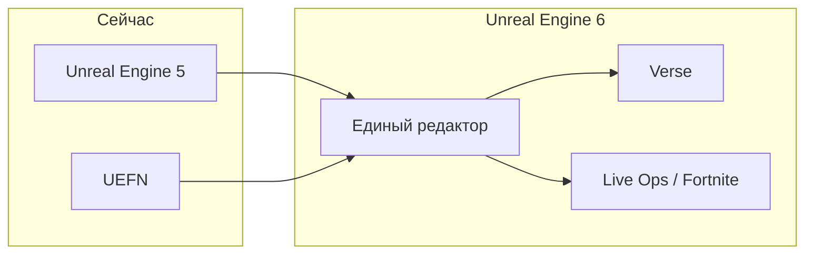

# Unreal Engine 6

  ОБЯЗАТЕЛЬНО
  ДЛЯ НОВИЧКОВ

Разработчику

**Unreal Engine 6 (UE6)** — следующее поколение [игрового движка](/encyclopedia/9-spinoff/9-04-razrabotka-igr/112) от [Epic Games](/glossary/E#epic-games). В [UE5](/encyclopedia/9-spinoff/9-04-razrabotka-igr/4) главный акцент лёг на графику (**Nanite**, **Lumen**). В UE6 Epic перестраивает **редактор, язык сценариев и модель объектов** — то, как команда собирает игру из ассетов и кода.

Практика в текущем редакторе — [Unreal Engine](/encyclopedia/9-spinoff/9-04-razrabotka-igr/4). Сравнение Unity, Godot и Unreal — [Виды игровых движков](/encyclopedia/9-spinoff/9-04-razrabotka-igr/113).

---

## Термины, которые встретятся в этой главе

| Термин | Коротко |
|--------|---------|
| **UE5 / UE6** | Пятое и шестое поколение [Unreal Engine](/glossary/U#unreal-engine). |
| **UEFN** | *Unreal Editor for Fortnite* — редактор пользовательских режимов ("островов") внутри [Fortnite](https://www.fortnite.com/). |
| **Actor** | Базовый объект сцены в UE4/UE5 (персонаж, лампа, триггер). Подробнее — [Unreal Engine](/encyclopedia/9-spinoff/9-04-razrabotka-igr/4#архитектура--от-uobject-до-сцены). |
| **Blueprint** | Визуальный скрипт в UE — логика собирается из узлов на графе, без набора текста в файле. |
| **Verse** | Язык Epic для игровой логики; сейчас в UEFN, в UE6 станет основным для сценариев. [Глава Verse](/encyclopedia/9-spinoff/9-04-razrabotka-igr/130). |
| **Scene Graph** | Дерево объектов сцены — кто к кому "прикреплён" и в каком порядке обновляется. |
| **ECS** | *Entity Component System* — данные (компоненты) и код (системы) хранятся отдельно; так проще распараллеливать тысячи объектов. Обзор паттерна — [Игровой движок](/encyclopedia/9-spinoff/9-04-razrabotka-igr/112#архитектурная-роль-игрового-движка). |
| **MCP** | *Model Context Protocol* — открытый способ подключить к программе внешнюю [языковую модель](/encyclopedia/6-ai/6-01-vvedenie-v-ii/intro) (LLM). |
| **Live-service** | Игра как долгий сервис — сезоны, патчи, внутриигровой магазин, онлайн-события (*Fortnite*, *Genshin Impact*). |
| **UGC** | *User-Generated Content* — контент от игроков и независимых авторов (режимы, карты, скины). |
| **Fab** | Маркетплейс 3D-ассетов Epic (бывший Quixel Bridge + Sketchfab). |
| **Early Access** | Ранняя версия продукта для разработчиков — функции ещё допиливаются, API может меняться. |

---

## Хронология анонсов

| Когда | Событие |
|-------|---------|
| **Май 2026** | [Rocket League Championship Series](https://www.rocketleague.com/) (Paris Major) — первый публичный тизер UE6. В трейлере показали обновлённую *Rocket League* с картинкой в реальном времени на новом движке. Классическая версия игры с 2015 года работала на **UE3**. |
| **Июнь 2026** | [Unreal Fest Chicago](https://www.unrealengine.com/en-US/events), keynote **State of Unreal** — полная концепция UE6 и релиз **Unreal Engine 5.8** с экспериментальным MCP-плагином для ИИ. |
| **Конец 2027 (Q4)** | Планируемый **Early Access** UE6. |
| **Конец 2028 — середина 2029** | **Полный релиз**, примерно через 12–18 месяцев после раннего доступа. |

До выхода UE6 Epic продолжит выпускать обновления **UE5**. Версия **5.8** названа последним крупным релизом пятого поколения перед переносом основных сил на UE6.

---

## Слияние UE5 и UEFN

Сейчас у Epic два параллельных редактора:

- **Unreal Engine 5** — полноценная среда для AAA-игр, кино и симуляций;
- **UEFN** — упрощённый редактор внутри экосистемы Fortnite для пользовательских "островов".

В UE6 оба продукта сходятся в **один редактор**. Один проект можно собирать и выпускать как самостоятельную игру в [Steam](/encyclopedia/9-spinoff/9-03-igrovaya-industriya/11435) или [Epic Games Store](/glossary/E#epic-games), и как режим внутри Fortnite — без переписывания на другом стеке.

Epic описывает цель как единую **live-service**-экосистему. Для разработчика это означает:

- один набор инструментов для десктопного релиза и для острова в Fortnite;
- общие ассеты и скрипты на [Verse](/glossary/V#verse-epic-games);
- кросс-игровая косметика (скины Fortnite в сторонних UE6-играх и наоборот; первый пилот — косметика Fortnite);
- выплаты авторам UEFN — по заявлению Epic, уже **более $1 млрд**.

**Rocket League** (студия Psyonix, входит в Epic) — первая официально подтверждённая игра, которая полностью переедет на UE6.

Связанный контекст — [сотрудничество Unity и Epic](/encyclopedia/9-spinoff/9-04-razrabotka-igr/112) (публикация Unity-игр в Fortnite) и глава [Игровая индустрия](/encyclopedia/9-spinoff/9-03-igrovaya-industriya/intro).

---

## Verse, Blueprints и Actors

В UE4 и UE5 логику чаще всего пишут так:

- **Blueprints** — визуальные графы в редакторе;
- **C++** — производительные системы и плагины ([основы C++](/encyclopedia/5-languages/5-06-cpp/1));
- сцена собирается из **Actors** и **компонентов** (`ACharacter`, `UStaticMeshComponent` и т.д.).

В UE6 Epic делает ставку на другую связку.

Полный разбор языка — [Verse](/encyclopedia/9-spinoff/9-04-razrabotka-igr/130). Кратко ниже.

### Язык Verse

**Verse** Epic уже несколько лет развивает в UEFN. В UE6 он станет **главным языком игровой логики** (правила матча, квесты, экономика, сетевые события).

Особенности, которые Epic подчёркивает на анонсах:

- **Персистентные онлайн-миры** — состояние игры живёт между сессиями; мир "помнит" прогресс тысяч игроков.
- **Транзакции** — рантайм может откатить и пересчитать пакет изменений, если что-то пошло не так (важно для сетевых игр).
- **Распределение на серверах** — автор описывает логику как для одной машины, а движок сам раскидывает нагрузку по серверам.
- **Единые API** — один и тот же интерфейс для скриптов, [материалов](/encyclopedia/9-spinoff/9-04-razrabotka-igr/116), мешей, [Niagara](/encyclopedia/9-spinoff/9-04-razrabotka-igr/4#подсистемы-движка) и ассетов с [Fab](https://www.fab.com/).

**C++** останется для ядра движка, плагинов и низкоуровневой оптимизации. Verse работает поверх него — как C# в [Unity](/encyclopedia/9-spinoff/9-04-razrabotka-igr/3) поверх нативного движка.

Практика в UEFN — [UGC-платформы](/encyclopedia/9-spinoff/9-03-igrovaya-industriya/127), [глоссарий](/glossary/V#verse-epic-games), глава [Verse](/encyclopedia/9-spinoff/9-04-razrabotka-igr/130).

### Scene Graph и ECS

UE6 вводит новую модель объектов рядом с привычной цепочкой **Actor → компоненты** из UE5:

- **Scene Graph** — дерево объектов сцены с явной иерархией;
- **ECS** (*Entity Component System*) — сущности несут только данные, а отдельные **системы** обрабатывают их пакетами.

Зачем это студии:

- лучше задействовать несколько ядер процессора;
- меньше узких мест при тысячах объектов в [открытом мире](/encyclopedia/9-spinoff/9-04-razrabotka-igr/123);
- проще масштабировать код в больших командах ([роли в геймдеве](/encyclopedia/9-spinoff/9-04-razrabotka-igr/111)).

Похожий подход Epic уже предлагает опционально в Unity через пакет **DOTS** — см. [Игровой движок](/encyclopedia/9-spinoff/9-04-razrabotka-igr/112).

### Миграция с UE5

Epic обещает поэтапный переход без резкого отключения старых инструментов.

| Этап | Что ожидать |
|------|-------------|
| **Ранний доступ UE6** | **Actors** и **Blueprints** ещё работают — можно открывать учебные и рабочие проекты на привычном стеке. |
| **Зрелость нового фреймворка** | Появятся **конвертеры** Blueprints и Actor-проектов в Verse и Scene Graph. |
| **Полный релиз** | Старые системы снимут с поддержки — к этому моменту проекты должны быть переведены. |

Учебный стек на **UE 5.x + Blueprints/C++** останется востребованным ещё несколько лет: вакансии, курсы и [документация Epic](https://dev.epicgames.com/documentation/en-us/unreal-engine) завязаны на пятом поколении. UE6 имеет смысл подключать, когда выйдет Early Access и появятся официальные гайды по миграции.

---

## ИИ в редакторе и MCP

Epic встраивает [генеративный ИИ](/encyclopedia/6-ai/6-01-vvedenie-v-ii/intro) в редактор как **помощника** — он ускоряет рутину, а решения по геймплею и арту принимает человек.

### Что такое MCP

**Model Context Protocol (MCP)** — открытый протокол связи между приложением и внешней языковой моделью (LLM). В случае Unreal "приложение" — сам редактор.

Подключить можно, например:

- [Claude](https://www.anthropic.com/) (Anthropic);
- [Gemini](https://gemini.google.com/) (Google);
- Codex или **локальную модель** на своём сервере.

В **UE 5.8** (июнь 2026) уже есть **экспериментальный MCP-плагин** — можно пробовать сценарии до выхода UE6. В шестом поколении MCP станет штатной частью пайплайна.

Через MCP агент получает доступ к:

- сцене и уровням;
- Blueprints и ассетам;
- материалам и мешам;
- логам и настройкам проекта.

Действия выполняются **внутри редактора** — разработчик видит результат и подтверждает изменения.

Различие **игрового ИИ** (боты, NavMesh) и **ML/LLM в пайплайне** — в [ИИ в играх](/encyclopedia/9-spinoff/9-04-razrabotka-igr/128#два-разных-смысла-ии).

### Задачи, которые Epic показывает на демо

| Задача | Пример |
|--------|--------|
| Код на Verse | Черновик функции, рефакторинг, пояснение API |
| Навигация по проекту | Поиск ассетов и зависимостей в большой базе |
| [Тестирование](/encyclopedia/9-spinoff/9-04-razrabotka-igr/124) | Черновики smoke- и регрессионных сценариев |
| Отладка | Разбор крашей и логов |
| Техническая рутина | Первичный риггинг, расстановка света, пакетные правки ассетов |

### Генерация 3D и текстур

Встроенной **генерации моделей и текстур по текстовому промпту** в UE6 Epic **не планирует**. Причина — защитить качество маркетплейса **Fab** от потока однотипного ИИ-контента. Художник по-прежнему импортирует или покупает ассеты; ИИ помогает с кодом, организацией проекта и рутиной в редакторе.

---

## Инструменты Fortnite в общем пайплайне

После слияния редакторов инструменты пользовательских миров Fortnite входят в UE6 наравне с классическими:

- те же ассеты и Verse-код идут в Steam/EGS, и на остров в Fortnite;
- общая экономика создателей и каталог режимов в экосистеме Epic;
- инди-автор может выпустить игру и сразу опубликовать её как режим Fortnite.

Это усиливает курс Epic на **UGC-платформу** — на первый план выходят **дистрибуция, аудитория и live ops** наряду с качеством картинки. См. [монетизацию и UGC](/encyclopedia/9-spinoff/9-03-igrovaya-industriya/127).

---

## Открытый исходный код

Часть **архитектуры UE6** уже доступна на [GitHub Epic Games](https://github.com/EpicGames/UnrealEngine) — после регистрации в [Epic Developer Portal](https://dev.epicgames.com/portal). Можно смотреть коммиты, читать спецификацию Verse и следить за разработкой до Early Access. База по [Git](/encyclopedia/4-code-dev/4-13-osnovy-raboty-s-git/1) пригодится, если захотите клонировать репозиторий локально.

---

## Учёба и карьера

  
С чего начать в 2026–2027

  

  <ul>
  <li><strong>UE 5.x</strong>, Blueprints и базовый C++ — то, что сейчас встречается в вакансиях и учебниках. Маршрут — <a href="/encyclopedia/9-spinoff/9-04-razrabotka-igr/4">Unreal Engine</a>, <a href="/encyclopedia/9-spinoff/9-04-razrabotka-igr/intro">о разделе</a>.</li>
  <li><strong>Verse через UEFN</strong> — Fortnite, пользовательские режимы и UGC. <a href="/encyclopedia/9-spinoff/9-04-razrabotka-igr/130">Verse</a>, <a href="/encyclopedia/9-spinoff/9-03-igrovaya-industriya/127">UGC-платформы</a>.</li>
  <li><strong>Гейм-дизайн, оптимизация, live-service</strong> переносятся в UE6 вместе с профессией — меняются редактор и API. <a href="/encyclopedia/9-spinoff/9-04-razrabotka-igr/117">Гейм-дизайн</a>, <a href="/encyclopedia/9-spinoff/9-04-razrabotka-igr/123">оптимизация</a>.</li>
  </ul>
  

| Вопрос | Ответ |
|--------|--------|
| Начинать с UE6? | Early Access — не раньше конца 2027. Документация и студии сейчас на **UE5**. |
| Blueprints устареют сразу? | В ранних сборках UE6 они **ещё поддерживаются**; конвертеры появятся позже. |
| Verse нужен уже сейчас? | Для UEFN/Fortnite — **да**. Для классического AAA на C++ — пока хватает **C++/Blueprints**. |
| ИИ заменит разработчиков? | Epic показывает ИИ как **ускоритель рутины** в редакторе. Дизайн, баланс и арт остаются за человеком. |

---

## См. также

- [Unreal Engine](/encyclopedia/9-spinoff/9-04-razrabotka-igr/4) — установка UE5, Blueprints, C++, Nanite, Lumen.
- [Справочник по Unreal Engine](/encyclopedia/9-spinoff/9-04-razrabotka-igr/401) — lifecycle актора, API, горячие клавиши.
- [Виды игровых движков](/encyclopedia/9-spinoff/9-04-razrabotka-igr/113) — Unity, Godot, лицензии.
- [Движки](/tools/games/1) — сводная таблица и подбор стека.
- [ИИ в играх](/encyclopedia/9-spinoff/9-04-razrabotka-igr/128) — боты, ML и LLM в геймдеве.
- [Разработка игр — итоги](/encyclopedia/9-spinoff/9-04-razrabotka-igr/998) — FAQ по UE6.
- Официально — [блог Unreal Engine](https://www.unrealengine.com/en-US/blog), [YouTube Epic](https://www.youtube.com/@UnrealEngine), [документация](https://dev.epicgames.com/documentation/en-us/unreal-engine).

---
