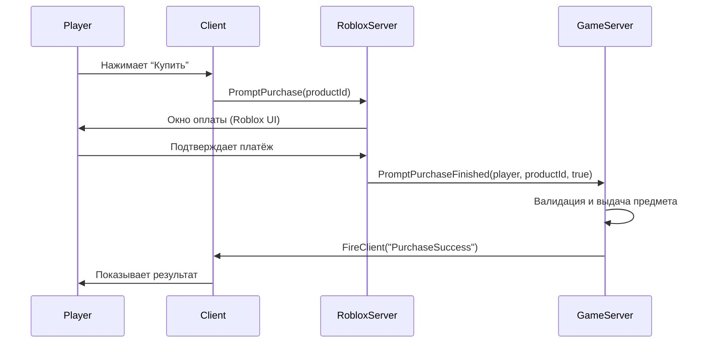

import ExternalCodeEmbed from '@site/src/components/ExternalCodeEmbed';


import ExternalPlayEmbed from '@site/src/components/ExternalPlayEmbed';


# Разработка на Roblox

<ExternalPlayEmbed example="spinoff/game-dev-studio-demo" title="Игровая студия" minHeight={560} />

<div class="article-tags">
  <span class="tag tag-required">ОБЯЗАТЕЛЬНО</span>
  <span class="tag tag-beginner">ДЛЯ НОВИЧКОВ</span>
</div>

<span class="complexity-badge">Всем</span>

---

## Разработка на Roblox

Платформа Roblox представляет собой экосистему, объединяющую пользователей и разработчиков для создания, публикации и взаимодействия с виртуальными мирами. Её ключевая особенность — возможность разработки трёхмерных игр без необходимости владения профессиональными 3D-редакторами или сложными игровыми движками. Основным инструментом для разработки выступает **Roblox Studio** — приложение, предоставляющее доступ к редактору сцены, системе физики, средствам визуализации и полнофункциональному языку программирования Lua.

Разработка на Roblox ориентирована как на начинающих, так и на опытных программистов. Низкий порог входа позволяет освоить основы геймдева уже на начальных этапах обучения, однако масштабируемость платформы и поддержка скриптования открывают возможности для реализации сложных механик, многопользовательского взаимодействия и даже экономических систем. Продвинутая тема экономики и магазина — в отдельной статье: [Внутриигровая экономика Roblox](./202).

<div class="callout callout--tip">
  <div class="callout-title">С чего начать (учебный маршрут)</div>

  <div class="callout-body">
  Эта статья — справочник по архитектуре и API. Для первой игры идите по порядку: [Studio и Place](/encyclopedia/9-spinoff/9-04-razrabotka-igr/203) → [практикум "обби"](/encyclopedia/9-spinoff/9-04-razrabotka-igr/204) → по желанию [королевская битва](/encyclopedia/9-spinoff/9-04-razrabotka-igr/205) и [механика и продвижение](/encyclopedia/9-spinoff/9-04-razrabotka-igr/206).

  Полный маршрут — в [о разделе](/encyclopedia/9-spinoff/9-04-razrabotka-igr/intro).
</div>
</div>

---

## Основы

Roblox поддерживает как простые мини-игры (например, паркур или гонки), так и сложные многопользовательские проекты с экономикой, прогрессией, кастомной физикой и серверной логикой. Платформа масштабируется вместе с вашими навыками — начав с перетаскивания блоков, вы можете перейти к проектированию распределённых систем, работающих с тысячами игроков одновременно.

---

### Система Roblox

Roblox — **платформа с клиент-серверной архитектурой и интегрированной средой разработки**.  
Она состоит из трёх уровней:

| Уровень | Роль | Примеры компонентов |
|---------|------|---------------------|
| **Платформа (Roblox Cloud)** | Хостинг, аутентификация, платёжная система, DataStore, DevHub | Marketplace, DataStoreService, Developer Products |
| **Сервер игры (Game Server)** | Выполняет авторитетную логику: движение, коллизии, экономика | `Workspace`, `ServerScriptService`, `Players`, физика |
| **Клиент (Roblox Player)** | Отображает игру, обрабатывает ввод, показывает GUI | `StarterGui`, `LocalScript`, рендер, звук |

> **Важно**: при запуске игры в Studio вы запускаете *локальный сервер + один клиент* — это эмуляция реального окружения. Но архитектура остаётся прежней: сервер и клиент — разные процессы.

Roblox Cloud - это глобальная распределённая система, управляемая Roblox Corporation. Не подвергается прямому влиянию разработчика игры, но предоставляет сервисы через API.

Roblox построена по принципу **разделения ответственности** между облачной инфраструктурой, игровым сервером и клиентом. Эта структура гарантирует безопасность, масштабируемость и согласованность состояния во всех сессиях.

Представьте, что игрок нажимает кнопку "Купить меч". На клиенте отображается надпись "Покупка успешна", и меч появляется в руках. Однако если проверка баланса выполнена только на клиенте, злоумышленник может изменить код через DevConsole и получить предмет бесплатно. Поэтому **вся критическая логика — на сервере**, а клиент лишь отображает результат.

---

### Платформа (Roblox Cloud)

Это глобальная распределённая система, управляемая Roblox Corporation. Не подвергается прямому влиянию разработчика игры, но предоставляет **сервисы через API**. Она обеспечивает аутентификацию, хостинг, платёжные операции, хранение данных и аналитику.

---

#### Компоненты и их назначение

| Компонент | Описание | Доступ из игры | Примечания |
|-----------|----------|----------------|------------|
| **Authentication & Identity** | Управление аккаунтами, сессиями, ролевой моделью (RBAC) | `game.Players.LocalPlayer.UserId`, `UserOwnsGamePassAsync()` | Все `Player` объекты содержат только публичную информацию (Name, DisplayName); приватные данные (email, возраст) недоступны. |
| **Game Hosting & Matchmaking** | Выделение и управление игровыми серверами (Game Server), балансировка нагрузки, регион-маршрутизация | `game.JobId`, `game.PlaceId` | Сервер игры существует *не дольше 6 часов* (лимит idle-time); при завершении все данные должны быть сохранены в DataStore. |
| **DataStoreService** | Постоянное хранилище данных игроков и игры. Поддерживает атомарные обновления (`UpdateAsync`) с квотами и повторами при сбоях — не полноценная СУБД. | `DataStoreService:GetDataStore()` | Основные типы: `DataStore` (ранее GlobalDataStore) и `OrderedDataStore`. Лимиты и квоты см. [документацию DataStore](https://create.roblox.com/docs/cloud-services/datastores). |
| **MarketplaceService** | Обработка покупок через Robux, возвратов, проверки владения Game Pass. | `MarketplaceService:PromptPurchase()`, `.PromptPurchaseFinished` | Все операции — асинхронные. Подтверждение приходит *только после финальной авторизации на сервере Roblox*. |
| **DevHub & Creator Dashboard** | Система управления ассетами, монетизацией, аналитикой, Developer Products. | Только вне игры (веб-интерфейс) | Регистрация Developer Product требует: уникального `ProductId`, названия, описания, цены. После публикации — изменение цены невозможно (только создание нового продукта). |
| **UGC & Asset Delivery** | Хостинг и доставка пользовательских ассетов (модели, анимации, текстуры). | `rbxassetid://...`, `rbxthumb://...` | Все ассеты проходят модерацию. Использование непроверенных внешних ресурсов (`http://`) запрещено политикой. |
| **Telemetry & Analytics** | Сбор метрик: retention, DAU, crash reports, performance stats. | Только через встроенные события (`.ChildAdded`, `HttpService` запрещён для отправки) | Данные доступны разработчику в DevHub. Прямой экспорт (например, в Google Analytics) блокируется. |

---

#### Важные ограничения платформы

- **Нет доступа к файловой системе** — даже для временных файлов.
- **Нет прямого HTTP-выхода** — `HttpService` разрешён только для ограниченного набора whitelisted-хостов (например, Discord webhooks — только с включённой опцией в Settings).
- **Время на сервере — UTC**, без доступа к локальному времени игрока.
- **Память** ограничена: ~1.5–2.5 GB RAM на сервер (в зависимости от региона и тарифа). Переполнение → OOM-kill.

---

### Сервер игры (Game Server)

Это экземпляр движка Roblox, развернутый в облаке или локально (в Studio). Выполняет **авторитетную (authoritative)** логику — то есть любое его решение считается окончательным. Например, если сервер говорит, что игрок мёртв, то он мёртв — даже если клиент продолжает показывать анимацию бега.

---

#### Компоненты

| Компонент | Назначение | Примеры |
|-----------|------------|---------|
| **DataModel** | Корень иерархии объектов. Содержит: `Workspace`, `Players`, `Lighting`, `ReplicatedFirst` и др. | `game`, `DataModel` — синонимы. |
| **Workspace** | Сцена физического мира. Все `BasePart`, `Model`, `Terrain`, персонажи — здесь. | Физика (PhysX), рендер, коллизии. |
| **Players** | Коллекция подключённых игроков. Управляет жизненным циклом `Player` и `Character`. | `game.Players.PlayerAdded`, `player.CharacterAdded`. |
| **ServerScriptService** | Контейнер **только для серверных скриптов** (`Script`). Автоматически запускается при загрузке. | Логика победы, экономика, инициализация уровней. |
| **ReplicatedStorage** | Общий контейнер для объектов, доступных *и серверу, и клиентам*. | Каталоги предметов, общие `ModuleScript`, `RemoteEvent`. |
| **PhysicsService** | Управление группами коллизий, физическими параметрами. | `CreateCollisionGroup`, `CollisionGroupSetCollidable`. |
| **LogService** | Централизованный логгер для сервера. | `LogService.MessageOut:Connect(...)`. |

---

#### Жизненный цикл сервера

1. **Инициализация**  
   Загружаются — `DataModel`, `Workspace`, `Lighting`, `ReplicatedStorage`, `ServerScriptService`. Выполняются `Script` в порядке создания.

2. **Ожидание игроков**  
   Сервер работает в фоне, обрабатывая события (например, таймеры), но не запускает `Character` до подключения.

3. **Подключение игрока**  
   - Создаётся `Player` в `game.Players`.  
   - Вызывается `PlayerAdded`.  
   - Клонируются `StarterPlayer`, `StarterGui`, `StarterPack` → в `player`.  
   - Сервер создаёт `player.Character` (если не отключено `player:LoadCharacter()`).

4. **Игровой процесс**  
   - Физика, события, скрипты работают синхронно с тиком движка (~30–60 FPS).  
   - Сервер отправляет обновления клиентам через **репликацию** (изменения свойств, событий, объектов).

5. **Отключение игрока**  
   - `Character` уничтожается → `player.Character = nil`.  
   - Вызывается `PlayerRemoving`.  
   - Данные игрока сохраняются (если предусмотрено).

6. **Завершение сессии**  
   Сервер останавливается через 6 часов бездействия или при ручной остановке. Все несохранённые данные теряются.

---

#### Ключевые принципы

- **Репликация идёт только "сверху вниз"**:  
`Server → Client`, но не наоборот — кроме специально разрешённых `RemoteEvent`/`RemoteFunction`.

- **Сервер не имеет GUI** — ни `ScreenGui`, ни `TextLabel`, ни рендер.  
  Всё, что видит игрок, — результат репликации на клиент.

- **Нет доступа к `LocalPlayer`** — `game.Players.LocalPlayer` всегда `nil` на сервере.

---

### Клиент (Roblox Player)

Это приложение, установленное на устройстве игрока (Windows, macOS, iOS, Android, Xbox, VR). Отвечает за **локальную интерактивность и рендер**. Клиент — это глаза, уши и руки игрока. Он отображает мир, реагирует на ввод и отправляет запросы на сервер.

---

#### Компоненты

| Компонент | Назначение | Примеры |
|-----------|------------|---------|
| **Renderer** | 3D-рендеринг сцены (PBR, динамическое и запечённое освещение, пост-обработка). | Тени, отражения, эффекты камеры. |
| **InputManager** | Обработка клавиатуры, мыши, тача, геймпада. | `UserInputService.InputBegan`, `ContextActionService`. |
| **SoundService** | Воспроизведение звуков и музыки. | `Sound:Play()`, `SoundService.RespectFilteringEnabled`. |
| **StarterGui** | *Шаблон* GUI. Не отображается — клонируется в `player.PlayerGui` при входе. | `ScreenGui`, `Frame`, `TextButton`. |
| **LocalScript** | Клиентские скрипты. Должны быть в `PlayerScripts`, `StarterGui`, `Backpack`. | Анимации камеры, HUD, обработка кликов. |
| **PlayerScripts** | Специальный контейнер в `StarterPlayerScripts`. Загружается *после* `Character`. | `Animate.lua`, пользовательские `LocalScript`. |

---

#### Жизненный цикл клиента

1. **Загрузка**  
   Подключается к Game Server, запрашивает `DataModel`.

2. **Инициализация**  
   Принимает `Workspace`, `Lighting`, клонирует `Starter*` → в свой контекст.

3. **Создание персонажа**  
   После получения `player.Character` — запускаются `LocalScript` в `PlayerScripts`.

4. **Интерактивность**  
   - Обработка ввода → отправка `RemoteEvent:FireServer()`.  
   - Обновление GUI в ответ на `RemoteEvent.OnClientEvent`.  
   - Рендер в реальном времени.

5. **Отключение**  
   При выходе — остановка всех скриптов, очистка памяти.

---

#### Ограничения клиента

- **Нет доступа к другим игрокам**, кроме `LocalPlayer`.  
`game.Players:GetPlayers()` возвращает всех, но `player.Character` других игроков — только позиция и ориентация (без `Humanoid.Health`, если не реплицируется).

- **Нет авторитетного изменения `Workspace` с клиента** — при `FilteringEnabled` локальные правки частей не реплицируются на сервер; для игровой логики используйте `RemoteEvent`/`RemoteFunction`.

- **Локальные данные не сохраняются** — `PlayerGui`, `Backpack`, `leaderstats` уничтожаются при выходе, если не синхронизированы с сервером.

- **Девконсоль (F9)** позволяет:  
   - Выполнять Lua-код (но только в локальной сессии);  
   - Изменять свойства объектов (но только нереплицируемые);  
   - Не даёт доступа к `ServerScriptService`, `DataStore`.

---

### Взаимодействие уровней

#### Пример — покупка предмета за монеты

| Этап | Платформа | Сервер | Клиент |
|------|-----------|--------|--------|
| **1. Инициация** | — | — | `button:Click() → BuyEvent:FireServer("Item_001", txId)` |
| **2. Валидация** | — | Проверка `txId`, баланса, наличия предмета | — |
| **3. Транзакция** | — | `CurrencyManager:Spend(); Inventory:Unlock(); DataStore:UpdateAsync()` | — |
| **4. Подтверждение** | — | `BuyEvent:FireClient(player, "Success")` | Получает событие → обновляет GUI |
| **5. Сохранение** | `DataStore` принимает запись, реплицирует в резервные ноды | Операция завершена | — |

> ⚠️ Ни один этап не может быть пропущен. Пропуск валидации на сервере = уязвимость к читерству.

---

## Порядок инициализации

Процесс запуска делится на три фазы — **инициализация мира (server-only)**, **подключение игрока (server)**, **инициализация клиента (client)**. Каждая фаза имеет строгий порядок и набор событий.

---

### Фаза 1. Инициализация сервера (до подключения игроков)

Происходит при запуске `game`, локально в Studio (`Play`) или в облаке (Production Server). Выполняется **один раз за сессию сервера**.

---

#### Шаг 1.1. Загрузка `DataModel`

- Создаётся корневой объект `DataModel` (`game`).
- Инициализируются **системные сервисы**:
  - `Workspace`
  - `Players`
  - `Lighting`
  - `ReplicatedStorage`
  - `ServerScriptService`
  - `SoundService`
  - `HttpService` (если разрешён)
  - и др.

> ⚠️ `ReplicatedFirst`, `StarterGui`, `StarterPlayer` — *не создаются автоматически*. Они появляются **только если присутствуют в `.rbxlx`** или были добавлены вручную.

---

#### Шаг 1.2. Выполнение `Script` в `ServerScriptService`

- Скрипты запускаются **в порядке их создания** (не алфавитном, не по имени).
- **Параллельное выполнение**:
  - Если скрипт содержит `while true do task.wait()`, он *не блокирует* загрузку других скриптов.
  - `task.spawn()` и `coroutine` позволяют инициировать фоновые процессы.
- **Доступные сервисы**:
  - `game:GetService("Workspace")` ✅  
  - `game.Players:GetPlayers()` → `{}` (пустая таблица)  
  - `game.Players.LocalPlayer` → `nil` (сервер не имеет LocalPlayer)

---

#### Шаг 1.3. Инициализация `Workspace`

- Физика **ещё не запущена**: `Workspace:IsLoaded()` → `false`.
- Коллизии, гравитация, `Touched` — неактивны.
- Можно создавать объекты (`Part`, `Model`), но они не участвуют в симуляции, пока `Workspace.Loaded` не станет `true`.

---

#### Шаг 1.4. Событие `Workspace.Loaded`

- **Флаг `Workspace.Loaded = true` устанавливается**.
- Запускается физический движок (PhysX).
- Объекты в `Workspace` становятся *физическими*:
  - `Anchored = false` → начинают падать.
  - `Touched`, `TouchEnded` — активны.
  - `BasePart:GetConnectedParts()` — работает.

> ✅ Рекомендуется — откладывать физически значимые операции (например, `:MoveTo()`, `ApplyImpulse()`) до `Workspace.Loaded:Wait()`.

---

#### Шаг 1.5. Инициализация `Lighting`

- Устанавливаются параметры по умолчанию (время суток, туман, Ambient).
- После `Workspace.Loaded` — начинает влиять на рендер.

---

### Фаза 2. Подключение игрока (серверная сторона)

Происходит при первом подключении игрока к серверу. Может повторяться для каждого игрока.

---

#### Шаг 2.1. Событие `Players.PlayerAdded`

- Создаётся объект `player` (класс `Player`) и добавляется в `game.Players`.
- Свойства `player`:
  - `player.Name`, `player.DisplayName` ✅  
  - `player.UserId` ✅  
  - `player.Character` → **`nil`**  
  - `player.PlayerGui` → **`nil`**  
  - `player.Backpack` → **`nil`**

> ⚠️ Попытка доступа к `player.Character.Humanoid` здесь → `attempt to index nil`.

---

#### Шаг 2.2. Клонирование Starter-контейнеров

Последовательность строго фиксирована:

| Порядок | Действие | Куда клонируется |
|---------|----------|------------------|
| 1 | `StarterPlayerScripts` | → `player.PlayerScripts` |
| 2 | `StarterCharacterScripts` | → `player.CharacterScripts` (только при создании `Character`) |
| 3 | `StarterPlayer` | → `player` (свойства, атрибуты, скрипты) |
| 4 | `StarterGui` | → `player.PlayerGui` (**создаётся пустой `PlayerGui`, затем клонируются дочерние элементы**) |
| 5 | `StarterPack` | → `player.Backpack` (**создаётся `Backpack`, затем клонируются инструменты**) |

> 🔍 Важно:
> - `StarterGui` и `StarterPack` **не клонируются напрямую** — создаются *контейнеры* (`PlayerGui`, `Backpack`), и в них копируются дети.
> - Если `StarterGui` пуст — `player.PlayerGui` всё равно создаётся (как пустая папка).
> - Клонирование **не включает** `LocalScript` в `StarterPlayer` → они становятся `Script` в `player.PlayerScripts`.

---

#### Шаг 2.3. Инициализация `PlayerGui` и `Backpack`

- `player.PlayerGui` и `player.Backpack` становятся **не-`nil`**.
- Но: GUI ещё **не отображается** — рендер не начался.

---

#### Шаг 2.4. Создание персонажа (`Character`)

- Вызывается внутренне `player:LoadCharacter()` (если `player.Character` = `nil` и не отключено в настройках).
- Происходит **асинхронно** — обычно через 0.1–0.5 сек после `PlayerAdded`.
- Этапы создания персонажа:
  1. Создаётся `Model` → `player.Character`.
  2. В него клонируется **R15/R6 rig** (в зависимости от настроек).
  3. Применяются ассеты (одежда, лицо, тело — из аккаунта игрока).
  4. Запускается `Animator`, `Humanoid`, `HumanoidRootPart`.
  5. Вызывается событие `player.CharacterAdded`.

> ⚠️ `player.CharacterAdded` **не гарантирует**, что:
> - `HumanoidRootPart` уже существует (может быть задержка из-за загрузки мешей);
> - `Humanoid.Health > 0` (иногда `Humanoid` инициализируется с `Health = 0`, затем `Health = 100`).

---

#### Шаг 2.5. Событие `player.CharacterAdded`

- Сигнализирует, что `player.Character` ≠ `nil` и содержит базовую иерархию.
- **Рекомендуемая практика**:
```lua
  player.CharacterAdded:Connect(function(character)
      local hrp = character:WaitForChild("HumanoidRootPart", 5)
      if not hrp then return end
      local humanoid = character:WaitForChild("Humanoid", 5)
      if not humanoid or humanoid.Health <= 0 then
          -- Дождаться полной инициализации
          humanoid.HealthChanged:Wait()
      end
      -- Теперь можно: hrp.Position, humanoid:MoveTo(), и т.д.
  end)
```

---

### Фаза 3. Инициализация клиента (локальная машина игрока)

Запускается **после** того, как сервер отправил клиенту `DataModel` и `player.Character`.

---

#### Шаг 3.1. Получение `DataModel` на клиенте

- Клиент получает синхронизированную копию `Workspace`, `Lighting`, `ReplicatedStorage`.
- `game.ReplicatedFirst` клонируется → `game.StarterGui` → `PlayerGui` (**локальная копия**).

---

#### Шаг 3.2. Создание `LocalPlayer`

- `game.Players.LocalPlayer` → ссылка на **собственного игрока**.
- Доступ к другим игрокам:
  - `game.Players:GetPlayers()` ✅  
  - `player.Character` других игроков — только `PrimaryPart`, `Humanoid.Health` (если разрешено), `Position` (реплицируется).

---

#### Шаг 3.3. Запуск `LocalScript`

- `LocalScript` выполняются **только в следующих контейнерах**:
  - `PlayerScripts`
  - `PlayerGui` и его дети
  - `Backpack` и его дети
  - `StarterPlayerScripts` (клонируется в `PlayerScripts`)
- `LocalScript` в `Workspace`, `ReplicatedStorage`, `ServerScriptService` — **игнорируются**.

---

#### Шаг 3.4. Событие `PlayerGui.Initialized`

- Гарантирует, что весь GUI загружен и отображается.
- Аналог `CharacterAdded` для интерфейса:
```lua
  player.PlayerGui.Initialized:Connect(function()
      -- Безопасно искать ScreenGui, Frame, Button
  end)
```

---

#### Шаг 3.5. Запуск `StarterCharacterScripts` на клиенте

- `LocalScript`, клонированные из `StarterCharacterScripts`, запускаются **после** `CharacterAdded`.
- Именно здесь работает `Animate.lua` — анимации движения/прыжка.

---

### Доступность объектов по времени

| Временная метка | `player.Character` | `player.PlayerGui` | `Humanoid` | `HumanoidRootPart` | `LocalPlayer` | `Workspace.Loaded` |
|-----------------|--------------------|--------------------|------------|--------------------|---------------|--------------------|
| `PlayerAdded` | `nil` | `nil` | — | — | `nil` (сервер) / ✅ (клиент) | ? |
| После клонирования `StarterGui` | `nil` | ✅ (пустой) | — | — | ✅ | ? |
| `CharacterAdded` | ✅ (Model) | ✅ | ✅ (но `Health` может быть 0) | ✅ (иногда с задержкой) | ✅ | ✅ |
| `Humanoid.Health > 0` | ✅ | ✅ | ✅ | ✅ | ✅ | ✅ |

> 🔎 Примечание: `Workspace.Loaded` обычно происходит *до* первого `PlayerAdded`, но в сложных сценах (большие мешы, скрипты инициализации) — может быть позже.

---

### Типичные ошибки и как их избежать

| Ошибка | Причина | Решение |
|--------|---------|---------|
| `attempt to index nil with 'Humanoid'` | Доступ к `player.Character.Humanoid` в `PlayerAdded` | Использовать `player.CharacterAdded:Wait()` или `:Connect()` |
| GUI не отображается | `LocalScript` ищет `ScreenGui` сразу после `PlayerAdded` | Дождаться `player.PlayerGui.Initialized` или использовать `player.PlayerGui:WaitForChild("MyGui")` |
| Скрипт не запускается | `LocalScript` размещён в `ReplicatedStorage` | Перенести в `StarterGui` или `StarterPlayerScripts` |
| `RemoteEvent` не срабатывает | `RemoteEvent` создан на клиенте, а не в `ReplicatedStorage` | Создавать `RemoteEvent` в `ReplicatedStorage` на сервере до подключения игроков |
| Предмет не появляется в инвентаре | Попытка `tool.Parent = player.Backpack` до `PlayerAdded` | Выполнять в `PlayerAdded` или `CharacterAdded` |

---

### Как проверить порядок самому?

Добавьте в `ServerScriptService` этот скрипт:


<ExternalCodeEmbed example="lua/sp-9-9-04-razrabotka-igr-2-001" title="Как проверить порядок самому?" minHeight={642} />


---

## `Instance`

`Instance` — базовый класс (в терминах ООП — *суперкласс*), от которого наследуются **все объекты** в среде Roblox. Это *активный субъект*, участвующий в репликации, сериализации, событийной модели и управлении памятью.

Наследуется всё — `Part`, `Model`, `Script`, `RemoteEvent`, `Player`, `Folder`, `DataModel`.

---

### Техническое определение

- **Тип**: `DataType.Instance` (в Lua — `typeof(obj) == "Instance"`).
- **Наследование**: иерархия классов реализована в C++ ядре движка; в Lua доступна только через `obj.ClassName`, `obj:IsA("Part")`.
- **Уникальный идентификатор**: каждому `Instance` присваивается GUID при создании (`obj:GetDebugId()` → строка вида `"1234567890"`). Не путать с `obj.Name` (не уникален) или `obj.UserId` (только для `Player`).

> ✅ Проверка:
> ```lua
> local part = Instance.new("Part")
> print(typeof(part))        -- "Instance"
> print(part.ClassName)      -- "Part"
> print(part:IsA("BasePart"))-- true (Part <: BasePart <: Instance)
> ```

---

### Структура `Instance`

Каждый экземпляр состоит из четырёх взаимосвязанных компонентов. Нарушение целостности одного — делает объект неработоспособным.

| Компонент | Назначение | Реализация | Доступность |
|-----------|------------|------------|-------------|
| **Класс (Class Info)** | Определяет метаданные: список свойств, методов, событий, наследование. | Загружается из `rbxmx`-манифестов при старте движка. Неизменяем. | Только для чтения (`ClassName`, `IsA()`, `GetFullName()`) |
| **Состояние (State)** | Текущие значения свойств (`Position`, `Name`, `Enabled` и т.д.). | Хранится в памяти; сериализуется в `.rbxlx`/`.rbxl`. | Чтение/запись через `obj.Property = value` |
| **Поведение (Methods & Events)** | Логика: методы (`:Clone()`) и точки расширения (`.Touched`). | Часть класса; методы — вызовы C++ функций. | Вызов через `obj:Method()` или `obj.Event:Connect()` |
| **Контекст (Hierarchy)** | Положение в дереве (`Parent`, дети, `Ancestors`). | Управляется через `Parent`-ссылку; критично для репликации и сборки мусора. | Изменение через `obj.Parent = parent` |

**Пример**:
  
```lua
local part = Instance.new("Part")
part.Name = "Cube"
-- На этом этапе объект существует в памяти, но не виден и не участвует в физике.
part.Parent = workspace
-- Теперь объект активен: рендерится, реагирует на коллизии, реплицируется.
```

> ⚠️ **Важно**:  
> - Свойства, методы и события **не определяются динамически** (как в JavaScript). Они зашиты в класс.  
> - Попытка `part.NewProperty = 42` **не создаёт** новое свойство — это создаёт *локальную переменную в таблице Lua*, не связанную с `Instance`.  
> - Для хранения пользовательских данных используйте `obj:SetAttribute("key", value)` или `Folder` с `IntValue`/`StringValue`.

---

### Класс, экземпляр, переменная

| Понятие | Что это | Где хранится | Жизненный цикл |
|---------|---------|--------------|----------------|
| **Класс** (`Part`, `Script`) | Метаописание: какие свойства/методы есть, как сериализуется, как ведёт себя в физике. | В C++ библиотеке движка (`rbx-core.dll` и др.). Загружается один раз при старте. | Вечный — пока работает движок. |
| **Экземпляр** (`workspace.Ground`) | Конкретный объект в сцене. Имеет состояние и позицию в иерархии. | В куче (heap) движка. Имеет ссылочный счётчик. | От `Instance.new()` / клонирования — до `:Destroy()` или сборки мусора. |
| **Переменная в скрипте** (`local p = workspace.Ground`) | **Ссылка (указатель)** на экземпляр. Не содержит данных — только адрес. | В Lua-стеке/куче. | До выхода из области видимости или переприсваивания. |

---

#### Пример, демонстрирующий разницу


<ExternalCodeEmbed example="lua/sp-9-9-04-razrabotka-igr-2-002" title="Пример, демонстрирующий разницу" minHeight={390} />


> 🔍 При отладке в Studio:  
> — Выделение `part1` и `part2` в Explorer — разные элементы.  
> — `print(part1, part2)` → разные `DebugId`.

---

### Свойства

Свойства доступный через точечную нотацию: `part.Size`, `script.Disabled`.

Наиболее важные методы:
- `:Clone()` — создаёт глубокую копию объекта и всех детей. Возвращает новый экземпляр с `Parent = nil`.
- `:Destroy()` — немедленно удаляет объект из памяти и отключает все события. Безопасен для повторного вызова.
- `:FindFirstChild(name, recursive?)` — ищет ребёнка по имени. Не вызывает ошибку, если не найден.
- `:WaitForChild(name, timeout?)` — блокирующий поиск, полезен при инициализации:  
```lua
local hrp = character:WaitForChild("HumanoidRootPart", 5)
```


---

#### Типы свойств

| Тип | Примеры | Особенности |
|-----|---------|-------------|
| **Базовые (Base)** | `Name` (`string`), `Parent` (`Instance?`), `Archivable` (`bool`) | Есть у всех `Instance`. Изменение `Name` не влияет на репликацию. |
| **Класс-специфичные** | `Part.Size` (`Vector3`), `Script.Source` (`string`), `RemoteEvent.OnServerEvent` (`RBXScriptSignal`) | Определены в классе. Недоступны в других классах (`Part.Script` → ошибка). |
| **Сериализуемые** | Почти все, кроме `LocalScript.Disabled`, `Player.UserId` | Сохраняются в `.rbxlx`. Несериализуемые — игнорируются при сохранении. |
| **Реплицируемые** | `Part.Position`, `StringValue.Value`, `Player.DisplayName` | Изменения отправляются клиентам. Не реплицируются: `LocalScript`, `Player.UserId`, `Folder.ChildAdded` и др. |

---

#### Доступ к свойствам

- **Чтение**: `obj.Property` — всегда возвращает текущее значение (может быть `nil`, если свойство не инициализировано).
- **Запись**: `obj.Property = value` — валидируется типом:
```lua
  part.Size = "hello"  -- ошибка: "Unable to cast string to Vector3"
```
- **Отсутствующее свойство**:  
```lua
  print(part.NonExistent)  -- nil (без ошибки)
  part.NonExistent = 5     -- игнорируется (не создаёт свойство)
```

---

#### Событие `.Changed`

Срабатывает **после** успешного изменения многих свойств (например, `Size`, `Name`). Смена родителя отражается в **`AncestryChanged`**, а не в `Changed`.

```lua
part.Changed:Connect(function(property)
	print("Свойство", property, "изменено на", part[property])
end)

part.Size = Vector3.new(2, 2, 2)
-- Вывод: "Свойство Size изменено на 2, 2, 2"
part.Name = "NewCube"
-- Вывод: "Свойство Name изменено на NewCube"
```

> ⚠️ Не используйте `.Changed` для критичной логики (например, сохранения):  
> — Оно срабатывает при *любом* изменении, включая репликацию.  
> — Не гарантирует порядок относительно других событий.  
> — Для отслеживания `Parent` подписывайтесь на `AncestryChanged`.

---

### Методы

Методы — вызовы C++ функций через Lua-обёртку. Они **не копируются при клонировании** — поведение определяется классом.

---

#### Наиболее важные методы

| Метод | Назначение | Особенности |
|-------|------------|-------------|
| `:Clone()` | Создаёт глубокую копию объекта и всех детей. | Возвращает **новый экземпляр** с `Parent = nil`. Требует `obj.Archivable = true` (по умолчанию `true`). |
| `:Destroy()` | Уничтожает объект и всех детей. | Немедленно удаляет из памяти; события отключаются; `Parent` = `nil`. Безопасно вызывать повторно. |
| `:FindFirstChild(name, recursive?)` | Поиск ребёнка по имени. | Не вызывает ошибку, если не найден → возвращает `nil`. `recursive = true` — поиск во всей подветке. |
| `:WaitForChild(name, timeout?)` | Блокирующий поиск (с ожиданием). | Используется при инициализации (`Character:WaitForChild("HumanoidRootPart")`). При `timeout` → `nil`. |
| `:GetChildren()` | Возвращает таблицу прямых детей. | Не рекурсивно. Порядок — как в Explorer (по времени создания). |
| `:IsDescendantOf(parent)` | Проверка принадлежности к ветке. | Используется для проверки контекста (`if tool:IsDescendantOf(player.Backpack) then`). |
| `:ClearAllChildren()` | Удаляет всех детей (но не сам объект). | Эквивалентно `for _, c in ipairs(obj:GetChildren()) do c:Destroy() end`. |

> ✅ Рекомендация:  
> Всегда используйте `:Destroy()`, а не `obj.Parent = nil`.  
> — `obj.Parent = nil` оставляет объект в памяти, если есть ссылки (утечка).  
> — `:Destroy()` гарантирует освобождение ресурсов.

---

### События

События в Roblox — это экземпляры `RBXScriptSignal`. Они предоставляют два основных метода:

| Метод | Назначение | Возвращаемое значение |
|-------|------------|------------------------|
| `:Connect(callback)` | Подписка на событие. | `RBXScriptConnection` — объект соединения. |
| `:Wait()` | Блокирующее ожидание события. | Значения, переданные в `Fire(...)`. |

---

#### Пример работы с соединением
```lua
local connection = workspace.Part.Touched:Connect(function(hit)
	print("Коснулся", hit.Name)
end)

-- Отмена подписки
connection:Disconnect()  -- событие больше не будет вызываться

-- Проверка состояния
print(connection.Connected)  -- false после Disconnect()
```

> ⚠️ Утечки памяти:  
> — Если не вызвать `:Disconnect()`, соединение остаётся в памяти даже после `:Destroy()` объекта.  
> — Особенно критично в `LocalScript`: при выходе игрока соединения не отключаются автоматически.

---

### Диагностика и отладка `Instance`

| Задача | Метод | Пример |
|--------|-------|--------|
| Узнать класс | `obj.ClassName` | `"Part"` |
| Проверить тип | `obj:IsA("BasePart")` | `true` для `Part`, `MeshPart` |
| Полный путь | `obj:GetFullName()` | `"Workspace.Ground"` |
| Отладочный ID | `obj:GetDebugId()` | `"123456789"` (уникален в сессии) |
| Проверить, уничтожен ли | `not obj or not obj.Parent` | Ненадёжно; лучше отслеживать вручную |
| Проверить, клонируемый ли | `obj.Archivable` | `true` по умолчанию для большинства объектов |

> 🛠️ Совет: при отладке используйте `warn(obj:GetFullName(), obj.ClassName, obj:GetDebugId())` — это выводит кликабельную ссылку в Output Studio.

---

### Основные понятия

#### `Instance`

В Roblox **всё — объект типа `Instance`**:  
- `Workspace`, `Part`, `Script`, `RemoteEvent`, `Player`, `Folder`, `DataModel`.

Каждый `Instance` обладает:
- **Классом** — определяет *возможности* объекта (например, у `Part` есть `Size`, `Anchored`; у `RemoteEvent` — `FireServer`, `OnServerEvent`).
- **Свойствами** — данные, которые можно читать/писать (`Name`, `Parent`, `Transparency`, `Position`).
- **Методами** — действия, которые можно вызвать (`:Clone()`, `:Destroy()`, `:FindFirstChild()`).
- **Событиями** — сигналы, на которые можно подписаться (`.Touched`, `.Changed`, `MouseButton1Click`).

> ⚠️ Не путайте:
> - **Класс** — абстрактное описание (например, `Part`).  
> - **Экземпляр** — конкретный объект в сцене (например, `Ground` в `Workspace`).  
> - **Переменная в скрипте** — ссылка на экземпляр, а не его копия.

---

#### Иерархия

Любой `Instance` имеет *ровно одного* родителя (`Parent`) и может иметь *много* детей.

```lua
-- Создание объекта и привязка к иерархии
local part = Instance.new("Part")
part.Name = "MyCube"
part.Parent = workspace  -- ← важнейшая строка: без неё объект "висит в воздухе"
```

| Контекст | Как работает `Parent` |
|----------|------------------------|
| В **Explorer** | Дочерние объекты отступлены, скрытие родителя скрывает детей |
| В **коде** | `game.Workspace.MyCube` — синтаксический сахар для `game:GetService("Workspace"):FindFirstChild("MyCube")` |
| При **клонировании** | `:Clone()` копирует всю подветку, но *отвязывает* от родителя — нужно вручную задать `Parent`. |

> ✅ Пример ошибки:  
> ```lua
> local part = Instance.new("Part")
> part.Position = Vector3.new(0, 10, 0)
> part.Anchored = true
> -- ... и ничего не происходит
> ```  
> Причина: `part.Parent == nil`. Объект создан, но не добавлен в сцену → не рендерится и не участвует в физике.

---

### Контейнеры и сервисы

#### Что такое контейнер?

**Контейнер** — это `Instance`, который может содержать другие объекты.  
Основные типы:

| Контейнер | Тип | Роль | Доступ |
|-----------|-----|------|--------|
| `Workspace` | `Model` | Все видимые объекты мира | Сервер + клиент |
| `ReplicatedStorage` | `Folder` | Данные и объекты для обмена | Сервер + клиент |
| `ServerScriptService` | `Folder` | Серверные скрипты | Только сервер |
| `StarterGui` | `Folder` | Шаблоны GUI для игроков | Только сервер (клонируется) |
| `Players` | `Players` | Коллекция подключённых игроков | Сервер + клиент (только свой игрок) |

> **Сервис** — специальный контейнер, предоставляющий API (например, `MarketplaceService`, `PhysicsService`).  
> Доступ к сервисам:  
> ```lua
> local ds = game:GetService("DataStoreService")
> local phys = game:GetService("PhysicsService")
> ```

---

#### Как объект попадает в игру?

1. **Ручное размещение в Studio** → сохраняется в `.rbxlx` → загружается сервером при старте.
2. **Клонирование из `Starter*`** → при заходе игрока.
3. **Создание через `Instance.new()`** → динамически, во время игры.

→ Только объекты с `Parent ~= nil` и находящиеся в `Workspace`, `Lighting`, `Players` и т.п. становятся *активными*.

---

## Добавление скрипта к объекту

Этот раздел можно использовать как **универсальный алгоритм** для любого объекта — `Part`, `Model`, `Tool`, `ScreenGui`, `ImageButton`. Следуйте шагам строго — это гарантирует корректную работу и избегание распространённых ошибок.

---

### Шаг 1. Создание объекта в сцене

#### Действия в Studio
1. Откройте вкладку **Home** → нажмите **Part**  
   → в `Workspace` появится `Part` (по умолчанию — `Position = (0, 5, 0)`, `Size = (2, 2, 2)`, `Anchored = false`).

2. В **Explorer** найдите объект:  
```
   Workspace
   └── Part ── [выделите его]
```

3. В **Properties** задайте:
   - `Name = "Button"` (для идентификации в коде),
   - `Anchored = true` (чтобы не падал),
   - `Color = BrickColor.new("Bright green")` (визуальная обратная связь),
   - `CanCollide = false` (чтобы игрок мог пройти сквозь него — опционально).

> ✅ Почему `Anchored = true`?  
> Если `Anchored = false`, объект подчиняется физике: упадёт, может улететь при столкновении → поведение непредсказуемо. Для интерактивных элементов (кнопок, триггеров) — почти всегда `true`.

---

### Шаг 2. Добавление скрипта к объекту

#### Действия в Studio
1. Убедитесь, что `Button` выделен в **Explorer**.
2. ПКМ по `Button` → **Insert Object…** → выберите **Script**  
   → создаётся `Script` **внутри `Button`** (в иерархии: `Workspace.Button.Script`).

> ⚠️ Критическое правило:  
> — Скрипт, помещённый **внутрь объекта**, имеет прямой доступ к нему через `script.Parent`.  
> — Это надёжнее, чем `workspace:FindFirstChild("Button")`, потому что:  
>   • не зависит от имени;  
>   • не требует поиска;  
>   • работает даже при переименовании объекта.

---

#### Что произошло технически
- Создан экземпляр класса `Script` (не `LocalScript`, не `ModuleScript`).
- Его свойство `Parent` установлено в `Button`.
- Скрипт автоматически запущен (сервером), так как находится в `Workspace` — зона видимости сервера.

---

### Шаг 3. Базовый шаблон скрипта

Замените содержимое `Script` на следующий код — это **универсальный шаблон**, пригодный для 90 % простых интерактивных объектов:


<ExternalCodeEmbed example="lua/sp-9-9-04-razrabotka-igr-2-003" title="Шаг 3. Базовый шаблон скрипта" minHeight={720} />


---

### Разбор шаблона по блокам

| Блок | Зачем нужен | Что будет, если убрать |
|------|--------------|------------------------|
| `local object = script.Parent` | Прямая привязка к контексту. Надёжнее `workspace.Button`. | При переименовании/копировании — сломается. |
| `IsA("BasePart"/"Model")` | Защита от размещения скрипта в `Folder`, `IntValue` и др. | Ошибка `attempt to index nil` при `Touched`. |
| Проверка `hit.Parent` + `Humanoid` | Игнорировать касания частей без персонажа (мусор, снаряды). | Сработает на любом `Part`, не привязанном к модели игрока. |
| `hit:IsDescendantOf(object)` | Защита от self-touch (например, при `Anchored = false`). | Объект может активировать сам себя. |
| `enabled` + `Destroying` | Гарантированная отмена подписки. | Утечка памяти при удалении объекта. |
| `TweenService` / `Model:ScaleTo()` | Плавное изменение: у `Part` — твин свойств, у `Model` — `ScaleTo`. | Резкое `Size = ...` выглядит дёргано. |

---

### Шаг 4. Расширение — другие типы взаимодействия

Тот же шаблон работает для **любого события** — нужно только заменить:

| Тип взаимодействия | Что изменить в шаблоне |
|--------------------|------------------------|
| **Нажатие мышью (в GUI)** | Объект: `TextButton` в `ScreenGui`; Событие: `MouseButton1Click`; Проверка: не нужна (GUI — только клиент) |
| **Использование инструмента** | Объект: `Tool` в `Backpack`; Событие: `Activated`; Место скрипта: **внутри `Tool`** → будет `Script`, а не `LocalScript` |
| **Вход в зону (Region3)** | Объект: `Part` как триггер; Логика: `while true do task.wait(); if hrp.Position inside region then ...`; Событие: не используется — polling |
| **Клиентская анимация (камера, HUD)** | Скрипт: **`LocalScript`**, размещённый в `StarterGui/Button`; Событие: `MouseButton1Click` |

---

#### Пример — кнопка в GUI (клиентская версия)


<ExternalCodeEmbed example="lua/sp-9-9-04-razrabotka-igr-2-004" title="Пример — кнопка в GUI (клиентская версия)" minHeight={444} />


> ✅ Правило безопасности:  
> — Клиент может **инициировать** действие, но не выполнять его напрямую.  
> — Реальная логика (начисление монет, выдача предмета) — только после `FireServer` → серверная валидация.

---

### События

События — это *точки расширения*, в которые можно "подключить" код.

```lua
-- Подписка на событие
workspace.Part.Touched:Connect(function(hit)
   print("Столкнулся с", hit.Name)
end)
```

Как это работает:
1. Происходит физическое столкновение → движок вызывает событие `.Touched`.
2. Система ищет все активные `:Connect()` на этом событии.
3. Для каждого — создаётся задача, выполняемая в порядке подписки.

> ✅ Важно:  
> - `:Connect()` возвращает **соединение (`RBXScriptConnection`)** — его можно `.Disconnect()`.  
> - События *не блокируют* основной поток: обработчики запускаются асинхронно.

---

## Игрок

`player.Character` — это объект типа `Model`, размещённый непосредственно в `Workspace`. Он представляет **физическую форму игрока в мире** — тело, анимации, коллизии, передвижение. Его наличие необязательно — игрок может быть в игре без персонажа (например, в интерфейсном меню), но любое взаимодействие с 3D-миром требует его загрузки.

Персонаж создаётся, существует и уничтожается в рамках строго определённого цикла, управляемого движком. На каждый этап приходится конкретное событие и состояние объекта.

- **Состояние `player.Character = nil`**  
  Это начальное и конечное состояние. Оно возникает:
  - до первого вызова `player:LoadCharacter()` (обычно сразу после `PlayerAdded`);
  - после `player:UnloadCharacter()` (например, при смерти, телепортации в меню);
  - при выходе игрока (`PlayerRemoving`).

- **Создание персонажа**  
  Происходит вызовом `player:LoadCharacter()`, который инициирует:
  1. Создание пустого `Model` → присваивается `player.Character`.
  2. Клонирование **базового скелета** (R6 или R15, в зависимости от настроек аккаунта):
     - R6 — 6 частей — `Head`, `Torso`, `Left/Right Arm`, `Left/Right Leg`;
     - R15 — 15 частей — добавлены `Upper/LowerTorso`, `Left/RightHand`, суставы.
  3. Установка `PrimaryPart = HumanoidRootPart` — точка привязки для перемещения.
  4. Добавление системных объектов:
     - `Humanoid` — контроллер здоровья, состояния (Running, Jumping), смерти;
     - `Animator` — управление анимациями (через `AnimationTrack`);
     - `HumanoidDescription` — описание внешности (тело, лицо, одежда);
     - `StarterGear` — экипировка по умолчанию (если настроена в `StarterPlayer`).

- **Событие `CharacterAdded`**  
  Генерируется **после** присвоения `player.Character = model`, но **до** полной загрузки всех частей. На момент события:
  - `model:FindFirstChild("Humanoid")` может вернуть `nil`, если загрузка мешей задержана;
  - `Humanoid.Health` часто равен `0` в первый тик, затем устанавливается в `100`;
  - `HumanoidRootPart` может отсутствовать на 1–2 кадра (особенно при медленной загрузке ассетов).

- **Полная инициализация**  
  Состояние "персонаж готов" наступает, когда:
  - `Humanoid.Health > 0`;
  - `HumanoidRootPart` существует и имеет `CFrame`;
  - `Animator` загрузил базовые анимации (`idle`, `walk`, `jump`).

  Рекомендуемый способ ожидания:
```lua
  player.CharacterAdded:Connect(function(char)
      local hrp = char:WaitForChild("HumanoidRootPart", 5)
      local hum = char:WaitForChild("Humanoid", 5)
      if not (hrp and hum) then return end
      hum.HealthChanged:Connect(function(health)
          if health > 0 then
              -- Персонаж полностью инициализирован
          end
      end)
  end)
```

- **Уничтожение персонажа**  
  Инициируется `player:UnloadCharacter()` или автоматически при:
  - `Humanoid.Health <= 0` (если включено автовоскрешение — создаётся новый);
  - телепортации в зону без физики;
  - выходе из игры.  
  Перед уничтожением генерируется событие `CharacterRemoving`, позволяющее сохранить состояние (позиция, инвентарь в руках).


Объект `player` (тип `Player`) содержит:

| Свойство / Дочерний объект | Назначение |
|----------------------------|------------|
| `.UserId` | Уникальный ID в системе Roblox |
| `.Name` | Отображаемое имя |
| `.Character` | Модель персонажа (м.б. `nil` при входе/выходе) |
| `.PlayerGui` | GUI, отображаемый *только этому* игроку |
| `.Backpack` | Инвентарь вне экипировки |
| `.leaderstats` (соглашение) | Папка для счётчиков (уровень, монеты) |


> ⚠️ `player.Character` может быть `nil` не только при входе, но и при смерти, телепортации, смене персонажа.

---

### Обязательные компоненты персонажа

Ниже — минимальный набор объектов, без которых персонаж **не будет функционировать** как игровая сущность.

- **`HumanoidRootPart`**  
  Это `Part` (обычно `BallSocket` или `Block`), служащий **точкой опоры** для физики и перемещения. Именно его `CFrame` используется движком для:
  - расчёта позиции игрока в мире;
  - привязки камеры;
  - определения центра масс в физике.  
  Если `HumanoidRootPart` отсутствует или `nil`, методы вроде `Humanoid:MoveTo()` игнорируются.

- **`Humanoid`**  
  Контроллер состояния персонажа. Его свойства управляют поведением:
  - `Health`, `MaxHealth` — система жизни;
  - `WalkSpeed`, `JumpPower` — физические параметры;
  - `State` (`Enum.HumanoidStateType`) — текущее действие (Walking, Jumping, Dead);
  - `SeatPart` — если персонаж сидит, ссылается на `Seat`.  
  Методы `:TakeDamage()`, `:Sit()`, `:MoveTo()` вызывают изменения состояния и генерируют события (`Touched`, `Died`).

- **`Animator`**  
  Отвечает за проигрывание анимаций. Работает с `Animation` (ассеты, загруженные из библиотеки или `AnimationIds`).  
  Важно: `Animator` не создаётся вручную — он добавляется автоматически при загрузке персонажа.

- **Скелет (R6/R15)**  
  Иерархия `Part` и `JointInstance` (`BallSocketConstraint`, `HingeConstraint`).  
  Пример R15:
```
  Character
  ├── HumanoidRootPart
  ├── LowerTorso
  │   ├── LeftLeg
  │   └── RightLeg
  ├── UpperTorso
  │   ├── LeftArm
  │   └── RightArm
  │   └── Head
  └── ...
```
  Коллизии между частями отключены (`CanCollide = false`), чтобы избежать самопроизвольных падений.

Разработчик может добавлять в персонажа:
- `Tool` — экипированный предмет (в `Backpack` или прямо в `Character`);
- `ProximityPrompt` — интерактивные подсказки;
- `Script`/`LocalScript` — поведение, привязанное к персонажу (например, `Animate.lua` — клонируется из `StarterCharacterScripts`).

---

### Инвентарь

Термин *"инвентарь"* в Roblox не имеет единого объекта-контейнера. Вместо этого используется **двухуровневая система**, разделённая на:

- **`Backpack`** — серверный контейнер для предметов, *не экипированных* в текущий момент;
- **`PlayerGui` + `Character`** — клиентские места отображения (GUI) и экипировки (в руках).

Это разделение отражает архитектурный принцип: сервер управляет *состоянием*, клиент — *отображением*.

---

#### `Backpack` — серверное хранилище

- Это объект типа `Backpack`, дочерний по отношению к `player`.  
- Создаётся автоматически при подключении игрока, если в `StarterPack` есть хотя бы один предмет или явно вызвано `player:FindFirstChild("Backpack")` (ленивая инициализация).

- **Содержимое** — только объекты типа `Tool` (и его наследники, например, `HopperBin`).  
  Другие типы (`Part`, `Folder`, `IntValue`) **игнорируются** движком: они не отображаются в интерфейсе, не подчиняются логике экипировки.

- **Жизненный цикл предмета в `Backpack`**:
  1. Игрок подбирает предмет → сервер вызывает `tool.Parent = player.Backpack`.
  2. Предмет появляется в клиентском инвентаре (рендерится через `StarterGui/BackpackFrame`).
  3. При нажатии — клиент отправляет `tool:Activate()`, сервер получает `tool.Activated`.
  4. Сервер проверяет:  
     — `tool:IsDescendantOf(player.Backpack)` → можно экипировать;  
     — `player.Character` существует → можно поместить в руки.
  5. Сервер вызывает `tool.Parent = player.Character` → предмет переходит в персонаж.

- **Ограничения**:
  - Максимум 10 предметов в `Backpack` по умолчанию (настраивается через `StarterPlayer.MaxBackpackItems`).
  - Предметы в `Backpack` **не участвуют в физике**, даже если `CanCollide = true`.
  - `Backpack` доступен только на сервере; клиент видит его содержимое через репликацию, но не может напрямую изменять.

---

#### Экипировка — предметы в руках

Когда предмет "в руках", он находится **внутри `Character`**, обычно в `Torso` или `UpperTorso`.  
Типичная иерархия:
```
Character
└── UpperTorso
    └── Sword (Tool)
        ├── Handle (Part) — видимая модель
        └── Script — логика атаки
```

- **Активация**: вызов `tool:Activate()` на клиенте → `tool.Activated` на сервере.
- **Деактивация**: `tool:Deactivate()` или смена оружия → сервер перемещает `tool.Parent = player.Backpack`.

> 🔐 Безопасность:  
> — Клиент не может вызвать `tool.Parent = workspace` напрямую — сервер отклонит операцию.  
> — Сервер должен проверять, что `tool` принадлежит игроку:  
>   ```lua
>   tool.AncestryChanged:Connect(function(_, newParent)
>       if newParent ~= player.Character and newParent ~= player.Backpack then
>           tool.Parent = player.Backpack  -- возврат в инвентарь
>       end
>   end)
>   ```

---

#### Визуальное отображение (GUI)

Инвентарь **не имеет встроенного GUI**. Его отображение — обязанность разработчика.

- Типичный подход:
  1. В `StarterGui` создаётся `ScreenGui` с `Frame` и `ImageButton` для каждого слота.
  2. На клиенте `LocalScript` подписывается на:
     - `player.Backpack.ChildAdded` → отобразить новый предмет;
     - `player.Backpack.ChildRemoved` → убрать иконку;
     - `Humanoid.EquipTool` / `UnequipTool` → подсветить активный слот.
  3. Для иконок используются `ImageLabel` с `rbxassetid://...` (ассеты из Marketplace или загруженные через DevHub).

- **Важно**:  
  GUI должен обновляться **только на клиенте**, но данные — браться с сервера через `RemoteEvent`. Например:
```lua
  -- Сервер
  inventoryUpdate:FireClient(player, { "Sword", "Shield", nil, ... })

  -- Клиент
  inventoryUpdate.OnClientEvent:Connect(function(slots)
      for i, itemName in ipairs(slots) do
          slotsGUI[i].Icon.Image = getIconId(itemName)
      end
  end)
```

---

#### Постоянное хранение

Ни `Backpack`, ни `Character` не сохраняются между сессиями. Для долговременного инвентаря используется:

- **`DataStore`** — сохранение списка `Tool` по `ProductId` или имени:
```lua
  DataStore:SetAsync("Inventory_" .. player.UserId, { "Sword", "Potion" })
```
- **`leaderstats` (соглашение)** — временные счётчики в рамках сессии:
```lua
  local leaderstats = Instance.new("Folder")
  leaderstats.Name = "leaderstats"
  leaderstats.Parent = player

  local coins = Instance.new("IntValue")
  coins.Name = "Coins"
  coins.Value = 100
  coins.Parent = leaderstats
```

> ⚠️ `leaderstats` — это *не системный объект*, а соглашение сообщества. Его использование не гарантируется, но поддерживается всеми популярными фреймворками (например, `StarterPlayerScripts/Chat`).

---

### Взаимодействие

Цикл "взять → экипировать → использовать → убрать" выглядит так:

1. Сервер создаёт `Tool` в `Workspace` (например, `Sword`).
2. Игрок касается предмета → сервер проверяет расстояние и права → `sword.Parent = player.Backpack`.
3. Клиент получает репликацию → отображает иконку в GUI.
4. Игрок нажимает кнопку → клиент вызывает `sword:Activate()`.
5. Сервер получает `sword.Activated` → проверяет:
   - `sword.Parent == player.Backpack` — можно экипировать;
   - `player.Character` существует — можно поместить в руки.
6. Сервер: `sword.Parent = player.Character.UpperTorso`.
7. Клиент: запускает анимацию, показывает эффекты.
8. При использовании (удар) — клиент отправляет `RemoteEvent:FireServer("Attack")`, сервер валидирует и применяет урон.

Любой пропущенный шаг (например, отсутствие проверки `Parent` на сервере) приводит к уязвимости или ошибке.

---

## Транзакции, экономика и магазин

Подробный разбор серверных транзакций, проектирования магазина, DataStore, Developer Products и пошагового гайда вынесен в отдельную статью:

→ **[Внутриигровая экономика Roblox](./202)** — идемпотентность покупок, каталог, `CurrencyManager`, тестирование в Studio.

Кратко: покупки за внутриигровую валюту **проверяются и исполняются только на сервере**; клиент отправляет запрос через `RemoteEvent` и обновляет UI после ответа. Покупки за Robux — через `MarketplaceService:PromptPurchase` и `PromptPurchaseFinished` (см. [Монетизация](#монетизация)).

---

## Ландшафт

Ландшафт (объект `Terrain`) — это специализированный компонент среды, предназначенный для создания **непрерывных, объёмных, деформируемых поверхностей** крупного масштаба — гор, пещер, рек, рельефа местности. В отличие от сборки из отдельных `Part`, ландшафт представляет собой **единое воксельное поле**, управляемое движком на уровне низкоуровневых операций. Его существование обусловлено необходимостью баланса между визуальной сложностью, физической достоверностью и производительностью при масштабах, недостижимых через классический подход с `BasePart`.

---

### Внутреннее устройство

Ландшафт организован как трёхмерная регулярная сетка ячеек — **вокселей** (volume pixels). Каждый воксель имеет фиксированный размер — **2 × 2 × 2 метра** (это значение неизменно и не настраивается). Вся доступная для редактирования область делится на **чанки** размером 64 × 64 × 64 вокселя (то есть 128 × 128 × 128 метров в мире). Чанки загружаются и выгружаются динамически по мере перемещения игрока, что позволяет работать с картами размером до 8192 × 8192 × 512 метров (теоретический лимит), не перегружая память.

Каждый воксель хранит несколько атрибутов:
- **Материал** — определяет визуальный вид и физические свойства (земля, камень, вода, песок и др.; всего 36 встроенных материалов).
- **Форма** — геометрия внутри вокселя — пусто, полный куб, наклонная плоскость (ramp), угловая поверхность (wedge) и комбинации (например, "четверть куба"). Это позволяет создавать плавные склоны без ступенчатых переходов.
- **Цвет** — корректирующий оттенок (tint), накладываемый на базовую текстуру материала.

Движок генерирует **единый меш** на каждый чанк, объединяя все воксели с одинаковым материалом и смежными гранями. Этот процесс называется **mesh stitching**. Благодаря ему количество отрисовываемых объектов остаётся пропорциональным числу чанков, а не числу вокселей — что даёт решающее преимущество в производительности при больших ландшафтах.

---

### Физическое поведение

Физика ландшафта реализована на основе воксельной коллизионной сетки, а не полигональных мешей. Это означает, что коллизии рассчитываются **не по точной геометрии поверхности**, а по упрощённой сетке, где каждый воксель представляет собой куб или призму. Точность коллизий зависит от разрешения формы внутри вокселя, но даже в максимальном качестве она уступает `MeshPart` с высокополигональной коллизией.

Ключевые особенности:
- Объекты с `CanCollide = true` взаимодействуют с ландшафтом как с твёрдой поверхностью; `Anchored = false` части падают и останавливаются на ней.
- `Touched` и `TouchEnded` работают, но с задержкой и возможными "дрожаниями" при движении вдоль наклонных поверхностей (из-за дискретности вокселей).
- Физические свойства (трение, упругость) наследуются от материала: `Material.Grass` имеет низкое трение, `Material.Ice` — ещё ниже, `Material.Sand` — высокое сопротивление.
- Вода (`Material.Water`) — визуальный эффект с ограниченной глубиной (максимум 20 метров). Объекты под водой получают замедление через `Humanoid.WalkSpeed`, но потоков, течений или плавучести нет.

Важно: ландшафт **не участвует в динамической физике** — его нельзя толкнуть, разрушить или переместить физическим воздействием. Любые изменения должны инициироваться программно или через инструменты редактора.

---

### Редактирование

В Studio ландшафт редактируется через панель **Terrain**, доступную при выделении объекта `Terrain` в `Workspace`. Основные инструменты:
- **Raise/Lower** — изменение высоты поверхности;
- **Smooth** — сглаживание рельефа;
- **Paint** — смена материала;
- **Fill** — заливка объёма (например, создание куба земли);
- **Erase** — удаление вокселей (создание пустоты, пещер);
- **Region Paste** — копирование фрагментов между местами или играми.

Программное управление осуществляется через API объекта `Terrain`, доступного как `workspace.Terrain`. Ключевые методы:

- `:FillBlock(region: Region3, material: Enum.Material)`  
  Заполняет указанный куб материалом. `Region3` должен быть выровнен по воксельной сетке (координаты кратны 2).

- `:FillWedge(region: Region3, material: Enum.Material)`  
  Заполняет клин (полезно для склонов).

- `:ReadVoxels(region: Region3, resolution: number)`  
  Возвращает трёхмерный массив данных вокселей в заданной области. `resolution` = 4 — стандартное разрешение (1 воксель = 1 элемент массива).

- `:WriteVoxels(region — Region3, resolution: number, Данные: VoxelData)`  
  Записывает данные в ландшафт. Используется для процедурной генерации (например, шум Перлина → высота → материал).

- `:PlaceAsync(region: Region3, instances: {Instance})`  
  Встраивает стандартные `Part`, `MeshPart` в ландшафт (например, камни на поверхности), сохраняя их физику и скрипты.

Ограничения API:
- Все операции **синхронные и блокирующие** — при работе с большими областями (> 1 млн вокселей) возможны фризы.
- Максимальная область в одном вызове — 2048 × 2048 × 256 вокселей.
- Изменения мгновенно реплицируются всем клиентам (в отличие от `Part`, где можно скрыть промежуточные состояния).

---

### Производительность и масштабируемость

Ландшафт оптимизирован для **статических или медленно меняющихся** сцен. Его преимущества проявляются при площади поверхности свыше 500 × 500 метров:
- 1 чанк = 1 draw call для рендера, 1 физический объект для движка;
- в то время как сборка из `Part` того же размера потребовала бы тысяч draw call’ов и объектов физики.

Однако у ландшафта есть узкие места:
- **Изменение в реальном времени** (например, копание тоннелей игроками) требует частых вызовов `:FillBlock()`, что создаёт нагрузку на CPU и сеть (из-за репликации).
- **LOD (Level of Detail)** для ландшафта отсутствует — чанки всегда рендерятся в полном разрешении.
- **Ограничения на материалы**: нельзя использовать кастомные текстуры напрямую — только через `Terrain:DecorateAsync()` с предварительно загруженными ассетами.

Для гибридных решений рекомендуется:
- использовать `Terrain` для базового рельефа (горы, реки);
- добавлять детализацию через `Part`/`MeshPart` (камни, деревья, здания);
- избегать частого изменения вокселей — кэшировать операции, применять изменения пакетно.

---

### Совместимость и ограничения платформы

- Ландшафт поддерживается на всех платформах, включая мобильные устройства и консоли.
- В мобильных сборках используется упрощённый шейдер рендера — детали текстур и тени могут быть снижены.
- Максимальная высота по оси Y — 500 метров (вокселей выше `y = 250` не существует); максимальная глубина — −200 метров.
- Невозможно создать "плавающие" острова без опоры — воксели в воздухе удаляются автоматически, если не поддерживаются снизу (настройка `workspace.Terrain.AutoStretchFill`).

---

### Когда использовать ландшафт, а когда — `Part`

Выбор обусловлен задачей, а не предпочтениями:

- **Используйте `Terrain`, если**:
  - требуется непрерывный рельеф (горы, долины, пещеры);
  - карта превышает 300 × 300 метров;
  - важна производительность на слабых устройствах;
  - допустимы приблизительные коллизии.

- **Используйте `Part`/`MeshPart`, если**:
  - нужна точная геометрия (архитектура, интерьеры);
  - важны детальные коллизии (платформер, паркур);
  - объекты должны быть динамическими (движущиеся платформы, разрушаемые стены);
  - требуется кастомная текстура на отдельном элементе.

Гибридный подход (ландшафт + декор из `Part`) — стандартная практика в профессиональных проектах.

---

## Добавление, удаление, изменение объектов

### Через интерфейс (Studio)

- **Добавить**: `Home → Part` / `Model` / `Script`.
- **Удалить**: выделить → Delete / ПКМ → Delete.
- **Изменить свойство**: выделить → `Properties` → ввести значение.

---

### Через код

| Действие | Код |
|----------|-----|
| Создать | `local p = Instance.new("Part")` |
| Разместить | `p.Parent = workspace` |
| Изменить свойство | `p.Size = Vector3.new(5, 1, 5)` |
| Найти по имени | `workspace:FindFirstChild("Ground")` |
| Найти по пути | `game.Players.Player1.PlayerGui.ScoreLabel` |
| Удалить | `p:Destroy()` |

> ✅ `:Destroy()` предпочтительнее `p.Parent = nil`, потому что:  
> — отключает события;  
> — освобождает память;  
> — не оставляет "висячих" ссылок.

---

## Монетизация

### Что такое Robux?

- Валюта платформы Roblox.
- Приобретается за реальные деньги.
- **Разработчик не управляет балансом Robux игрока** — только запрашивает покупку.

---

### Как работает покупка за Robux?



> ⚠️ **Запрещено**:
> - Запрашивать платёж из `LocalScript` без подтверждения через `PromptPurchase`.
> - Выдавать предмет до получения `PromptPurchaseFinished`.
> - Использовать `RemoteEvent` для имитации покупки за Robux.

Пошаговый магазин на внутриигровых монетах и интеграция с Developer Products — в статье **[Внутриигровая экономика Roblox](./202)**.

---

## Архитектура проекта в Roblox Studio

### Структура сцены

Каждый проект в Roblox Studio строится вокруг понятия **места (Place)** — файла, содержащего всю информацию об игровом мире — объекты, скрипты, настройки, ресурсы. Проект хранится в виде `.rbxl` или `.rbxlx`, что позволяет сохранять состояние сцены между сессиями редактирования.

Центральным элементом редактора является окно **Explorer**, отображающее иерархию всех объектов в текущем месте. Объекты организованы в древовидную структуру, где каждый узел может содержать дочерние элементы. Это позволяет группировать связанные компоненты, например, помещая все элементы игровой среды в папку `Game Environment`.

Пример:
```
Workspace
├── Game Environment
│   ├── Ground
│   ├── Obstacle
│   └── Platforms
├── StarterGui
└── ReplicatedStorage
```

Такая организация способствует поддержке чистоты кода и упрощает навигацию по проекту.

---

### Основные контейнеры

- **Workspace** — корневой контейнер для всех видимых объектов в игровом мире — персонажи, платформы, препятствия.
- **StarterGui** — содержит элементы графического интерфейса (GUI), которые автоматически клонируются для каждого игрока при подключении.
- **ReplicatedStorage** — используется для хранения данных и объектов, доступных как на сервере, так и на клиенте.
- **ServerScriptService** — место для размещения серверных скриптов, управляющих логикой игры.
- **Lighting** — хранит параметры освещения, времени суток, тумана.
- **Players** — содержит данные о каждом игроке, включая его персонажа (`Character`) и инвентарь.

Правильное использование этих контейнеров обеспечивает предсказуемое поведение объектов и корректную работу системы репликации.

---

## Интерфейс Roblox Studio

### Основные панели

Интерфейс Roblox Studio состоит из нескольких ключевых компонентов:

1. **Главная область (Viewport)** — трёхмерное пространство, в котором происходит редактирование сцены.
2. **Панель инструментов (Toolbar)** — расположена сверху, содержит инструменты для выбора, перемещения, изменения размеров объектов, а также запуска и остановки игры.
3. **Explorer** — дерево объектов сцены, позволяющее добавлять, удалять и переупорядочивать элементы.
4. **Properties** — отображает и позволяет изменять свойства выбранного объекта (размер, положение, цвет, прозрачность, коллизии и др.).
5. **Toolbox** — библиотека готовых моделей, эффектов, скриптов и материалов.
6. **Output** — консоль, выводящая сообщения от скриптов, ошибки, предупреждения и результаты выполнения команд.

Доступ к этим панелям осуществляется через меню **View**. Например, чтобы открыть консоль, необходимо выбрать `View → Output`.

---

### Управление камерой

Управление вьюпортом аналогично другим 3D-редакторам:
- **W, A, S, D** — перемещение камеры.
- **Колесо мыши** — масштабирование.
- **ПКМ + движение мыши** — вращение камеры.
- **Зажатие Q** — орбитальное вращение вокруг центра.

Эти действия позволяют эффективно навигировать по сцене и точно размещать объекты.

---

## Создание игровой среды

### Базовые объекты — Part и BasePart

Все физические объекты в Roblox основаны на классе `BasePart`. Наиболее часто используется `Part` — параллелепипед, который можно масштабировать, вращать и раскрашивать.

---

#### Пример — создание земли
1. В Explorer создайте папку `Game Environment`.
2. Внутри неё добавьте новый `Part` и назовите его `Ground`.
3. Используйте инструмент **Resize** для изменения размеров (например, 100×1×100).
4. В Properties установите материал: `Grass` или `Concrete`.
5. При необходимости измените цвет через свойство `Color`.

---

### Работа с ландшафтом

Для создания естественного рельефа используется встроенный **Terrain Editor**.

---

#### Шаги
1. Перейдите в меню `View → Terrain`.
2. Выберите инструмент:
   - **Raise/Lower** — изменение высоты поверхности.
   - **Smooth** — сглаживание переходов.
   - **Paint** — нанесение текстур (трава, песок, камень).
3. Для добавления воды используйте режим **Water**, задав уровень и форму водоёма.

Ландшафт поддерживает многослойную текстуризацию и может быть экспортирован/импортирован для повторного использования.

---

## Программирование на Lua в Roblox

### Основы Lua

Roblox использует диалект Lua 5.1 с расширениями API, специфичными для платформы. Язык интерпретируется в реальном времени, что позволяет быстро тестировать изменения.

Типичный скрипт в Roblox:
```lua
local part = script.Parent

part.Touched:Connect(function(hit)
    print("Объект задет: " .. hit.Name)
end)
```

---

### Типы скриптов

- **Script** — выполняется на сервере. Используется для логики, требующей надёжности (например, проверка победы).
- **LocalScript** — выполняется на клиенте. Подходит для GUI, анимаций, ввода с клавиатуры.
- **ModuleScript** — содержит переиспользуемый код, импортируется через `require()`.

---

### Обработка событий

События — основа реактивной архитектуры в Roblox. Большинство объектов имеют встроенные события:

```lua
-- Обработка клика по кнопке
script.Parent.MouseButton1Click:Connect(function(player)
    print(player.Name .. " нажал кнопку")
end)

-- Изменение положения персонажа
game.Players.PlayerAdded:Connect(function(player)
    player.CharacterAdded:Connect(function(char)
        char:WaitForChild("HumanoidRootPart").Touched:Connect(function(hit)
            -- Логика столкновения
        end)
    end)
end)
```

---

### Асинхронность и задержки

Для отложенного выполнения используется `task.wait()` (аналог `delay()`):
```lua
task.spawn(function()
    task.wait(5)
    print("Прошло 5 секунд")
end)
```

---

## Физика и коллизии

### Система физики

Roblox включает встроенную физическую модель, основанную на двигателе NVIDIA PhysX. Все `BasePart` по умолчанию участвуют в симуляции, если не отключено свойство `Anchored`.

---

#### Ключевые свойства
- `Anchored` — фиксирует объект в пространстве.
- `CanCollide` — определяет, будет ли объект сталкиваться с другими.
- `Massless` — игнорирует влияние массы при столкновениях.
- `Gravity` — включение/выключение гравитации для части.

---

### PhysicsService

Для точного управления взаимодействием между объектами используется `PhysicsService`, позволяющий назначать объекты в разные группы коллизий:

```lua
local PhysicsService = game:GetService("PhysicsService")

PhysicsService:CreateCollisionGroup("Player")
PhysicsService:CollisionGroupSetCollidable("Player", "Obstacle", false)
```

---

## Графический интерфейс (GUI)

### Элементы интерфейса

GUI создаётся с помощью объектов внутри `StarterGui`. Основные типы:
- `ScreenGui` — контейнер для 2D-интерфейса.
- `Frame` — прямоугольная область.
- `TextButton`, `ImageButton` — кнопки.
- `TextLabel`, `TextBox` — отображение и ввод текста.

---

#### Пример — кнопка старта
```lua
local screenGui = Instance.new("ScreenGui")
local button = Instance.new("TextButton")

button.Size = UDim2.new(0, 150, 0, 50)
button.Position = UDim2.new(0.5, -75, 0.5, -25)
button.Text = "Start Game"
button.Parent = screenGui

button.MouseButton1Click:Connect(function()
    print("Игра начата!")
end)

screenGui.Parent = game.StarterGui
```

---

### Координатная система GUI

Используется относительная система координат через `UDim2`, где:
- `Scale` — часть от размера родителя (0–1).
- `Offset` — фиксированный сдвиг в пикселях.

---

## Система уровней и прогресса

### Реализация уровней

Система уровней может быть построена на основе накопления опыта (XP). При достижении порога — повышение уровня.


<ExternalCodeEmbed example="lua/sp-9-9-04-razrabotka-igr-2-005" title="Реализация уровней" minHeight={336} />


---

### Хранение данных

Для сохранения прогресса используется **DataStore**:
```lua
local DataStoreService = game:GetService("DataStoreService")
local playerStore = DataStoreService:GetDataStore("PlayerData")

-- Сохранение
playerStore:SetAsync("Player_"..player.UserId, playerData)

-- Загрузка
local data = playerStore:GetAsync("Player_"..player.UserId)
```

> **Важно**: DataStore имеет ограничения на частоту вызовов и требует обработки ошибок.

---

## Мультиплеер и репликация

### Сервер-клиент архитектура

Roblox использует авторитетный сервер:
- Все критические решения принимаются на сервере.
- Клиенты получают только визуальные и интерфейсные обновления.

---

### RemoteEvents и RemoteFunctions

Для передачи данных между клиентом и сервером используются:
- `RemoteEvent` — односторонняя отправка (например, клик по кнопке).
- `RemoteFunction` — запрос с ответом (например, получение данных игрока).

---

#### Пример
**ServerScript**
```lua
local remoteEvent = game.ReplicatedStorage.RemoteEvent

remoteEvent.OnServerEvent:Connect(function(player, action)
    if action == "Jump" then
        -- Выполнить действие на сервере
    end
end)
```

**LocalScript**
```lua
remoteEvent:FireServer("Jump")
```

---

## Анимации и моделирование

### Создание анимаций

Анимации создаются в **Animation Editor**:
1. Выделите персонажа или часть.
2. Откройте `Window → Animation Editor`.
3. Добавьте ключевые кадры для свойств (позиция, вращение).
4. Экспортируйте анимацию в `AnimationController`.

---

### Скриптовое управление анимациями
```lua
local animator = character:WaitForChild("Animator")
local animation = Instance.new("Animation")
animation.AnimationId = "rbxassetid://123456789"

local track = animator:LoadAnimation(animation)
track:Play()
```

---

## Тестирование и отладка

### Консоль вывода (Output)

Окно `Output` показывает:
- Результаты `print()`.
- Ошибки выполнения скриптов.
- Предупреждения о производительности.

---

### Инструменты отладки
- `Debug → Stats` — мониторинг FPS, памяти, количества частей.
- `Test → Play` — запуск локальной сессии.
- `TeleportService` — тестирование перехода между местами.

---

## Публикация проекта

### Подготовка к публикации
1. Убедитесь, что все скрипты протестированы.
2. Проверьте права доступа к ассетам.
3. Настройте настройки места — название, описание, теги.
4. Установите уровень приватности (публичный, друзья, приватный).

---

### Процесс публикации
1. Нажмите **Publish to Roblox**.
2. Выберите существующее место или создайте новое.
3. Загрузите изменения.
4. Получите ссылку для распространения.

После публикации игра становится доступна другим пользователям. Возможна интеграция с системой monetization (продажа предметов за Robux).

---

## Методология разработки

### Итеративный подход
1. **Прототипирование** — создание минимального воспроизводимого примера (MVP).
2. **Тестирование** — проверка на разных устройствах и соединениях.
3. **Оптимизация** — снижение количества частей, использование `MeshPart` вместо сложных конструкций.
4. **Сбор обратной связи** — анализ действий игроков, исправление багов.

---

### Рекомендации
- Начинайте с простых проектов (платформеры, мини-игры).
- Используйте готовые ресурсы из Toolbox.
- Документируйте код и структуру проекта.
- Регулярно сохраняйте и коммитьте изменения (при использовании внешних систем контроля версий).

---
