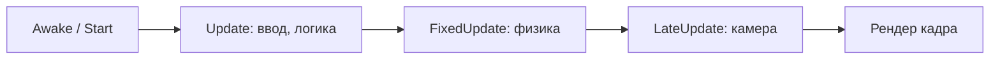

import ExternalCodeEmbed from '@site/src/components/ExternalCodeEmbed';


import ExternalPlayEmbed from '@site/src/components/ExternalPlayEmbed';


# Разработка на Unity

<ExternalPlayEmbed example="spinoff/game-dev-studio-demo" title="Игровая студия" minHeight={560} />

<div class="article-tags">
  <span class="tag tag-required">ОБЯЗАТЕЛЬНО</span>
  <span class="tag tag-beginner">ДЛЯ НОВИЧКОВ</span>
</div>

<span class="complexity-badge">Всем</span>

Unity — кроссплатформенный игровой движок для 2D и 3D приложений. Теоретическую основу (что такое движок, компонентная модель) см. в главах [Игровой движок](/encyclopedia/9-spinoff/9-04-razrabotka-igr/112) и [Виды игровых движков — Unity](/encyclopedia/9-spinoff/9-04-razrabotka-igr/113); здесь — практика в редакторе. Справочник API и lifecycle: [Справочник по Unity](/encyclopedia/9-spinoff/9-04-razrabotka-igr/301).

---

### Установка и настройка окружения

Для начала разработки нужны **Unity Hub** и **IDE для C#** (редактор кода).

1.  **IDE (на выбор)**:
    *   **Visual Studio Community** — https://visualstudio.microsoft.com/ru/vs/community/ — рабочие нагрузки **"Разработка игр с использованием Unity"** и **"Разработка классических приложений .NET"**.
    *   **JetBrains Rider** (платный, есть trial) или **Visual Studio Code** + расширение C# — тоже поддерживаются; в Unity Hub: *Edit → Preferences → External Tools* укажите нужный редактор.
2.  **Установка Unity Hub и редактора**:
    *   Скачайте Unity Hub с официального сайта Unity (https://unity.com/ru/download).
    *   Установите и запустите Unity Hub. Авторизуйтесь или создайте учетную запись.
    *   В разделе "Installs" добавьте новую версию Unity. Рекомендуется **LTS**-ветка (на момент обновления раздела — **Unity 6 LTS**); проверяйте актуальную LTS на [unity.com/releases](https://unity.com/releases).
    *   Во время установки Unity выберите **Visual Studio Community** в качестве среды разработки по умолчанию.
3.  **Создание проекта**:
    *   В Unity Hub перейдите во вкладку "Projects" и нажмите "New Project".
    *   Выберите подходящий шаблон (например, "3D").
    *   Укажите имя проекта и его расположение на диске.
    *   Нажмите "Create". Проект будет создан, и Unity Editor автоматически откроется.

4.  **Документация Unity**:
    *   **User Manual** — концепции редактора, пайплайны, 2D/3D, UI (*Help → Unity Manual* или [docs.unity3d.com/Manual](https://docs.unity3d.com/Manual/index.html)).
    *   **Scripting API** — классы C# (`GameObject`, `Rigidbody`, …): *Help → Scripting Reference* или поиск по API на сайте.
    *   На компоненте в Inspector кнопка **?** открывает страницу справки по этому API.

---

### Основные окна редактора Unity

Интерфейс Unity состоит из нескольких основных панелей, каждая из которых выполняет свою функцию.

*   **Scene View (Вид сцены)**:
    *   Представляет собой основное пространство для визуального редактирования сцены.
    *   Позволяет перемещать, вращать и масштабировать игровые объекты с помощью мыши и клавиш (W - перемещение, E - вращение, R - масштабирование).
    *   Инструменты в верхнем левом углу позволяют изменять режим просмотра (перспективный/ортогональный) и способ манипуляции объектами (перемещение по осям, вращение вокруг осей, масштабирование).

*   **Game View (Вид игры)**:
    *   Отображает сцену так, как она будет выглядеть при запуске игры.
    *   Позволяет изменять разрешение экрана и соотношение сторон для тестирования адаптации интерфейса под разные устройства.

*   **Hierarchy (Иерархия)**:
    *   Содержит список всех игровых объектов, находящихся на текущей сцене.
    *   Объекты могут быть организованы в виде дерева, где один объект является дочерним по отношению к другому (родитель-потомок). Дочерние объекты наследуют трансформации (позицию, вращение, масштаб) своего родителя.

*   **Project Window (Окно проекта)**:
    *   Является файловым менеджером для всех ресурсов вашего проекта — скрипты, модели, текстуры, звуки, префабы и т.д.
    *   Позволяет организовывать ресурсы в папки (например, `Scripts`, `Models`, `Textures`, `Prefabs`) для удобства управления.
    *   Предоставляет доступ к настройкам импорта ресурсов и возможность создавать новые элементы (скрипты, материалы, префабы).

*   **Inspector (Инспектор)**:
    *   Отображает все компоненты и их свойства для выбранного объекта в Hierarchy или Scene View.
    *   Это центральное место для настройки поведения объектов. Здесь можно изменять параметры компонентов, назначать ссылки на другие объекты и загружать ресурсы (например, модель или текстуру).
    *   Все изменения, внесенные в Inspector, сохраняются вместе с объектом.

*   **Console (Консоль)**:
    *   Отображает сообщения, генерируемые во время выполнения сцен (логи), а также предупреждения и ошибки.
    *   Критически важна для отладки кода. Ошибки в скриптах будут выделены красным цветом, и щелчок по сообщению позволяет перейти к соответствующей строке в коде.

---

### Игровые объекты и компоненты

Основой любой сцены в Unity являются **игровые объекты** (`GameObject`). Сам по себе GameObject — это пустой контейнер, который становится функциональным только после добавления к нему **компонентов**.

*   **Создание объектов**:
    *   Через контекстное меню в Hierarchy — клик правой кнопкой мыши -> `Create Empty` (пустой объект) или выбрать тип объекта из раздела `3D Object` (Cube, Sphere, etc.).
    *   Через главное меню: `GameObject` -> `Create Empty` / `3D Object`.
    *   Через кнопку "+" в верхней части панели Hierarchy.

*   **Основные компоненты**:
    *   **Transform**: Присутствует у каждого GameObject. **Мировые** координаты (`position`) и **локальные** относительно родителя (`localPosition`). Дочерний объект наследует движение родителя в иерархии.
    *   **Mesh Renderer**: Отвечает за визуализацию объекта. Получает геометрию из компонента `Mesh Filter` и применяет к ней материал.
    *   **Mesh Filter**: Хранит сетку (mesh) объекта, которая определяет его форму.
    *   **Collider** — Определяет физическую границу объекта для системы обнаружения столкновений (например, `Box Collider`, `Sphere Collider`).
    *   **Rigidbody**: Придает объекту физические свойства (массу, инерцию) и позволяет ему взаимодействовать с системой физики Unity. Объекты с Rigidbody подвержены действию силы тяжести и могут сталкиваться с другими объектами, имеющими Collider.

*   **Настройка свойств через Inspector**:
    *   Для изменения поведения объекта необходимо настроить параметры его компонентов в Inspector.
    *   Например, чтобы объект падал, добавьте к нему компонент `Rigidbody`. Чтобы он мог сталкиваться с другими объектами, убедитесь, что у него и у других объектов есть компоненты `Collider`.

---

### Префабы — повторное использование объектов

Префаб (`Prefab`) — это шаблон игрового объекта, который может быть многократно использован в сцене. Это ключевой инструмент для обеспечения согласованности и эффективности разработки.

*   **Создание префаба**:
    1.  Создайте и настройте игровой объект в сцене (например, настройте его компоненты, назначьте текстуры).
    2.  Перетащите этот объект из панели Hierarchy в папку `Prefabs` в окне Project.
    3.  Объект в сцене станет экземпляром префаба (его название в Hierarchy будет синим).

*   **Преимущества использования префабов**:
    *   **Упрощение управления**: Все экземпляры одного префаба имеют одинаковую базовую конфигурацию.
    *   **Легкость в тестировании и обновлении**: Если вы внесете изменения в сам префаб (в папке Project), все его экземпляры на всех сценах автоматически получат эти изменения. Это позволяет быстро вносить глобальные изменения (например, изменить здоровье врага).
    *   **Гибкость** — Экземпляры префаба можно модифицировать (например, изменить позицию или цвет материала), и при необходимости применить эти изменения обратно к оригинальному префабу с помощью кнопки "Apply All" в разделе Overrides в Inspector.

---

### Блок-out уровня (white-boxing)

Перед финальным артом удобно собрать **серую коробку** уровня из примитивов Unity — так проверяют масштаб, проходимость и ритм боя без затрат на модели.

1. Создайте родительский объект `Environment` и дочерние `Cube` / `Plane` для пола, стен, укрытий.
2. Выровняйте сетку (*Scene* → включите **Grid** и **Snap**, шаг 1 м) — игрок-капсула ≈ 2 м высотой, проходы шириной не меньше 1,5–2 м.
3. Назначьте простые **Materials** (разные цвета Albedo) — игрок, пол, стены, предметы легко различать в Play Mode.
4. Готовые группы (игрок, враг, бонус) сохраните как **префабы** в `Prefabs/`.

<div class="callout callout--info">
  <div class="callout-title">Документ до кода</div>

  <div class="callout-body">
  Для учебного прототипа достаточно **One-Page** — одностраничного описания концепта, механик и win/lose.

  Шаблон и типы документов (GDD, TDD, One-Page) — в [гейм-дизайне](/encyclopedia/9-spinoff/9-04-razrabotka-igr/117).
</div>
</div>

---

### Освещение сцены

| Тип | Роль | Типичное применение |
|-----|------|---------------------|
| **Directional Light** | "Солнце", параллельные лучи | Открытые арены, день/ночь через поворот |
| **Point Light** | Сфера света из точки | Факелы, лампы, взрывы |
| **Spot Light** | Конус, как прожектор | Фонари, вспышки, "конус видимости" в стелсе |

Кратко о режимах: **Realtime** — свет считается каждый кадр (дороже); **Baked** — освещение запекается в lightmap для статичной геометрии (дешевле в runtime). Для white-box достаточно одного Directional Light и ambient в *Window → Rendering → Lighting*.

---

### Работа со скриптами

Скрипты на C# определяют логику и поведение игровых объектов. Готовые фрагменты с построчным разбором — [Unity C# — скрипты для новичков](/lab/Примеры/1136).

---

#### Игровой цикл

**Игровой цикл** — каждый кадр движок повторяет: ввод → логика → физика → отрисовка. Если шаг тормозит, падает FPS.



Unity раскладывает цикл по методам `MonoBehaviour`:

| Метод | Назначение |
|-------|------------|
| `Awake` | Инициализация ссылок (один раз при создании объекта) |
| `Start` | Логика старта сцены (один раз перед первым `Update`) |
| `Update` | Кадровая логика: ввод, UI, таймеры (`Time.deltaTime` — длительность кадра) |
| `FixedUpdate` | Физика с фиксированным шагом (~50 Гц); силы и `Rigidbody` — здесь |
| `LateUpdate` | Камера и следование за целью — после всех `Update` |

**Разбор:** скорость в `Update` умножайте на `Time.deltaTime`. Силы к `Rigidbody` — в `FixedUpdate`. Камеру за игроком удобнее двигать в `LateUpdate`.

При `Time.timeScale = 0` игра на паузе: `Update` может вызываться, но `Time.deltaTime` равен нулю, физика не продвигается. Подробная таблица — в [справочнике](/encyclopedia/9-spinoff/9-04-razrabotka-igr/301#блок-1-основа-lifecycle-gameobject-transform-component-project-settings). Готовый каркас `MonoBehaviour` с построчным разбором — [Unity C# — скрипты для новичков](/lab/Примеры/1136#karkas).

> **Ввод с клавиатуры:** в примерах ниже используется классический **Input Manager** (`Input.GetKeyDown`, `Input.GetAxis`) — он по-прежнему работает в многих учебных проектах. В новых шаблонах Unity по умолчанию часто включён пакет **Input System** (`UnityEngine.InputSystem`). Для продакшена выберите один подход в *Project Settings → Player → Active Input Handling* и придерживайтесь его во всём проекте.

*   **Создание скрипта**:
    *   В окне Project кликните правой кнопкой мыши -> `Create` -> `C# Script`.
    *   Назовите скрипт (например, `PlayerController`) и дважды щелкните по нему, чтобы открыть в Visual Studio.

*   **Прикрепление скрипта к объекту**:
    *   Перетащите файл скрипта из окна Project на объект в Hierarchy.
    *   Альтернативно, выберите объект, затем в Inspector нажмите `Add Component` и введите имя скрипта.
    *   После этого скрипт появится в списке компонентов объекта в Inspector.

*   **Ссылки в Inspector (`[SerializeField]` vs `public`)**:
    *   Поля с `[SerializeField]` видны в Inspector, но остаются приватными в C# — так обычно делают в продакшене. `public` тоже сериализуется, но открывает поле всем скриптам.


<ExternalCodeEmbed example="csharp/sp-9-9-04-razrabotka-igr-3-001" title="Игровой цикл" minHeight={426} />


    *   После сохранения скрипта перетащите префаб яблока в поле `Apple Prefab` в Inspector. Движение по осям `Horizontal` / `Vertical` работает, если в *Input Manager* заданы эти оси (по умолчанию — WASD и стрелки).

*   **Тот же пример на Input System** (пакет `com.unity.inputsystem`, в шаблоне часто уже подключён):


<ExternalCodeEmbed example="csharp/sp-9-9-04-razrabotka-igr-3-002" title="Игровой цикл" minHeight={642} />


Для продакшена удобнее **Input Actions asset** (`Create → Input Actions`) и компонент `Player Input`, чем жёстко прошитые клавиши в коде.

---

### Работа с UI (User Interface)

Интерфейс пользователя — критически важный элемент любого приложения. В Unity для создания UI используется система **Canvas**, которая служит контейнером для всех элементов интерфейса, таких как кнопки, текст, полосы здоровья и т.д.

*   **Создание Canvas**:
    *   Создайте новый объект: `GameObject` -> `UI` -> `Canvas`.
    *   Canvas может работать в трех режимах рендеринга:
        1.  **Screen Space - Overlay**: UI отображается поверх игры. Масштабируется автоматически под разрешение экрана.
        2.  **Screen Space - Camera**: UI привязан к конкретной камере, что позволяет контролировать его глубину.
        3.  **World Space**: UI является частью 3D-сцены и может быть помещен где угодно в игровом мире.
    *   Для большинства случаев рекомендуется использовать `Screen Space - Overlay`.

*   **Основные элементы UI**:
    *   **Text / TextMeshPro**: Отображает текст. TextMeshPro (TMP) — это продвинутая альтернатива стандартному Text, предлагающая лучшее качество шрифтов, эффекты (тенями, контурами) и гибкие настройки.
    *   **Image**: Отображает спрайты или цветные фоны. Используется для создания полос здоровья, иконок, рамок.
    *   **Button**: Интерактивная кнопка, реагирующая на клики. Состоит из компонентов `Image` (для фона) и `Button`, который обрабатывает события нажатия.
    *   **Slider** — Элемент для отображения прогресса (например, здоровье, энергия). Состоит из фона (`Background`) и заполняемой области (`Fill Area`).

*   **Настройка слайдера (Health Bar)**:
    1.  Создайте слайдер: `GameObject` -> `UI` -> `Slider`.
    2.  Удалите компонент `Handle Slide Area`, если не нужна возможность перетаскивания бегунка.
    3.  В инспекторе найдите раздел `Fill Area` -> `Fill`. Настройте цвет и размер заполняемой части.
    4.  Чтобы управлять значением слайдера из скрипта, получите ссылку на компонент `Slider` через `[SerializeField]`.


<ExternalCodeEmbed example="csharp/sp-9-9-04-razrabotka-igr-3-003" title="Работа с UI (User Interface)" minHeight={642} />


---

### Анимация и Timeline

Unity предоставляет мощные инструменты для создания анимации как 3D-объектов, так и UI.

*   **Анимация свойств с помощью Animation Window**:
    1.  Выделите объект, который нужно анимировать.
    2.  Откройте окно `Window` -> `Animation` -> `Animation`.
    3.  Нажмите `Create` и укажите имя анимации (например, `FadeIn`). Файл `.anim` будет создан в проекте.
    4.  Запишите ключевые кадры (keyframes), изменяя свойства объекта (позиция, вращение, масштаб, прозрачность материала) во времени.
    5.  Для анимации прозрачности необходимо использовать материал со шейдером, поддерживающим прозрачность (например, `Standard (Transparent)`).

*   **Кривые анимации (Animation Curves)**:
    *   В окне Animation между keyframe'ами Unity рисует **кривую** интерполяции. Откройте **Curves** внизу окна Animation.
    *   **Tangents** (касательные) задают плавность: линейный участок — равномерное изменение, ease-in/out — мягкий старт и финиш (удобно для UI и дверей).
    *   Для циклического мигания можно зациклить клип (*Loop Time* в Inspector у `.anim`).

*   **Плавное изменение параметров (Lerp)**:
    *   Для плавного изменения числовых значений (например, высоты приседа, яркости света) используется линейная интерполяция `Mathf.Lerp`.
    *   Ключевой момент — использование `Time.deltaTime` для независимости от частоты кадров.
    *   Пример ниже двигает объект **без `Rigidbody`** через `transform` — для кинематики и UI это нормально. У объекта с **динамическим `Rigidbody`** позицию в `Update` лучше не задавать; используйте `AddForce` / `MovePosition` в `FixedUpdate`.


<ExternalCodeEmbed example="csharp/sp-9-9-04-razrabotka-igr-3-004" title="Анимация и Timeline" minHeight={534} />


---

### Система частиц (Particle System)

Компонент **Particle System** создаёт дождь, искры, дым, след от двигателя без отдельных mesh на каждую искру.

1. `GameObject` → `Effects` → `Particle System`.
2. В Inspector настройте минимум:
    * **Duration** / **Looping** — одноразовый взрыв или непрерывный эффект.
    * **Start Lifetime** — сколько секунд живёт частица.
    * **Start Speed** и **Shape** (Sphere, Cone, Box) — откуда вылетают частицы.
    * **Emission** → **Rate over Time** — плотность потока.
3. Для "удара" включите **Play On Awake**; для выстрела вызывайте `GetComponent<ParticleSystem>().Play()` из кода.

В финальной сборке ограничивайте **Max Particles** и область эффекта — лишние частицы часто бьют по FPS (см. [Оптимизация игр](/encyclopedia/9-spinoff/9-04-razrabotka-igr/123)).

---

### Движение игрока — Vector3 и три подхода

| Подход | Как двигаем | Плюсы | Минусы |
|--------|-------------|-------|--------|
| **Transform** | `transform.Translate` / изменение `position` в `Update` | Просто, предсказуемо для прототипа | Обходит физику; плохо для динамического `Rigidbody` |
| **Rigidbody** | `AddForce`, `MovePosition`, скорость в `FixedUpdate` | Гравитация, столкновения, прыжок | Нужно не смешивать с телепортом через `transform` |
| **Character Controller** | `CharacterController.Move` | Готовый человекообразный контроллер, ступеньки | Меньше "чистой" физики; свой компонент Unity |

**Vector3** хранит позицию `(x, y, z)` и направление. Движение по плоскости пола — нормализуйте вектор WASD и умножайте на `speed * Time.deltaTime` (в `Update`) или задавайте силу/скорость в `FixedUpdate` для `Rigidbody`.


<ExternalCodeEmbed example="csharp/sp-9-9-04-razrabotka-igr-3-005" title="Движение игрока — Vector3 и три подхода" minHeight={720} />


На капсуле игрока — **Rigidbody**, **Capsule Collider**, **Freeze Rotation** X/Z. Пол и платформы — слой `Ground`, его укажите в `groundMask`. Упрощённые учебные варианты (WASD без физики, прыжок, разбор каждой строки) — [движение и прыжок в Lab](/lab/Примеры/1136#move-wasd).

---

### Физические взаимодействия — Rigidbody, слои и Raycast

*   **Rigidbody**:
    *   Компонент `Rigidbody` добавляет объекту массу, инерцию и позволяет ему подчиняться законам физики (гравитация, столкновения).
    *   Движение **динамического** тела — через силы (`AddForce`), `MovePosition` / `MoveRotation` или изменение скорости (`linearVelocity` в Unity 6+, ранее `velocity`) в **`FixedUpdate`**, а не через `transform.position` в `Update`.

*   **Слои и `LayerMask`**:
    *   У каждого `GameObject` есть **слой** (0–31). В *Edit → Project Settings → Tags and Layers* создайте, например, слой `Interactable`.
    *   `Physics.Raycast(..., layerMask)` проверяет только выбранные слои — так луч не "цепляет" пол и UI.
    *   Матрица столкновений: *Project Settings → Physics → Layer Collision Matrix*.

*   **Raycast (луч)** — невидимый луч из точки в направлении; используется для выбора, стрельбы, подбора предметов.

---

### Стрельба — Instantiate и LayerMask

Для выстрела создайте **префаб снаряда** (Sphere + `Rigidbody` + `Sphere Collider` + скрипт урона). Стрельба — `Instantiate` в точке `firePoint` с импульсом вперёд. **LayerMask** ограничивает, кого задевает луч проверки земли и куда попадает пуля.


<ExternalCodeEmbed example="csharp/sp-9-9-04-razrabotka-igr-3-006" title="Стрельба — Instantiate и LayerMask" minHeight={498} />


**`Projectile.cs`** — уничтожение и урон:


<ExternalCodeEmbed example="csharp/sp-9-9-04-razrabotka-igr-3-007" title="Стрельба — Instantiate и LayerMask" minHeight={426} />


Для частых выстрелов подключите [Object Pooling](#оптимизация-производительности--object-pooling) вместо `Destroy` каждый кадр.

---

### Переноска объектов (Raycast + Rigidbody)

1.  Создайте куб с `Rigidbody`, `Box Collider`, скриптом `DraggableObject` и тегом `DraggableObject` (*Tags and Layers*).
2.  На игрока или камеру — скрипт `PlayerInteraction` ниже; в Inspector укажите `Interactable Layers` (слой переносимых объектов).

**`DraggableObject.cs`** — объект, который следует за точкой перед камерой:


<ExternalCodeEmbed example="csharp/sp-9-9-04-razrabotka-igr-3-008" title="Переноска объектов (Raycast + Rigidbody)" minHeight={720} />


**`PlayerInteraction.cs`** — подбор и отпускание по ЛКМ (один файл, заменяет отдельный "учебный" Raycast):


<ExternalCodeEmbed example="csharp/sp-9-9-04-razrabotka-igr-3-009" title="Переноска объектов (Raycast + Rigidbody)" minHeight={720} />


---

### Сцены и загрузка уровней

Проект в Unity состоит из одной или нескольких **сцен**. Каждая сцена представляет собой отдельную часть игры (меню, уровень, экран проигрыша).

*   **Создание и добавление сцен**:
    1.  Создайте новую сцену: `File` -> `New Scene`.
    2.  Сохраните сцену в папке проекта (например, `Scenes/MainMenu.unity`, `Scenes/GameLevel.unity`).
    3.  Для корректной загрузки сцены через API необходимо добавить ее в сборку. Перейдите в `File` -> `Build Settings`.
    4.  Перетащите все используемые сцены из окна Project в список "Scenes in Build". Это один из наиболее частых источников ошибок при запуске игры.

*   **Загрузка сцены программно**:
    *   Используйте пространство имен `UnityEngine.SceneManagement`.
    *   Метод `SceneManager.LoadScene()` позволяет загрузить сцену по имени или индексу.


<ExternalCodeEmbed example="csharp/sp-9-9-04-razrabotka-igr-3-010" title="Сцены и загрузка уровней" minHeight={408} />


---

### Сохранение данных — PlayerPrefs

Для сохранения небольших объёмов данных между сессиями (громкость, последний уровень, координаты чекпоинта) можно использовать `PlayerPrefs`. Это простой key-value на диске, **не** защищённый от правок и не подходящий для сложного прогресса — для него чаще используют JSON-файл, облако или backend.

*   **Основные методы**:
    *   `PlayerPrefs.SetFloat(key, value)`
    *   `PlayerPrefs.SetInt(key, value)`
    *   `PlayerPrefs.SetString(key, value)`
    *   `PlayerPrefs.GetFloat(key, defaultValue)`
    *   `PlayerPrefs.GetInt(key, defaultValue)`
    *   `PlayerPrefs.GetString(key, defaultValue)`

*   **Пример: сохранение позиции чекпоинта**:


<ExternalCodeEmbed example="csharp/sp-9-9-04-razrabotka-igr-3-011" title="Сохранение данных — PlayerPrefs" minHeight={480} />


На объекте-чекпоинте: `Collider` с **Is Trigger**; у игрока — `Rigidbody` (хотя бы kinematic) или Rigidbody на чекпоинте — иначе `OnTriggerEnter` не вызовется.

---

### Virtual Camera (Cinemachine)

Пакет **Cinemachine** упрощает слежение камеры за целью, дрожание, кадрирование.

*   **Установка**: Package Manager → `Cinemachine`.
*   **Версии**: в Cinemachine 2.x пункт меню — *Cinemachine Virtual Camera*; в **Cinemachine 3** объект называется *Cinemachine Camera* — смысл тот же (`Follow`, `Look At`).

*   **Настройка камеры слежения**:
    1.  Создайте виртуальную камеру: `GameObject` → `Cinemachine` → *Virtual Camera* / *Cinemachine Camera* (зависит от версии пакета).
    2.  В инспекторе найдите поле `Follow` и перетащите туда объект игрока. Камера будет следовать за этим объектом.
    3.  В поле `Look At` также укажите игрока, чтобы камера всегда была направлена на него.
    4.  Настройте параметры в разделе `Body`:
        *   `Transposer` — Задает смещение камеры относительно цели (например, `(0, 2, -5)` для вида от третьего лица).
        *   `Damping`: Контролирует плавность движения камеры. Высокие значения делают движение более медленным и плавным.

**Без Cinemachine:** камеру на отдельном объекте можно двигать в **`LateUpdate`**, копируя позицию игрока + смещение `(0, 2, -5)` — так же, как в пошаговых учебниках по Unity; Cinemachine заменяет этот шаблонный код. Готовый скрипт `SimpleCameraFollow` с разбором — [камера за игроком в Lab](/lab/Примеры/1136#camera).

---

### Работа с коллайдерами — триггеры и физические столкновения

Компонент `Collider` определяет форму границ объекта в пространстве. В зависимости от настройки, он может использоваться для двух различных целей: обнаружения физических столкновений или запуска событий при прохождении одного объекта сквозь другой (триггер).

*   **Физическое столкновение**:
    *   По умолчанию, когда у объекта есть Collider и Rigidbody, он будет физически взаимодействовать с другими объектами, имеющими Collider.
    *   Это используется для реализации стен, пола, подвижных платформ и т.д.
    *   События — `OnCollisionEnter`, `OnCollisionStay`, `OnCollisionExit`.

*   **Триггер (Trigger)**:
    *   Если в инспекторе компонента Collider установить флажок `Is Trigger`, объект перестает быть "твердым" и позволяет другим объектам проходить сквозь него.
    *   Вместо этого, при входе, пребывании и выходе другого объекта из зоны действия коллайдера, вызываются специальные события-триггеры.
    *   Широко применяется для:
        *   Запуска сценариев при входе игрока в область (например, активация чекпоинта).
        *   Сбора предметов (игрок проходит через объект-монету) — учебный пример с `ScoreManager` в [Lab](/lab/Примеры/1136#coin).
        *   Обнаружения врагов в радиусе атаки.
        *   Активации ловушек или сюжетных событий.
    *   События — `OnTriggerEnter`, `OnTriggerStay`, `OnTriggerExit`.
    *   **Условие срабатывания**: хотя бы у одного из участников должен быть **`Rigidbody`** (у игрока или у монеты). Оба объекта — с `Collider`; у триггера включён `Is Trigger`.

*   **Счёт, здоровье и победа — GameManager**:

Центральный **GameManager** хранит состояние сессии (здоровье, патроны, собранные предметы, флаг game over). UI подписывается на изменения через свойства или события C#.


<ExternalCodeEmbed example="csharp/sp-9-9-04-razrabotka-igr-3-012" title="Работа с коллайдерами — триггеры и физические столкновения" minHeight={720} />


**`GameHud.cs`** — обновление Slider и текста (TMP):


<ExternalCodeEmbed example="csharp/sp-9-9-04-razrabotka-igr-3-013" title="Работа с коллайдерами — триггеры и физические столкновения" minHeight={720} />


На монете — триггер, вызывающий `GameManager.Instance.CollectItem()` вместо отдельного счёта очков.

---

### ИИ и навигация — NavMesh

**NavMesh** — "карта проходимости" уровня: Unity **запекает** её из геометрии, помеченной как статичная для навигации. **NavMeshAgent** на враге сам обходит препятствия и идёт к цели через `SetDestination`.

**Настройка в редакторе**

1. Выберите корень уровня (`Environment`), в Inspector → **Static** → **Navigation Static** (применить к дочерним объектам).
2. *Window → AI → Navigation* (в Unity 6 может понадобиться модуль **AI Navigation** в Package Manager).
3. Вкладка **Bake** → **Bake**. Синие области на сцене — зоны ходьбы.
4. На префаб **Enemy** добавьте **Nav Mesh Agent** (радиус и высота ≈ коллайдер капсулы).

**Маршрут патруля** — пустой родитель `PatrolRoute` и дочерние `Waypoint` в углах арены.


<ExternalCodeEmbed example="csharp/sp-9-9-04-razrabotka-igr-3-014" title="ИИ и навигация — NavMesh" minHeight={552} />


**Преследование игрока** (упрощённо): в `Update` задайте `agent.SetDestination(player.position)` если игрок в радиусе `detectionRange`; иначе — патруль по waypoints.

**Урон и уничтожение врага**:


<ExternalCodeEmbed example="csharp/sp-9-9-04-razrabotka-igr-3-015" title="ИИ и навигация — NavMesh" minHeight={354} />


**Перезапуск уровня** — вынесите в статический класс (логика не привязана к одному `GameObject`):

```csharp
using UnityEngine;
using UnityEngine.SceneManagement;

public static class LevelRestart
{
    public static void RestartActiveScene()
    {
        Time.timeScale = 1f;
        SceneManager.LoadScene(SceneManager.GetActiveScene().buildIndex);
    }
}
```

Кнопка "Retry" на Canvas вызывает `LevelRestart.RestartActiveScene()`. Подробнее API — [Справочник по Unity](/encyclopedia/9-spinoff/9-04-razrabotka-igr/301); теория pathfinding — [Игровой движок](/encyclopedia/9-spinoff/9-04-razrabotka-igr/112).

<div class="callout callout--tip">
  <div class="callout-title">Паттерны в геймплее</div>

  <div class="callout-body">
  Singleton (`GameManager`), Object Pool (снаряды), Observer (`StateChanged`) — частые приёмы в Unity-проектах.

  Обзор паттернов проектирования — [Конструирование ПО](/encyclopedia/7-project/7-12-konstruirovanie-po/intro).
</div>
</div>

---

### Управление видимостью объектов — SetActive()

Метод `SetActive()` является основным способом программного управления видимостью и активностью игровых объектов. Это критически важно для таких элементов, как экраны меню, окна проигрыша, диалоговые окна и т.д.

*   **Синтаксис**: `gameObject.SetActive(bool state);`
    *   `true`: объект становится активным и видимым.
    *   `false` — объект деактивируется, все его компоненты (включая скрипты) перестают работать, и он исчезает с экрана.

*   **Пример: управление экраном проигрыша**:


<ExternalCodeEmbed example="csharp/sp-9-9-04-razrabotka-igr-3-016" title="Управление видимостью объектов — SetActive()" minHeight={444} />


---

### Оптимизация производительности — Object Pooling

Частое создание (`Instantiate`) и уничтожение (`Destroy`) объектов во время игры (например, пуль, частиц, монет) является крайне неэффективной операцией, которая может вызывать "лаги" (hitching). Паттерн **Object Pooling** решает эту проблему путем повторного использования уже созданных объектов.

*   **Принцип работы**:
    1.  При старте игры создаются несколько экземпляров объекта (например, 10 пуль) и помещаются в "пул" (список), где они находятся в неактивном состоянии.
    2.  Когда игре нужна пуля, она берется из пула (активируется), а не создается заново.
    3.  Когда пуля больше не нужна (например, достигла цели или вышла за пределы экрана), вместо удаления она возвращается в пул (деактивируется и помещается обратно в список).

*   **Преимущества**:
    *   Исключение затрат времени на динамическое выделение памяти (`Instantiate`/`Destroy`).
    *   Гладкая работа игры даже при высокой частоте появления объектов.

*   **Базовая реализация пула**:


<ExternalCodeEmbed example="csharp/sp-9-9-04-razrabotka-igr-3-017" title="Оптимизация производительности — Object Pooling" minHeight={720} />


---

### Подготовка к сборке проекта

Перед выпуском игры необходимо правильно настроить параметры сборки.

*   **Добавление сцен в сборку**:
    *   Перейдите в `File` -> `Build Settings`.
    *   Убедитесь, что все используемые сцены (меню, уровни, экран проигрыша) добавлены в список "Scenes in Build". Сцены без них не будут загружены в финальной версии игры.

*   **Настройка целевой платформы**:
    *   В окне `Build Settings` выберите целевую платформу (PC, Mac & Linux Standalone, Android, iOS и т.д.).
    *   Нажмите `Switch Platform` для применения настроек.

*   **Параметры сборки**:
    *   Выберите тип сборки: Разработка Build (для отладки) или обычную сборку.
    *   Укажите путь для сохранения собранного проекта.
    *   Нажмите `Build` для создания исполняемого файла и связанных с ним данных.

---

### Заключение — отладка и финальная сборка

Перед выпуском игры в свет необходимо тщательно протестировать ее работу и выполнить корректную сборку. Этот этап критически важен для обеспечения стабильности и работоспособности финального продукта.

*   **Комплексное тестирование**:
    *   Проверьте все механики игры — перемещение, взаимодействие с объектами (`PlayerInteraction` / Raycast), сбор предметов, поведение врагов.
    *   Убедитесь, что пользовательский интерфейс (UI) отображается корректно — Health Bar, полоса энергии, счётчик очков. Элементы не должны обрезаться при смене разрешения.
    *   Протестируйте логику сохранения прогресса через `PlayerPrefs`. Остановите игру после прохождения чекпоинта и убедитесь, что игрок возрождается в правильной точке при следующем запуске.
    *   Проверьте загрузку всех сцен: переход из меню в игру, экран проигрыша и возможность рестарта.

*   **Оптимизация производительности**:
    *   Если игра работает с низким FPS, проверьте использование ресурсоемких элементов.
    *   Уменьшите количество частиц в системах `Particle System` или ограничьте их область действия.
    *   Убедитесь, что для анимаций используется паттерн Object Pooling, особенно если они создаются часто.
    *   Слишком сложные модели или текстуры большого размера могут замедлять игру; рассмотрите возможность использования оптимизированных ассетов.

*   **Процесс сборки проекта**:
    1.  Перейдите в `File` -> `Build Settings`.
    2.  Убедитесь, что все необходимые сцены находятся в списке "Scenes in Build" и расположены в правильном порядке (например, первая — главное меню).
    3.  Выберите целевую платформу (например, PC, Mac & Linux Standalone).
    4.  Нажмите `Build`. Укажите папку для сохранения и задайте имя исполняемого файла (например, `ApplePicker.exe`).
    5.  Unity создаст исполняемый файл и папку с данными (например, `ApplePicker_Data`). Эти два компонента **обязательно** должны находиться в одной директории. Без папки с данными игра не запустится.

*   **Финальная проверка**:
    *   Выйдите из редактора Unity и запустите собранный `.exe` файл.
    *   Проверьте, что игра запускается, все механики работают, аудио и видео воспроизводятся корректно.
    *   Убедитесь, что управление и камера реагируют адекватно, UI отображается без артефактов.
    *   Если возникают проблемы, вернитесь в редактор, проверьте пути к ресурсам, настройки скриптов и повторите процесс сборки.


---
