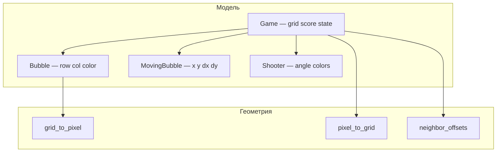
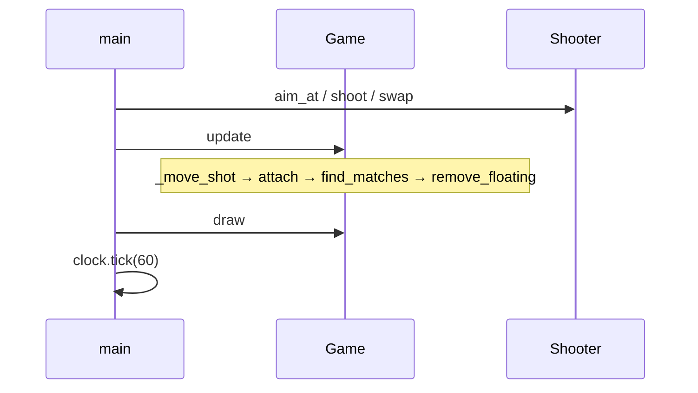

import ExternalCodeEmbed from '@site/src/components/ExternalCodeEmbed';


# Python — Bubble Shooter

<div class="article-tags">
  <span class="tag tag-beginner">НАЧАЛЬНЫЙ</span>
</div>

<span class="complexity-badge">Разработчику</span>
<span class="complexity-badge">Начальный уровень</span>

---

## О практикуме

**Bubble Shooter** — аркада в духе классических "пузырьковых" шутеров: снизу стрелок, сверху "стена" из шаров в гексагональной укладке. Выстрелом прикрепляете шар к сетке; **три и более** соседних шара одного цвета исчезают; кластеры, не связанные с верхним рядом, снимаются и дают бонус к счёту. Соберём игру на **Python 3** и **Pygame** в одном файле `bubbleshooter.py`.

Жанр близок к [Match3](./2.md) (поиск групп одного цвета, каскады), но геометрия другая: не прямоугольная сетка, а **соты** с чередованием сдвига по X. Здесь же появляются баллистика (отражение от стен) и **snap** — выбор ячейки, куда "прилипнет" летящий шар. Базовый цикл Pygame и структура игры — в [Разработка игр на Python](/encyclopedia/5-languages/5-02-python/312); для разминки подойдут [мини-игры в Lab](/lab/Примеры/1132).

| Механика | В игре |
|----------|--------|
| Сетка | 12×15 ячеек, вертикальный шаг `R×√3` |
| Выстрел | ЛКМ; ПКМ — обмен текущего и следующего шара |
| Прицел | Угол 15°…165°, пунктир с отражением от боков |
| Очки | +10 за шар в лопнувшей группе, +20 за "висяк" |
| Поражение | Любой шар опустился до красной линии `DANGER_Y` |

**Оценка времени** — 4–8 часов на все этапы; этапы 0–4 можно пройти за один вечер (~2 ч), если уже знакомы с Pygame.

| Год / контекст | Событие |
|----------------|---------|
| 1990-е | Массовые "bubble" аркады и казуальные клоны |
| Сейчас | Учебная модель для гекс-сетки, BFS и простой физики 2D |

<div class="callout callout--info">
  <div class="callout-title">Для кого</div>
  <div class="callout-body">
  Нужны классы Python, списки, базовый Pygame (<code>display</code>, события, <code>draw.circle</code>). Весь код — в одном <code>bubbleshooter.py</code>; финальная версия — на <a href="#stage-11">этапе 11</a>. Соседний трек с прямоугольной сеткой — <a href="./2.md">Match3</a>; аркада на сетке тайлов — <a href="https://github.com/Spirzen/BattleCity">Battle City</a>.
  </div>
</div>

<div class="callout callout--tip">
  <div class="callout-title">Как читать</div>
  <div class="callout-body">
  Идите этапы 0–11 по порядку. На каждом шаге — блок <strong>Теория</strong>, полный листинг, <strong>Самопроверка</strong> и <strong>Разбор</strong> с разбором строк. Застряли — сверьтесь с <a href="#stage-11">этапом 11</a> или с <a href="#glossary">глоссарием терминов</a>.
  </div>
</div>

## Как проходить практикум

1. Создайте папку `bubbleshooter/`, venv и установите Pygame — [зависимости](#dependencies).
2. Копируйте **целиком** `bubbleshooter.py` из статьи после каждого этапа (без фрагментов с `# ...`).
3. Запускайте `python bubbleshooter.py` и отмечайте пункты самопроверки.
4. Читайте **Разбор** — там связь строк с геометрией и игровой логикой.
5. Финал — [этап 11](#stage-11) и [итоговый чек-лист](#final-checklist).

**Управление в финальной версии**

| Действие | Поведение |
|----------|-----------|
| Движение мыши | Поворот прицела |
| ЛКМ | Выстрел |
| ПКМ | Поменять текущий и следующий шар |
| R | Рестарт после Game Over |
| Esc | Выход |

### Карта этапов

| Этап | Тема | Новое поведение |
|------|------|-----------------|
| [0](#stage-0) | Окно и цикл | Тёмный фон, линия опасности |
| [1](#stage-1) | Геометрия сот | `grid_to_pixel`, подсветка ячейки |
| [2](#stage-2) | Пузыри на поле | Цветные шары, 5 стартовых рядов |
| [3](#stage-3) | Стрелок | Прицеливание мышью |
| [4](#stage-4) | Прицел и очередь | Next, swap, пунктир траектории |
| [5](#stage-5) | Выстрел | Полёт и отскок от стен |
| [6](#stage-6) | Прилипание | Snap к ближайшей ячейке |
| [7](#stage-7) | Совпадения | Группы 3+ лопаются |
| [8](#stage-8) | Висящие группы | Отрезанные кластеры исчезают |
| [9](#stage-9) | Линия поражения | Блокировка ввода |
| [10](#stage-10) | Game Over UI | Затемнение и подсказка |
| [11](#stage-11) | Финал | Полная игра |

**Маршрут чтения**

1. [Архитектура](#architecture) и [глоссарий](#glossary) — до первой строки кода.
2. [Зависимости](#dependencies).
3. Этапы 0–11.
4. [Итоговая самопроверка](#final-checklist), [отладка](#debugging), [задания](#tasks).

---
<span id="architecture"></span>

## Архитектура

### Гексагональная сетка

В "плоской" укладке шаров один ряд смещён относительно соседнего на полдиаметра. Вертикальное расстояние между **центрами** соседних рядов — **`R×√3`** (высота равностороннего треугольника со стороной `2R`).

```text
Экран 800×600 px
┌─ GRID_TOP = 40 ─────────────────────────────┐
│  ○ ○ ○ ○   ← чётный row (col без сдвига)      │
│   ○ ○ ○ ○  ← нечётный row (+BUBBLE_RADIUS X)  │
│  ... GRID_ROWS × GRID_COLS                    │
├─ DANGER_Y = HEIGHT - 120 ────────────────────┤  красная линия
│              ▲ Shooter (WIDTH//2, HEIGHT-60) │
└──────────────────────────────────────────────┘
```

| Константа | Значение | Смысл |
|-----------|----------|-------|
| `BUBBLE_RADIUS` (`R`) | 18 | Радиус шара в пикселях |
| `BUBBLE_DIAMETER` (`D`) | `2R` | Расстояние между центрами в одном ряду |
| `BUBBLE_HEIGHT` | `int(R×√3)` | Шаг между рядами по Y |
| `GRID_LEFT` | формула | Горизонтальное центрирование поля |
| `GRID_TOP` | 40 | Верх поля (под будущий HUD) |
| `DANGER_Y` | `HEIGHT - 120` | Порог поражения |
| `SHOT_SPEED` | 14 | Модуль скорости выстрела |
| `MATCH_MIN` | 3 | Минимальный размер группы для удаления |

**Почему две формулы для `pixel_to_grid`**

- В **чётном** ряду центр первого шара: `GRID_LEFT + R`.
- В **нечётном** ряду сетка сдвинута на `R` вправо — в формуле для `col` участвует `2R` вместо `R`.

Ошибка на этом шаге — главная причина "зазоров" и промахов snap. Подробный разбор — на [этапе 1](#stage-1).

### Классы и ответственность



| Класс / функция | Роль |
|-----------------|------|
| `grid_to_pixel` / `pixel_to_grid` | Логические `(row, col)` ↔ экранные `(x, y)` |
| `neighbor_offsets` | Шесть соседей в сотах (зависят от чётности ряда) |
| `Bubble` | Шар на сетке; координаты через свойства |
| `MovingBubble` | Летящий шар в **пикселях** до snap |
| `Shooter` | Угол, текущий/следующий цвет, выстрел |
| `Game` | Сетка, физика выстрела, match, счёт, game over |

### Цикл кадра

Каждый кадр (60 FPS) — классическая схема из [игрового цикла Pygame](/encyclopedia/5-languages/5-02-python/312):



- **Ввод** обрабатывается только если не `game_over` и нет активного `moving` (на финальном этапе).
- **`update`** двигает летящий шар; при касании вызывает **`attach`**, который может запустить цепочку match + floating.
- **`draw`** не смешивает логику — только отрисовка (разделение полезно при отладке).

<span id="glossary"></span>

### Глоссарий терминов

| Термин | В этом практикуме |
|--------|-------------------|
| **Snap** | Прикрепление летящего шара к ближайшей **пустой** ячейке сетки после касания |
| **Hit cell** | Ячейка с шаром, с которой соприкоснулся выстрел (`_find_hit_cell`) |
| **Match** | Связная группа ≥ `MATCH_MIN` шаров одного цвета |
| **Floating / висяк** | Кластер шаров, не связанный с верхним рядом; снимается отдельно |
| **BFS** | Обход в ширину через `collections.deque` — для match и floating |
| **Субшаг** | Дробление движения за кадр, чтобы не "проскочить" стену |

---

<span id="dependencies"></span>

## Зависимости

**Python 3.10+**, **Pygame 2.x**. Отдельных ассетов (PNG, звук) нет — всё рисуется примитивами, как во многих учебных треках [практикума](./intro.md).

```bash
mkdir bubbleshooter && cd bubbleshooter
python -m venv .venv
pip install pygame
```

Активация venv:

- Windows (PowerShell): `.\.venv\Scripts\Activate.ps1`
- Linux / macOS: `source .venv/bin/activate`

```text
bubbleshooter/
  bubbleshooter.py    # один файл на всех этапах
```

Проверка установки:

```bash
python -c "import pygame; print(pygame.version.ver)"
```

Если модуль не находится — убедитесь, что venv активен и команда `python` указывает на интерпретатор из `.venv`.

---
<span id="stage-0"></span>

## Этап 0 — минимальный запуск

**Цель** — Окно **800×600** px, тёмный фон, вертикальные направляющие и красная линия опасности.

### Теория на этом шаге

Перед механикой фиксируем **холст** и **константы поля**. Размер окна `800×600` и `DANGER_Y` не меняются до конца практикума — так проще проверять геометрию на следующих этапах.

- **`pygame.init()`** — инициализация подсистем; **`set_mode`** создаёт окно.
- **`clock.tick(FPS)`** ограничивает цикл ~60 кадрами в секунду (см. [игровой цикл](/encyclopedia/5-languages/5-02-python/312)).
- Вертикальные серые линии — временные **направляющие**; красная линия — будущий порог поражения.

Файл `bubbleshooter.py`:


<ExternalCodeEmbed example="python/sp-9-9-04-razrabotka-igr-praktikum-razrabotki-igr-10-001" title="Теория на этом шаге" minHeight={720} />


**Самопроверка**

- [ ] Окно открывается.
- [ ] Видны направляющие и красная линия `DANGER_Y`.
- [ ] Esc и крестик закрывают игру.

### Разбор

**Константы сетки** задают геометрию на все последующие этапы:

```python
BUBBLE_HEIGHT = int(BUBBLE_RADIUS * math.sqrt(3))
GRID_LEFT = (WIDTH - (GRID_COLS * BUBBLE_DIAMETER + BUBBLE_RADIUS)) // 2
```

- `BUBBLE_HEIGHT` — вертикальный шаг **центров** соседних рядов в укладке "соты".
- `GRID_LEFT` центрирует поле: ширина занятой сетки ≈ `COLS × D + R` (учёт сдвига нечётного ряда).
- `DANGER_Y` оставляет место под стрелка (`HEIGHT - 60`) и запас до линии.

**Цикл событий** — минимальный набор для Pygame — `QUIT`, `KEYDOWN` (`Esc`), затем `fill` → линии → `flip` → `tick`. Подробнее о событиях — в [разработке игр на Python](/encyclopedia/5-languages/5-02-python/312).

**Связанные темы:** [игровой цикл](/encyclopedia/5-languages/5-02-python/312) · [компьютерные игры — о разделе](/encyclopedia/1-basics/1-18-kompyuternye-igry/intro)

---

<span id="stage-1"></span>

## Этап 1 — геометрия сот

**Цель** — Функции `grid_to_pixel`, `pixel_to_grid`, `neighbor_offsets`, `dist`; подсветка клетки под курсором.

### Теория на этом шаге

Логическая сетка `(row, col)` и экран `(x, y)` — **разные системы координат**. В Pygame `(0,0)` — левый верх, ось Y растёт **вниз** (как в [Match3](./2.md), но формулы другие).

- **`grid_to_pixel`** — для отрисовки и расчёта расстояний.
- **`pixel_to_grid`** — для подсказки под курсором и snap (этап 6).
- **`neighbor_offsets(row)`** — ровно **6** соседей; набор смещений зависит от чётности `row`.
- **`dist`** — `math.hypot` для сравнения "кто ближе" при snap.

Файл `bubbleshooter.py`:


<ExternalCodeEmbed example="python/sp-9-9-04-razrabotka-igr-praktikum-razrabotki-igr-10-002" title="Теория на этом шаге" minHeight={720} />


**Самопроверка**

- [ ] При движении мыши подсвечивается ячейка.
- [ ] Подпись `row` / `col` в углу.
- [ ] Чётные ряды смещены относительно нечётных.

### Разбор

#### `grid_to_pixel`

```python
x = GRID_LEFT + BUBBLE_RADIUS + col * BUBBLE_DIAMETER
if row % 2 == 1:
    x += BUBBLE_RADIUS
y = GRID_TOP + BUBBLE_RADIUS + row * BUBBLE_HEIGHT
```

- `+ BUBBLE_RADIUS` — координата **центра**, а не левого края ячейки.
- Нечётный `row` сдвигает ряд на полшага (`R`) вправо.

#### `pixel_to_grid`

Обратное преобразование через **`round`** и **разные** формулы для `col` при чётном/нечётном `row` — зеркало forward-формулы. Без `max`/`min` индексы уходили бы за границы при клике у края окна.

#### `neighbor_offsets`

Шесть направлений в "offset coordinates". Сосед "между рядами" зависит от чётности — иначе match и floating на [этапах 7–8](#stage-7) дали бы неверные группы.

**Отладка:** на этом этапе подпись `row=` / `col=` под курсором — главный инструмент; если подсветка "прыгает", проверьте `BUBBLE_HEIGHT` и сдвиг нечётных рядов.

**Связанные темы:** [Match3 — координаты](./2.md#architecture) · [этап 6 — snap](#stage-6)

---

<span id="stage-2"></span>

## Этап 2 — пузыри на поле

**Цель** — Класс `Bubble`, палитра `COLORS`, заполнение `INITIAL_ROWS` рядов.

### Теория на этом шаге

Вводим **модель данных**: двумерный список `grid[row][col]` хранит `Bubble` или `None`. Координаты центра шара **не дублируем** в полях — только `row`, `col`, `color`; `x`/`y` считаются через `grid_to_pixel` ([DRY](https://ru.wikipedia.org/wiki/Don%27t_repeat_yourself)).

- **`INITIAL_ROWS = 5`** — стартовая "стена"; позже можно заменить на загрузку уровней ([задания](#tasks)).
- Отрисовка: заливка + **блик** (светлее на 60) + обводка — простой объём без спрайтов.

Файл `bubbleshooter.py`:


<ExternalCodeEmbed example="python/sp-9-9-04-razrabotka-igr-praktikum-razrabotki-igr-10-003" title="Теория на этом шаге" minHeight={720} />


**Самопроверка**

- [ ] 5 рядов разноцветных шаров.
- [ ] Блик и обводка у каждого.
- [ ] Сетка совпадает с этапом 1.

### Разбор

#### Класс `Bubble`

```python
@property
def x(self) -> float:
    return grid_to_pixel(self.row, self.col)[0]
```

Свойства **`x`** / **`y`** пересчитываются при каждом обращении — если `row`/`col` не менялись, можно было бы кэшировать, но для учебного масштаба это не нужно.

#### Заполнение поля

```python
for row in range(INITIAL_ROWS):
    for col in range(GRID_COLS):
        self.grid[row][col] = Bubble(row, col, random.choice(COLORS))
```

Список **`COLORS`** — шесть оттенков; `random.choice` даёт разнообразие без отдельного генератора уровней.

#### Отрисовка

Три круга — тело, блик `(px-5, py-5)`, обводка `(40,40,50)`. Такой приём часто встречается в [Pygame Lab](/lab/Примеры/1132) без текстур.

**Связанные темы:** [этап 1 — геометрия](#stage-1) · [Python — классы](/encyclopedia/5-languages/5-02-python/intro)

---

<span id="stage-3"></span>

## Этап 3 — стрелок

**Цель** — Класс `Shooter` — позиция внизу, `aim_at`, отрисовка текущего шара.

### Теория на этом шаге

**Стрелок** (`Shooter`) отделён от сетки: он живёт в **экранных** координатах внизу окна. Угол прицеливания ограничен, чтобы шар не улетал в пол или слишком полого в стены.

- **`aim_at`** переводит позицию мыши в угол через `atan2`.
- **`AIM_MIN_DEG` / `AIM_MAX_DEG`** — допустимый сектор (15°…165° от горизонтали).
- Пока нет выстрела — только поворот "текущего" шара.

Файл `bubbleshooter.py`:


<ExternalCodeEmbed example="python/sp-9-9-04-razrabotka-igr-praktikum-razrabotki-igr-10-004" title="Теория на этом шаге" minHeight={720} />


**Самопроверка**

- [ ] Шар внизу следует за углом прицеливания.
- [ ] Угол ограничен `AIM_MIN_DEG`…`AIM_MAX_DEG`.
- [ ] Поле сверху без изменений.

### Разбор

#### Прицеливание

```python
dx = mouse_x - self.x
dy = self.y - mouse_y          # Y экрана растёт вниз
angle = math.atan2(dy, dx)
self.angle = max(lo, min(hi, angle))
```

- **`dy = self.y - mouse_y`** — инверсия, потому что "вверх" на экране — **меньший** Y.
- **`clamp`** угла не даёт стрелять в пол или слишком круто вбок.

Стрелок рисуется **поверх** сетки в `Game.draw`; порядок вызовов важен и сохранится до финала.

**Связанные темы:** [этап 4 — aim guide](#stage-4) · [этап 5 — shoot](#stage-5)

---

<span id="stage-4"></span>

## Этап 4 — прицел и очередь

**Цель** — Следующий шар, подпись Next, ПКМ — `swap`, пунктирная линия прицела с отражением от стен.

### Теория на этом шаге

Типичная механика жанра: видеть **следующий** шар и менять его местами с текущим (**swap**). Пунктир прицела — **превью** траектории (та же логика отражения, что позже в `_move_shot`).

- **`next_color`** и **`advance()`** — очередь из двух шаров; после выстрела текущий ← next, next ← random.
- **`_draw_aim_guide`** — дискретные точки с убывающей прозрачностью (`SRCALPHA`).

Файл `bubbleshooter.py`:


<ExternalCodeEmbed example="python/sp-9-9-04-razrabotka-igr-praktikum-razrabotki-igr-10-005" title="Теория на этом шаге" minHeight={720} />


**Самопроверка**

- [ ] Справа виден меньший "Next" шар.
- [ ] ПКМ меняет текущий и следующий.
- [ ] Белые точки показывают траекторию с отскоком.

### Разбор

#### Очередь из двух шаров

```python
def advance(self) -> None:
    self.current_color = self.next_color
    self.next_color = random.choice(COLORS)
```

После каждого успешного attach (с [этапа 6](#stage-6)) текущий цвет сдвигается — игрок планирует пару "сейчас / потом".

#### `_draw_aim_guide`

Цикл по **`step`** — сдвиг по `(dx, dy)`, отражение **`dx`** у `x <= R` и `x >= WIDTH-R`, альфа **`180 - step*6`**. Это **упрощённая** симуляция — реальный выстрел использует `_move_shot` с субшагами.

**Swap (ПКМ)** меняет только цвета, не угол — удобно готовить комбо под [match на этапе 7](#stage-7).

**Связанные темы:** [этап 5 — физика выстрела](#stage-5)

---

<span id="stage-5"></span>

## Этап 5 — выстрел

**Цель** — `MovingBubble`, `_move_shot` — полёт, отскок от стен, остановка у потолка или при касании.

### Теория на этом шаге

**`MovingBubble`** — шар в полёте — хранит `x, y, dx, dy` в пикселях. На этом этапе после остановки шар **не** крепится к сетке — проверяем только баллистику.

- Отражение — инверсия **`dx`**, **`x`** зажимается в `[R, WIDTH-R]`.
- **Субшаги** в `_move_shot` — делим перемещение за кадр на части, иначе при 60 FPS шар может "перепрыгнуть" через стену ([tunneling](https://en.wikipedia.org/wiki/Collision_detection#Discrete_vs._continuous)).

Файл `bubbleshooter.py`:


<ExternalCodeEmbed example="python/sp-9-9-04-razrabotka-igr-praktikum-razrabotki-igr-10-006" title="Теория на этом шаге" minHeight={720} />


**Самопроверка**

- [ ] ЛКМ запускает шар.
- [ ] Шар отражается от боков.
- [ ] После остановки появляется новый шар (без прилипания к сетке).

### Разбор

#### Создание выстрела

```python
dx = math.cos(self.angle) * SHOT_SPEED
dy = -math.sin(self.angle) * SHOT_SPEED
return MovingBubble(self.x, self.y, dx, dy, self.current_color)
```

Знак **`−sin`** согласован с инверсией оси Y при прицеливании.

#### Субшаги в `_move_shot`

```python
steps = max(1, int(math.hypot(bubble.dx, bubble.dy) / 4))
```

На каждом субшаге проверяются стены и **`_find_hit_cell`**. Без деления траектории шар за один `tick(60)` может оказаться **по другую сторону** стены — классическая ошибка дискретной физики.

На этом этапе **`attach`** упрощён (только `advance` + `moving = None`) — snap подключится на [этапе 6](#stage-6).

**Связанные темы:** [Battle City — пули и коллизии](https://github.com/Spirzen/BattleCity) · [этап 6](#stage-6)

---

<span id="stage-6"></span>

## Этап 6 — прилипание

**Цель** — `_find_hit_cell`, `_find_snap_cell`, `attach` — шар встаёт в ближайшую свободную ячейку соседней с касанием.

### Теория на этом шаге

Самый тонкий этап практикума: **snap**. Летящий шар касается занятой ячейки, но встаёт в **соседнюю пустую**.

1. **`_find_hit_cell`** — ближайший занятый шар в радиусе `touch = D - 2`.
2. **`_find_snap_cell`** — множество кандидатов (соседи hit, верхний ряд, окрестность `pixel_to_grid`), выбор **минимума по dist** до центра ячейки.

Без корректной геометрии [этапа 1](#stage-1) snap будет "мимо" — см. [таблицу отладки](#final-checklist).

Файл `bubbleshooter.py`:


<ExternalCodeEmbed example="python/sp-9-9-04-razrabotka-igr-praktikum-razrabotki-igr-10-007" title="Теория на этом шаге" minHeight={720} />


**Самопроверка**

- [ ] Шар ложится в соты без зазоров.
- [ ] Цвет сохраняется.
- [ ] Совпадения пока не исчезают.

### Разбор

#### Касание

```python
touch = BUBBLE_DIAMETER - 2
if d < touch and d < best_d:
    best = (row, col)
```

Порог чуть меньше диаметра — шар "чувствует" контакт до полного перекрытия кругов.

#### Кандидаты snap

1. Пустые **`empty_neighbors`** от hit-ячейки.
2. Если hit нет (выстрел в потолок) — пустые ячейки **row 0**.
3. Окрестность **`pixel_to_grid(bubble.x, bubble.y)`** — страховка от пограничных случаев.
4. Fallback — любая пустая ячейка (на переполненном поле).

Выбор: **`min(..., key=dist до grid_to_pixel)`** — ближайший **центр** ячейки к позиции шара.

**Связанные темы:** [этап 1 — pixel_to_grid](#stage-1) · [этап 7 — match после attach](#stage-7)

---

<span id="stage-7"></span>

## Этап 7 — совпадения

**Цель** — `find_matches` — flood-fill по цвету; группы ≥ `MATCH_MIN` удаляются, растёт счёт.

### Теория на этом шаге

**Match** — связная компонента одного цвета размером ≥ `MATCH_MIN`. Обход **BFS** (очередь `deque`): тот же `neighbor_offsets`, что для snap.

- Удаляем только если группа достаточно большая — иначе возвращаем пустой список.
- Счёт: **`len(matches) * 10`** — по одному шару в группе.

Сравните с поиском линий в [Match3](./2.md) — там линии по строке/столбцу, здесь произвольная форма на гекс-сетке.

Файл `bubbleshooter.py`:


<ExternalCodeEmbed example="python/sp-9-9-04-razrabotka-igr-praktikum-razrabotki-igr-10-008" title="Теория на этом шаге" minHeight={720} />


**Самопроверка**

- [ ] 3+ одного цвета лопаются.
- [ ] Счёт +10 за каждый шар в группе.
- [ ] Висящие группы пока остаются.

### Разбор

#### BFS для match

```python
queue = deque([(row, col)])
while queue:
    r, c = queue.popleft()
    ...
    if cell.color != target:
        continue
    for dr, dc in neighbor_offsets(r):
        ...
```

- Старт — ячейка, куда только что **snap**-нули шар.
- В очередь попадают только **занятые** соседи того же цвета.
- Возврат **`[]`**, если `len(matched) < MATCH_MIN` — пара из двух шаров **не** снимается.

#### Очки

```python
self.score += len(matches) * 10
```

Пока **без** floating-бонуса — он на [этапе 8](#stage-8).

**Связанные темы:** [Match3 — find_matches](./2.md) · [deque в Python](https://docs.python.org/3/library/collections.html#collections.deque)

---

<span id="stage-8"></span>

## Этап 8 — висящие группы

**Цель** — `remove_floating` — BFS от верхнего ряда; оторванные кластеры снимаются, +20 очков за шар.

### Теория на этом шаге

После лопания группы могут остаться **висяки** — шары, не связанные с верхним рядом. Второй BFS: помечаем `attached` от всех занятых ячеек **row 0**, всё остальное снимаем.

- Бонус **`floating * 20`** мотивирует "отрезать" большие куски.
- Алгоритм тот же класс задач, что **flood fill** на карте ([Battle City](https://github.com/Spirzen/BattleCity) использует другую топологию — тайлы, не соты).

Файл `bubbleshooter.py`:


<ExternalCodeEmbed example="python/sp-9-9-04-razrabotka-igr-praktikum-razrabotki-igr-10-009" title="Теория на этом шаге" minHeight={720} />


**Самопроверка**

- [ ] Отрезанные пузыри исчезают.
- [ ] Счёт растёт сильнее за "висяки".
- [ ] Полная механика Match-3 в сотах.

### Разбор

#### Два прохода BFS

| Проход | Старт | Результат |
|--------|-------|-----------|
| Match ([этап 7](#stage-7)) | Новый шар | Удаление одного цвета ≥ 3 |
| Floating | Все `(0, col)` занятые | Снятие всего без связи с верхом |

```python
if self.occupied(row, col) and not attached[row][col]:
    self.grid[row][col] = None
    removed += 1
self.score += floating * 20
```

**+20 за висяк** сильнее **+10 за шар в match** — типичный баланс жанра: выгодно "отрезать" большие куски одним выстрелом.

**Связанные темы:** [теория графов — связность](/encyclopedia/1-basics/1-06-matematika/intro) · [этап 9](#stage-9)

---

<span id="stage-9"></span>

## Этап 9 — линия поражения

**Цель** — `_check_game_over`: если любой шар опускается до `DANGER_Y`, игра останавливается (без overlay).

### Теория на этом шаге

**Game over** — **геометрическое** условие: нижняя граница любого шара (`y + R`) опустилась до `DANGER_Y`. Пока overlay ещё нет — проверяем, что новые выстрелы блокируются.

- Флаг **`game_over`** проверяется в `main` до обработки мыши.
- После поражения поле остаётся на экране для анализа.

Файл `bubbleshooter.py`:


<ExternalCodeEmbed example="python/sp-9-9-04-razrabotka-igr-praktikum-razrabotki-igr-10-010" title="Теория на этом шаге" minHeight={720} />


**Самопроверка**

- [ ] Дожмите поле вниз — новые выстрелы блокируются.
- [ ] Swap и прицел не работают после game over.
- [ ] Overlay появится на следующем этапе.

### Разбор

```python
if cell is not None and cell.y + BUBBLE_RADIUS >= DANGER_Y:
    self.game_over = True
```

Проверяется **нижняя точка** шара (центр + радиус), а не только центр — иначе визуально шар уже пересёк линию, а игра продолжалась бы.

В **`main`** после `game_over` события мыши игнорируются — на [этапе 10](#stage-10) добавится overlay, на [11](#stage-11) — **`R`** → **`reset()`** → **`__init__()`** с новой случайной стеной.

**Связанные темы:** [этап 0 — DANGER_Y](#stage-0) · [этап 10 — UI](#stage-10)

---

<span id="stage-10"></span>

## Этап 10 — экран Game Over

**Цель** — Затемнение, надписи, блокировка ввода при поражении.

### Теория на этом шаге

UI-слой поверх логики: полупрозрачный **`Surface`** с **`pygame.SRCALPHA`**, текст по центру. Ввод по-прежнему заблокирован флагом в `main`.

- **`big_font`** / **`font`** — два размера для заголовка и подсказки.
- Рестарт по **R** добавится на [этапе 11](#stage-11).

Файл `bubbleshooter.py`:


<ExternalCodeEmbed example="python/sp-9-9-04-razrabotka-igr-praktikum-razrabotki-igr-10-011" title="Теория на этом шаге" minHeight={720} />


**Самопроверка**

- [ ] При поражении — overlay "Game Over".
- [ ] Подсказка на экране.
- [ ] Рестарт по R — на этапе 11.

### Разбор

```python
overlay = pygame.Surface((WIDTH, HEIGHT), pygame.SRCALPHA)
overlay.fill((0, 0, 0, 150))
surface.blit(overlay, (0, 0))
```

- **`SRCALPHA`** — per-pixel альфа; `(0,0,0,150)` — затемнение ~59%.
- Текст центрируется через **`get_rect(center=...)`** — устойчиво к длине строки.

Overlay рисуется **после** поля и шаров, но **до** `flip` — порядок слоёв как в [Match3 — UI](./2.md).

Рестарт по **R** пока отключён намеренно — финальная версия на [этапе 11](#stage-11).

**Связанные темы:** [Pygame Surface](https://www.pygame.org/docs/ref/surface.html) · [этап 11](#stage-11)

---

<span id="stage-11"></span>

## Этап 11 — финальная сборка

**Цель** — полная игра: все механики в одном файле `bubbleshooter.py`.

### Теория на этом шаге

Финальная сборка — один **`Game`**, один **`main`**, полный цикл событий. Архитектура намеренно **монолитная** — как в учебных [Lab-примерах](/lab/Примеры/1132), чтобы видеть всю цепочку в одном файле.

Рекомендуется пройти [итоговый чек-лист](#final-checklist) и попробовать [задания](#tasks) для закрепления.

Файл `bubbleshooter.py`:


<ExternalCodeEmbed example="python/sp-9-9-04-razrabotka-igr-praktikum-razrabotki-igr-10-012" title="Теория на этом шаге" minHeight={720} />


**Самопроверка**

- [ ] Все пункты итогового чек-листа.
- [ ] Геометрия сот и snap работают без зазоров.
- [ ] R перезапускает после Game Over.

### Разбор финальной сборки

#### Роли модулей в одном файле

| Блок | Строки (ориентир) | Задача |
|------|-------------------|--------|
| Константы | верх файла | Размеры, цвета, баланс |
| Геометрия | функции до классов | Единый источник формул |
| `Game.attach` | центр логики | snap → match → floating → game over |
| `main` | низ файла | События + `update` + `draw` |

#### Цепочка после выстрела

```text
shoot → moving → _move_shot → attach → find_matches → remove_floating → _check_game_over
```

#### Что вынести при росте проекта

- Уровни в JSON / отдельный модуль (см. [задания](#tasks)).
- Звук через **`pygame.mixer`** ([Battle City — идеи расширения](https://github.com/Spirzen/BattleCity)).
- Отдельный **`settings.py`**, как в [Ping Pong](./3.md).

**Связанные темы:** [практикум — о разделе](./intro.md) · [Match3](./2.md) · [Battle City](https://github.com/Spirzen/BattleCity) · [Lab — Pygame](/lab/Примеры/1132)

---


<span id="final-checklist"></span>

## Итоговая самопроверка

Пройдите таблицу после [этапа 11](#stage-11). Если пункт не выполняется — вернитесь к указанному этапу.

| # | Проверка | Ожидание | Этап |
|---|----------|----------|------|
| 1 | Окно | 800×600 | [0](#stage-0) |
| 2 | Сетка | 5 стартовых рядов, 6 цветов | [2](#stage-2) |
| 3 | Прицел | Угол ограничен, пунктир с отскоком | [4](#stage-4) |
| 4 | Выстрел | Отражение от боков | [5](#stage-5) |
| 5 | Snap | Шар вплотную к соседям, без зазоров | [6](#stage-6) |
| 6 | Match | 3+ одного цвета лопаются | [7](#stage-7) |
| 7 | Floating | Отрезанные группы исчезают, +20 | [8](#stage-8) |
| 8 | Счёт | Растёт за match и висяки | [7](#stage-7)–[8](#stage-8) |
| 9 | Swap | ПКМ меняет текущий и next | [4](#stage-4) |
| 10 | Game Over | Красная линия, overlay, R | [9](#stage-9)–[11](#stage-11) |
| 11 | Esc | Выход без ошибок | [0](#stage-0) |

### Типичные симптомы

| Симптом | Вероятная причина | Где смотреть |
|---------|-------------------|--------------|
| Шар не попадает в соту | Неверный `BUBBLE_HEIGHT` или сдвиг рядов | [Этап 1](#stage-1) |
| Проскок сквозь стену | Нет субшагов в `_move_shot` | [Этап 5](#stage-5) |
| Snap "мимо" | `touch` или кандидаты `_find_snap_cell` | [Этап 6](#stage-6) |
| Match не срабатывает | Соседи через неверный `neighbor_offsets` | [Этап 1](#stage-1) |
| Game over не наступает | Сравниваете центр, а не `y + R` | [Этап 9](#stage-9) |

---

<span id="debugging"></span>

## Отладка и расширения

| Идея | Описание | Сложность |
|------|----------|-----------|
| Уровни | Паттерны в `_fill_initial_grid` или JSON | ★★ |
| Прицел-линия | `pygame.draw.line` вместо точек | ★ |
| Звук | `pygame.mixer` при лопании и swap | ★★ |
| Превью траектории | Показать реальный `_move_shot` | ★★★ |
| Сеть | Два игрока по очереди — отдельный цикл | ★★★★ |

Похожие механики в других треках практикума:

- [Match3](./2.md) — группы цвета, каскады, UI.
- [Battle City](https://github.com/Spirzen/BattleCity) — сетка, коллизии, game over.
- [Ping Pong](./3.md) — разнесение по модулям.

---

<span id="tasks"></span>

## Задания

| # | Задание | Подсказка |
|---|---------|-----------|
| 1 | Рекорд в JSON | `json.dump` после game over |
| 2 | Подсказка "лучший" цвет | Подсветить соседа, дающего match ≥ 3 |
| 3 | Анимация падения висяков | Список `falling` с `y += speed` до удаления |
| 4 | Седьмой цвет | Баланс `MATCH_MIN` и размер поля |
| 5 | Победа при пустом поле | Флаг `win` + overlay, как game over |

---

## См. также

- [Практикум разработки игр — о разделе](./intro.md)
- [Разработка игр на Python](/encyclopedia/5-languages/5-02-python/312)
- [Pygame — мини-игры](/lab/Примеры/1132)
- [Компьютерные игры — о разделе](/encyclopedia/1-basics/1-18-kompyuternye-igry/intro)
- [Python — Match3](./2.md)
- [Python — Battle City](https://github.com/Spirzen/BattleCity)

---
