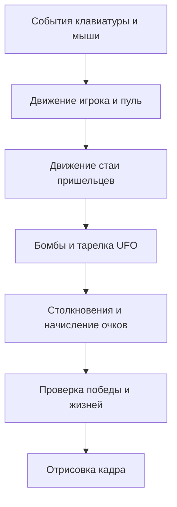

import ExternalCodeEmbed from '@site/src/components/ExternalCodeEmbed';


# Python — Space Invaders

<span class="complexity-badge">Разработчику</span>
<span class="complexity-badge">Начальный уровень</span>

---

## О практикуме

В 1978 году Taito выпустила аркаду **Space Invaders**. Игрок стоит внизу экрана, стреляет вверх, а ряды пришельцев ползут в сторону; у края вся стая разворачивается и опускается на один ряд. Этот шаблон до сих пор встречается в учебных проектах и инди-играх.

Здесь соберём такую же механику на **Python 3** и **Pygame**. Графика — цветные прямоугольники (`pygame.draw`, `Rect`), без загрузки PNG. Так проще сосредоточиться на [игровом цикле](/encyclopedia/5-languages/5-02-python/312), столкновениях и состоянии матча. Картинки и звуки подключите позже по инструкции из раздела [Где брать графику и звук](/encyclopedia/5-languages/5-02-python/312#game-assets).

### Что понадобится заранее

- Базовый Python — списки, `if`, функции, простой класс. Маршрут — [Python — о разделе](/encyclopedia/5-languages/5-02-python/intro).
- Окно Pygame, события, `Rect`, `clock.tick`. Теория — [Разработка игр на Python](/encyclopedia/5-languages/5-02-python/312).
- По желанию, один вечер на [упрощённых Invaders в Lab](/lab/Примеры/1132#invaders) — там та же стая врагов в одном коротком файле.

На каждом этапе вы копируете **целый** `main.py`, запускаете `python main.py` и проверяете одну новую механику.

### Слова, которые встретятся в коде

| Термин | Коротко |
|--------|---------|
| **Игровой цикл** | Бесконечный `while`, на каждом кадре — события, логика, отрисовка. Подробнее в [главе 312](/encyclopedia/5-languages/5-02-python/312). |
| **`Rect`** | Прямоугольник с координатами и размером; им задают позицию корабля, пули и пришельца. |
| **`colliderect`** | Проверка, пересекаются ли два `Rect` — основа попадания пули по врагу. |
| **Кулдаун** (`fire_cd`) | Счётчик кадров между выстрелами, чтобы нельзя было зажать Пробел и залить экран пулями. |
| **Стая** | Все пришельцы двигаются синхронно, как в оригинальной аркаде. |
| **UFO** | Летающая тарелка-бонус; в оригинале пролетает сверху и даёт случайное число очков. |

### Управление в финальной версии

| Клавиша | Действие |
|---------|----------|
| `←` / `A` | Корабль влево |
| `→` / `D` | Корабль вправо |
| `Пробел` | Выстрел (с паузой между выстрелами) |
| `R` | Новый матч после победы или поражения |
| `Esc` | Выход |

Ориентир по времени — **3–5 часов** на этапы 0–8, ещё около часа на [модульную ревизию](#full-revision).

### Карта этапов

| Этап | Тема | Что появится в игре |
|------|------|---------------------|
| [0](#stage-0) | Запуск Pygame | Тёмное окно 640×720 |
| [1](#stage-1) | Игрок | Корабль внизу, движение по стрелкам |
| [2](#stage-2) | Пули | Выстрел по Пробелу |
| [3](#stage-3) | Сетка врагов | 5 рядов по 11 пришельцев |
| [4](#stage-4) | Движение стаи | Разворот у края и шаг вниз |
| [5](#stage-5) | Попадания | Счёт и ускорение стаи |
| [6](#stage-6) | Бомбы | Жизни игрока |
| [7](#stage-7) | Бонусная тарелка | Пролёт UFO и случайные очки |
| [8](#stage-8) | Конец раунда | Экран победы или поражения, клавиша `R` |
| [Ревизия](#full-revision) | Модули | `settings.py` и пакет `game/` |

---

<span id="dependencies"></span>

## Зависимости и папка проекта

Создайте отдельную папку и виртуальное окружение — так проще не смешать Pygame с другими проектами.

```bash
mkdir invaders && cd invaders
python -m venv .venv
# Windows: .venv\Scripts\activate
pip install pygame
```

Файл `requirements.txt` для сдачи работы или GitHub:

```text
pygame>=2.5.0
```

Структура на этапах 0–8:

- один файл `main.py` в корне `invaders/`;
- терминал открыт в этой папке;
- команда запуска — `python main.py`.

После [этапа 8](#stage-8) можно разнести код по файлам — см. [полную ревизию](#full-revision).

---

<span id="architecture"></span>

## Как устроена игра

Каждый кадр (обычно 60 раз в секунду) программа повторяет одну и ту же цепочку:



Роли основных объектов:

- **Игрок** — один `pygame.Rect` внизу экрана; сдвигается только по горизонтали.
- **Пули** — список маленьких `Rect`, каждый кадр поднимаются вверх.
- **Пришельцы** — список структур с полем `rect`, цветом ряда и очками за уничтожение.
- **Бомбы** — падающие `Rect`; сбрасывает случайный пришелец из нижнего живого ряда.
- **UFO** — отдельный объект; летит справа налево, за попадание даёт бонус.

Тот же приём "список объектов + цикл обновления" используется в [Tetris](./5.md) и [Ping Pong](./3.md) — меняется только правило движения.

---

<span id="stage-0"></span>

## Этап 0 — минимальный запуск

**Цель** — убедиться, что Pygame установлен, окно открывается и закрывается без ошибок.

Создайте `main.py`. Внутри — `pygame.init()`, окно, цикл `while running`, заливка фона, `display.flip()` и `clock.tick(60)`. Выход — по крестику окна или по `Esc`.


<ExternalCodeEmbed example="python/sp-9-9-04-razrabotka-igr-praktikum-razrabotki-igr-11-001" title="Этап 0 — минимальный запускаемый код" minHeight={420} />


**Самопроверка**

- [ ] Окно 640×720, тёмный фон.
- [ ] После `Esc` процесс завершается, консоль не зависает.

**Разбор.** `clock.tick(60)` ограничивает частоту кадров и не даёт циклу загрузить процессор на 100%. Без `tick` игра может работать слишком быстро или "съедать" весь CPU.

---

<span id="stage-1"></span>

## Этап 1 — корабль игрока

**Цель** — нарисовать корабль и двигать его по нижней линии экрана.

Добавляется `player = pygame.Rect(...)` и чтение клавиш через `pygame.key.get_pressed()` **каждый кадр** (пока клавиша зажата, корабль едет). Ограничение `player.x = max(8, min(...))` не выпускает прямоугольник за левый и правый край.


<ExternalCodeEmbed example="python/sp-9-9-04-razrabotka-igr-praktikum-razrabotki-igr-11-002" title="Этап 1 — корабль игрока" minHeight={720} />


**Самопроверка**

- [ ] Корабль реагирует на `←`/`→` и `A`/`D`.
- [ ] У правого и левого края корабль останавливается.

**Разбор.** `get_pressed()` возвращает состояние всех клавиш **сейчас**, в отличие от `event.key` в `KEYDOWN`, который срабатывает один раз на нажатие. Для непрерывного движения удобнее именно `get_pressed()`. Тот же приём — в [Lab, Invaders lite](/lab/Примеры/1132#invaders).

---

<span id="stage-2"></span>

## Этап 2 — стрельба

**Цель** — по Пробелу создавать пулю над кораблём и двигать её вверх.

Пуля — ещё один `Rect` в списке `bullets`. Событие `pygame.KEYDOWN` с `K_SPACE` добавляет новую пулю. Переменная `fire_cd` (кулдаун) считает кадры до следующего разрешённого выстрела.


<ExternalCodeEmbed example="python/sp-9-9-04-razrabotka-igr-praktikum-razrabotki-igr-11-003" title="Этап 2 — стрельба" minHeight={720} />


**Самопроверка**

- [ ] Пули летят вверх и исчезают за верхним краем.
- [ ] При зажатом Пробеле выстрелы идут с паузой, а не сотней пуль за секунду.

**Разбор.** Список `bullets` перебирают с копией `for b in bullets[:]` — так безопасно удалять элементы во время цикла. Про списки и мутацию — в [Python, коллекции](/encyclopedia/5-languages/5-02-python/intro).

---

<span id="stage-3"></span>

## Этап 3 — сетка пришельцев

**Цель** — расставить врагов рядами и задать разные очки по высоте.

Функция `create_aliens()` строит сетку 5×11. Верхний ряд приносит больше очков (массив `ROW_POINTS`). На этом этапе пришельцы **стоят на месте** — проверьте, что сетка ровная и центрирована.


<ExternalCodeEmbed example="python/sp-9-9-04-razrabotka-igr-praktikum-razrabotki-igr-11-004" title="Этап 3 — сетка пришельцев" minHeight={720} />


**Самопроверка**

- [ ] Пять рядов, в каждом одиннадцать врагов.
- [ ] Цвета рядов различаются (в коде заданы в `ROW_COLORS`).

**Разбор.** Координата `y` ряда считается как `ALIEN_TOP + row * (высота + отступ)`. Так же строят сетку в [Tetris](./5.md) и [Match-3](./2.md) — меняются только размер ячейки и правила заполнения.

---

<span id="stage-4"></span>

## Этап 4 — движение стаи

**Цель** — заставить всех пришельцев двигаться влево-вправо синхронно и опускаться у края экрана.

Переменная `alien_dir` хранит направление (1 или −1). Если любой живой пришелец касается края, направление меняется на противоположное (`alien_dir *= -1`), и весь ряд сдвигается вниз на `ALIEN_DROP`. Функция `alien_speed()` увеличивает скорость, когда врагов остаётся меньше — как в оригинальной аркаде.


<ExternalCodeEmbed example="python/sp-9-9-04-razrabotka-igr-praktikum-razrabotki-igr-11-005" title="Этап 4 — движение стаи" minHeight={720} />


**Самопроверка**

- [ ] Стая доходит до края, разворачивается и опускается.
- [ ] После уничтожения части врагов (на следующих этапах) движение становится быстрее.

**Разбор.** Жанр **fixed shooter** (стрельба с фиксированной линии игрока) разобран в [классификации компьютерных игр](/encyclopedia/1-basics/1-18-kompyuternye-igry/2) — Space Invaders там часто приводят как пример.

---

<span id="stage-5"></span>

## Этап 5 — попадания и счёт

**Цель** — уничтожать пришельцев пулями и показывать счёт на экране.

Для каждой пули вызывается `bullet.colliderect(alien.rect)`. При попадании у пришельца `alive = False`, пуля удаляется, к `score` прибавляются очки ряда. Мёртвые враги не рисуются.


<ExternalCodeEmbed example="python/sp-9-9-04-razrabotka-igr-praktikum-razrabotki-igr-11-006" title="Этап 5 — попадания, счёт и ускорение" minHeight={720} />


**Самопроверка**

- [ ] Счёт растёт при попадании.
- [ ] Верхний ряд даёт больше очков, чем нижний.

**Разбор.** `colliderect` сравнивает только прямоугольники, не "прозрачные" пиксели картинки. Для PNG со сложной формой позже можно перейти на `collide_mask` — это описано в [главе 312](/encyclopedia/5-languages/5-02-python/312).

---

<span id="stage-6"></span>

## Этап 6 — бомбы и жизни

**Цель** — добавить ответный урон от врагов и запас жизней игрока.

Раз в несколько кадров случайный пришелец из **самого нижнего живого ряда** создаёт бомбу (`Rect` под ним). Бомба падает вниз; при пересечении с `player` жизнь уменьшается. При `lives <= 0` включается флаг поражения.


<ExternalCodeEmbed example="python/sp-9-9-04-razrabotka-igr-praktikum-razrabotki-igr-11-007" title="Этап 6 — бомбы и жизни" minHeight={720} />


**Самопроверка**

- [ ] На экране видно "Жизни: 3" (и меньше после попадания).
- [ ] Бомбы падают только с нижнего ряда стаи, а не с верхнего.

**Разбор.** Счётчик `bomb_cd` задаёт паузу между сбросами бомб. Без него экран быстро заполнился бы падающими прямоугольниками. Жизни (`lives`) — целое число; при нуле матч считается проигранным.

---

<span id="stage-7"></span>

## Этап 7 — бонусная тарелка

**Цель** — периодически запускать UFO и давать случайный бонус за попадание.

Каждые `UFO_INTERVAL_MS` миллисекунд (в коде около 20 секунд) справа появляется тарелка. Очки за неё выбираются случайно (`random.choice`). Попадание пули начисляет бонус; на месте тарелки кратко показывается число очков.


<ExternalCodeEmbed example="python/sp-9-9-04-razrabotka-igr-praktikum-razrabotki-igr-11-008" title="Этап 7 — бонусная тарелка (UFO)" minHeight={720} />


**Самопроверка**

- [ ] Тарелка пролетает сверху справа налево.
- [ ] За разные пролёты можно получить разное число очков.

**Разбор.** Время берётся из `pygame.time.get_ticks()` — миллисекунды с момента `pygame.init()`. Так же считают таймеры в [Lab, выживание 30 секунд](/lab/Примеры/1132#survive).

---

<span id="stage-8"></span>

## Этап 8 — победа, поражение и рестарт

**Цель** — завершать матч по правилам и начинать заново по `R`.

Условия победы:

- живых пришельцев не осталось.

Условия поражения:

- стая опустилась до линии игрока;
- жизни закончились.

По клавише `R` сбрасываются счёт, жизни, списки пуль и бомб, заново вызывается `create_aliens()`.


<ExternalCodeEmbed example="python/sp-9-9-04-razrabotka-igr-praktikum-razrabotki-igr-11-009" title="Этап 8 — победа, поражение и рестарт" minHeight={720} />


**Самопроверка**

- [ ] После уничтожения всех врагов — сообщение о победе.
- [ ] Если пришельцы дошли до низа или жизни = 0 — поражение.
- [ ] `R` запускает новую волну с чистого листа.

**Разбор.** Флаги `won` и `game_over` останавливают обновление логики, но цикл рисования продолжается — игрок видит итоговый текст. Похожая **машина состояний** (меню → игра → конец) есть в [Lab, заготовка 5.2](/lab/Примеры/1132) и в [Ping Pong, этап 13](./3.md).

---

<span id="full-revision"></span>

## Полная ревизия файлов

Однофайловый `main.py` на этапе 8 уже длинный. Разнесение по модулям облегчает правки: константы отдельно, логика стаи отдельно, точка входа — короткая.

Целевая структура:

```
invaders/
  main.py
  settings.py
  game/
    __init__.py
    game.py
    player.py
    bullets.py
    alien_wave.py
    ufo.py
```

**`settings.py`** — ширина окна, скорости, цвета, число рядов. Все "магические числа" в одном месте.


<ExternalCodeEmbed example="python/sp-9-9-04-razrabotka-igr-praktikum-razrabotki-igr-11-010" title="settings.py" minHeight={480} />


**`main.py`** — только создание `Game()` и вызов `run()`.


<ExternalCodeEmbed example="python/sp-9-9-04-razrabotka-igr-praktikum-razrabotki-igr-11-011" title="main.py" minHeight={240} />


**`game/game.py`** — класс `Game`: события, обновление, отрисовка, сброс матча.


<ExternalCodeEmbed example="python/sp-9-9-04-razrabotka-igr-praktikum-razrabotki-igr-11-012" title="game/game.py" minHeight={720} />


Остальные файлы пакета `game/`:


<ExternalCodeEmbed example="python/sp-9-9-04-razrabotka-igr-praktikum-razrabotki-igr-11-013" title="game/player.py" minHeight={300} />


<ExternalCodeEmbed example="python/sp-9-9-04-razrabotka-igr-praktikum-razrabotki-igr-11-014" title="game/bullets.py" minHeight={480} />


<ExternalCodeEmbed example="python/sp-9-9-04-razrabotka-igr-praktikum-razrabotki-igr-11-015" title="game/alien_wave.py" minHeight={720} />


<ExternalCodeEmbed example="python/sp-9-9-04-razrabotka-igr-praktikum-razrabotki-igr-11-016" title="game/ufo.py" minHeight={360} />


Скопируйте файлы в одну папку `invaders/`, активируйте `venv`, выполните из корня проекта:

```bash
python main.py
```

Тот же приём модулей — в [Ping Pong](./3.md#full-revision) и [Racing](./4.md#full-revision).

### Идеи для продолжения

- **Спрайты PNG** — заменить `draw.rect` на `blit` после загрузки картинок. Источники — [Где брать графику и звук](/encyclopedia/5-languages/5-02-python/312#game-assets).
- **Звуки выстрела и взрыва** — `pygame.mixer.Sound`, раздел [Изображения и звук](/encyclopedia/5-languages/5-02-python/312).
- **Баррикады** — несколько статичных `Rect` между игроком и стаей, как в оригинале.
- **Несколько волн** — после победы снова `create_aliens()`, уменьшить `bomb_cd` для сложности.
- **Крестики-нолики с ИИ** — другой жанр, но те же клики мыши по сетке — [Lab §4.3](/lab/Примеры/1132#tic-tac-toe).

### См. также

- [Pygame — мини-игры](/lab/Примеры/1132) — короткие однофайловые примеры.
- [Bubble Shooter](./10.md) — другая аркада с сеткой и прицеливанием.
- [Гейм-дизайн, core loop](/encyclopedia/9-spinoff/9-04-razrabotka-igr/1174) — зачем в аркаде ускоряется стая и растёт напряжение.
- [История аркад](/encyclopedia/9-spinoff/9-03-igrovaya-industriya/116) — контекст жанра.

{/* sidebar-collections */}

---

## В подборках

Статья входит в [тематические подборки](/about/collections) и блок "С чего начать?" на [главной](/). Соседние шаги того же маршрута:

**Разработка видеоигр** — [Практикум — о разделе](/encyclopedia/9-spinoff/9-04-razrabotka-igr/praktikum-razrabotki-igr/intro), [Разработка игр на Python](/encyclopedia/5-languages/5-02-python/312), [Pygame — мини-игры](/lab/Примеры/1132), [Разработка игр — о разделе](/encyclopedia/9-spinoff/9-04-razrabotka-igr/intro).

{/* /sidebar-collections */}

---
