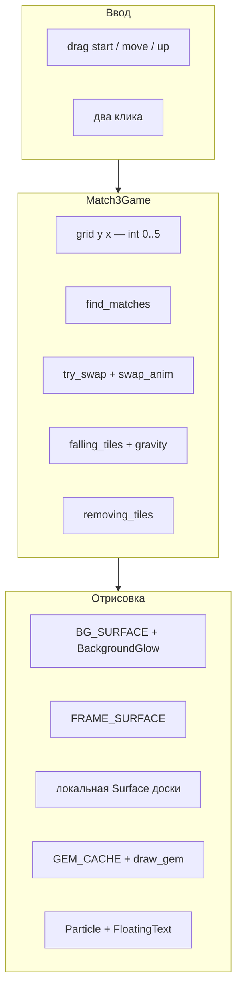
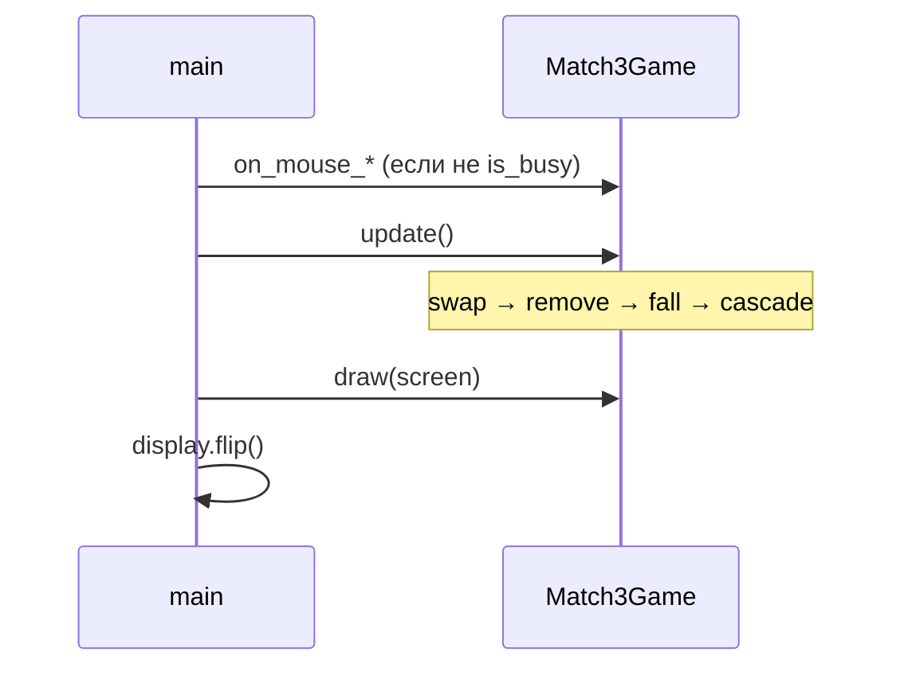
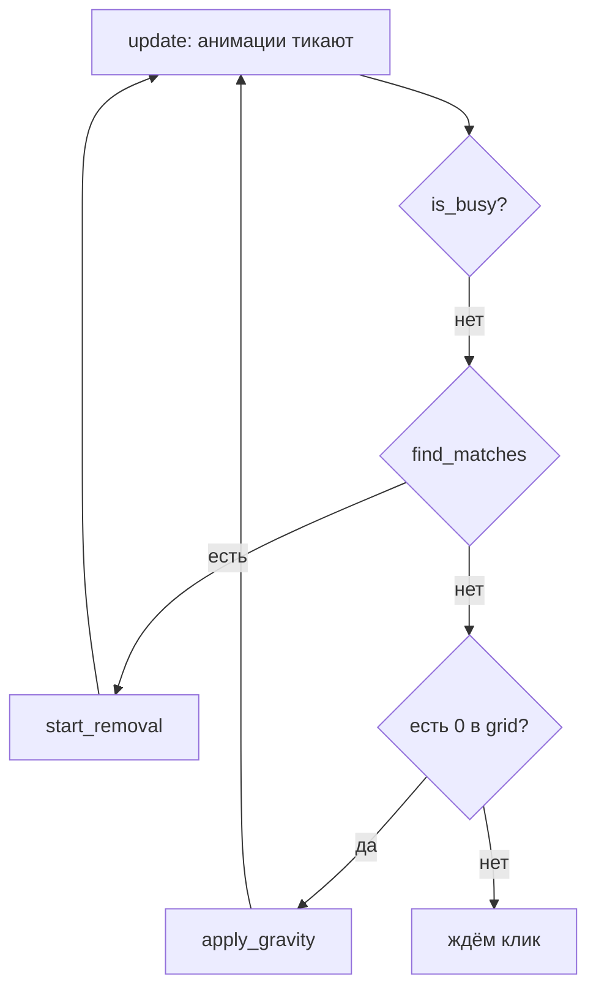

import ExternalCodeEmbed from '@site/src/components/ExternalCodeEmbed';


# Python — Match3

<div class="article-tags">
  <span class="tag tag-beginner">ДЛЯ НОВИЧКОВ</span>
</div>

<span class="complexity-badge">Разработчику</span>

---

## О практикуме

**Match-3** ("три в ряд") — жанр головоломок, где игрок меняет местами **соседние** элементы на сетке, чтобы собрать линию из трёх и более одинаковых. После совпадения элементы исчезают, остальные падают вниз, сверху появляются новые — и иногда возникает **каскад** без дополнительного хода. Так устроены Bejeweled, Candy Crush и сотни клонов; в [разделе о компьютерных играх](/encyclopedia/1-basics/1-18-kompyuternye-igry/intro) этот жанр относят к casual / puzzle.

В этом практикуме вы соберёте **полированный прототип** на **Python 3** и **Pygame** — в одном файле `match3.py`. Не учебные прямоугольники, а:

- **многоугольные камни** пяти типов (рубин, сапфир, изумруд, топаз, аметист);
- рамка поля, градиентный фон, шапка со счётом и подвал с подсказкой;
- анимированный обмен, удаление, падение и дозаполнение;
- drag-and-drop и выбор двумя кликами;
- частицы, всплывающий текст, комбо, лёгкая тряска экрана.

Особый акцент — **геометрия окна**. В Match-3 ошибка на один пиксель в `PLAY_OX` или `CELL_GAP` даёт эффект "клик мимо клетки". Здесь все размеры выводятся из формул, а координаты "экран → поле → локальная Surface доски" согласованы заранее.

<div class="callout callout--info">
  <div class="callout-title">Для кого материал</div>

  <div class="callout-body">
  Нужны базовые Python (списки, классы, <code>for</code>/<code>while</code>) и общее представление об игровом цикле Pygame из статьи <a href="/encyclopedia/5-languages/5-02-python/312">Разработка игр на Python</a>. Полезна, но не обязательна, [змейка или Pong в Lab](/lab/Примеры/1132) — там те же <code>Rect</code>, события мыши и <code>clock.tick</code>. Каждый этап даёт <strong>запускаемый</strong> код: после шага игра открывается и показывает новую механику.
  </div>
</div>

<div class="callout callout--info">
  <div class="callout-title">Чем этот трек отличается от "минимального Match-3"</div>

  <div class="callout-body">
  Упрощённый прототип (цветные квадраты, мгновенный каскад, два клика) хорош, чтобы понять <code>find_matches</code> за вечер. Здесь мы идём дальше — <strong>анимации как в мобильных головоломках</strong>, предрендер графики, класс <code>Match3Game</code> и отточенная вёрстка. Логику каскада можно сравнить с практикумом <a href="./5.md">Python — Tetris</a> (сетка, гравитация, заполнение пустот).
  </div>
</div>

## Как проходить практикум

1. Прочитайте [Практикум разработки игр — о разделе](/encyclopedia/9-spinoff/9-04-razrabotka-igr/praktikum-razrabotki-igr/intro) и подготовьте окружение — [зависимости](#dependencies).
2. Идите по [этапам 0–17](#stage-0) **строго по порядку**: после каждого шага обновляйте `match3.py` и запускайте `python match3.py`.
3. В конце каждого этапа отметьте пункты **Самопроверка**; если поведение расходится — сверьтесь с [полной ревизией на GitHub](https://github.com/Spirzen/Match3).
4. Прочитайте блок **Разбор** под этапом — там объясняется, зачем нужны ключевые строки, а не только "что вставить".

**Перед стартом проверьте**

- [ ] Python 3.10+ (`python --version`).
- [ ] Терминал открыт в папке `match3/`, активирован venv.
- [ ] Прочитан раздел [игровой цикл](/encyclopedia/5-languages/5-02-python/312) и знакомство с `pygame.Rect`.

**Что получится**

| Механика | Описание |
|----------|----------|
| Поле | Сетка 8×8, 5 типов камней |
| Ход | Drag к соседу **или** два клика по соседним клеткам |
| Правило | Обмен только если после него есть совпадение; иначе откат с анимацией |
| Каскад | Удаление → падение → дозаполнение → повтор без нового клика |
| FX | Частицы, всплывающий счёт, комбо ×N, тряска экрана |
| UI | Шапка с очками, подвал с мигающей подсказкой |

**Оценка времени** — 6–10 часов при прохождении всех этапов; этапы 0–8 можно уложить в один вечер (~2,5 ч).

**Управление в финальной версии**

| Действие | Поведение |
|----------|-----------|
| ЛКМ + drag | Потянуть камень к соседней клетке |
| Два клика | Выбрать камень, кликнуть соседа — обмен |
| Крестик | Выход |

**Маршрут чтения**

1. [Архитектура](#architecture) — слои, координаты, цикл кадра, словарь терминов.
2. [Зависимости](#dependencies) — venv, pygame, типичные сбои.
3. [Этапы 0–17](#stage-0) — по одной подсистеме за шаг, с разбором кода.
4. [Полная ревизия на GitHub](https://github.com/Spirzen/Match3) — эталонный `match3.py` для копирования.
5. [Отладка](#debugging) и [дальнейшее развитие](#extensions).

### Словарь перед кодом

| Термин | Определение |
|--------|-------------|
| **Клетка (tile)** | Одна позиция сетки 8×8; рисуется фон `_draw_cell` и поверх — камень |
| **Камень (gem)** | Элемент головоломки; тип `1…5`, у каждого своя форма и цвет |
| **Swap (обмен)** | Перестановка двух **соседних** камней (по вертикали или горизонтали) |
| **Match (совпадение)** | Три и более одинаковых камня подряд в строке или столбце |
| **Валидный ход** | Swap, после которого на поле есть хотя бы один match |
| **Каскад** | Цепочка: match → удаление → падение → дозаполнение → снова match **без** нового клика |
| **Комбо** | Счётчик волн удаления подряд; влияет на бонус к очкам |
| **is_busy** | Флаг "идёт анимация"; пока True, ввод мыши блокируется |
| **Предрендер** | Графика (фон, рамка, камни) рисуется один раз в `Surface` и потом только `blit` |

### Карта этапов

| Этап | Фокус | Новое поведение |
|------|--------|-----------------|
| [0](#stage-0) | Цикл Pygame | Окно нужного размера |
| [1](#stage-1) | Геометрия | Константы, `grid_to_pixel`, рамка |
| [2](#stage-2) | Фон | Градиент, `make_board_frame` |
| [3](#stage-3) | Клетки | `_draw_cell`, сетка на доске |
| [4](#stage-4) | Камни | `gem_polygon`, `render_gem`, кэш |
| [5](#stage-5) | Модель | `Match3Game`, поле без стартовых троек |
| [6](#stage-6) | Совпадения | `find_matches`, `has_match_at` |
| [7](#stage-7) | Клики | Выбор и обмен (мгновенный) |
| [8](#stage-8) | Валидность | `try_swap`, откат без матча |
| [9](#stage-9) | Анимация swap | `ease_out_cubic`, `start_swap_animation` |
| [10](#stage-10) | Удаление | `removing_tiles`, частицы |
| [11](#stage-11) | Падение | `falling_tiles`, гравитация |
| [12](#stage-12) | Каскад | `update` как машина состояний, `is_busy` |
| [13](#stage-13) | Drag | `on_mouse_down/move/up` |
| [14](#stage-14) | Очки | Комбо, `FloatingText`, тряска |
| [15](#stage-15) | UI | Шапка, подвал, `BackgroundGlow` |
| [16](#stage-16) | Полировка | Idle bob, кольцо выбора, hover |
| [17](#stage-17) | Финал | Сборка и чек-лист |

<div class="callout callout--tip">
  <div class="callout-title">Один файл</div>

  <div class="callout-body">
  Весь проект живёт в <code>match3.py</code> — как в эталоне. Не разносите по модулям, пока не пройдёте практикум: так проще сверять этапы.
  </div>
</div>

---

<span id="architecture"></span>

## Архитектура

Прежде чем писать код, зафиксируем **что из чего состоит** и **как данные текут по кадру**. Match-3 удобно мыслить как разделение **модели** (числа в `grid`) и **представления** (как это рисуется). Анимации — третий слой: они не меняют правила мгновенно, а **отображают** уже принятое решение логики.

### Модель и представление

| Слой | Где в коде | Отвечает на вопрос |
|------|------------|-------------------|
| **Модель** | `Match3Game.grid`, `find_matches`, `try_swap` | Что лежит в клетках? Есть ли match? Можно ли ход? |
| **Анимация** | `swap_anim`, `removing_tiles`, `falling_tiles` | Как плавно показать уже решённый шаг? |
| **Представление** | `draw`, `BG_SURFACE`, `GEM_CACHE` | Как это выглядит на экране? |

Модель **не должна** зависеть от FPS: swap в `grid` выполняется сразу, а игрок видит движение 11 кадров. Так проще отлаживать: можно временно отключить анимации и проверить только `find_matches`.

### Слои (схема)



### Координатная система

В Pygame начало координат `(0, 0)` — **левый верх** экрана, ось X растёт вправо, ось Y — **вниз**. Это совпадает с индексами `grid[row][col]`: `row = 0` — верхняя строка поля.

Игра использует **три** системы координат одновременно:

1. **Экранные** — мышь `event.pos`, шапка, подвал, `grid_to_pixel`.
2. **Позиция доски** — `(BOARD_OX, BOARD_OY)`; сюда кладётся `FRAME_SURFACE` и локальная Surface.
3. **Локальные** — `(0, 0)` в левом верху Surface размером `BOARD_W × BOARD_H`; `tile_rect_local` считает только их.

Зачем два вида координат для сетки? **Drag** считает смещение в пикселях экрана (`grid_to_pixel`), а отрисовка камней идёт на **отдельной** Surface доски, которую потом одним `blit` накладывают на экран (вместе с тряской). Локальные координаты не сбрасываются при `shake_x` / `shake_y`.

```text
Экран (WIDTH × HEIGHT)
┌─ HEADER_H ─────────────────────────────┐
│  Match-3          [ ОЧКИ pill ]        │
├─ FRAME ────────────────────────────────┤
│  ┌─ BOARD_W × BOARD_H ─────────────┐   │
│  │  GRID_INSET                      │   │
│  │  ┌─ BOARD_INNER ─────────────┐  │   │
│  │  │ 8×8 клеток TILE_SIZE      │  │   │  ← PLAY_OX, PLAY_OY (экран)
│  │  │ с зазором CELL_GAP        │  │   │
│  │  └───────────────────────────┘  │   │
│  └─────────────────────────────────┘   │
├─ FOOTER_H ─────────────────────────────┤
│  подсказка                             │
└────────────────────────────────────────┘
```

| Константа | Значение | Смысл |
|-----------|----------|-------|
| `TILE_SIZE` | 58 | Ширина/высота камня |
| `CELL_GAP` | 5 | Зазор между клетками |
| `BOARD_PAD` | 18 | Внутренний отступ доски |
| `FRAME` | 14 | Толщина внешней рамки окна |
| `GRID_INSET` | `BOARD_PAD + FRAME // 2 - 3` | Сдвиг сетки внутри рамки (подогнан) |
| `PLAY_OX`, `PLAY_OY` | экранные | Левый верх **игровой** сетки |
| `LOCAL_PLAY_X/Y` | локальные | То же на Surface доски |

**Формула ширины сетки** (без отступов рамки):

```text
BOARD_INNER = GRID_SIZE * TILE_SIZE + (GRID_SIZE - 1) * CELL_GAP
```

Пример для эталона: `8 * 58 + 7 * 5 = 464 + 35 = 499` px — столько занимает **только** клетки и зазоры.

**Hit-test мыши** (перевод пикселя в индексы):

```text
col = (mx - PLAY_OX) // (TILE_SIZE + CELL_GAP)
row = (my - PLAY_OY) // (TILE_SIZE + CELL_GAP)
```

Шаг `(TILE_SIZE + CELL_GAP)` — "шаг сетки": камень плюс зазор до следующей клетки. Целочисленное деление `//` даёт номер клетки; дробная часть отбрасывается — клик anywhere внутри клетки попадает в неё.

<div class="callout callout--warning">
  <div class="callout-title">Частая ошибка</div>

  <div class="callout-body">
  Путать <code>col, row</code> с <code>x, y</code> экрана. В эталоне <code>get_tile_pos</code> возвращает <code>(col, row)</code>, а в <code>grid</code> индексация <code>grid[row][col]</code> — сначала строка, потом столбец. Тот же порядок, что в матрицах и в <a href="./5.md">Tetris</a>.
  </div>
</div>

### Модель поля

`grid[row][col]` — двумерный список целых:

- `0` — пустая клетка (после удаления, до приземления нового камня);
- `1 … 5` — тип камня.

Почему типы начинаются с **1**, а не с 0? Ноль зарезервирован под "пусто" — одно условие `if color == 0` в `find_matches` и отрисовке.

Индексация — **`grid[y][x]`**, где `y` — строка (0 сверху), `x` — столбец (0 слева).

```text
        x=0   x=1   x=2
y=0     [1]   [3]   [2]    ← верх экрана
y=1     [5]   [1]   [4]
y=2     [2]   [2]   [2]    ← тройка изумрудов (тип 3)
```

### Списки анимаций вместо FSM

Вместо явных состояний `IDLE` / `SWAP` / `FALL` эталон использует **списки активных анимаций**:

- `swap_anim` — один обмен или `None`;
- `removing_tiles` — клетки, которые исчезают;
- `falling_tiles` — камни в движении по столбцу.

Метод `is_busy()` возвращает True, если любой из этих объектов не пуст. Это проще расширять, чем большой `switch` по enum — см. сравнение с машиной состояний в [Ping Pong](./3.md#architecture).

### Игровой цикл кадра



Пока `is_busy()` — ввод блокируется. Порядок в `main` тот же, что в [игровом цикле Pygame](/encyclopedia/5-languages/5-02-python/312):

1. `clock.tick(FPS)` — ограничение 60 кадров в секунду.
2. Обработка событий (`QUIT`, мышь).
3. `game.update()` — анимации и каскадная логика.
4. `game.draw(screen)` — отрисовка.
5. `pygame.display.flip()` — показ кадра.

### Термины в коде эталона

| Термин | Где | Поведение |
|--------|-----|-----------|
| **Swap** | `try_swap`, `swap_anim` | Обмен соседей; при отсутствии match — откат с обратной анимацией |
| **Match** | `find_matches` | Список линий; каждая линия — список `(y, x)` |
| **Каскад** | конец `update` | После стабилизации анимаций снова `find_matches` или гравитация |
| **Комбо** | `start_removal_animation` | `combo += 1`; бонус `10 * combo` к очкам; сброс после `apply_gravity_with_animation` |
| **is_busy** | ввод + hover | Блокирует клики и drag |

---

<span id="dependencies"></span>

## Зависимости и каркас проекта

### Требования

- Python **3.10+** (подойдёт 3.11, 3.12);
- pip;
- Pygame **2.x** — нужны скруглённые прямоугольники `border_radius` в `pygame.draw.rect` и стабильная работа `SRCALPHA` для полупрозрачности.

### Виртуальное окружение

Изолированный venv не даёт смешать пакеты системы и проекта — типичная причина `No module named 'pygame'` при запуске из IDE.

```bash
mkdir match3
cd match3
python -m venv .venv
```

Windows (PowerShell):

```powershell
.\.venv\Scripts\Activate.ps1
pip install pygame
```

Linux / macOS:

```bash
source .venv/bin/activate
pip install pygame
```

Проверка:

```bash
python -c "import pygame; print(pygame.version.ver)"
```

Опционально зафиксируйте версию:

```bash
pip freeze > requirements.txt
```

### Структура каталога

```text
match3/
  match3.py          # весь код практикума
  requirements.txt   # по желанию
```

### Если что-то не запускается

| Симптом | Вероятная причина | Что сделать |
|---------|------------------|-------------|
| `No module named 'pygame'` | venv не активирован или другой Python | Активируйте `.venv`; в Cursor выберите интерпретатор из `match3/.venv` |
| Окно мигает и закрывается | Ошибка в коде | Запускайте из терминала — увидите traceback |
| Windows, ошибка SDL / DLL | Нет VC++ runtime | Установите [Visual C++ Redistributable](https://learn.microsoft.com/en-us/cpp/windows/latest-supported-vc-redist) |
| `border_radius` не работает | Старый Pygame | `pip install -U pygame` |
| Linux без дисплея | Нет X11/Wayland | Запускайте локально с монитором или пропустите этапы 0–4 и начните с логики из [этапа 5](#stage-5) |

<div class="callout callout--tip">
  <div class="callout-title">Один интерпретатор</div>

  <div class="callout-body">
  Терминал, кнопка Run и расширение Python в IDE должны указывать на <strong>один</strong> и тот же Python из <code>match3/.venv</code>.
  </div>
</div>

---

<span id="stage-0"></span>

## Этап 0. Минимальный запуск

**Цель** — окно с **уже рассчитанным** размером финальной игры и стабильный цикл 60 FPS.

На этом шаге мы **не** берём произвольные 640×480. Размер окна выводится из сетки — шапка, поле и подвал уже на своих местах, и на [этапе 1](#stage-1) не придётся переделывать layout.

**Что нового по сравнению с "голым" Pygame**

- константы `GRID_SIZE`, `TILE_SIZE`, `CELL_GAP` задают сетку;
- `HEADER_H` и `FOOTER_H` резервируют место под UI;
- `WIDTH` / `HEIGHT` — итоговый размер окна.

Создайте `match3.py`:


<ExternalCodeEmbed example="python/sp-9-9-04-razrabotka-igr-praktikum-razrabotki-igr-2-001" title="Этап 0. Минимальный запуск" minHeight={714} />


**Самопроверка**

- [ ] Окно ~534×652 px (не стандартное 640×480).
- [ ] Закрывается крестиком без traceback.

### Разбор этапа 0

| Строка / блок | Зачем |
|---------------|-------|
| `BOARD_INNER = GRID_SIZE * TILE_SIZE + (GRID_SIZE - 1) * CELL_GAP` | Ширина/высота **игровой** сетки с зазорами |
| `BOARD_W = BOARD_INNER + BOARD_PAD * 2` | Добавляем внутренний отступ доски |
| `WIDTH = BOARD_W + FRAME * 2` | Рамка окна слева и справа |
| `HEIGHT = HEADER_H + BOARD_H + FRAME * 2 + FOOTER_H` | Шапка + доска + рамка + подвал |
| `clock.tick(FPS)` | Ограничение 60 кадров/с; без него цикл крутится на 100% CPU |
| `pygame.display.flip()` | Показ нарисованного кадра (double buffering) |

Каркас `while running` → события → рисование → `flip` повторяется во всех играх на Pygame — см. [Разработка игр на Python](/encyclopedia/5-languages/5-02-python/312).

---

<span id="stage-1"></span>

## Этап 1. Геометрия и перевод координат

**Цель** — зафиксировать константы раскладки и две функции перевода координат.

Это **ключевой** этап практикума. Ошибка здесь даёт "клики мимо", drag не попадает в соседа, камни не по центру ячеек.

**Две функции — два контекста**

- `grid_to_pixel(col, row)` — **экранные** пиксели (drag, отладка);
- `tile_rect_local(col, row)` — **локальный** `pygame.Rect` на Surface доски (отрисовка).

Добавьте после расчёта `HEIGHT`:


<ExternalCodeEmbed example="python/sp-9-9-04-razrabotka-igr-praktikum-razrabotki-igr-2-002" title="Этап 1. Геометрия и перевод координат" minHeight={480} />


В цикл отрисовки — нарисуйте **контур** игровой зоны (временная отладка):

```python
    pygame.draw.rect(screen, (200, 170, 255), (PLAY_OX, PLAY_OY, BOARD_INNER, BOARD_INNER), 2)
    for row in range(GRID_SIZE):
        for col in range(GRID_SIZE):
            px, py = grid_to_pixel(col, row)
            pygame.draw.rect(screen, (90, 60, 140), (px, py, TILE_SIZE, TILE_SIZE), 1)
```

**Самопроверка**

- [ ] 8×8 клеток с **равномерным зазором** 5 px.
- [ ] Сетка не прилипает к краям окна — есть шапка и подвал.

### Разбор GRID_INSET

- `BOARD_PAD` — отступ контента внутри Surface рамки (`BOARD_W × BOARD_H`).
- `FRAME` — поля **окна** вокруг доски (между краем окна и Surface).
- `BOARD_OX = FRAME`, `BOARD_OY = HEADER_H + FRAME` — где на **экране** начинается Surface доски.
- `GRID_INSET = BOARD_PAD + FRAME // 2 - 3` — сдвиг сетки внутри рамки; **`- 3` подогнано визуально**, чтобы камни смотрелись по центру "окна" доски.

Если меняете `TILE_SIZE` или `CELL_GAP`, пересчитайте все производные и при необходимости подправьте `- 3` на `- 2` или `- 4`.

**Проверка формулы на бумаге** для `col=2`, `row=1`:

```text
x = PLAY_OX + 2 * (58 + 5) = PLAY_OX + 126
y = PLAY_OY + 1 * 63 = PLAY_OY + 63
```

Каждый следующий столбец сдвигается на `TILE_SIZE + CELL_GAP = 63` px.

---

<span id="stage-2"></span>

## Этап 2. Градиентный фон и рамка доски

**Цель** — один раз нарисовать фон и рамку в `Surface`, дальше только `blit`.

**Идея предрендера** — тяжёлые операции (градиент построчно, несколько скруглённых rect, тень) выполняются **при старте**, а не 60 раз в секунду. В кадре остаётся два быстрых `blit`. Тот же приём — кэш камней `GEM_CACHE` на [этапе 4](#stage-4).

Добавьте палитру и хелперы:


<ExternalCodeEmbed example="python/sp-9-9-04-razrabotka-igr-praktikum-razrabotki-igr-2-003" title="Этап 2. Градиентный фон и рамка доски" minHeight={720} />


В цикле вместо `fill`:

```python
    screen.blit(BG_SURFACE, (0, 0))
    screen.blit(FRAME_SURFACE, (BOARD_OX, BOARD_OY))
```

Уберите временный контур с этапа 1 или оставьте поверх рамки для сверки.

**Самопроверка**

- [ ] Вертикальный градиент фона.
- [ ] Скруглённая "коробка" доски с тенью.

### Разбор этапа 2

| Функция | Идея |
|---------|------|
| `lerp_color(c1, c2, t)` | Линейная интерполяция RGB; `t=0` → `c1`, `t=1` → `c2` |
| `make_gradient_bg` | Для каждой строки `y` считаем `t = y / (h-1)` и рисуем горизонтальную линию |
| `make_board_frame` | `SRCALPHA` — прозрачность; `inflate(-FRAME*2)` — внутренний прямоугольник "окна" |
| `shadow = outer.move(0, 6)` | Тень смещена вниз на 6 px — иллюзия глубины |

`border_radius` скругляет углы без ручной геометрии — требует Pygame 2.x.

---

<span id="stage-3"></span>

## Этап 3. Клетки сетки

**Цель** — нарисовать ячейки на **локальной** Surface доски.

Каждая клетка — двухслойный скруглённый прямоугольник. Камень рисуется **поверх** на [этапе 4](#stage-4). Отдельная Surface `board` позволяет сдвигать всё поле при тряске ([этап 14](#stage-14)) одним `blit`.

```python
CELL_COLOR = (22, 18, 42)
CELL_INSET = (12, 10, 28)


def draw_cell(surface, rect, highlight=False):
    r = rect.inflate(-1, -1)
    pygame.draw.rect(surface, CELL_INSET, r, border_radius=10)
    pygame.draw.rect(surface, CELL_COLOR, r.inflate(-2, -2), border_radius=9)
    if highlight:
        ACCENT = (255, 210, 80)
        glow = pygame.Surface((r.w + 8, r.h + 8), pygame.SRCALPHA)
        pygame.draw.rect(glow, (*ACCENT, 70), glow.get_rect(), border_radius=12, width=2)
        surface.blit(glow, glow.get_rect(center=r.center))
```

В цикле:

```python
    board = pygame.Surface((BOARD_W, BOARD_H), pygame.SRCALPHA)
    for row in range(GRID_SIZE):
        for col in range(GRID_SIZE):
            draw_cell(board, tile_rect_local(col, row))
    screen.blit(board, (BOARD_OX, BOARD_OY))
```

**Самопроверка**

- [ ] 64 тёмные ячейки со скруглением внутри рамки.

### Разбор этапа 3

- `rect.inflate(-1, -1)` — чуть уменьшаем rect, чтобы между соседними ячейками оставался визуальный зазор `CELL_GAP`.
- `highlight=True` (позже) — полупрозрачный `Surface` с обводкой `ACCENT`; используется для hover на [этапе 16](#stage-16).
- Порядок отрисовки: сначала **все** ячейки, потом камни — иначе фон перекроет камни.

---

<span id="stage-4"></span>

## Этап 4. Многоугольные камни

**Цель** — процедурная графика камней и кэш `GEM_CACHE`.

Пять типов — пять форм (октагон, ромб, шестиугольник, звезда, четырёхугольник). Кэш `(kind, size)` не даёт перерисовывать полигоны каждый кадр.

Добавьте `import math` и палитру камней:

```python
COLORS = {
    1: (255, 95, 109),
    2: (120, 210, 255),
    3: (120, 230, 140),
    4: (255, 210, 80),
    5: (200, 130, 255),
}
GEM_DARK = {1: (180, 40, 60), 2: (40, 120, 200), 3: (40, 160, 70),
            4: (200, 150, 20), 5: (130, 60, 200)}
GEM_LIGHT = {1: (255, 180, 190), 2: (200, 240, 255), 3: (200, 255, 210),
             4: (255, 240, 180), 5: (240, 200, 255)}
```

Функции `gem_polygon`, `render_gem`, `draw_gem` — скопируйте из [полной ревизии на GitHub](https://github.com/Spirzen/Match3) (комментарий `# ── Pre-rendered assets ──`). Кратко, что внутри:

- **`render_gem(kind, size)`** — один раз рисует камень в `Surface` размером `size×size`, кладёт в `GEM_CACHE[(kind, size)]`.
- **`draw_gem(surface, rect, color_id, scale, alpha, rotation, glow)`** — достаёт из кэша, при необходимости масштабирует/крутит, рисует ореол и `blit` по центру `rect`.

После определения функций:

```python
GEM_CACHE = {}
for k in COLORS:
    render_gem(k, TILE_SIZE)
```

В отрисовку доски — случайные камни:

```python

import random

grid = [[random.randint(1, 5) for _ in range(GRID_SIZE)] for _ in range(GRID_SIZE)]

# в цикле после draw_cell:
            cid = grid[row][col]
            if cid:
                draw_gem(board, tile_rect_local(col, row), cid)
```

**Самопроверка**

- [ ] Пять разных форм — октагон, ромб, шестиугольник, звезда, "квадрат".
- [ ] Блик и тень у каждого камня.

### Разбор render_gem

1. **Тень** — вершины со сдвигом `(+2, +3)`, цвет `GEM_DARK` с alpha.
2. **Тело** — основной полигон `COLORS[kind]`.
3. **Внутренний блик** — уменьшенный полигон, смесь `base` и `GEM_LIGHT`.
4. **Facet** — ещё меньший полигон для грани.
5. **Sparkle** — белые круги разного радиуса.

`draw_gem` при анимации вызывает `smoothscale` и `rotate` — поэтому статичный кэш остаётся одним, а на экране камень может сжиматься и крутиться ([этапы 9–10](#stage-9)).

---

<span id="stage-5"></span>

## Этап 5. Класс Match3Game и чистый старт

**Цель** — собрать игровое состояние в класс и **не допускать** готовых троек при старте.

В commercial Match-3 стартовое поле без автоматических совпадений — стандарт: иначе игра начинается с каскада без участия игрока. Метод `has_match_at` проверяет только **левых и верхних** соседей — достаточно при заполнении слева направо, сверху вниз.

**Поля класса на этом этапе**

- `grid` — модель поля;
- `selected`, `hover` — ввод (позже);
- `ensure_no_matches_on_start` — перегенерация "плохих" клеток.

Оберните состояние в класс:


<ExternalCodeEmbed example="python/sp-9-9-04-razrabotka-igr-praktikum-razrabotki-igr-2-004" title="Этап 5. Класс Match3Game и чистый старт" minHeight={720} />


Замените глобальный `grid` на `game = Match3Game()` и используйте `game.grid` в `draw`.

**Самопроверка**

- [ ] Перезапуск 5 раз — нигде нет трёх подряд.

### Разбор этапа 5

| Метод | Назначение |
|-------|------------|
| `has_match_at(x, y)` | Есть ли тройка, **заканчивающаяся** в `(x,y)` по горизонтали или вертикали |
| `ensure_no_matches_on_start` | Пока есть "плохие" клетки — перебрасываем тип; цикл конечен на 8×8 |
| `get_tile_pos` | Hit-test: `(None, None)` вне сетки; иначе `(col, row)` |

`get_tile_pos` использует полуинтервал `[PLAY_OX, PLAY_OX + BOARD_INNER)` — клик ровно на правой границе не попадает в поле, это нормально.

---

<span id="stage-6"></span>

## Этап 6. Поиск совпадений

**Цель** — `find_matches()` возвращает **список линий**; каждая линия — список координат `(y, x)`.

Алгоритм — два прохода (строки, затем столбцы). Для каждой строки расширяем серию одинаковых `color`, пока сосед справа совпадает. Если длина серии ≥ 3 (`end - x >= 2` означает минимум 3 клетки — x, x+1, x+2), добавляем линию.

**Пример на бумаге** — строка `[2, 2, 2, 4, 4]`:

- серия `2` с `x=0` до `end=2` → линия `[(y,0), (y,1), (y,2)]`;
- серия `4` длины 2 — **не** match.


<ExternalCodeEmbed example="python/sp-9-9-04-razrabotka-igr-praktikum-razrabotki-igr-2-005" title="Этап 6. Поиск совпадений" minHeight={624} />


Для отладки временно подсвечивайте matched-клетки жёлтым `draw_cell(..., highlight=True)`.

**Самопроверка**

- [ ] Вручную поставьте тройку в `grid` — подсветка на трёх клетках.

### Разбор этапа 6

- Пустые клетки (`color == 0`) разрывают серию — после падения ([этап 11](#stage-11)) в одной строке могут быть "дыры".
- Форма "Г" (две перпендикулярные тройки) даёт **две** линии в `matches`; очки суммируются по каждой ([этап 14](#stage-14)).
- Сложность O(GRID_SIZE²) — для 8×8 перебор мгновенный.

---

<span id="stage-7"></span>

## Этап 7. Выбор и мгновенный обмен

**Цель** — связать мышь с моделью: два клика по **соседним** клеткам меняют `grid` (пока без проверки и анимации).

**Соседство** по Manhattan distance: `abs(x1-x2) + abs(y1-y2) == 1` — только вверх/вниз/влево/вправо, без диагоналей.

В `main` подключите события:

```python
            elif event.type == pygame.MOUSEBUTTONDOWN and event.button == 1:
                game.on_mouse_down(event.pos)
            elif event.type == pygame.MOUSEMOTION:
                game.on_mouse_move(event.pos)
            elif event.type == pygame.MOUSEBUTTONUP and event.button == 1:
                game.on_mouse_up(event.pos)
```

```python
    def swap_tiles(self, x1, y1, x2, y2):
        self.grid[y1][x1], self.grid[y2][x2] = self.grid[y2][x2], self.grid[y1][x1]

    def on_mouse_down(self, pos):
        x, y = self.get_tile_pos(pos)
        if x is None or self.grid[y][x] == 0:
            return
        # заглушка — позже drag
        pass

    def on_mouse_up(self, pos):
        pass
```

Обработчик в `main` — `MOUSEBUTTONDOWN/UP/MOTION` → методы `game`.

Реализуйте **два клика** — первый — `selected = (x,y)`, второй по соседу (`abs(dx)+abs(dy)==1`) — `swap_tiles`.

**Самопроверка**

- [ ] Соседние камни меняются местами; несоседний клик — новый выбор.

### Разбор этапа 7

- `swap_tiles` — симметричный обмен через tuple unpacking в Python.
- Координаты в `selected` храните как `(col, row)` в эталоне drag; в `grid` доступ — `grid[row][col]`.
- Позже [этап 13](#stage-13) добавит drag, но логика "два клика" останется запасным путём.

---

<span id="stage-8"></span>

## Этап 8. Только валидные ходы

**Цель** — обмен **откатывается**, если после него нет match.

Правило "только валидные ходы" — стандарт жанра: игрок не может испортить поле бессмысленным swap. На этом этапе откат **мгновенный**; на [этапе 9](#stage-9) тот же откат станет анимацией.

```python
    def try_swap(self, x1, y1, x2, y2):
        self.swap_tiles(x1, y1, x2, y2)
        if self.find_matches():
            # позже: start_removal_animation
            pass
        else:
            self.swap_tiles(x1, y1, x2, y2)  # откат
```

**Самопроверка**

- [ ] Бессмысленный обмен не меняет поле.
- [ ] Обмен, собирающий тройку, остаётся (пока без удаления).

### Разбор этапа 8

Паттерн "попробовать → проверить → откатить":

1. `swap_tiles` — применить ход.
2. `find_matches()` — есть ли выигрыш?
3. Если нет — второй `swap_tiles` возвращает grid.

На [этапе 9](#stage-9) шаг 3 заменится на обратную анимацию, но **модель** уже должна быть согласована.

---

<span id="stage-9"></span>

## Этап 9. Анимация обмена

**Цель** — визуализировать swap: камни едут по дуге ~11 кадров; невалидный ход — обратная анимация.

**Easing** — функция `ease_out_cubic(t)` замедляет движение к концу (как в UI-анимациях). `progress` от 0 до 1; `t = ease_out_cubic(progress)` подставляется в lerp позиций. Дополнительный `lift = sin(progress * π) * 6` приподнимает камни mid-air.

**Важно:** `try_swap` **сначала** меняет `grid`, потом запускает анимацию. Callback `on_done` после кадров проверяет match или откатывает модель.

Константы:

```python
SWAP_FRAMES = 11

def ease_out_cubic(t):
    return 1 - (1 - t) ** 3
```

В классе:


<ExternalCodeEmbed example="python/sp-9-9-04-razrabotka-igr-praktikum-razrabotki-igr-2-006" title="Этап 9. Анимация обмена" minHeight={444} />


В `update` уменьшайте `swap_anim["frame"]`; в `draw` интерполируйте позиции с `ease_out_cubic` и `lift = sin(progress * pi) * 6` — см. [репозиторий на GitHub](https://github.com/Spirzen/Match3), метод `draw`.

**Самопроверка**

- [ ] Плавный обмен ~11 кадров.
- [ ] Невалидный ход визуально "отскакивает" назад.

### Разбор этапа 9

| Поле `swap_anim` | Смысл |
|------------------|-------|
| `from`, `to` | Клетки обмена |
| `c1`, `c2` | **Цвета на момент старта** (не читаем из grid во время anim) |
| `frame` | Счётчик кадров до callback |
| `callback` | Вызывается при `frame <= 0`; может быть `None` (обратный откат) |

В `draw` для swap используйте `_occupied_by_anim`, чтобы не рисовать статичные камни в тех же клетках ([этап 16](#stage-16)).

---

<span id="stage-10"></span>

## Этап 10. Удаление и частицы

**Цель** — matched-клетки исчезают с FX: pop + shrink + частицы.

Список `removing_tiles` хранит `[gx, gy, timer, color_val, elapsed]`. Пока timer > 0, камень рисуется **поверх** пустой клетки в `grid` (там уже `0`).

**ease_out_back** — лёгкий "перелёт" scale в начале удаления; затем `ease_out_cubic` сжимает камень.

```python
REMOVE_FRAMES = 20

def ease_out_back(t):
    c1 = 1.70158
    c3 = c1 + 1
    return 1 + c3 * (t - 1) ** 3 + c1 * (t - 1) ** 2
```

Класс `Particle` и `spawn_explosion` — из [репозитория на GitHub](https://github.com/Spirzen/Match3). `start_removal_animation`:

- помечает клетки в `removing_tiles` как `[gx, gy, timer, color_val, elapsed]`;
- ставит `grid[gy][gx] = 0`;
- начисляет очки (упрощённо пока `self.score += 10 * len(match)`).

**Самопроверка**

- [ ] Тройка "взрывается" частицами и сжимается.
- [ ] На поле остаются нули до падения.

### Разбор этапа 10

- `spawn_explosion` создаёт 16–26 точек + звёзды — координаты в **локальной** системе доски (`tile_rect_local`).
- Класс `Particle` использует `__slots__` — меньше памяти при сотнях частиц за сессию.
- Не вызывайте `find_matches` вручную после удаления — [этап 12](#stage-12) сделает это в `update`.

---

<span id="stage-11"></span>

## Этап 11. Падение и дозаполнение

**Цель** — гравитация по столбцам с анимацией; новые камни падают сверху.

Логика столбца (аналог [Tetris](./5.md), но только вниз):

1. Собрать все непустые `(old_y, color)` снизу вверх.
2. Записать их в нижние строки; верх — `0` до приземления.
3. Для каждого сдвига — запись в `falling_tiles` с **дробным** `current_y` для плавности.

`FALL_SPEED = 0.62` px/кад — не привязан к `dt`; на 60 FPS скорость стабильна.

```python
FALL_SPEED = 0.62
BOUNCE_FRAMES = 6
```

`apply_gravity_with_animation` для каждого столбца:

1. Собрать непустые `(old_y, color)`.
2. Для сдвинувшихся — добавить в `falling_tiles` `[x, float(old_y), new_y, color, 0]`.
3. Для пустот сверху — новые камни с `old_y` отрицательным.
4. Обновить `grid` (верхние строки = 0 до приземления).

В `update` двигаете `tile[1]` к `target_y`; при достижении — записываете в `grid`.

**Самопроверка**

- [ ] После удаления камни **падают** (не телепорт).
- [ ] Сверху появляются новые камни.

### Разбор этапа 11

- `abs(tile[1] - target_y) < 0.05` — порог "приземления"; без него камни могут дрожать вечно.
- Новые камни стартуют с отрицательным `old_y` — визуально "падают" из-за верхней границы поля.
- `self.combo = 0` в конце `apply_gravity_with_animation` — новая фаза каскада после падения ([этап 14](#stage-14)).

---

<span id="stage-12"></span>

## Этап 12. Каскад и is_busy

**Цель** — связать анимации в автоматический каскад и заблокировать ввод на время FX.

**Каскад в `update`** — когда все три очереди пусты:

- если есть match → `start_removal_animation`;
- иначе если в `grid` есть `0` → `apply_gravity_with_animation`.

Это **сердце** Match-3: один клик игрока может запустить длинную цепочку без дальнейших кликов.

```python
    def is_busy(self):
        return bool(self.removing_tiles) or bool(self.falling_tiles) or self.swap_anim is not None
```

В конце `update`, когда ничего не анимируется:

```python
        if not self.removing_tiles and not self.falling_tiles and not self.swap_anim:
            matches = self.find_matches()
            if matches:
                self.start_removal_animation(matches)
            elif any(0 in row for row in self.grid):
                self.apply_gravity_with_animation()
```

Блокируйте ввод: `if self.is_busy(): return` в `on_mouse_down`.

**Самопроверка**

- [ ] Один ход может дать 2+ волны исчезновений.
- [ ] Клики во время анимации игнорируются.

### Разбор этапа 12



Без `is_busy` быстрые клики во время падения ломают `grid` — типичный баг junior-проектов.

---

<span id="stage-13"></span>

## Этап 13. Drag-and-drop

**Цель** — UX как в мобильных головоломках: потянуть камень к соседу.

**Порог `dist > 14`** — минимальное смещение в px, чтобы считать направление (влево/вправо/вверх/вниз). **`max_drag = TILE_SIZE * 0.48`** — камень не уезжает дальше половины клетки.

Поля класса:

```python
        self.dragging = False
        self.drag_start = None
        self.drag_current_pos = None
```

- `on_mouse_down` — начать drag, запомнить клетку.
- `on_mouse_move` — обновить `drag_current_pos`, `hover = get_tile_pos`.
- `on_mouse_up` — если сосед по drag (`dist > 14`, направление по `dx/dy`) — `try_swap`; иначе логика двух кликов из этапа 7.

Отрисовка drag — полупрозрачная тень + увеличенный камень, подсветка целевой клетки — см. блок `if self.dragging` в `draw` [репозитория на GitHub](https://github.com/Spirzen/Match3).

**Самопроверка**

- [ ] Drag вправо/влево/вверх/вниз на соседа запускает swap.
- [ ] Короткий клик без drag по-прежнему работает как выбор.

### Разбор этапа 13

- `grid_to_pixel` + смещение мыши от центра камня → `dx`, `dy` для drag-визуала.
- Тень (`alpha=80`, сдвиг `(3,5)`) + основной камень (`scale=1.12`, `glow=0.5`) — параallax-подсказка глубины.
- Если drag короткий — срабатывает ветка **два клика** в `on_mouse_up` (см. [репозиторий на GitHub](https://github.com/Spirzen/Match3)).

---

<span id="stage-14"></span>

## Этап 14. Очки, комбо, всплывающий текст

**Цель** — награда за ход ощущается "сочно" — цифры, комбо, juice (тряска).

**Формула за линию** (упрощённо):

```text
pts = (10 * match_len + (match_len - 3) * 15) * match_len   # в эталоне умножается ещё на длину
bonus = 10 * combo   # за каждую клетку в волне
```

- `display_score` догоняет `score` с шагом `diff // 4` — счётчик "накручивается", а не прыгает.
- `shake_timer` / `shake_power` — случайный сдвиг `board_origin` на 3–10 кадров.

```python
        self.score = 0
        self.display_score = 0
        self.combo = 0
        self.best_combo = 0
        self.shake_timer = 0
        self.shake_power = 0
        self.floating_texts = []
```

В `start_removal_animation`:

- `self.combo += 1`; `bonus = 10 * self.combo`;
- `pts = 10 * match_len + (match_len - 3) * 15` на линию;
- при `combo > 1` — `FloatingText(..., "COMBO ×N!", ...)`;
- при ≥4/≥5 клеток за волну — `shake_timer`, `shake_power`.

В `update`: плавный `display_score` (`diff // 4`); в `draw`: `shake_x/y = randint(-power, power)`.

**Самопроверка**

- [ ] Счёт в шапке догоняет реальный с задержкой.
- [ ] Каскад показывает "COMBO ×2".
- [ ] Большое совпадение слегка трясёт доску.

### Разбор этапа 14

| Эффект | Класс / поля | Зачем |
|--------|--------------|-------|
| Всплывающий +N | `FloatingText` | Мгновенная обратная связь |
| COMBO ×N | `FloatingText`, `big=True` | Подчёркивает каскад |
| Тряска | `shake_timer`, `shake_power` | "Juice" без изменения логики |
| Плавный счёт | `display_score` | Читаемость в шапке |

`FloatingText.draw` рисует обводку чёрным — текст читается на любом фоне доски.

---

<span id="stage-15"></span>

## Этап 15. Шапка, подвал, фоновое свечение

**Цель** — UI вокруг поля и атмосфера фона.

- **Шапка** (`_draw_header`) — бренд, декоративные мини-камни (`render_gem(cid, 22)`), pill со счётом.
- **Подвал** (`_draw_footer`) — подсказка управления; `hint_alpha` пульсирует 100↔255.
- **BackgroundGlow** — медленно пульсирующие орбы; рисуются **до** доски, не перекрывают gameplay.

Шрифты: `SysFont("Segoe UI", …)` на Windows; блок `except` — fallback на bitmap font Pygame (см. [Lab — Pygame](/lab/Примеры/1132)).

```python
pygame.font.init()
font_title = pygame.font.SysFont("Segoe UI", 34, bold=True)
font_sm = pygame.font.SysFont("Segoe UI", 16)
font_score = pygame.font.SysFont("Segoe UI", 28, bold=True)
# fallback: pygame.font.Font(None, ...) в except
```

- Шапка — заголовок "Match-3", мини-камни, pill "ОЧКИ" справа.
- Подвал: "Потяните камень к соседу…" с пульсом `hint_alpha`.
- `BackgroundGlow` — 5 полупрозрачных орбов на фоне.

**Самопроверка**

- [ ] Очки в pill с разделителем тысяч (пробел).
- [ ] Подсказка внизу мигает.

### Разбор этапа 15

- `f"{self.display_score:,}".replace(",", " ")` — разделитель тысяч пробелом (локаль RU).
- `footer_y = HEADER_H + FRAME * 2 + BOARD_H` — подвал **под** доской, не под окном.
- Орбы `BackgroundGlow` используют цвета из `COLORS` — визуальная связь с камнями на поле.

---

<span id="stage-16"></span>

## Этап 16. Полировка камней

**Цель** — "живое" поле без изменения правил.

| Приём | Код | Эффект |
|-------|-----|--------|
| Idle bob | `sin(tick * 0.04 + col * 0.7 + row * 0.5) * 1.5` | Лёгкое покачивание |
| Hover | `_draw_cell(..., highlight=True)` | Подсветка клетки под курсором |
| Selection | пульсирующее кольцо `ACCENT` | Выбранный камень |
| `_occupied_by_anim` | skip static draw | Нет двойных спрайтов |

Реализация — в методе `draw` [репозитория на GitHub](https://github.com/Spirzen/Match3): блоки "static gems", "selection ring", проверка `_occupied_by_anim`.

**Самопроверка**

- [ ] Камни слегка "дышат".
- [ ] При swap не дублируются статичный и анимированный камень.

### Разбор этапа 16

Фаза `col * 0.7 + row * 0.5` рассинхронизирует bob — поле не качается одной "волной".

---

<span id="stage-17"></span>

## Этап 17. Финальная сборка

**Цель** — вынести цикл в `main()`, пройти чек-лист, свериться с [репозиторием на GitHub](https://github.com/Spirzen/Match3).

Функция `main()` — единственная точка входа после `if __name__ == "__main__"`. Глобальные `screen`, `clock`, предрендеры остаются на уровне модуля; **состояние партии** — только в `Match3Game`.

**Порядок в цикле важен:** `clock.tick` → события → `update` → `draw` → `flip`. События до `update` — стандарт Pygame ([Разработка игр на Python](/encyclopedia/5-languages/5-02-python/312), [Ping Pong](./3.md)).


<ExternalCodeEmbed example="python/sp-9-9-04-razrabotka-igr-praktikum-razrabotki-igr-2-007" title="Этап 17. Финальная сборка" minHeight={480} />


### Чек-лист

| # | Проверка | Ожидание |
|---|----------|----------|
| 1 | Старт | Нет готовых троек |
| 2 | Drag | Swap с анимацией |
| 3 | Невалидный ход | Откат |
| 4 | Каскад | 2+ волны, комбо |
| 5 | is_busy | Нет ввода во время FX |
| 6 | Геометрия | Клик попадает в клетку по всему полю |
| 7 | UI | Очки, подсказка, мини-камни в шапке |

### Типичные ошибки

| Симптом | Причина | Решение |
|---------|---------|---------|
| Клик мимо клеток | Перепутаны `PLAY_OX` и `PAD` | Используйте формулы эталона |
| Двойные камни | Нет `_occupied_by_anim` | Пропускайте занятые клетки в static draw |
| Зависание | `falling_tiles` не удаляются | Проверьте `abs(y - target) < 0.05` |
| Откат не работает | swap в grid до анимации | Эталон: swap в `try_swap` до anim, откат в callback |

### Карта этапов (кратко)

```text
0 окно → 1 геометрия → 2–4 графика → 5 модель → 6 match → 7–8 swap
→ 9 anim swap → 10 remove → 11 fall → 12 каскад → 13 drag
→ 14 очки → 15 UI → 16 polish → 17 main
```

<div class="callout callout--note">
  <div class="callout-title">Портфолио</div>

  <div class="callout-body">
  Запишите GIF геймплея с каскадом и drag, выложите <code>match3/</code> на GitHub с README (<code>pip install pygame</code>, <code>python match3.py</code>) — наглядный пункт для junior game dev рядом с <a href="https://github.com/Spirzen/BattleCity">Battle City</a> или <a href="./5.md">Tetris</a>.
  </div>
</div>

---

<span id="full-revision"></span>

## Полная ревизия. Эталонный match3.py

Готовый эталон — в публичном репозитории на GitHub: **[Spirzen/Match3](https://github.com/Spirzen/Match3)**

Склонируйте или скачайте ZIP, положите `match3.py` в папку `match3/`, установите pygame и запустите `python match3.py`.

### Разбор эталона

**Геометрия**

- Все размеры окна выводятся из `TILE_SIZE`, `CELL_GAP`, `GRID_SIZE`; `GRID_INSET` визуально центрирует сетку ([этап 1](#stage-1)).
- `grid_to_pixel` — экран; `tile_rect_local` — Surface доски ([архитектура](#architecture)).

**Логика**

- `try_swap` меняет `grid` сразу; анимация иллюстрирует; callback проверяет match или откатывает ([этап 9](#stage-9)).
- Каскад в конце `update`, когда очереди анимаций пусты ([этап 12](#stage-12)).
- `combo` сбрасывается в `apply_gravity_with_animation` — новая "волна" после падения.

**Графика**

- `GEM_CACHE` + `draw_gem` — статика и FX без перерисовки полигонов ([этап 4](#stage-4)).
- `Particle`, `FloatingText`, `BackgroundGlow` — juice ([этапы 10–15](#stage-10)).

**Ввод**

- Drag с порогом 14 px и fallback на два клика ([этап 13](#stage-13)).
- `is_busy` блокирует ввод на всём протяжении каскада.

---

---

<span id="debugging"></span>

## Отладка

| Приём | Действие |
|-------|----------|
| Запуск из терминала | Traceback виден сразу; не закрывайте окно двойным кликом |
| `print(game.grid)` | Снимок поля после `update`; ищите "висящие" `0` |
| `FPS = 10` | Замедлить swap/fall для пошагового наблюдения |
| Контур `PLAY_OX` | `pygame.draw.rect(screen, (255,0,0), (PLAY_OX, PLAY_OY, BOARD_INNER, BOARD_INNER), 1)` |
| Подсветка match | Временно `highlight=True` для клеток из `find_matches()` |

### Типичные симптомы

| Симптом | Куда смотреть |
|---------|---------------|
| Клик мимо | [Этап 1](#stage-1), `PLAY_OX`, `(TILE_SIZE + CELL_GAP)` |
| Два камня в одной клетке | [Этап 16](#stage-16), `_occupied_by_anim` |
| Каскад не стартует | [Этап 12](#stage-12), блок в конце `update` |
| Зависшие падающие | [Этап 11](#stage-11), порог `0.05` у `target_y` |

Если логика расходится с эталоном — откройте [полную ревизию на GitHub](https://github.com/Spirzen/Match3) и сравните методы `Match3Game` по одному.

---

<span id="extensions"></span>

## Дальнейшее развитие

После [этапа 17](#stage-17) игра полностью играбельна. Ниже — направления в порядке возрастания сложности; внедряйте **по одному** и перезапускайте после каждого.

| Направление | Сложность | Идея |
|-------------|-----------|------|
| Клавиша `R` | ★☆☆ | `ensure_no_matches_on_start()` заново |
| Подсказка `H` | ★★☆ | Перебор соседних пар + пробный `try_swap` без anim |
| `has_any_move` | ★★☆ | Перетасовка при тупике |
| Звук | ★★☆ | `pygame.mixer` в `start_removal_animation` |
| Спец-фишки 4/5 | ★★★ | Ракета / бомба за длинные линии |
| Уровни с целью | ★★★ | 500 очков за N ходов |

Соседние треки для закрепления техник:

- [Python — Ping Pong](./3.md) — события, FSM, `Rect`;
- [Python — Tetris](./5.md) — сетка, гравитация, каскадное заполнение;
- [Pygame — мини-игры](/lab/Примеры/1132) — короткие разборы до полного практикума.

---

## Задания для самостоятельной работы

| # | Задание | Критерий | Подсказка |
|---|---------|----------|-----------|
| 1 | Клавиша `R` — новое поле | Без стартовых троек | `KEYDOWN`, `ensure_no_matches_on_start` |
| 2 | Подсказка по `H` | Подсветка валидной пары | Перебор соседей, как в [расширениях](#extensions) |
| 3 | Звук match | wav при удалении | [Разработка игр на Python](/encyclopedia/5-languages/5-02-python/312), mixer |
| 4 | Спец-фишка за 4 в ряд | Очищает строку | Расширить `find_matches` |
| 5 | Сохранение рекорда | `best_score` в JSON | `json.dump` при выходе |

---

## См. также

- [Практикум разработки игр — о разделе](/encyclopedia/9-spinoff/9-04-razrabotka-igr/praktikum-razrabotki-igr/intro)
- [Разработка игр на Python](/encyclopedia/5-languages/5-02-python/312)
- [Pygame — мини-игры](/lab/Примеры/1132)
- [Компьютерные игры — о разделе](/encyclopedia/1-basics/1-18-kompyuternye-igry/intro)
- [Battle City на GitHub](https://github.com/Spirzen/BattleCity) · [Python — Tetris](./5.md) · [Python — Ping Pong](./3.md)

---
