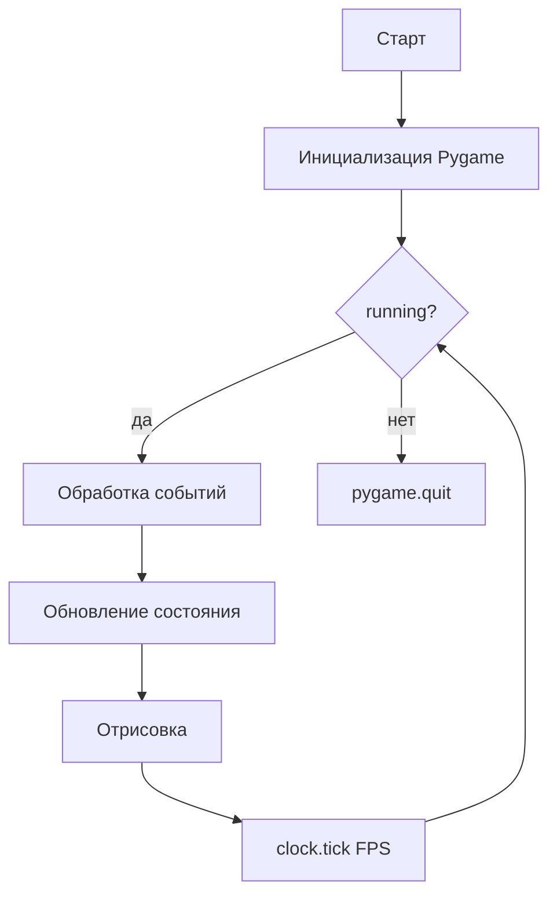
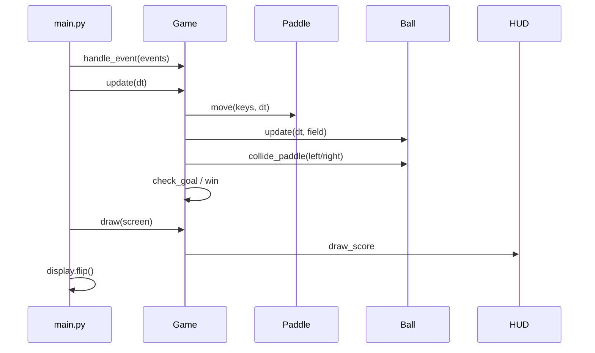
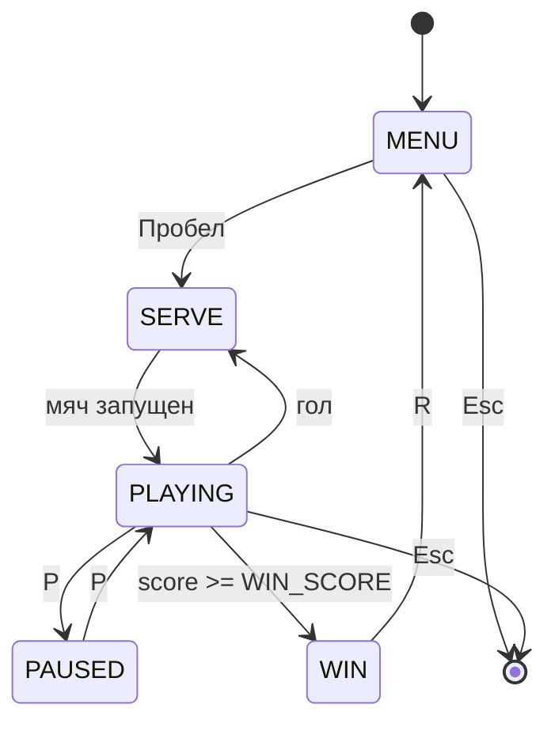
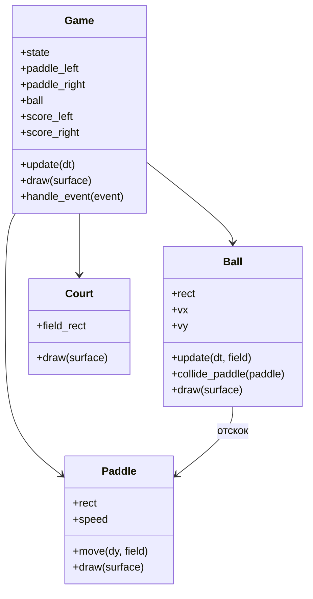

import ExternalCodeEmbed from '@site/src/components/ExternalCodeEmbed';


# Python — Ping Pong

<span class="complexity-badge">Разработчику</span>
<span class="complexity-badge">Начальный уровень</span>

---

## О практикуме

**Pong** (Ping Pong) — одна из первых аркад: две ракетки отбивают мяч по горизонтали; проигрывает тот, кто пропустил мяч за свою линию. В этом практикуме соберём **полноценный прототип** на **Python 3** и **Pygame** — без спрайтов из оригинала Atari, на цветных прямоугольниках, зато с разбором физики отскока, счёта и игровых состояний.

<div class="callout callout--info">
  <div class="callout-title">Для кого материал</div>

  <div class="callout-body">
  Нужны базовые Python (классы, списки, циклы) и знакомство с Pygame из статьи <a href="/encyclopedia/5-languages/5-02-python/312">Разработка игр на Python</a>. Для разминки подойдёт один файл <a href="/lab/Примеры/1132#pong">Pong в Lab</a> с разбором отскока и <code>Rect</code>. Каждый этап — <strong>запускаемый код</strong>: после шага проект можно запустить и увидеть новую механику.
  </div>
</div>

## Как проходить практикум

1. Создайте папку `pong/`, виртуальное окружение и установите Pygame — раздел [Зависимости](#dependencies).
2. Идите по этапам 0–14 по порядку: после каждого шага запускайте `python main.py` и отмечайте пункты "Самопроверка".
3. На этапе 6 разложите код по пакету `game/`; с этапа 14 вся логика матча живёт в `game/game.py`.
4. После этапа 14 сверьте проект с эталоном — [Полная ревизия файлов](#full-revision): дерево, разбор и готовые листинги.

**Что получится в конце**

- Окно 960×540 с кортом, двумя ракетками, мячом и счётом до 11.
- Режим **1×1** на одной клавиатуре или **против простого ИИ**.
- Меню, подача после гола, пауза, экран победы.
- Модули `game/*` и короткий `main.py` — каркас, на который легко навесить звук, сеть или турнирную таблицу.

**Оценка времени** — 3–5 часов при прохождении всех этапов подряд; этапы 0–6 можно уложить в один вечер (~1,5 ч).

**Перед стартом проверьте**

- [ ] Python 3.10+ в PATH (`python --version`).
- [ ] Терминал открыт в **корне проекта** `pong/` (там, где лежит `main.py`).
- [ ] Прочитаны разделы "игровой цикл" и `Rect` в [Разработка игр на Python](/encyclopedia/5-languages/5-02-python/312).

**Управление в финальной версии**

| Клавиша | Действие |
|---------|----------|
| `W` / `S` | Ракетка игрока слева (вверх / вниз) |
| `↑` / `↓` | Ракетка игрока справа (вверх / вниз) |
| `Пробел` | Подача мяча (из меню и после гола) |
| `P` | Пауза |
| `R` | Перезапуск матча |
| `Esc` | Выход |

**Маршрут чтения**

1. [Архитектура](#architecture) — как устроен проект до первой строки кода.
2. [Зависимости и структура папок](#dependencies) — окружение и файлы.
3. [Этап 0 — минимальный запуск](#stage-0) — чёрное окно и игровой цикл.
4. Этапы 1–14 — по одной механике за шаг.
5. [Этап 15 — substeps и звук](#stage-15) (бонус, полировка).
6. [Итоговая структура и самопроверка](#final-checklist).

### Карта этапов

| Этап | Фокус | Новое поведение в игре |
|------|--------|-------------------------|
| 0 | Цикл Pygame | Тёмное окно, выход по `Esc` |
| 1 | `settings.py` | Константы в одном файле |
| 2 | Корт | Поле, рамка, пунктир |
| 3 | `Paddle` | Две статичные ракетки |
| 4 | Ввод | Левая ракетка на `W`/`S` |
| 5 | `Ball` | Мяч в центре |
| 6 | Модули | Мяч летит по диагонали |
| 7 | Стены | Отскок от верха и низа |
| 8 | `colliderect` | Простой отскок от ракетки |
| 9 | Угол удара | Траектория зависит от точки контакта |
| 10 | Гол | Счёт на экране |
| 11 | `SERVE` | Подача по Пробелу |
| 12 | ИИ / 2 игрока | Правая ракетка оживает |
| 13 | FSM | Меню, пауза, победа |
| 14 | `Game` | Чистая архитектура |
| 15 | Substeps + звук | Мяч не "проскакивает" сквозь ракетку |

---

<span id="architecture"></span>
## Архитектура

Прежде чем писать код, зафиксируем **что из чего состоит** и **как данные текут по кадру**.

### Кратко об оригинале

**Pong** (Atari, 1972) — одна из первых коммерчески успешных аркад. Управление сводится к одной оси на игрока; вся сложность — в **тайминге** и **угле** отскока. Учебная версия на Pygame повторяет ту же петлю "ввод → движение → столкновение → счёт", которую позже масштабируют до платформеров и шутеров.

### Игровой цикл

Любая игра на Pygame крутит один и тот же цикл. В Pong порядок шагов важен — сначала ввод и логика, потом отрисовка.



На каждом кадре внутри **обновления** выполняется цепочка:

1. Прочитать нажатые клавиши (или решение ИИ).
2. Сдвинуть ракетки с учётом границ поля.
3. Сдвинуть мяч по скорости `(vx, vy)`.
4. Проверить столкновения со стенами и ракетками.
5. При голе — обновить счёт, сбросить мяч, перейти в режим подачи.
6. Проверить победу (например, до 11 очков).

### Один кадр — порядок вызовов

Когда логика собрана в класс `Game`, типичный кадр в состоянии `PLAYING` выглядит так:



**Правило порядка** — сначала двигаем ракетки, потом мяч, потом столкновения. Если поменять местами "мяч" и "ракетки", мяч на один кадр окажется **внутри** ракетки после её сдвига — отсюда двойные отскоки и "прилипание".

### Слои приложения

| Слой | Ответственность | Примеры сущностей |
|------|-----------------|-------------------|
| **Ввод** | События клавиатуры, пауза, выход | `KEYDOWN`, `get_pressed()` |
| **Мир** | Размеры поля, отступы, центральная линия | `Court`, константы из `settings` |
| **Акторы** | Ракетки и мяч | `Paddle`, `Ball` |
| **Правила** | Счёт, подача, победа, пауза | `Game`, `score_left`, `score_right` |
| **Представление** | Рисование поля, HUD, экраны | `draw_court`, `draw_hud` |

Слой **правил** не рисует напрямую — он меняет состояние; слой **представления** только читает состояние и выводит кадр. Так проще менять графику и добавлять сетевую игру позже.

### Координатная система

Pygame использует **экранные координаты** — начало `(0, 0)` — левый верхний угол, ось **X** растёт вправо, ось **Y** — вниз.

```
Экран (пиксели)
┌────────────────────────────────────────────┐
│  MARGIN                                    │
│  ┌──────────────────────────────────────┐  │
│  │  ● ракетка слева                     │  │
│  │         · центр                      │  │
│  │  ─ ─ ─ ─ ─ ─ ─ ─ ─ ─ ─ ─ ─ ─ ─ ─ ─  │  │  ← пунктир по центру
│  │                     ● ракетка справа │  │
│  └──────────────────────────────────────┘  │
│           счёт 3 : 7                       │
└────────────────────────────────────────────┘
```

Рекомендуемые константы (можно менять, но **все модули должны брать размеры из одного места**):

| Константа | Значение | Смысл |
|-----------|----------|-------|
| `SCREEN_W`, `SCREEN_H` | `960`, `540` | Размер окна (16:9) |
| `MARGIN` | `40` | Отступ поля от краёв экрана |
| `PADDLE_W`, `PADDLE_H` | `14`, `100` | Ракетка — узкий высокий прямоугольник |
| `BALL_SIZE` | `16` | Диаметр мяча (квадрат `16×16`) |
| `PADDLE_SPEED` | `420` | Пикселей в секунду |
| `BALL_SPEED` | `320` | Базовая скорость мяча |
| `WIN_SCORE` | `11` | Очков для победы |
| `FPS` | `60` | Кадров в секунду |

Игровое поле — прямоугольник внутри отступов:

```python
FIELD_RECT = pygame.Rect(MARGIN, MARGIN, SCREEN_W - 2 * MARGIN, SCREEN_H - 2 * MARGIN)
```

Ракетки **прилипают** к левому и правому краю поля; мяч отскакивает от верхней и нижней границы `FIELD_RECT`.

### Физика отскока

Классический Pong на Atari использовал **два типа столкновений**:

1. **Стены** (верх / низ) — инвертировать `vy` (скорость по Y меняет знак).
2. **Ракетка** — инвертировать `vx` и **слегка изменить** `vy` в зависимости от того, **куда по высоте** ракетки попал мяч.

Чем ближе удар к краю ракетки, тем сильнее угол:

```python
# relative_hit: от -1 (низ ракетки) до +1 (верх ракетки)
relative_hit = (ball.center_y - paddle.center_y) / (paddle.height / 2)
ball.vy = BALL_SPEED * relative_hit * 0.85
ball.vx = -ball.vx  # отражение по горизонтали
```

Так партия остаётся динамичной: прямой удар по центру летит почти горизонтально, удар "с краю" даёт крутой угол.

**Нормализация скорости** (этап 9) не даёт мячу бесконечно ускоряться от серии ударов под острым углом — модуль вектора `(vx, vy)` ограничивается `BALL_SPEED * 1.15`.

### Гейм-дизайн и баланс

| Параметр | Значение в практикуме | Зачем |
|----------|----------------------|-------|
| `WIN_SCORE = 11` | Как в настольном пинг-понге (party до 11) | Короткие партии, быстрый feedback |
| `PADDLE_H = 100` при поле ~460 px | ~22% высоты поля | Достаточно зоны для защиты, но промахи возможны |
| `BALL_SPEED = 320` | ~¾ ширины поля в секунду | Рally ~2–4 с без ускорения |
| `PADDLE_SPEED = 420` | Чуть быстрее мяча по вертикали | Игрок успевает перехватить, но нужен тайминг |
| ИИ `reaction = 0.82` | Бот ошибается на резких углах | Одиночная игра остаётся честной |

Подстройка баланса — только правка констант в `settings.py`; логику `Game` менять не нужно.

<div class="callout callout--tip">
  <div class="callout-title">Rect и ручная физика</div>

  <div class="callout-body">
  Для аркады достаточно <code>pygame.Rect.colliderect</code> и явной коррекции скорости. Отдельный physics engine (Box2D, Pymunk) здесь лишний: Pong учит цикл, ввод и предсказуемые столкновения.
  </div>
</div>

### Конечный автомат состояний

Игра переключается между экранами через явное поле `state`:



Состояния `MENU`, `SERVE`, `PLAYING`, `PAUSED`, `WIN` — отдельные ветки в `update()` и `draw()`.

| Состояние | `update` | `draw` |
|-----------|----------|--------|
| `MENU` | только чтение событий | корт + оверлей "Пробел — начать" |
| `SERVE` | ракетки двигаются, мяч стоит | подсказка "Пробел — подача" |
| `PLAYING` | полная физика | корт, акторы, счёт |
| `PAUSED` | как `PLAYING`, но мяч не обновляется* | затемнение + "ПАУЗА" |
| `WIN` | только события | оверлей победителя |

\* На этапе 13 проще **не вызывать** `ball.update`, если `state == "PAUSED"` — заморозка без отдельного поля.

### Структура файлов (целевая)

К **этапу 5** достаточно одного `main.py`. Дальше проект **раскладываем по модулям**.

```
pong/
├── main.py              # точка входа, цикл while
├── settings.py          # константы, цвета, FPS
├── assets/              # позже — звуки (опционально)
├── game/
│   ├── __init__.py
│   ├── court.py         # фон, центральная линия
│   ├── paddle.py        # Paddle — движение и отрисовка
│   ├── ball.py          # Ball — скорость, столкновения
│   ├── hud.py           # счёт, оверлеи меню/паузы
│   ├── ai.py            # простой ИИ для одиночной игры (этап 12)
│   └── game.py          # класс Game — правила матча
└── requirements.txt
```

### Диаграмма объектов на кадре



---

<span id="dependencies"></span>
## Зависимости и подготовка окружения

### Требования

- **Python 3.10+** (удобны `match`/`case`; на 3.9 код тоже работает, если заменить `match` на `if/elif`).
- **Pygame 2.5+** — единственная внешняя библиотека.

### Установка

```bash
mkdir pong && cd pong
python -m venv .venv
```

Активация виртуального окружения:

- **Windows (PowerShell):** `.venv\Scripts\Activate.ps1`
- **Linux / macOS:** `source .venv/bin/activate`

```bash
pip install pygame
python -c "import pygame; print('Pygame', pygame.ver)"
```

Файл `requirements.txt`:

```
pygame>=2.5.0
```

### Файлы окружения

`.gitignore` в корне `pong/`:

```
.venv/
__pycache__/
*.pyc
.pytest_cache/
```

### Запуск из IDE

Cursor / VS Code: откройте папку `pong` как workspace, выберите интерпретатор из `.venv`, запускайте `main.py`. Рабочая директория должна быть **корнем проекта** — иначе импорт `import settings` и `from game...` сломается.

<div class="callout callout--caution">
  <div class="callout-title">Pygame на Windows</div>

  <div class="callout-body">
  Если <code>pip install pygame</code> падает, обновите pip (<code>python -m pip install -U pip</code>) и повторите установку. На Python 3.12+ берите Pygame 2.5+. Сообщение <code>ModuleNotFoundError: No module named 'pygame'</code> почти всегда значит, что активировано не то venv или запуск идёт из другой папки.
  </div>
</div>

### Первичная структура

На **этапе 0** создайте только `main.py`. Папку `game/` добавим на этапе 6.

<div class="callout callout--warning">
  <div class="callout-title">Delta time</div>

  <div class="callout-body">
  На всех этапах движение считаем через <code>dt = clock.tick(FPS) / 1000.0</code> — секунды с прошлого кадра. Так скорость в "пикселях в секунду" остаётся одинаковой на любом мониторе и при просадках FPS.
  </div>
</div>

---

<span id="stage-0"></span>
## Этап 0 — минимальный запускаемый код

**Цель** — окно, цикл событий, выход по крестику и `Esc`, стабильные 60 FPS.

Создайте `main.py`:


<ExternalCodeEmbed example="python/sp-9-9-04-razrabotka-igr-praktikum-razrabotki-igr-3-001" title="Этап 0 — минимальный запускаемый код" minHeight={534} />


Запуск:

```bash
python main.py
```

**Самопроверка этапа 0**

- [ ] Окно открывается без traceback.
- [ ] Фон тёмный, без мерцания.
- [ ] `Esc` и крестик закрывают программу.

На следующих этапах **не удаляем** цикл — только расширяем тело `while`.

<div class="callout callout--note">
  <div class="callout-title">Переменная dt</div>

  <div class="callout-body">
  На этапе 0 <code>dt</code> пока нигде не используется — это нормально. С этапа 4 она участвует в каждом движении; удалять строку <code>clock.tick</code> нельзя.
  </div>
</div>

---

<span id="stage-1"></span>
## Этап 1 — константы и файл настроек

**Цель** — вынести все числа и цвета в `settings.py`, чтобы не искать "магические" значения по коду.

`settings.py`:


<ExternalCodeEmbed example="python/sp-9-9-04-razrabotka-igr-praktikum-razrabotki-igr-3-002" title="Этап 1 — константы и файл настроек" minHeight={534} />


Обновите `main.py`:


<ExternalCodeEmbed example="python/sp-9-9-04-razrabotka-igr-praktikum-razrabotki-igr-3-003" title="Этап 1 — константы и файл настроек" minHeight={480} />


**Самопроверка**

- [ ] Импорт `settings as S` работает без ошибок.
- [ ] Размер окна 960×540.

---

<span id="stage-2"></span>
## Этап 2 — игровое поле и центральная линия

**Цель** — нарисовать "корт": прямоугольник поля и пунктир по центру, как в классическом Pong.

Добавьте в `main.py` функцию отрисовки (позже перенесём в `game/court.py`):


<ExternalCodeEmbed example="python/sp-9-9-04-razrabotka-igr-praktikum-razrabotki-igr-3-004" title="Этап 2 — игровое поле и центральная линия" minHeight={390} />


В цикле перед `flip()`:

```python
    screen.fill(S.COLOR_BG)
    draw_court(screen)
    pygame.display.flip()
```

**Самопроверка**

- [ ] Поле с отступом 40 px от краёв окна.
- [ ] По центру — вертикальный пунктир.
- [ ] Тонкая рамка вокруг поля.

**Если пунктир "рваный"** — проверьте, что `dash_h + gap` не больше высоты поля; последний сегмент обрезается через `min(y + dash_h, MARGIN + FIELD_H)`.

---

<span id="stage-3"></span>
## Этап 3 — две ракетки (статичные)

**Цель** — класс `Paddle`, две ракетки по краям поля, пока без движения.

Добавьте в `main.py` (этап 6 вынесем в модуль):


<ExternalCodeEmbed example="python/sp-9-9-04-razrabotka-igr-praktikum-razrabotki-igr-3-005" title="Этап 3 — две ракетки (статичные)" minHeight={354} />


После `draw_court(screen)`:

```python
    paddle_left.draw(screen)
    paddle_right.draw(screen)
```

**Самопроверка**

- [ ] Левая ракетка зелёноватая, правая — синяя.
- [ ] Ракетки по вертикали центрированы в поле.
- [ ] Между ракеткой и боковой границей поля есть небольшой зазор (~8 px).

---

<span id="stage-4"></span>
## Этап 4 — движение левой ракетки

**Цель** — управление `W` / `S` с ограничением внутри поля.

Добавьте метод в `Paddle`:

```python
    def move(self, direction, dt):
        """direction: -1 вверх, +1 вниз, 0 — стоять."""
        dy = direction * self.speed * dt
        self.rect.y += int(dy)
        top = S.MARGIN
        bottom = S.MARGIN + S.FIELD_H - self.rect.height
        self.rect.top = max(top, min(bottom, self.rect.top))
```

В игровом цикле **перед** отрисовкой:

```python
    keys = pygame.key.get_pressed()
    direction = 0
    if keys[pygame.K_w]:
        direction -= 1
    if keys[pygame.K_s]:
        direction += 1
    paddle_left.move(direction, dt)
```

<div class="callout callout--tip">
  <div class="callout-title">get_pressed и KEYDOWN</div>

  <div class="callout-body">
  Для непрерывного движения удобнее <code>pygame.key.get_pressed()</code> — ракетка едет, пока клавиша зажата. События <code>KEYDOWN</code> оставим для одиночных действий (пауза, подача, выход).
  </div>
</div>

**Самопроверка**

- [ ] `W` / `S` двигают левую ракетку.
- [ ] Ракетка не выходит за верх и низ поля.
- [ ] Скорость ощущается одинаковой при 60 FPS.

---

<span id="stage-5"></span>
## Этап 5 — мяч в центре (без движения)

**Цель** — класс `Ball`, отрисовка белого квадрата в центре поля.


<ExternalCodeEmbed example="python/sp-9-9-04-razrabotka-igr-praktikum-razrabotki-igr-3-006" title="Этап 5 — мяч в центре (без движения)" minHeight={336} />


После ракеток:

```python
    ball.draw(screen)
```

**Самопроверка**

- [ ] Мяч ровно в центре поля.
- [ ] Размер 16×16 px.

---

<span id="stage-6"></span>
## Этап 6 — движение мяча и модули

**Цель** — мяч летит по диагонали; код раскладываем по файлам `game/paddle.py`, `game/ball.py`, `game/court.py`.

Создайте пустой `game/__init__.py`.

`game/court.py`:


<ExternalCodeEmbed example="python/sp-9-9-04-razrabotka-igr-praktikum-razrabotki-igr-3-007" title="Этап 6 — движение мяча и модули" minHeight={534} />


`game/paddle.py`:


<ExternalCodeEmbed example="python/sp-9-9-04-razrabotka-igr-praktikum-razrabotki-igr-3-008" title="Этап 6 — движение мяча и модули" minHeight={426} />


`game/ball.py`:


<ExternalCodeEmbed example="python/sp-9-9-04-razrabotka-igr-praktikum-razrabotki-igr-3-009" title="Этап 6 — движение мяча и модули" minHeight={552} />


Обновлённый `main.py`:


<ExternalCodeEmbed example="python/sp-9-9-04-razrabotka-igr-praktikum-razrabotki-igr-3-010" title="Этап 6 — движение мяча и модули" minHeight={720} />


**Самопроверка**

- [ ] Мяч летит вправо-вниз и уходит за край экрана (столкновений ещё нет).
- [ ] Импорты из пакета `game` работают.

<div class="callout callout--note">
  <div class="callout-title">Структура пакета game</div>

  <div class="callout-body">
  Файл <code>game/__init__.py</code> может быть пустым — он нужен Python, чтобы папка считалась пакетом. Импорт <code>from game.ball import Ball</code> работает только при запуске из родительской папки <code>pong/</code>.
  </div>
</div>

---

<span id="stage-7"></span>
## Этап 7 — отскок от верхней и нижней стены

**Цель** — мяч остаётся внутри поля по вертикали.

Добавьте в `Ball.update` в `game/ball.py`:

```python
    def update(self, dt, field):
        self.rect.x += int(self.vx * dt)
        self.rect.y += int(self.vy * dt)

        if self.rect.top <= field.top:
            self.rect.top = field.top
            self.vy = abs(self.vy)
        elif self.rect.bottom >= field.bottom:
            self.rect.bottom = field.bottom
            self.vy = -abs(self.vy)
```

В `main.py` сделайте два изменения.

1. В **импортах** добавьте `field_rect` рядом с `draw_court`:

```python
from game.court import draw_court, field_rect
```

2. **Перед** циклом `while running` один раз вычислите прямоугольник поля; **внутри** цикла, сразу после движения ракеток и **перед** отрисовкой, передайте его в `ball.update`:

```python
field = field_rect()

running = True
while running:
    # ... события, dt, paddle_left.move ...
    ball.update(dt, field)
    # ... draw_court, flip ...
```

Переменная `field` не пересоздаётся каждый кадр — размеры поля из `settings.py` не меняются во время матча.

**Самопроверка**

- [ ] Мяч бесконечно отскакивает от верха и низа поля.
- [ ] Не "залипает" в углу (если залипает — проверьте, что используете `abs` для скорости).

**Почему `abs(vy)`** — после удара о стену скорость должна быть **направлена от стены**. Если мяч вошёл в верхнюю границу с `vy = -200`, после коррекции нужно `vy = +200`, то есть положительное значение.

---

<span id="stage-8"></span>
## Этап 8 — столкновение с ракеткой (простой отскок)

**Цель** — при пересечении `Rect` мяча и ракетки мяч отражается по горизонтали.

Метод в `Ball`:


<ExternalCodeEmbed example="python/sp-9-9-04-razrabotka-igr-praktikum-razrabotki-igr-3-011" title="Этап 8 — столкновение с ракеткой (простой отскок)" minHeight={318} />


В `main.py` после `ball.update`:

```python
    ball.collide_paddle(paddle_left)
    ball.collide_paddle(paddle_right)
```

Пока правая ракетка не двигается — временно **сдвиньте её ближе к центру** или управляйте ей теми же `W`/`S`, чтобы проверить отскок вручную.

<div class="callout callout--warning">
  <div class="callout-title">Tunneling — проскок сквозь ракетку</div>

  <div class="callout-body">
  За один кадр мяч может "перепрыгнуть" через тонкую ракетку, если <code>|vx * dt|</code> больше ширины ракетки. На базовых скоростях это редкость; если заметили — см. <a href="#stage-15">этап 15 (substeps)</a>.
  </div>
</div>

**Самопроверка**

- [ ] Мяч отражается от ракетки, а не проходит сквозь неё.
- [ ] После удара мяч летит в противоположную сторону.

---

<span id="stage-9"></span>
## Этап 9 — угол отскока от места удара

**Цель** — `vy` зависит от точки контакта на ракетке; партия становится интереснее.

Замените тело `collide_paddle` на версию с углом:


<ExternalCodeEmbed example="python/sp-9-9-04-razrabotka-igr-praktikum-razrabotki-igr-3-012" title="Этап 9 — угол отскока от места удара" minHeight={570} />


<div class="callout callout--info">
  <div class="callout-title">Проверка "с какой стороны" летит мяч</div>

  <div class="callout-body">
  Без проверки <code>approaching</code> мяч может "застрять" внутри ракетки и несколько раз подряд вызвать столкновение за один кадр. Мы отражаем только если мяч летит <strong>на</strong> ракетку.
  </div>
</div>

**Самопроверка**

- [ ] Удар по центру ракетки — почти горизонтальный полёт.
- [ ] Удар по краю — заметный наклон траектории.

**Эксперимент** — временно поставьте `relative_hit * 1.2` вместо `0.85`: мяч станет слишком "живым" и будет улетать почти вертикально от краёв. Верните `0.85`, когда поймёте связь формулы и геймплея.

---

<span id="stage-10"></span>
## Этап 10 — гол и счёт

**Цель** — мяч за левой или правой границей поля даёт очко противнику; счёт хранится в переменных.

В `main.py` (позже перенесём в `Game`):

```python
score_left = 0
score_right = 0
```

После обновления мяча:

```python
    if ball.rect.right < field.left:
        score_right += 1
        ball.reset(center=True)
    elif ball.rect.left > field.right:
        score_left += 1
        ball.reset(center=True)
```

Временный вывод счёта:

```python
font = pygame.font.SysFont("consolas", 36)

def draw_score(surface, left, right):
    text = font.render(f"{left}  :  {right}", True, S.COLOR_TEXT)
    rect = text.get_rect(center=(S.SCREEN_W // 2, 28))
    surface.blit(text, rect)
```

Счёт размещаем **над полем** (Y ≈ 28), чтобы не перекрывать центральный пунктир. На этапе 13 тот же приём переедет в `game/hud.py`.

**Самопроверка**

- [ ] Пропущенный мяч увеличивает счёт соперника.
- [ ] После гола мяч останавливается в центре.

---

<span id="stage-11"></span>
## Этап 11 — подача и состояние SERVE

**Цель** — после гола нужно нажать **Пробел**, чтобы запустить мяч в сторону проигравшего подачу.

Логика подачи в классическом Pong: **проигравший очко** принимает подачу — мяч летит **на него**, чтобы он мог вернуться в игру. Поэтому после гола слева (`score_left += 1`) задаём `serve_direction = 1` (мяч вправо, к проигравшему справа), и наоборот.

Добавьте переменную состояния:

```python
state = "SERVE"  # позже: MENU, PLAYING, PAUSED, WIN
serve_direction = 1
```

Обработка в цикле событий:

```python
        elif event.type == pygame.KEYDOWN and event.key == pygame.K_SPACE:
            if state == "SERVE":
                ball.reset(center=False, direction=serve_direction)
                state = "PLAYING"
```

При голе:

```python
    if ball.rect.right < field.left:
        score_right += 1
        serve_direction = -1
        ball.reset(center=True)
        state = "SERVE"
    elif ball.rect.left > field.right:
        score_left += 1
        serve_direction = 1
        ball.reset(center=True)
        state = "SERVE"
```

Обновление мяча только в `PLAYING`:

```python
    if state == "PLAYING":
        ball.update(dt, field)
        ball.collide_paddle(paddle_left)
        ball.collide_paddle(paddle_right)
        # проверка гола — как выше
```

Подсказка на экране в `SERVE`:

```python
def draw_hint(surface, message):
    f = pygame.font.SysFont("consolas", 22)
    t = f.render(message, True, S.COLOR_ACCENT)
    surface.blit(t, t.get_rect(center=(S.SCREEN_W // 2, S.SCREEN_H - 24)))

# в цикле отрисовки:
if state == "SERVE":
    draw_hint(screen, "Пробел — подача")
```

**Самопроверка**

- [ ] После гола мяч стоит, пока не нажмёте Пробел.
- [ ] Подача летит к тому, кто **пропустил** мяч (он принимает).

---

<span id="stage-12"></span>
## Этап 12 — вторая ракетка и простой ИИ

**Цель** — игрок справа управляется стрелками **или** простым ботом для одиночной игры.

Управление правой ракеткой:

```python
    dir_right = 0
    if keys[pygame.K_UP]:
        dir_right -= 1
    if keys[pygame.K_DOWN]:
        dir_right += 1
    paddle_right.move(dir_right, dt)
```

Опционально `game/ai.py` для режима "против компьютера":


<ExternalCodeEmbed example="python/sp-9-9-04-razrabotka-igr-praktikum-razrabotki-igr-3-013" title="Этап 12 — вторая ракетка и простой ИИ" minHeight={390} />


Переключатель в `main.py`:

```python
VS_AI = True  # False — два игрока на одной клавиатуре

# в update:
if VS_AI:
    from game.ai import ai_follow_ball
    if state == "PLAYING" and ball.vx > 0:
        ai_follow_ball(paddle_right, ball, dt, reaction=0.82)
else:
    paddle_right.move(dir_right, dt)
```

<div class="callout callout--tip">
  <div class="callout-title">Баланс ИИ</div>

  <div class="callout-body">
  Параметр <code>reaction</code> чуть ниже 1.0 делает бота "человечнее". Дополнительно можно двигать бота только когда <code>ball.vx > 0</code>, то есть мяч летит на его половину.
  </div>
</div>

| Сложность | `reaction` | Поведение |
|-----------|------------|-----------|
| Лёгкая | 0.65 | Частые промахи на быстрых углах |
| Нормальная | 0.82 | Баланс для одиночной игры |
| Сложная | 0.95 | Почти идеальный трекинг |

**Самопроверка**

- [ ] Два игрока могут играть на одной клавиатуре.
- [ ] В режиме ИИ правая ракетка перехватывает мяч, но иногда ошибается.

---

<span id="stage-13"></span>
## Этап 13 — HUD, меню, пауза и победа

**Цель** — экраны `MENU`, `PAUSED`, `WIN`; победа при `WIN_SCORE` очках.

Для паузы удобно **не обновлять мяч**, когда `state == "PAUSED"`, но **продолжать рисовать** замороженный кадр. В `update` оборачивайте блок физики мяча:

```python
    if state == "PLAYING":
        ball.update(dt, field)
        # столкновения и гол
```

Создайте `game/hud.py`:


<ExternalCodeEmbed example="python/sp-9-9-04-razrabotka-igr-praktikum-razrabotki-igr-3-014" title="Этап 13 — HUD, меню, пауза и победа" minHeight={714} />


Логика состояний в `main.py` (фрагмент):


<ExternalCodeEmbed example="python/sp-9-9-04-razrabotka-igr-praktikum-razrabotki-igr-3-015" title="Этап 13 — HUD, меню, пауза и победа" minHeight={714} />


**Самопроверка**

- [ ] Стартовое меню с подсказкой.
- [ ] `P` ставит и снимает паузу.
- [ ] При 11 очках — экран победы, `R` сбрасывает матч.

---

<span id="stage-14"></span>
## Этап 14 — класс `Game` и чистый `main.py`

**Цель** — собрать разрозненную логику в один класс; в `main.py` остаётся только цикл.

`game/game.py`:


<ExternalCodeEmbed example="python/sp-9-9-04-razrabotka-igr-praktikum-razrabotki-igr-3-016" title="Этап 14 — класс `Game` и чистый `main.py`" minHeight={720} />


Финальный `main.py`:


<ExternalCodeEmbed example="python/sp-9-9-04-razrabotka-igr-praktikum-razrabotki-igr-3-017" title="Этап 14 — класс `Game` и чистый `main.py`" minHeight={696} />


**Самопроверка**

- [ ] `main.py` короче 40 строк.
- [ ] Перезапуск матча и смена состояния не дублируют код.

---

<span id="stage-15"></span>
## Этап 15 (бонус) — substeps и звук

**Цель** — убрать проскок мяча сквозь ракетку на высокой скорости и добавить минимальную обратную связь через звук.

### Substeps — дробление движения

Идея: за один кадр выполнить **несколько маленьких шагов** физики вместо одного большого.

В `settings.py`:

```python
PHYSICS_STEPS = 4
```

В `game/ball.py` замените `update`:


<ExternalCodeEmbed example="python/sp-9-9-04-razrabotka-igr-praktikum-razrabotki-igr-3-018" title="Substeps — дробление движения" minHeight={354} />


В `Game.update` передавайте список ракеток:

```python
        self.ball.update(
            dt,
            self.field,
            paddles=(self.paddle_left, self.paddle_right),
        )
        # collide_paddle отдельно больше не вызываем — всё внутри update
```

После substeps уберите дублирующие вызовы `collide_paddle` сразу после `ball.update`.

### Звук без внешних ассетов

Pygame умеет синтезировать простой "бип" через `pygame.sndarray`. Минимальный вариант — загрузить короткий WAV из [freesound.org](https://freesound.org) в `assets/hit.wav` и `assets/score.wav`.

`game/audio.py`:


<ExternalCodeEmbed example="python/sp-9-9-04-razrabotka-igr-praktikum-razrabotki-igr-3-019" title="Звук без внешних ассетов" minHeight={462} />


Вызывайте `audio.play_hit()` в конце `collide_paddle` (если вернул `True`), `audio.play_goal()` при начислении очка. Если файлов нет — класс тихо отключается (`enabled = False`).

<div class="callout callout--tip">
  <div class="callout-title">Отладочный оверлей</div>

  <div class="callout-body">
  Добавьте флаг <code>DEBUG = True</code> в <code>settings.py</code> и по <code>F1</code> рисуйте контуры <code>Rect</code> мяча и ракеток, а также стрелки скорости (<code>vx</code>, <code>vy</code>) — так проще ловить tunneling и двойные столкновения.
  </div>
</div>

**Самопроверка этапа 15**

- [ ] При быстрых rally мяч не проходит сквозь ракетку.
- [ ] Звук удара/гола слышен (или игра работает без `assets/`).
- [ ] FPS остаётся стабильным (`PHYSICS_STEPS = 4` при 60 FPS — 240 микрошагов/с).

---

<span id="full-revision"></span>
## Полная ревизия файлов

Эталонный проект после **этапа 14** (проверен импортом `from game.game import Game`). Сверяйте листинги построчно, если что-то не сходится после прохождения практикума.

### Дерево проекта

```
pong/
├── main.py
├── settings.py
├── requirements.txt
└── game/
    ├── __init__.py
    ├── court.py
    ├── paddle.py
    ├── ball.py
    ├── hud.py
    ├── ai.py
    └── game.py
```

### `requirements.txt`

**Разбор.** Единственная внешняя зависимость — Pygame 2.5+.

```
pygame>=2.5.0
```

### `settings.py`

**Разбор.** Все размеры окна, поля, скорости и цвета — в одном месте; модули `game/*` импортируют `settings as S`.


<ExternalCodeEmbed example="python/sp-9-9-04-razrabotka-igr-praktikum-razrabotki-igr-3-020" title="`settings.py`" minHeight={534} />


### `main.py`

**Разбор.** Только инициализация Pygame, цикл событий и вызовы `Game.update` / `Game.draw` — без правил матча.


<ExternalCodeEmbed example="python/sp-9-9-04-razrabotka-igr-praktikum-razrabotki-igr-3-021" title="`main.py`" minHeight={696} />


### `game/__init__.py`

**Разбор.** Пустой файл — Python считает `game` пакетом; импорты вида `from game.ball import Ball` работают при запуске из корня `pong/`.

```python

```

### `game/court.py`

**Разбор.** Отрисовка поля и пунктира; `field_rect()` возвращает `Rect` для границ мяча (этап 7).


<ExternalCodeEmbed example="python/sp-9-9-04-razrabotka-igr-praktikum-razrabotki-igr-3-022" title="`game/court.py`" minHeight={534} />


### `game/paddle.py`

**Разбор.** Ракетка — `Rect`, движение по вертикали с clamp внутри поля.


<ExternalCodeEmbed example="python/sp-9-9-04-razrabotka-igr-praktikum-razrabotki-igr-3-023" title="`game/paddle.py`" minHeight={426} />


### `game/ball.py`

**Разбор.** Скорость, отскок от верха/низа (`update` + `field`), угол удара от точки контакта на ракетке (`collide_paddle`).


<ExternalCodeEmbed example="python/sp-9-9-04-razrabotka-igr-praktikum-razrabotki-igr-3-024" title="`game/ball.py`" minHeight={720} />


### `game/hud.py`

**Разбор.** Счёт над полем и полноэкранные оверлеи меню, паузы и победы.


<ExternalCodeEmbed example="python/sp-9-9-04-razrabotka-igr-praktikum-razrabotki-igr-3-025" title="`game/hud.py`" minHeight={714} />


### `game/ai.py`

**Разбор.** Правая ракетка следует за `ball.rect.centery` с коэффициентом `reaction` меньше 1.


<ExternalCodeEmbed example="python/sp-9-9-04-razrabotka-igr-praktikum-razrabotki-igr-3-026" title="`game/ai.py`" minHeight={390} />


### `game/game.py`

**Разбор.** FSM (`MENU`, `SERVE`, `PLAYING`, `PAUSED`, `WIN`), счёт, подача, ИИ или второй игрок, делегирование отрисовки в `court` и `hud`.


<ExternalCodeEmbed example="python/sp-9-9-04-razrabotka-igr-praktikum-razrabotki-igr-3-027" title="`game/game.py`" minHeight={720} />


<div class="callout callout--tip">
  <div class="callout-title">Быстрая проверка импортов</div>

  <div class="callout-body">
  Из корня <code>pong/</code>: <code>python -c "from game.game import Game; print('ok')"</code> — без ошибок <code>ModuleNotFoundError</code>.
  </div>
</div>

---

<span id="final-checklist"></span>
## Итоговая самопроверка проекта

### Дерево готового проекта

```
pong/
├── main.py
├── settings.py
├── requirements.txt
├── .gitignore
├── assets/                  # опционально, этап 15
│   ├── hit.wav
│   └── score.wav
└── game/
    ├── __init__.py
    ├── court.py
    ├── paddle.py
    ├── ball.py
    ├── hud.py
    ├── ai.py
    ├── audio.py             # опционально, этап 15
    └── game.py
```

Пройдите чек-лист **готового прототипа**:

| # | Критерий | Да / нет |
|---|----------|----------|
| 1 | Окно фиксированного размера, стабильный FPS | |
| 2 | Поле с центральной линией и рамкой | |
| 3 | Две ракетки, левая — `W`/`S`, правая — стрелки или ИИ | |
| 4 | Мяч отскакивает от верха и низа поля | |
| 5 | Угол отскока зависит от места удара по ракетке | |
| 6 | Счёт, подача после гола, победа до 11 очков | |
| 7 | Меню, пауза, экран победы | |
| 8 | Код разбит на модули `game/*` | |
| 9 | (Бонус) Substeps или звук | |

### Словарь терминов

| Термин | Значение в этом практикуме |
|--------|----------------------------|
| **dt** | Delta time — секунды с прошлого кадра; умножается на скорость |
| **FSM** | Finite State Machine — переключение `MENU` / `PLAYING` / … |
| **HUD** | Head-Up Display — счёт и подсказки поверх поля |
| **Rect** | Прямоугольник Pygame для позиции и `colliderect` |
| **SERVE** | Состояние подачи — мяч в центре, ждём Пробел |
| **Substep** | Дробный шаг физики внутри одного кадра |
| **Tunneling** | Проскок объекта сквозь препятствие за один большой шаг |

### Идеи для расширения (самостоятельно)

- **Звук** — `pygame.mixer` для удара о ракетку и гола; короткие `.wav` в `assets/`.
- **Ускорение мяча** — после каждого успешного отбития умножать скорость на `1.03` (с потолком).
- **Spin / эффект** — при зажатом `Shift` при ударе добавлять к `vy` бонус (имитация "вращения").
- **Сетевой Pong** — второй процесс или socket; состояние синхронизируется только позициями ракеток и мяча.
- **Режим "squash"** — одна ракетка и мяч от стены за спиной игрока.
- **Сохранение рекорда** — лучший счёт в `highscore.txt`.
- **Турнир до N побед** — счётчик выигранных партий, не только очков в партии.
- **Экран выбора режима** — `1` один игрок, `2` два игрока, до старта матча.
- **Частицы** — при ударе о ракетку 3–5 белых точек, исчезающих за 0,2 с (без спрайтов).

### Типичные ошибки

| Симптом | Вероятная причина | Что сделать |
|---------|------------------|-------------|
| Чёрный экран, нет ошибок | Забыли `pygame.display.flip()` | Вызовите `flip` в конце цикла |
| `ModuleNotFoundError: settings` | Запуск не из корня `pong/` | `cd pong` или Run с правильным cwd в IDE |
| `ModuleNotFoundError: game` | Нет `game/__init__.py` | Создайте пустой файл |
| Мяч проходит сквозь ракетку на высокой скорости | Один кадр — слишком большой шаг | Substeps (этап 15) или снизьте `BALL_SPEED` |
| Мяч "прилипает" к ракетке | Нет проверки направления подлёта | Используйте флаг `approaching` из этапа 9 |
| Ракетка дёргается | Движение без `dt` | Умножайте скорость на `dt` |
| Счёт растёт несколько раз за один проход | Гол проверяется каждый кадр, пока мяч за полем | После гола сразу `reset` и `state = "SERVE"` |
| ИИ непобедим | `reaction = 1.0` | Снизьте до 0.7–0.85 или добавьте задержку реакции |
| Пауза не останавливает мяч | `ball.update` вызывается в `PAUSED` | Оборачивайте физику в `if state == "PLAYING"` |
| Двойной отскок за кадр | Столкновение до выталкивания из ракетки | Выталкивайте мяч (`rect.left = paddle.right`) до смены `vx` |

### Связь с историей игр

Pong (Atari, 1972) показал, что **простые правила + понятная обратная связь** достаточны для залипательной аркады. Тот же каркас — цикл, `Rect`, состояния — лежит в основе и современных игр; здесь вы отработали его на минимальном примере перед более сложными практикумами ([Battle City на GitHub](https://github.com/Spirzen/BattleCity), [Tetris](./5.md)).

### Сравнение с другими практикумами раздела

| | Ping Pong | Battle City | Match3 (план) |
|---|-----------|-------------|---------------|
| Сложность | Низкая | Средняя | Средняя |
| Главный навык | Столкновения, FSM | Сетка, спавн, пули | Массивы, каскады |
| Файлов к этапу 14 | ~8 | ~12+ | — |
| Идеальная "первая игра" | Да | После Pong | После Python-бasics |

---

## Связанные материалы

- [Практикум разработки игр — о разделе](/encyclopedia/9-spinoff/9-04-razrabotka-igr/praktikum-razrabotki-igr/intro) — другие учебные треки (Battle City, Tetris, diabloид).
- [Разработка игр на Python](/encyclopedia/5-languages/5-02-python/312) — Pygame, спрайты, звук, игровой цикл
- [Pygame — мини-игры](/lab/Примеры/1132#pong) — упрощённый Pong в одном файле
- [Компьютерные игры — о разделе](/encyclopedia/1-basics/1-18-kompyuternye-igry/intro) — жанры и история аркад.
- [Battle City на GitHub](https://github.com/Spirzen/BattleCity) — сетка, враги, пули (эталон вне энциклопедии).

---
