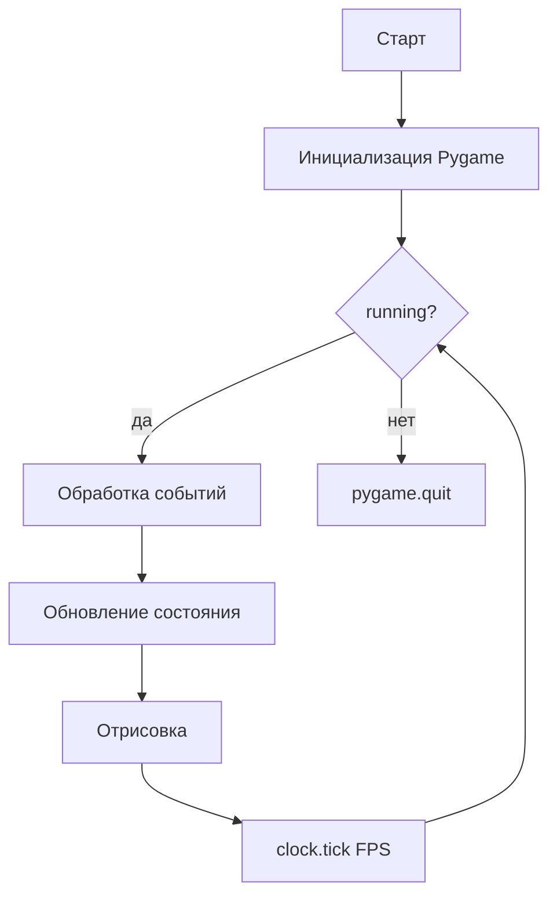
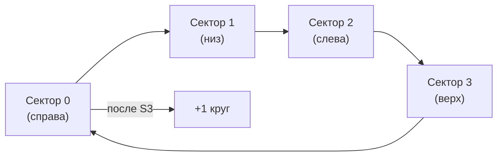
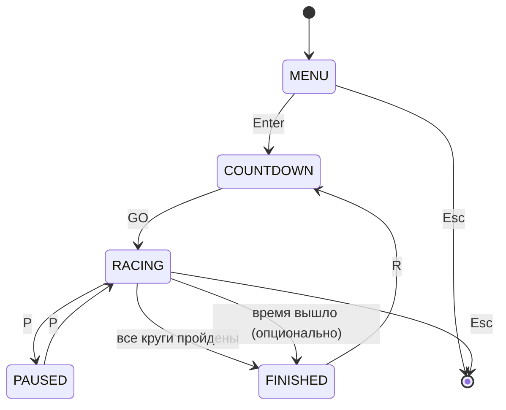
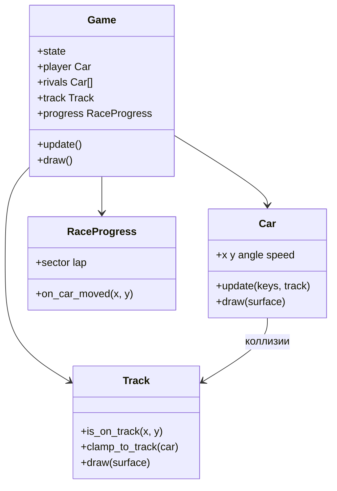

import ExternalCodeEmbed from '@site/src/components/ExternalCodeEmbed';


# Python — Racing

<span class="complexity-badge">Разработчику</span>
<span class="complexity-badge">Начальный уровень</span>

<div class="callout callout--info">
  <div class="callout-title">Формат практикума</div>

  <div class="callout-body">
  Материалы трека приводятся к единому формату: <strong>полные листинги для копирования</strong> на каждом этапе, блок <strong>"Разбор"</strong> и раздел <strong>"Полная ревизия"</strong> в конце статьи.
  <ul>
    <li>Гарантированно запускаемые эталоны для сверки: <a href="https://github.com/Spirzen/BattleCity">Battle City</a>, <a href="https://github.com/Spirzen/Match3">Match3</a>, <a href="./3.md#full-revision">Ping Pong</a>, <a href="./5.md#full-revision">Tetris</a>, <a href="./4.md#full-revision">Racing</a> (<code>#full-revision</code>).</li>
    <li>В этой статье <a href="#full-revision">полная ревизия</a> (<code>#full-revision</code>) покрывает этапы 0–14 — овал, круги, таймер, два соперника, меню, отсчёт, пауза и финиш. Этапы 15–16 (мини-карта, nitro) — по желанию.</li>
  </ul>
  </div>
</div>

## Как проходить практикум

- Копируйте **целиком** файлы из блоков кода каждого этапа.
- После каждого этапа **запускайте** проект (команда указана в главе) и пройдите чек-лист самопроверки.
- Если застряли — методология в разделе [Практикум разработки игр — о разделе](./intro.md); для сверки — [полная ревизия](#full-revision) в конце этой статьи и эталоны [Battle City](https://github.com/Spirzen/BattleCity), [Match3](https://github.com/Spirzen/Match3), [Ping Pong](./3.md#full-revision).

---

## О практикуме

Соберём **аркадные гонки сверху** (top-down) на **Python 3** и **Pygame** — овальная трасса, машина с ускорением и поворотом, столкновения с бордюром, **контрольные точки**, **круги**, таймер заезда и простые **соперники по waypoints**. Графика — цветные фигуры (без внешних спрайтов), зато с полным разбором физики, коллизий и состояний гонки.

Жанр **top-down racing** — вид "с камеры над трассой", как в ранних Micro Machines или Hot Wheels. Альтернатива для отдельного проекта — **вертикальный скроллер** (машина внизу, дорога едет на игрока); здесь выбран овал, потому что он наглядно учит **непрерывную физику**, **секторный подсчёт кругов** и **ИИ по точкам маршрута**.

<div class="callout callout--info">
  <div class="callout-title">Для кого материал</div>

  <div class="callout-body">
  Нужны базовые Python (классы, списки, <code>math</code>) и знакомство с Pygame из статьи <a href="/encyclopedia/5-languages/5-02-python/312">Разработка игр на Python</a>. Каждый этап — <strong>запускаемый код</strong>: после шага проект можно запустить и увидеть новую механику.
  </div>
</div>

**Управление в финальной версии**

| Клавиша | Действие |
|---------|----------|
| `W` или `↑` | Газ |
| `S` или `↓` | Тормоз / задний ход |
| `A` или `←` | Поворот влево (при движении) |
| `D` или `→` | Поворот вправо (при движении) |
| `P` | Пауза |
| `R` | Перезапуск заезда |
| `Enter` | Старт из меню |
| `Shift` | Nitro (этап 16) |
| `F1` | Режим отладки — секторы и waypoints |

**Маршрут чтения**

1. [Архитектура](#architecture) — как устроен проект до первой строки кода.
2. [Зависимости и структура папок](#dependencies) — окружение и файлы.
3. [Этап 0 — минимальный запуск](#stage-0) — окно и игровой цикл.
4. [Этапы 1–14](#stage-1) — базовый прототип, по одной механике за шаг.
5. [Полная ревизия файлов](#full-revision) — эталон после этапа 14 для построчной сверки.
6. [Этапы 15–16](#stage-15) — позиция в гонке, nitro и полировка (опционально).
7. [Настройка "руления"](#tuning) — таблица параметров физики.
8. [Отладка на трассе](#debug-mode) — визуализация секторов и waypoints.
9. [Итоговая структура и самопроверка](#final-checklist).

### Содержание этапов

| № | Тема | Новая механика |
|---|------|----------------|
| 0 | [Минимальный запуск](#stage-0) | Окно, цикл, `clock.tick` |
| 1 | [Конфиг и фон](#stage-1) | `config.py`, палитра |
| 2 | [Овальная трасса](#stage-2) | Эллипсы, линия разметки |
| 3 | [Машина игрока](#stage-3) | Класс `Car`, поворот спрайта |
| 4 | [Газ и трение](#stage-4) | `speed`, `FRICTION` |
| 5 | [Движение и поворот](#stage-5) | `move`, `steer` |
| 6 | [Бордюр](#stage-6) | `Track.clamp_car` |
| 7 | [Секторы](#stage-7) | `RaceProgress`, круги |
| 8 | [Таймер круга](#stage-8) | `perf_counter`, best lap |
| 9 | [Старт/финиш и сброс](#stage-9) | Черта, клавиша `R` |
| 10 | [ИИ соперник](#stage-10) | Waypoints по овалу |
| 11 | [Столкновения](#stage-11) | Несколько машин, отталкивание |
| 12 | [HUD](#stage-12) | Скорость, круг, время |
| 13 | [Состояния заезда](#stage-13) | Меню, отсчёт, пауза |
| 14 | [Класс `Game`](#stage-14) | Модули, тонкий `main.py` |
| 15 | [Позиция и мини-карта](#stage-15) | Место в гонке, radar |
| 16 | [Nitro и следы шин](#stage-16) | Буст, полировка |

---

## Что должно получиться

| Механика | Описание |
|----------|----------|
| Трасса | Овальное кольцо — асфальт между внутренним и внешним эллипсом |
| Машина | Ускорение, трение, поворот зависит от скорости |
| Бордюр | Выезд за асфальт — отскок и потеря скорости |
| Круги | Четыре сектора-триггера; полный круг только при проходе по порядку |
| Таймер | Время текущего круга и лучший круг |
| Соперники | 1–3 машины по замкнутому маршруту waypoints |
| Заезд | Обратный отсчёт 3–2–1–GO, меню, пауза, финиш после N кругов |
| Позиция | Место в гонке по прогрессу круга и сектора |
| Nitro | Кратковременный буст по `Shift` с перезарядкой |

### Сравнение подходов к гонкам в Pygame

| Подход | Камера | Сложность | Чему учит |
|--------|--------|-----------|-----------|
| **Top-down (этот практикум)** | Статичная сверху | Средняя | Угол, скорость, секторы, waypoints |
| Вертикальный скроллер | Дорога движется вниз | Ниже | Спавн препятствий, скорость мира |
| Псевдо-3D (OutRun) | Перспектива по линиям дороги | Выше | Проекция, сегменты трассы |
| Tilemap-трек | Сверху или изометрия | Средняя | Тайлы, A*, сетка |

---

<span id="architecture"></span>
## Архитектура

Прежде чем писать код, зафиксируем **из чего состоит гонка** и **как данные текут по кадру**.

### Игровой цикл



На каждом кадре внутри **обновления** (когда состояние `RACING`):

1. Прочитать удерживаемые клавиши (`get_pressed`).
2. Применить газ/тормоз и трение к скорости игрока.
3. Повернуть машину, если скорость выше порога.
4. Сдвинуть позицию по углу и скорости.
5. Проверить границы трассы — при выезде вернуть на асфальт и урезать скорость.
6. Обновить прогресс по секторам и счётчик кругов.
7. Обновить соперников по waypoints.
8. Проверить столкновения машин (упрощённо — отталкивание).
9. Обновить таймеры и проверить финиш.

### Слои приложения

| Слой | Ответственность | Примеры |
|------|-----------------|---------|
| **Ввод** | Клавиатура, пауза, меню | `KEYDOWN`, `get_pressed` |
| **Трасса** | Геометрия, коллизии с бордюром | `Track`, эллипсы |
| **Физика** | Скорость, угол, трение | `Car.update` |
| **Прогресс** | Секторы, круги, финиш | `RaceProgress` |
| **ИИ** | Движение соперников | `WaypointFollower` |
| **Правила** | Состояния заезда, таймер | `GameState` |
| **Представление** | Трасса, машины, HUD | `draw_track`, `draw_hud` |

Слой **правил** меняет состояние; слой **представления** только читает его и рисует кадр.

### Координатная система

Вид **сверху**, ось **Y направлена вниз** (как в Pygame). Угол машины — в **градусах**, `0°` — вправо, рост угла — по часовой стрелке (стандарт `pygame.transform.rotate`).

```
Экран (пиксели)
┌────────────────────────────────────────┐
│  трава (фон)                           │
│    ╭────────────────────────╮          │
│    │  внутренний газон       │         │
│    ╰────────────────────────╯          │
│         асфальт (кольцо)               │
│    старт / финиш — нижняя дуга         │
└────────────────────────────────────────┘
```

Рекомендуемые константы (все модули берут размеры из **`config.py`**):

| Константа | Значение | Смысл |
|-----------|----------|-------|
| `SCREEN_W`, `SCREEN_H` | `960`, `540` | Окно 16:9 |
| `FPS` | `60` | Кадров в секунду |
| `TRACK_CX`, `TRACK_CY` | центр экрана | Центр овала |
| `OUTER_RX`, `OUTER_RY` | `420`, `220` | Внешний эллипс |
| `INNER_RX`, `INNER_RY` | `220`, `110` | Внутренний эллипс |
| `CAR_W`, `CAR_H` | `44`, `22` | Габарит машины |
| `MAX_SPEED` | `8.0` | Пикселей за кадр |
| `TOTAL_LAPS` | `3` | Кругов до финиша |

Проверка "машина на асфальте" — через **нормализованное расстояние до эллипса**:

```python
def ellipse_norm(x, y, cx, cy, rx, ry):
    dx, dy = x - cx, y - cy
    return (dx / rx) ** 2 + (dy / ry) ** 2
```

Точка на **кольце**, если `inner_norm >= 1.0` и `outer_norm <= 1.0` (с небольшим запасом `EPS`).

### Модель физики машины

Машина — **material point + heading** — храним `(x, y, angle, speed)`. Это упрощение без бокового сноса; для аркады его достаточно.

| Переменная | Единица | Роль |
|------------|---------|------|
| `speed` | px/кадр | Скalar скорости вдоль `angle`; отрицательная — задний ход |
| `angle` | градусы | Курс; `0°` — вправо, `90°` — вниз |
| `ACCELERATION` | px/кадр² | Прирост при газе |
| `FRICTION` | 0…1 | Множитель каждый кадр; `0.96` ≈ лёгкое сопротивление |

Обновление за кадр (состояние `RACING`):

```text
speed += gas * ACCELERATION - brake * BRAKE
speed *= FRICTION
speed = clamp(speed, MIN_SPEED, MAX_SPEED)
if |speed| > STEER_MIN_SPEED:
    angle += turn_input * TURN_SPEED * sign(speed)
x += cos(radians(angle)) * speed
y += sin(radians(angle)) * speed
```

Поворот **зависит от знака скорости** — при заднем ходе руль "инвертируется", как у настоящего автомобиля.

<div class="callout callout--note">
  <div class="callout-title">Пиксели и "км/ч"</div>

  <div class="callout-body">
  В HUD скорость показываем как <code>abs(speed) * 10</code> — условные km/h для красоты. Реальная физика завязана на px/кадр и <code>FPS</code>; при смене <code>FPS</code> умножайте ускорение на <code>dt * 60</code>, если переходите на обновление через <code>dt</code>.
  </div>
</div>

### Порядок обновления кадра

Порядок вызовов **фиксирован** — иначе круги и столкновения "дрожат":

| Шаг | Действие | Почему именно здесь |
|-----|----------|---------------------|
| 1 | Ввод → `apply_input`, `steer` | Решаем, куда едем |
| 2 | `move` | Меняем позицию |
| 3 | `track.clamp_car` | Не даём уехать с асфальта |
| 4 | `progress.update` | Секторы после финальной позиции |
| 5 | ИИ соперников + `clamp_car` | Соперники в тех же правилах |
| 6 | `collide_with` | Разводим пересечения |
| 7 | Проверка `finished` | Финиш после логики |

### Секторы и круги

Трассу делим на **4 сектора** по углу от центра (`atan2`). Игрок должен пройти секторы **0 → 1 → 2 → 3 → 0** подряд; только тогда засчитывается **полный круг**. Так нельзя "накрутить" круг, проехав туда-сюда на одном участке.



Схема секторов на овале (вид сверху, центр — `TRACK_CX`, `TRACK_CY`):

```text
              сектор 3 (верх)
                   │
     сектор 2 ─────┼───── сектор 0 (право)
      (лево)       │
              сектор 1 (низ, старт)
```

Угол считается через `atan2(dy, dx)` в градусах `[0, 360)`; границы секторов — кратные 90°. Старт на нижней дуге попадает в **сектор 1**, поэтому `RaceProgress` инициализируется с `next_sector = 2`.

### Конечный автомат состояний



Состояния `MENU`, `COUNTDOWN`, `RACING`, `PAUSED`, `FINISHED` — отдельные ветки в `update()` и `draw()`.

### Структура файлов (целевая)

До **этапа 5** достаточно `main.py` и `config.py`. Дальше код **раскладываем по модулям**.

```
racing/
├── main.py              # точка входа, цикл while
├── config.py            # константы, цвета, FPS
├── assets/              # позже — звуки и спрайты
├── game/
│   ├── __init__.py
│   ├── car.py           # Car — физика и отрисовка
│   ├── track.py         # Track — эллипсы, коллизии, рисование
│   ├── progress.py      # RaceProgress — секторы и круги
│   ├── ai.py            # WaypointFollower для соперников
│   ├── hud.py           # скорость, круг, таймер
│   └── states.py        # Game — состояния заезда
└── requirements.txt
```

### Диаграмма объектов



<div class="callout callout--tip">
  <div class="callout-title">Почему овал, а не tilemap</div>

  <div class="callout-body">
  Для гонок удобна <strong>непрерывная</strong> траектория: скорость и угол меняются плавно. Овальное кольцо задаётся двумя эллипсами — минимум геометрии, максимум ощущения "трассы". Позже ту же архитектуру можно перенести на полигональную трассу из точек.
  </div>
</div>

### ИИ соперников — waypoints

Соперник не "знает" физику — каждый кадр **тянется к следующей точке** маршрута:

```mermaid
flowchart LR
    W0[waypoint i] --> W1[waypoint i+1]
    W1 --> W2[...]
    W2 --> W0
    Car[Car x,y] -->|вектор к W[i]| W0
```

Точки строятся по параметрическому овалу (`cos/sin` с радиусом между inner и outer). Когда расстояние до точки &lt; порога — индекс увеличивается. Скорость ИИ **константа**; разнообразие — разный `speed` и сдвиг стартового `index`, чтобы машины не ехали в хвост.

### Словарь терминов

| Термин | Значение в проекте |
|--------|-------------------|
| **Waypoint** | Точка `(x, y)` на маршруте; цель для ИИ |
| **Сектор** | Четверть овала по углу; триггер прогресса |
| **Круг (lap)** | Полный проход секторов 0→1→2→3→0 |
| **Clamp** | Возврат машины на допустимый эллипс |
| **HUD** | Наложенный UI — скорость, круг, таймер |
| **dt** | Длительность кадра в секундах (`tick / 1000`) |

---

<span id="dependencies"></span>
## Зависимости и подготовка окружения

### Требования

- **Python 3.10+**
- **Pygame 2.5+** — единственная внешняя библиотека

### Установка

```bash
mkdir racing && cd racing
python -m venv .venv
```

Активация виртуального окружения:

- **Windows (PowerShell):** `.venv\Scripts\Activate.ps1`
- **Linux / macOS:** `source .venv/bin/activate`

```bash
pip install pygame
python -c "import pygame; print('Pygame', pygame.version.ver)"
```

Файл `requirements.txt`:

```
pygame>=2.5.0
```

### Первичная структура

На **этапе 0** создайте только `main.py`. Файл `config.py` появится на этапе 1, папку `game/` — ближе к финалу.

### Если Pygame не ставится

| Сообщение | Что сделать |
|-----------|-------------|
| `Microsoft Visual C++ 14.0 is required` (старые версии) | Обновите pip и Pygame до 2.5+, либо поставьте [Build Tools](https://visualstudio.microsoft.com/visual-cpp-build-tools/) |
| `No module named 'pygame'` | Активируйте `.venv` — в приглашении должно быть `(.venv)` |
| Окно сразу закрывается | Запускайте из терминала `python main.py`, читайте traceback |
| Чёрный экран на Linux/WSL | Нужен графический сервер (WSLg или X11); в headless CI Pygame не откроет окно |

<div class="callout callout--tip">
  <div class="callout-title">Как проходить практикум</div>

  <div class="callout-body">
  Создайте папку <code>racing/</code>, копируйте код <strong>после каждого этапа</strong>, запускайте <code>python main.py</code>. Если что-то сломалось — сверьтесь с блоком "Самопроверка" в конце этапа.
  </div>
</div>

---

<span id="stage-0"></span>
## Этап 0 — минимальный запускаемый код

**Цель** — окно, цикл событий, выход по крестику и `Esc`, стабильные 60 FPS.

Создайте `main.py`:


<ExternalCodeEmbed example="python/sp-9-9-04-razrabotka-igr-praktikum-razrabotki-igr-4-001" title="Этап 0 — минимальный запускаемый код" minHeight={534} />


Запуск:

```bash
python main.py
```

**Самопроверка этапа 0**

- [ ] Окно открывается без traceback.
- [ ] Фон зелёный (трава), без мерцания.
- [ ] `Esc` и крестик закрывают программу.

### Зачем `clock.tick(FPS)`

`clock.tick(60)` **ограничивает** частоту кадров и возвращает миллисекунды с прошлого кадра. Без него цикл крутится на максимальной скорости CPU — окно мерцает, а физика на слабом и мощном ПК ведёт себя по-разному. С этапа 13 используем `dt = tick / 1000.0` для отсчёта 3–2–1.

На следующих этапах **не удаляем** цикл — только расширяем тело `while`.

---

<span id="stage-1"></span>
## Этап 1 — конфиг и фон

**Цель** — вынести настройки в `config.py`, зафиксировать палитру и размер окна.

`config.py`:


<ExternalCodeEmbed example="python/sp-9-9-04-razrabotka-igr-praktikum-razrabotki-igr-4-002" title="Этап 1 — конфиг и фон" minHeight={354} />


Обновите `main.py`:


<ExternalCodeEmbed example="python/sp-9-9-04-razrabotka-igr-praktikum-razrabotki-igr-4-003" title="Этап 1 — конфиг и фон" minHeight={480} />


**Самопроверка**

- [ ] Импорт `config` без ошибок.
- [ ] Размер окна 960×540.

---

<span id="stage-2"></span>
## Этап 2 — овальная трасса

**Цель** — нарисовать кольцо асфальта между двумя эллипсами и **стартовую разметку** в шахматном стиле.

Добавьте в `main.py` функции отрисовки (позже перенесём в `track.py`):


<ExternalCodeEmbed example="python/sp-9-9-04-razrabotka-igr-praktikum-razrabotki-igr-4-004" title="Этап 2 — овальная трасса" minHeight={588} />


В цикле вместо одного `fill`:

```python
screen.fill(C.COLOR_GRASS)
draw_track(screen)
```

**Самопроверка**

- [ ] Видно серое кольцо и зелёный "остров" внутри.
- [ ] Трасса по центру экрана.
- [ ] На нижней дуге — бело-чёрная черта и жёлтая линия финиша.

---

<span id="stage-3"></span>
## Этап 3 — машина игрока (статичная)

**Цель** — класс `Car`, отрисовка повёрнутого прямоугольника, стартовая позиция на нижней дуге.

Добавьте в `main.py` (или создайте `game/car.py` и импортируйте):


<ExternalCodeEmbed example="python/sp-9-9-04-razrabotka-igr-praktikum-razrabotki-igr-4-005" title="Этап 3 — машина игрока (статичная)" minHeight={426} />


Стартовая точка — **снаружи внутреннего эллипса, снизу по центру**:

```python
start_x = C.TRACK_CX
start_y = C.TRACK_CY + (C.INNER_RY + C.OUTER_RY) // 2
player = Car(start_x, start_y, -90, (220, 50, 50))
```

В цикле после `draw_track(screen)`:

```python
player.draw(screen)
```

**Самопроверка**

- [ ] Красная машина стоит на асфальте внизу овала.
- [ ] "Лобовое стекло" смотрит по направлению движения (вверх при `angle = -90`).

---

<span id="stage-4"></span>
## Этап 4 — газ, тормоз и трение

**Цель** — изменять `speed` по клавишам `W`/`S`, каждый кадр умножать скорость на коэффициент трения.

В `config.py` добавьте:

```python
MAX_SPEED = 8.0
MIN_SPEED = -3.0
ACCELERATION = 0.18
BRAKE = 0.28
FRICTION = 0.96
```

В класс `Car` добавьте метод:

```python
def apply_input(self, keys):
    if keys[pygame.K_w] or keys[pygame.K_UP]:
        self.speed += C.ACCELERATION
    if keys[pygame.K_s] or keys[pygame.K_DOWN]:
        self.speed -= C.BRAKE
    self.speed *= C.FRICTION
    self.speed = max(C.MIN_SPEED, min(C.MAX_SPEED, self.speed))
```

В цикле **перед** отрисовкой:

```python
keys = pygame.key.get_pressed()
player.apply_input(keys)
```

Пока **не двигаем** `(x, y)` — только меняется скорость (на следующем этапе поедем).

Для отладки выведите скорость на экран (временно):

```python
font = pygame.font.SysFont("consolas", 20)
# после apply_input:
txt = font.render(f"speed={player.speed:.2f}", True, (255, 255, 255))
screen.blit(txt, (12, 12))
```

**Самопроверка**

- [ ] При зажатом `W` в заголовке окна или временном `print(player.speed)` скорость растёт до `MAX_SPEED`.
- [ ] После отпускания клавиш скорость падает к нулю.

---

<span id="stage-5"></span>
## Этап 5 — движение и поворот

**Цель** — сдвиг по углу, поворот `A`/`D` только при достаточной скорости.

В `config.py`:

```python
TURN_SPEED = 3.2
STEER_MIN_SPEED = 0.4
```

Методы `Car`:

```python
def steer(self, keys):
    if abs(self.speed) < C.STEER_MIN_SPEED:
        return
    direction = 1 if self.speed >= 0 else -1
    if keys[pygame.K_a] or keys[pygame.K_LEFT]:
        self.angle -= C.TURN_SPEED * direction
    if keys[pygame.K_d] or keys[pygame.K_RIGHT]:
        self.angle += C.TURN_SPEED * direction

def move(self):
    rad = math.radians(self.angle)
    self.x += math.cos(rad) * self.speed
    self.y += math.sin(rad) * self.speed
```

В цикле:

```python
player.apply_input(keys)
player.steer(keys)
player.move()
```

**Самопроверка**

- [ ] Машина ездит по овалу при удержании `W` и лёгкой коррекции `A`/`D`.
- [ ] На месте (`speed ≈ 0`) поворот не работает.

### Сводный `main.py` после этапа 5

Если вы собирали файл по частям, сверьте его с этим вариантом:


<ExternalCodeEmbed example="python/sp-9-9-04-razrabotka-igr-praktikum-razrabotki-igr-4-006" title="Сводный `main.py` после этапа 5" minHeight={720} />


<div class="callout callout--note">
  <div class="callout-title">Физика в двух словах</div>

  <div class="callout-body">
  Скорость — скаляр (пикс/кадр), угол — курс в градусах. Каждый кадр: <code>speed</code> меняется от газа/тормоза и умножается на <code>FRICTION</code>; позиция сдвигается по формулам <code>cos/sin</code>. Это упрощённая модель "танка" — без бокового сноса; для аркады этого достаточно.
  </div>
</div>

---

<span id="stage-6"></span>
## Этап 6 — коллизии с бордюром

**Цель** — не давать машине уехать на газон; при выезде — вернуть на асфальт и урезать скорость.

Создайте `game/track.py`:


<ExternalCodeEmbed example="python/sp-9-9-04-razrabotka-igr-praktikum-razrabotki-igr-4-007" title="Этап 6 — коллизии с бордюром" minHeight={720} />


Создайте пустой `game/__init__.py`. В `main.py` импортируйте `Track`, создайте `track = Track()` и в цикле **после** `player.steer(keys)` вызывайте `player.move()`, затем `track.clamp_car(player)`; **перед** `pygame.display.flip()` — `track.draw(screen)` (вместо прежней `draw_track` в `main.py`).

### Как работает `clamp_car`

Идея — проецировать точку на ближайший допустимый эллипс. Если `outer_norm > 1`, координаты **сжимают** к внешней границе; если `outer_norm < 1` для внутреннего газона — **выталкивают** наружу от inner. Множитель `0.55` к скорости имитирует удар о бордюр.

<div class="callout callout--caution">
  <div class="callout-title">Угол при ударе</div>

  <div class="callout-body">
  В этом учебном прототипе угол при столкновении с бордюром <strong>не отражается</strong> — только позиция и скорость. Для реализма добавьте отражение компоненты скорости относительно нормали эллипса (домашнее задание в конце статьи).
  </div>
</div>

**Самопроверка**

- [ ] При резком выезде машина "отскакивает" на асфальт.
- [ ] Скорость заметно падает после удара о бордюр.

---

<span id="stage-7"></span>
## Этап 7 — секторы трассы

**Цель** — определять, в каком секторе (0–3) находится машина, для будущего подсчёта кругов.

`game/progress.py`:


<ExternalCodeEmbed example="python/sp-9-9-04-razrabotka-igr-praktikum-razrabotki-igr-4-008" title="Этап 7 — секторы трассы" minHeight={660} />


В `config.py`:

```python
TOTAL_LAPS = 3
```

В `main.py` после `clamp_car`:

```python
from game.progress import RaceProgress

progress = RaceProgress(player.x, player.y)
# в цикле:
progress.update(player.x, player.y)
```

Для отладки выведите сектор шрифтом:

```python
font = pygame.font.SysFont("consolas", 20)
label = font.render(f"sector {progress.sector} lap {progress.lap}", True, (255, 255, 255))
screen.blit(label, (12, 12))
```

**Самопроверка**

- [ ] При полном обороте по часовой стрелке `lap` увеличивается на 1.
- [ ] Срезание через центр **не** даёт лишний круг без прохода всех секторов.

<div class="callout callout--info">
  <div class="callout-title">Почему круг не растёт</div>

  <div class="callout-body">
  Частая причина — езда <strong>против часовой</strong> или пропуск сектора (срезали внутренний газон и "перепрыгнули" с 1 на 3). Смотрите отладку секторов по <code>F1</code> в разделе <a href="#debug-mode">Отладка на трассе</a>.
  </div>
</div>

---

<span id="stage-8"></span>
## Этап 8 — таймер круга и лучший круг

**Цель** — засекать время текущего круга и запоминать лучший результат.

Расширьте `RaceProgress`:


<ExternalCodeEmbed example="python/sp-9-9-04-razrabotka-igr-praktikum-razrabotki-igr-4-009" title="Этап 8 — таймер круга и лучший круг" minHeight={534} />


Функция форматирования в `main.py` или `game/hud.py`:

```python
def format_time(seconds):
    ms = int((seconds % 1) * 1000)
    s = int(seconds) % 60
    m = int(seconds) // 60
    return f"{m:02d}:{s:02d}.{ms:03d}"
```

**Самопроверка**

- [ ] Таймер текущего круга растёт каждый кадр.
- [ ] После финиша сектора 3→0 время фиксируется как `last_lap_time`.

---

<span id="stage-9"></span>
## Этап 9 — линия старта/финиша и сброс заезда

**Цель** — нарисовать стартовую черту; по `R` сбрасывать машину и прогресс.

В `Track.draw` добавьте черту на нижней дуге:

```python
finish_x = C.TRACK_CX
finish_y = C.TRACK_CY + (C.INNER_RY + C.OUTER_RY) // 2
pygame.draw.line(
    surface, (255, 255, 0),
    (finish_x - 30, finish_y),
    (finish_x + 30, finish_y), 4,
)
```

Функция сброса в `main.py`:

```python
def reset_race():
    player.x = C.TRACK_CX
    player.y = C.TRACK_CY + (C.INNER_RY + C.OUTER_RY) // 2
    player.angle = -90
    player.speed = 0
    progress.__init__(player.x, player.y)
```

Обработка `KEYDOWN`:

```python
elif event.type == pygame.KEYDOWN and event.key == pygame.K_r:
    reset_race()
```

**Самопроверка**

- [ ] Жёлтая линия видна на старте.
- [ ] `R` возвращает машину на линию и обнуляет круги.

---

<span id="stage-10"></span>
## Этап 10 — соперник по waypoints

**Цель** — одна машина ИИ, едущая по заранее заданным точкам по овалу.

`game/ai.py`:


<ExternalCodeEmbed example="python/sp-9-9-04-razrabotka-igr-praktikum-razrabotki-igr-4-010" title="Этап 10 — соперник по waypoints" minHeight={720} />


**Look-ahead (опционально)** — смотреть на точку дальше по маршруту, чтобы траектория была плавнее:

```python
def _target_index(self, offset=3):
    return (self.index + offset) % len(self.waypoints)

def update(self):
    tx, ty = self.waypoints[self._target_index()]
    # ... остальное как выше, tx/ty от look-ahead ...
```

В `main.py`:

```python
from game.ai import build_oval_waypoints, WaypointFollower
from game.car import Car

rival = Car(C.TRACK_CX + 120, C.TRACK_CY, 180, (50, 120, 220))
ai = WaypointFollower(rival, build_oval_waypoints(), speed=4.2)
# в цикле:
ai.update()
rival.draw(screen)
```

**Самопроверка**

- [ ] Синяя машина стабильно кружит по овалу без выездов.
- [ ] Скорость соперника постоянная (можно менять в конструкторе).

### Настройка ИИ

| Параметр | Эффект | Рекомендация |
|----------|--------|--------------|
| `speed` | Средняя скорость соперника | 3.8–4.8 px/кадр |
| `n` в `build_oval_waypoints(n)` | Гладкость траектории | 32–48 точек |
| Порог `dist < 16` | Когда переключать waypoint | 12–20 px |
| `rival.index = i * 8` | Разводка машин на старте | Сдвиг 6–10 точек |

---

<span id="stage-11"></span>
## Этап 11 — несколько соперников и простое столкновение

**Цель** — список соперников; при пересечении прямоугольников — лёгкое отталкивание.

В `Car` добавьте (метод `rect()` здесь не нужен — используем axis-aligned `Rect` по центру):


<ExternalCodeEmbed example="python/sp-9-9-04-razrabotka-igr-praktikum-razrabotki-igr-4-011" title="Этап 11 — несколько соперников и простое столкновение" minHeight={354} />


Создайте список:

```python
rivals = [
    WaypointFollower(Car(...), build_oval_waypoints(), speed=4.0),
    WaypointFollower(Car(...), build_oval_waypoints(), speed=4.6),
]
```

После движения игрока проверяйте столкновения с каждым `rival.car`.

**Самопроверка**

- [ ] При таране машины разъезжаются.
- [ ] Скорость игрока падает после контакта.

---

<span id="stage-12"></span>
## Этап 12 — HUD (скорость, круг, таймер)

**Цель** — панель статуса поверх трассы с полупрозрачным фоном и подсказкой управления.

`game/hud.py`:


<ExternalCodeEmbed example="python/sp-9-9-04-razrabotka-igr-praktikum-razrabotki-igr-4-012" title="Этап 12 — HUD (скорость, круг, таймер)" minHeight={624} />


Параметры `position` и `total_racers` заполним на [этапе 15](#stage-15).

**Самопроверка**

- [ ] HUD читается на фоне трассы.
- [ ] Номер круга совпадает с логикой `RaceProgress`.

---

<span id="stage-13"></span>
## Этап 13 — меню, отсчёт и пауза

**Цель** — состояния `MENU`, `COUNTDOWN`, `RACING`, `PAUSED`, `FINISHED`.

`game/states.py` (скелет):


<ExternalCodeEmbed example="python/sp-9-9-04-razrabotka-igr-praktikum-razrabotki-igr-4-013" title="Этап 13 — меню, отсчёт и пауза" minHeight={624} />


В `main.py` используйте `dt = clock.tick(C.FPS) / 1000.0`. Пока `state != RACING`, **не вызывайте** `player.apply_input` (или обнуляйте скорость).

Отрисовка оверлеев:

```python
def draw_menu(surface, font):
    title = font.render("Racing — Enter to start", True, (255, 255, 255))
    surface.blit(title, (C.SCREEN_W // 2 - title.get_width() // 2, C.SCREEN_H // 2))

def draw_countdown(surface, font, value):
    text = font.render(str(max(1, int(value + 0.99))), True, (255, 220, 0))
    rect = text.get_rect(center=(C.SCREEN_W // 2, C.SCREEN_H // 2))
    surface.blit(text, rect)
```

При `progress.finished` переключайте `state = FINISHED` и показывайте итоговое время.

**Самопроверка**

- [ ] Enter запускает 3–2–1, затем гонка.
- [ ] `P` ставит паузу и снимает её.
- [ ] После 3 кругов — экран финиша.

---

<span id="stage-14"></span>
## Этап 14 — класс `Game` и чистый `main.py`

**Цель** — собрать логику в `Game`, оставить в `main.py` только инициализацию и цикл.

Перенесите класс `Car` в `game/car.py` (добавьте `import config as C` и метод `collide_with` из этапа 11):


<ExternalCodeEmbed example="python/sp-9-9-04-razrabotka-igr-praktikum-razrabotki-igr-4-014" title="Этап 14 — класс `Game` и чистый `main.py`" minHeight={720} />


Пример финального `main.py`:


<ExternalCodeEmbed example="python/sp-9-9-04-razrabotka-igr-praktikum-razrabotki-igr-4-015" title="Этап 14 — класс `Game` и чистый `main.py`" minHeight={570} />


Класс `Game` внутри `game/states.py` (или `game/game.py`) хранит `player`, `track`, `progress`, `rivals`, `hud`, методы `reset`, `update`, `draw`.

Пример полной реализации `Game` (можно скопировать в `game/states.py` после переноса `Car`, `Track`, `RaceProgress`, `HUD`, `WaypointFollower`):


<ExternalCodeEmbed example="python/sp-9-9-04-razrabotka-igr-praktikum-razrabotki-igr-4-016" title="Этап 14 — класс `Game` и чистый `main.py`" minHeight={720} />


Финальный `config.py` (все константы в одном месте):


<ExternalCodeEmbed example="python/sp-9-9-04-razrabotka-igr-praktikum-razrabotki-igr-4-017" title="Этап 14 — класс `Game` и чистый `main.py`" minHeight={516} />


<div class="callout callout--tip">
  <div class="callout-title">Куда развивать дальше</div>

  <div class="callout-body">
  Этапы 15–16 добавляют позицию, nitro и следы. Полный список идей — в разделе <a href="#future-work">Дальнейшее развитие</a> в конце статьи.
  </div>
</div>

**Самопроверка этапа 14**

- [ ] `main.py` короче ~40 строк.
- [ ] Поведение совпадает с этапом 13.
- [ ] Все модули в `game/` импортируются без циклических ошибок.

---

<span id="stage-15"></span>
## Этап 15 — позиция в гонке и мини-карта

**Цель** — показывать место игрока (`P1/3`) и мини-схему овала с точками машин.

### Подсчёт позиции

Сравниваем `progress_score()` игрока и каждого соперника. У соперника "виртуальный" прогресс — индекс waypoint, приведённый к той же шкале:


<ExternalCodeEmbed example="python/sp-9-9-04-razrabotka-igr-praktikum-razrabotki-igr-4-018" title="Подсчёт позиции" minHeight={318} />


В `Game.update` после движения сохраняйте `self.position = race_position(...)`.

### Мини-карта (radar)

`game/minimap.py`:


<ExternalCodeEmbed example="python/sp-9-9-04-razrabotka-igr-praktikum-razrabotki-igr-4-019" title="Мини-карта (radar)" minHeight={570} />


В `Game.draw` после HUD: `self.minimap.draw(surface, self.player, self.rivals)`.

**Самопроверка**

- [ ] При обгоне соперника цифра `P1`, `P2` меняется.
- [ ] На мини-карте видны все машины относительно овала.

---

<span id="stage-16"></span>
## Этап 16 — nitro и следы от шин

**Цель** — кратковременный буст по `Shift` и визуальные следы при заносе.

### Nitro

В `config.py`:

```python
NITRO_BOOST = 0.35
NITRO_MAX = 100.0
NITRO_DRAIN = 2.5
NITRO_RECHARGE = 0.8
MAX_SPEED_NITRO = 11.0
```

В `Car`:


<ExternalCodeEmbed example="python/sp-9-9-04-razrabotka-igr-praktikum-razrabotki-igr-4-020" title="Nitro" minHeight={354} />


В HUD добавьте полоску nitro — `pygame.draw.rect` шириной пропорционально `player.nitro / NITRO_MAX`.

### Следы шин

Список последних позиций при высокой скорости и резком повороте:


<ExternalCodeEmbed example="python/sp-9-9-04-razrabotka-igr-praktikum-razrabotki-igr-4-021" title="Следы шин" minHeight={318} />


В `Game.update` после `steer` вызывайте `skids.add(..., turn_delta=...)`.

**Самопроверка**

- [ ] `Shift` + `W` даёт заметный разгон; полоска nitro опустошается.
- [ ] Без Shift nitro постепенно восстанавливается.
- [ ] На резких поворотах остаются тёмные следы.

---

<span id="tuning"></span>
## Настройка "руления"

Все ощущения от вождения — в нескольких константах `config.py`. Меняйте **по одной** и перезапускайте игру.

| Константа | "Слишком" | Симптом | Куда крутить |
|-----------|-----------|---------|--------------|
| `ACCELERATION` | высокая | Машина "стреляет" | ↓ до 0.12–0.15 |
| `FRICTION` | низкая (0.90) | Долгое скольжение | ↑ до 0.96–0.98 |
| `FRICTION` | высокая (0.99) | Тормозит слишком резко | ↓ |
| `TURN_SPEED` | высокая | Крутится на месте | ↓ до 2.5 |
| `MAX_SPEED` | высокая | Слетает с овала | ↓ или ужесточите clamp |
| `STEER_MIN_SPEED` | высокая | Не поворачивает на малой скорости | ↓ до 0.2 |
| `BRAKE` | низкая | Плохо тормозит | ↑ |

**Пресеты**

| Стиль | ACCEL | FRICTION | TURN | MAX_SPEED |
|-------|-------|----------|------|-----------|
| Аркада (по умолчанию) | 0.18 | 0.96 | 3.2 | 8.0 |
| Симуляция-lite | 0.10 | 0.98 | 2.2 | 6.5 |
| Хардкор | 0.22 | 0.94 | 3.8 | 9.5 |

---

<span id="debug-mode"></span>
## Отладка на трассе

Добавьте флаг `DEBUG = False` в `config.py` и переключение по `F1`.

`game/debug_draw.py`:


<ExternalCodeEmbed example="python/sp-9-9-04-razrabotka-igr-praktikum-razrabotki-igr-4-022" title="Отладка на трассе" minHeight={624} />


В `Game.handle_event` по `F1` переключайте `C.DEBUG`. В `draw` при `DEBUG` вызывайте функции выше.

<div class="callout callout--tip">
  <div class="callout-title">Лог в консоль</div>

  <div class="callout-body">
  На время отладки кругов пишите <code>print(sector, next_sector, lap)</code> только при смене сектора — иначе консоль завалится за секунду.
  </div>
</div>

---

<span id="full-revision"></span>
## Полная ревизия файлов

Эталонный проект после **этапа 14** (проверен импортом `from game.states import Game`). Скопируйте дерево в папку `racing/` и запустите `python main.py` — овальная трасса, круги, таймер, два соперника, меню, отсчёт 3–2–1, пауза и финиш после трёх кругов.

### Дерево проекта

```
racing/
├── main.py
├── config.py
├── requirements.txt
└── game/
    ├── __init__.py
    ├── car.py
    ├── track.py
    ├── progress.py
    ├── ai.py
    ├── hud.py
    └── states.py   # class Game
```

### `requirements.txt`

**Разбор.** Единственная внешняя зависимость — Pygame 2.5+.

```
pygame>=2.5.0
```

### `config.py`

**Разбор.** Размеры окна, геометрия овала, физика машины, палитра и число кругов — все модули импортируют `config as C`.


<ExternalCodeEmbed example="python/sp-9-9-04-razrabotka-igr-praktikum-razrabotki-igr-4-023" title="`config.py`" minHeight={516} />


### `main.py`

**Разбор.** Точка входа — цикл событий, `dt`, вызовы `Game.handle_event`, `update` и `draw`; импорт `from game.states import Game`.


<ExternalCodeEmbed example="python/sp-9-9-04-razrabotka-igr-praktikum-razrabotki-igr-4-024" title="`main.py`" minHeight={624} />


### `game/__init__.py`

**Разбор.** Пустой файл — Python считает `game` пакетом; без него импорты из `game.*` не сработают.

```python

```

### `game/car.py`

**Разбор.** Физика игрока и соперников — газ, трение, поворот, сдвиг, отталкивание и отрисовка прямоугольника.


<ExternalCodeEmbed example="python/sp-9-9-04-razrabotka-igr-praktikum-razrabotki-igr-4-025" title="`game/car.py`" minHeight={720} />


### `game/track.py`

**Разбор.** Овальная трасса — нормализованные эллипсы, `clamp_car`, линия финиша и `draw`.


<ExternalCodeEmbed example="python/sp-9-9-04-razrabotka-igr-praktikum-razrabotki-igr-4-026" title="`game/track.py`" minHeight={720} />


### `game/progress.py`

**Разбор.** Секторы по `atan2`, счётчик кругов и таймеры круга (`perf_counter`).


<ExternalCodeEmbed example="python/sp-9-9-04-razrabotka-igr-praktikum-razrabotki-igr-4-027" title="`game/progress.py`" minHeight={720} />


### `game/ai.py`

**Разбор.** Маршрут по waypoints на среднем радиусе овала; `WaypointFollower` двигает машину соперника.


<ExternalCodeEmbed example="python/sp-9-9-04-razrabotka-igr-praktikum-razrabotki-igr-4-028" title="`game/ai.py`" minHeight={720} />


### `game/hud.py`

**Разбор.** Панель скорости, круга и таймеров поверх трассы; подсказка управления внизу экрана.


<ExternalCodeEmbed example="python/sp-9-9-04-razrabotka-igr-praktikum-razrabotki-igr-4-029" title="`game/hud.py`" minHeight={696} />


### `game/states.py`

**Разбор.** Класс `Game` — FSM (`State`), сборка заезда, обновление кадра, оверлеи меню/отсчёта/паузы/финиша.


<ExternalCodeEmbed example="python/sp-9-9-04-razrabotka-igr-praktikum-razrabotki-igr-4-030" title="`game/states.py`" minHeight={720} />


### Разбор финальной архитектуры

- **Track, ellipse clamp** — `ellipse_norm` проверяет кольцо между inner и outer; `clamp_car` проецирует машину на границу и режет скорость при ударе о бордюр.
- **RaceProgress, sectors** — четыре сектора по углу от центра; круг засчитывается только при проходе 0→1→2→3→0 подряд.
- **WaypointFollower AI** — соперники тянутся к точкам овала; разный `speed` и сдвиг `index` разводят машины на старте.
- **State enum flow** — `MENU` → `COUNTDOWN` (Enter) → `RACING` → `PAUSED` (`P`) → `FINISHED` после `TOTAL_LAPS`; `R` перезапускает заезд.
- **HUD overlay** — полупрозрачная панель со скоростью, кругом и таймерами; позиция `P&#123;n&#125;/3` считается в `race_position` по `progress_score` и индексу waypoint.

### Чек-лист эталона

- [ ] `Enter` запускает отсчёт 3–2–1, затем гонку.
- [ ] `WASD` ведут машину, она остаётся на овале.
- [ ] Счётчик круга растёт после прохода четырёх секторов по порядку.
- [ ] Два соперника стабильно едут по трассе.
- [ ] `P` — пауза, `R` — перезапуск, финиш после трёх кругов.

---

<span id="final-checklist"></span>
## Итоговая структура и самопроверка

### Дерево проекта

```
racing/
├── main.py
├── config.py
├── requirements.txt
└── game/
    ├── __init__.py
    ├── car.py
    ├── track.py
    ├── progress.py
    ├── ai.py
    ├── hud.py
    ├── minimap.py      # этап 15
    ├── debug_draw.py   # отладка F1
    └── states.py
```

### Чек-лист готового прототипа (этап 14)

Сверьте поведение с [полной ревизией](#full-revision) или пройдите пункты ниже.

- [ ] `Enter` запускает отсчёт 3–2–1, затем гонку.
- [ ] `WASD` ведут машину, она остаётся на овале.
- [ ] Счётчик круга растёт после прохода четырёх секторов по порядку.
- [ ] Два соперника стабильно едут по трассе.
- [ ] `P` — пауза, `R` — перезапуск, финиш после трёх кругов.

После [этапов 15–16](#stage-15) дополнительно:

- HUD с позицией;
- мини-карта;
- nitro по `Shift`;
- следы при заносе.

### Типичные ошибки

| Симптом | Причина | Решение |
|---------|---------|---------|
| Машина "скользит" боком | Поворот при нулевой скорости | Проверьте `STEER_MIN_SPEED` |
| Круги не растут | Секторы проходятся не по порядку | Езжайте по периметру овала |
| ИИ уезжает с трассы | Слишком высокая `speed` у follower | Уменьшите до 3.5–4.5 |
| Окно "мигает" | Забыли `clock.tick` | Вызов в конце цикла |
| `ImportError: game` | Нет `game/__init__.py` | Создайте пустой файл |
| Nitro не кончается | Нет `NITRO_DRAIN` в цикле | Списывайте только при `Shift` |
| Позиция всегда P1 | `race_position` не вызывается | Обновляйте после `progress.update` |
| Мини-карта пустая | Забыли `Minimap.draw` | Вызов после HUD |
| Отладка не видна | `DEBUG` не переключается | Обработайте `K_F1` в `handle_event` |

---

<span id="future-work"></span>
## Дальнейшее развитие

Идеи **после** прохождения 16 этапов — каждая опирается на уже готовую архитектуру.

| Идея | Сложность | С чего начать |
|------|-----------|---------------|
| Полигональная трасса из JSON | Средняя | Заменить `ellipse_norm` на "точка внутри полигона" |
| Два игрока на одной клавиатуре | Низкая | Второй `Car`, WASD + стрелки |
| Звук мотора по `speed` | Низкая | `pygame.mixer`, pitch через `set_volume` |
| Таблица рекордов | Низкая | `best_lap_time` в `records.json` |
| Отражение от бордюра | Средняя | Нормаль эллипса + отражение скорости |
| Камера следует за машиной | Средняя | Сдвиг всех `draw` на `-camera_x, -camera_y` |
| Штрафной таймер за off-track | Низкая | Счётчик кадров вне асфальта → +1 сек штрафа |

### Два игрока — эскиз

```python
player1 = Car(sx - 20, sy, -90, (220, 50, 50))
player2 = Car(sx + 20, sy, -90, (50, 220, 100))
# player1: WASD, player2: стрелки — разные ветки apply_input по keys
```

### Запись лучшего круга

```python

import json

from pathlib import Path

RECORDS = Path("records.json")

def save_best(name, seconds):
    data = json.loads(RECORDS.read_text()) if RECORDS.exists() else {}
    if name not in data or seconds < data[name]:
        data[name] = seconds
        RECORDS.write_text(json.dumps(data, indent=2))
```

### Связанные материалы

- [Разработка игр на Python](/encyclopedia/5-languages/5-02-python/312) — игровой цикл, события, спрайты.
- [Battle City на GitHub](https://github.com/Spirzen/BattleCity) — похожая поэтапная структура с коллизиями.
- [Практикум разработки игр — о разделе](/encyclopedia/9-spinoff/9-04-razrabotka-igr/praktikum-razrabotki-igr/intro) — остальные треки.

---
