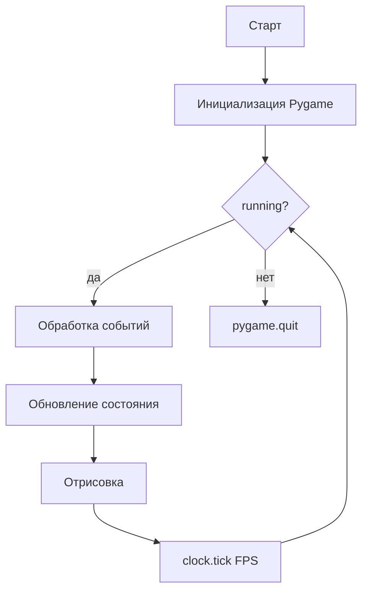
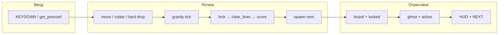
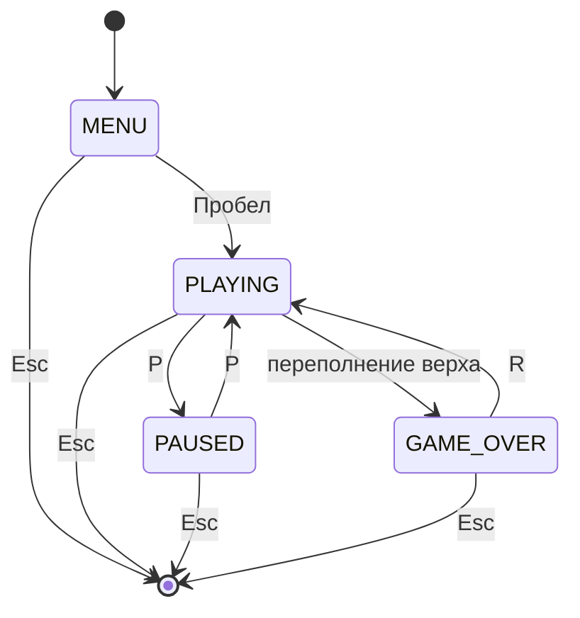
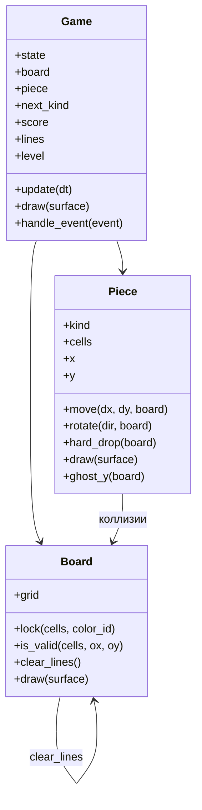

import ExternalCodeEmbed from '@site/src/components/ExternalCodeEmbed';


# Python — Tetris

<div class="article-tags">
  <span class="tag tag-beginner">ДЛЯ НОВИЧКОВ</span>
</div>

<span class="complexity-badge">Разработчику</span>
<span class="complexity-badge">Начальный уровень</span>

<div class="callout callout--info">
  <div class="callout-title">Формат практикума</div>

  <div class="callout-body">
  Материалы трека приводятся к единому формату: <strong>полные листинги для копирования</strong> на каждом этапе, блок <strong>"Разбор"</strong> и раздел <strong>"Полная ревизия"</strong> в конце статьи.
  <ul>
    <li>Гарантированно запускаемые эталоны для сверки сейчас: <a href="https://github.com/Spirzen/BattleCity">Battle City</a>, <a href="https://github.com/Spirzen/Match3">Match3</a>, <a href="./3.md#full-revision">Ping Pong</a>, <a href="./5.md#full-revision">Tetris</a>, <a href="./4.md#full-revision">Racing</a> (<code>#full-revision</code> в каждой статье).</li>
    <li>В этой статье готовая <a href="#full-revision">полная ревизия</a> (<code>#full-revision</code>) — этапы 0–18; этапы 19–20 (7-bag, hold, lock delay, DAS) остаются опциональными расширениями.</li>
  </ul>
  </div>
</div>

## Как проходить практикум

1. Создайте папку `tetris/`, виртуальное окружение и установите Pygame — раздел [Зависимости](#dependencies).
2. Идите по этапам 0–18 по порядку: после каждого шага запускайте `python main.py` и отмечайте пункты "Самопроверка".
3. Копируйте **целиком** файлы из блоков кода этапа, а не отдельные фрагменты — иначе легко потерять импорты.
4. На этапе 17 разложите код по пакету `game/`; с этапа 18 вся логика партии живёт в `game/game.py`.
5. Этапы 19–20 (7-bag, hold, lock delay, DAS) — по желанию, после рабочего прототипа.
6. После этапа 18 сверьте проект с эталоном — [Полная ревизия файлов](#full-revision): дерево, разбор и готовые листинги.

---

## О практикуме

**Tetris** (тетрис) — классическая головоломка, придуманная **Алексеем Пажитновым** в 1984 году в Москве. Из падающих фигур из четырёх клеток (**тетромино**) нужно заполнять ряды на поле шириной 10 клеток. Полная горизонтальная линия исчезает, верхние блоки опускаются, за это начисляются очки. Скорость падения растёт с уровнем; игра заканчивается, когда новая фигура не помещается у верхней границы.

Название происходит от греческого *tetra* ("четыре") и "теннис" — любимой игры автора. С 1980-х Tetris стал эталоном **простых правил и глубокого skill ceiling** — за десять минут можно понять механику, а годами оттачивать скорость, предвидение и работу с очередью фигур.

В этом практикуме соберём **полноценный прототип** на **Python 3** и **Pygame** — без спрайтов из оригинала, на цветных квадратах, зато с разбором сетки, вращения, очистки линий, очков, уровней, "призрака", **7-bag**-рандома, **hold** и экранов меню.

<div class="callout callout--info">
  <div class="callout-title">Для кого материал</div>

  <div class="callout-body">
  Нужны базовые Python (классы, списки, двумерные массивы, циклы) и знакомство с Pygame из статьи <a href="/encyclopedia/5-languages/5-02-python/312">Разработка игр на Python</a>. Каждый этап — <strong>запускаемый код</strong>: после шага проект можно запустить и увидеть новую механику.
  </div>
</div>

**Управление в финальной версии**

| Клавиша | Действие |
|---------|----------|
| `←` / `→` | Сдвиг фигуры влево / вправо |
| `↓` | Ускоренное падение (soft drop) |
| `↑` или `X` | Поворот по часовой стрелке |
| `Z` | Поворот против часовой стрелки |
| `Пробел` | Мгновенный сброс (hard drop) |
| `C` | Hold — отложить фигуру (этап 20) |
| `P` | Пауза |
| `R` | Перезапуск после game over |
| `Esc` | Выход |

**Маршрут чтения**

1. [Архитектура](#architecture) — как устроен проект до первой строки кода.
2. [Зависимости и структура папок](#dependencies) — окружение и файлы.
3. [Этап 0 — минимальный запуск](#stage-0) — чёрное окно и игровой цикл.
4. Этапы 1–18 — по одной механике за шаг.
5. [Этапы 19–20 — продвинутые улучшения](#stage-19) (7-bag, hold, lock delay, DAS).
6. [Полная ревизия файлов](#full-revision) — проверенный эталон для копирования целиком.
7. [Итоговая структура и самопроверка](#final-checklist).

**Оглавление этапов**

| Этап | Тема |
|------|------|
| [0](#stage-0) | Минимальное окно |
| [1](#stage-1) | `settings.py` |
| [2](#stage-2) | Поле и сетка |
| [3](#stage-3) | Формы тетромино |
| [4](#stage-4) | Класс `Piece` |
| [5](#stage-5) | Сетка `board` |
| [6](#stage-6) | Гравитация |
| [7](#stage-7) | Движение ← / → |
| [8](#stage-8) | Вращение |
| [9](#stage-9) | Soft drop |
| [10](#stage-10) | Фиксация |
| [11](#stage-11) | Hard drop |
| [12](#stage-12) | Очистка линий |
| [13](#stage-13) | Очки и уровни |
| [14](#stage-14) | NEXT |
| [15](#stage-15) | Ghost piece |
| [16](#stage-16) | HUD и состояния |
| [17](#stage-17) | Модули `game/` |
| [18](#stage-18) | Класс `Game` |
| [19](#stage-19) | 7-bag randomizer |
| [20](#stage-20) | Hold, lock delay, DAS |

**Что должно получиться**

| Механика | Описание |
|----------|----------|
| Поле | Сетка 10×20 клеток |
| Фигуры | 7 тетромино (I, O, T, S, Z, J, L) с цветами |
| Падение | Таймер гравитации, ускорение на `↓` |
| Вращение | Поворот с простыми wall kick-сдвигами |
| Линии | Удаление заполненных рядов, сдвиг блоков вниз |
| Очки | Классическая таблица NES + рост уровня каждые 10 линий |
| HUD | Счёт, линии, уровень, превью следующей фигуры |
| Призрак | Полупрозрачная проекция места приземления |
| Состояния | Меню, игра, пауза, game over |
| 7-bag | Честная очередь из семи фигур без длинных серий одного типа |
| Hold | Одна "запасная" фигура на обмен |

---

<span id="architecture"></span>
## Архитектура

Прежде чем писать код, зафиксируем **что из чего состоит** и **как данные текут по кадру**.

### Игровой цикл

Любая игра на Pygame крутит один и тот же цикл. В Tetris порядок шагов важен — сначала ввод и логика, потом отрисовка.



На каждом кадре внутри **обновления** выполняется цепочка:

1. Прочитать нажатые клавиши (движение, поворот, hard drop).
2. Сдвинуть активную фигуру по таймеру гравитации (или быстрее при soft drop).
3. Проверить столкновения с границами поля и зафиксированными блоками.
4. При "приземлении" — записать клетки фигуры в сетку `board`.
5. Найти и удалить полные горизонтальные линии, сдвинуть верхние ряды вниз.
6. Обновить счёт, линии и уровень; ускорить гравитацию.
7. Создать новую фигуру из очереди; при переполнении верха — game over.

### Два представления координат

Tetris живёт в **логической сетке** и **экранных пикселях**. Их нельзя смешивать в одной переменной.

| Система | Оси | Единица | Пример |
|---------|-----|---------|--------|
| **Сетка (логика)** | `col` (0…9), `row` (0…19) | клетка | фигура в `(3, 0)` |
| **Экран (Pygame)** | `x` вправо, `y` вниз | пиксель | `(120, 40)` |

Перевод:

```python
screen_x = MARGIN + col * CELL_SIZE
screen_y = MARGIN + row * CELL_SIZE
```

Pygame использует **экранные координаты**: начало `(0, 0)` — левый верхний угол.

```
Экран (пиксели)
┌──────────────────────────────────────────────────┐
│ MARGIN                                           │
│  ┌────────────────────┐  ┌──────────────────┐   │
│  │ ■ ■ □ □ □ □ □ □ □ □ │  │ NEXT:            │   │
│  │ □ □ □ □ □ □ □ □ □ □ │  │   [T-фигура]     │   │
│  │ □ □ □ □ □ □ □ □ □ □ │  │                  │   │
│  │ ... 10×20 сетка    │  │ SCORE: 1200      │   │
│  │ □ □ ■ ■ ■ ■ □ □ □ □ │  │ LINES: 7         │   │
│  │ ■ ■ ■ ■ ■ ■ ■ ■ □ □ │  │ LEVEL: 1         │   │
│  └────────────────────┘  └──────────────────┘   │
│         игровое поле            боковая панель    │
└──────────────────────────────────────────────────┘
```

### Модель данных — сетка `board`

Поле храним как **двумерный список** `board[row][col]`:

- `0` — пустая клетка;
- `1…7` — индекс цвета зафиксированного блока (по типу тетромино).

Активная (падающая) фигура **не** записывается в `board`, пока не "застынет". Её рисуем отдельно поверх сетки.

### Тетромино

Семь классических фигур — **I, O, T, S, Z, J, L**. Каждая занимает до четырёх клеток.

Удобное представление — **список смещений** `(dx, dy)` относительно "якорной" точки фигуры `(piece.x, piece.y)`:

```python
# Фигура T в «нулевом» повороте (вид сверху)
T_SHAPE = [(0, 0), (-1, 0), (1, 0), (0, 1)]
#        центр    влево       вправо      вниз
```

Поворот на 90° по часовой стрелке для каждой клетки:

```python
def rotate_cw(cells):
    return [(-dy, dx) for dx, dy in cells]
```

Фигура **O** (квадрат 2×2) при повороте совпадает сама с собой — это нормально.

**Справочник семи фигур** (вид сверху, "нулевой" поворот):

```
  I (cyan)          O (yellow)        T (purple)
  · ■ · ·           ■ ■               · ■ ·
  ■ ■ ■ ■           ■ ■               ■ ■ ■

  S (green)         Z (red)           J (blue)          L (orange)
    ■ ■               ■ ·             ■ · ·             · · ■
  ■ · ·             ■ ■               ■ ■ ■             ■ ■ ■
```

| Фигура | Клеток | Особенность при вращении |
|--------|--------|--------------------------|
| **I** | 4 | Единственная "палка"; нужны wall kick ±2 у стены |
| **O** | 4 | Не меняет форму — поворот можно пропустить |
| **T** | 4 | Центр вращения — "головка" буквы T |
| **S**, **Z** | 4 | Зеркальные парами; часто путают новички |
| **J**, **L** | 4 | Уголок влево / вправо |

### Точка спавна

Новая фигура появляется **над видимым полем**, якорь в `(SPAWN_COL, SPAWN_ROW)`. Для ширины 10 стандартный столбец — **4** или **5** (центр). Фигура **I** в горизонтали шире остальных — при спавне проверяйте `can_place`, иначе I иногда "вылезает" за правую стену.

```python
SPAWN_COL = 4
SPAWN_ROW = 0   # верхний ряд; часть клеток может быть с row < 0 в Guideline — у нас упрощённо 0
```

<div class="callout callout--tip">
  <div class="callout-title">SRS и wall kick</div>

  <div class="callout-body">
  В оригинальных Guideline Tetris используется система <strong>SRS</strong> с таблицами сдвигов при вращении у стены. Для учебного проекта достаточно <strong>упрощённых wall kick</strong> — если поворот невозможен, пробуем сдвинуть фигуру на (−1, 0), (+1, 0), (0, −1) клетку.
  </div>
</div>

### Слои приложения

| Слой | Ответственность | Примеры сущностей |
|------|-----------------|-------------------|
| **Ввод** | Клавиши, пауза, перезапуск | `KEYDOWN`, `get_pressed()` |
| **Мир** | Размеры сетки, таймеры, очередь фигур | `Board`, `COLS`, `ROWS` |
| **Акторы** | Падающая фигура, следующая фигура | `Piece`, `next_kind` |
| **Правила** | Гравитация, фиксация, линии, очки, уровень | `Game`, `clear_lines()` |
| **Представление** | Сетка, фигуры, HUD, оверлеи | `draw_board`, `draw_hud` |

Слой **правил** не рисует напрямую — он меняет состояние; слой **представления** только читает состояние и выводит кадр.

### Поток одного кадра (PLAYING)



Порядок в коде — **сначала** `handle_event`, **затем** `update` (гравитация и lock), **в конце** `draw`. Призрак рисуем **до** активной фигуры, чтобы она была поверх.

### Алгоритм коллизий

Функция `can_place(board, cells, ax, ay)` — сердце физики Tetris. Для каждой клетки фигуры `(dx, dy)`:

1. Вычислить абсолютные координаты `col = ax + dx`, `row = ay + dy`.
2. Если `col < 0` или `col >= COLS` — **стена**, место занято.
3. Если `row >= ROWS` — **пол**, место занято.
4. Если `row >= 0` и `board[row][col] != 0` — **столкновение** с застывшим блоком.
5. Если `row < 0` — клетка "над потолком" видимой зоны; для учебного прототипа это допустимо (фигура ещё не полностью вошла на экран).

```python
def can_place(board, cells, ax, ay):
    for dx, dy in cells:
        col, row = ax + dx, ay + dy
        if col < 0 or col >= COLS or row >= ROWS:
            return False
        if row >= 0 and board[row][col]:
            return False
    return True
```

Все движения (`try_move`, `try_rotate`, `hard_drop`, `ghost_row`) сводятся к вызовам `can_place` с разными `(ax, ay)` или наборами `cells`.

### Конечный автомат состояний



### Рекомендуемые константы

| Константа | Значение | Смысл |
|-----------|----------|-------|
| `COLS` | `10` | Ширина поля в клетках |
| `ROWS` | `20` | Высота видимого поля |
| `CELL_SIZE` | `30` | Размер клетки в пикселях |
| `SIDEBAR_W` | `160` | Ширина панели справа |
| `MARGIN` | `24` | Отступ от края окна |
| `FPS` | `60` | Кадров в секунду |
| `LINES_PER_LEVEL` | `10` | Линий до следующего уровня |

Скорость падения (интервал между автоматическими шагами вниз, в секундах) уменьшается с уровнем:

```python
def gravity_interval(level):
    # level 0 → ~0.8 с, level 9 → ~0.1 с (упрощённая таблица)
    return max(0.05, 0.8 - level * 0.07)
```

### Таблица очков (стиль NES)

| Линий за раз | Базовые очки | С множителем уровня |
|--------------|--------------|---------------------|
| 1 (Single) | 40 | `40 × (level + 1)` |
| 2 (Double) | 100 | `100 × (level + 1)` |
| 3 (Triple) | 300 | `300 × (level + 1)` |
| 4 (Tetris) | 1200 | `1200 × (level + 1)` |

Дополнительно за каждую клетку soft drop — 1 очко, за hard drop — 2 очка за клетку.

### Структура файлов (целевая)

К **этапу 6** достаточно одного `main.py`. Дальше проект **раскладываем по модулям**.

```
tetris/
├── main.py              # точка входа, цикл while
├── settings.py          # константы, цвета, FPS
├── game/
│   ├── __init__.py
│   ├── tetrominoes.py   # формы, цвета, rotate_cw / rotate_ccw
│   ├── board.py         # сетка, фиксация, очистка линий
│   ├── piece.py         # Piece — активная фигура
│   ├── hud.py           # счёт, next, оверлеи
│   └── game.py          # класс Game — правила партии
└── requirements.txt
```

### Диаграмма объектов



---

<span id="dependencies"></span>
## Зависимости и подготовка окружения

### Требования

- **Python 3.10+** (удобны `match`/`case`; на 3.9 код работает, если заменить `match` на `if/elif`).
- **Pygame 2.5+** — единственная внешняя библиотека.

### Установка

```bash
mkdir tetris && cd tetris
python -m venv .venv
```

Активация виртуального окружения:

- **Windows (PowerShell):** `.venv\Scripts\Activate.ps1`
- **Linux / macOS:** `source .venv/bin/activate`

```bash
pip install pygame
python -c "import pygame; print('Pygame', pygame.ver)"
```

Файл `requirements.txt`:

```
pygame>=2.5.0
```

### Первичная структура

На **этапе 0** создайте только `main.py`. Папку `game/` добавим на этапе 14.

<div class="callout callout--warning">
  <div class="callout-title">Delta time</div>

  <div class="callout-body">
  На всех этапах таймеры считаем через <code>dt = clock.tick(FPS) / 1000.0</code> — секунды с прошлого кадра. Так интервал гравитации остаётся предсказуемым при просадках FPS.
  </div>
</div>

<div class="callout callout--tip">
  <div class="callout-title">Как проходить практикум</div>

  <div class="callout-body">
  Создайте папку <code>tetris/</code>, копируйте код <strong>после каждого этапа</strong>, запускайте <code>python main.py</code>. Если что-то сломалось — сверьтесь с блоком "Самопроверка" в конце этапа.
  </div>
</div>

---

<span id="stage-0"></span>
## Этап 0 — минимальный запускаемый код

**Цель** — окно, цикл событий, выход по крестику и `Esc`, стабильные 60 FPS.

Создайте `main.py`:


<ExternalCodeEmbed example="python/sp-9-9-04-razrabotka-igr-praktikum-razrabotki-igr-5-001" title="Этап 0 — минимальный запускаемый код" minHeight={534} />


**Разбор.** `pygame.init()` поднимает подсистемы Pygame; цикл `while running` на каждом кадре читает события (`QUIT`, `Esc`), заливает фон и вызывает `display.flip()`. `clock.tick(FPS)` ограничивает частоту кадров и возвращает `dt` в секундах — на следующих этапах через него считают таймеры гравитации.

Запуск:

```bash
python main.py
```

**Самопроверка этапа 0**

- [ ] Окно открывается без traceback.
- [ ] Фон тёмный, без мерцания.
- [ ] `Esc` и крестик закрывают программу.

На следующих этапах **не удаляем** цикл — только расширяем тело `while`.

---

<span id="stage-1"></span>
## Этап 1 — константы и файл настроек

**Цель** — вынести все числа и цвета в `settings.py`.

`settings.py`:


<ExternalCodeEmbed example="python/sp-9-9-04-razrabotka-igr-praktikum-razrabotki-igr-5-002" title="Этап 1 — константы и файл настроек" minHeight={720} />


Обновите `main.py`:


<ExternalCodeEmbed example="python/sp-9-9-04-razrabotka-igr-praktikum-razrabotki-igr-5-003" title="Этап 1 — константы и файл настроек" minHeight={480} />


**Самопроверка**

- [ ] Импорт `settings as S` работает без ошибок.
- [ ] Окно шире, чем на этапе 0 (есть место под боковую панель).

---

<span id="stage-2"></span>
## Этап 2 — отрисовка игрового поля

**Цель** — нарисовать прямоугольник поля и сетку 10×20.

Добавьте в `main.py`:


<ExternalCodeEmbed example="python/sp-9-9-04-razrabotka-igr-praktikum-razrabotki-igr-5-004" title="Этап 2 — отрисовка игрового поля" minHeight={678} />


В цикле перед `flip()`:

```python
    screen.fill(S.COLOR_BG)
    draw_board(screen)
    draw_sidebar(screen)
    pygame.display.flip()
```

**Самопроверка**

- [ ] Слева — сетка 10×20 с тонкими линиями.
- [ ] Справа — тёмная панель под HUD.
- [ ] Поле не выходит за границы окна.

---

<span id="stage-3"></span>
## Этап 3 — формы тетромино

**Цель** — описать 7 фигур как словари смещений и функции поворота.

Создайте `tetrominoes.py` (позже перенесём в `game/tetrominoes.py`):


<ExternalCodeEmbed example="python/sp-9-9-04-razrabotka-igr-praktikum-razrabotki-igr-5-005" title="Этап 3 — формы тетромино" minHeight={606} />


В `main.py` добавьте отладочную отрисовку одной фигуры **T** в центре поля:

```python

import tetrominoes as T


def draw_cells(surface, cells, anchor_x, anchor_y, color):
    ox, oy = board_origin()
    for dx, dy in cells:
        col = anchor_x + dx
        row = anchor_y + dy
        px = ox + col * S.CELL_SIZE
        py = oy + row * S.CELL_SIZE
        rect = pygame.Rect(px + 1, py + 1, S.CELL_SIZE - 2, S.CELL_SIZE - 2)
        pygame.draw.rect(surface, color, rect, border_radius=3)
```

После `draw_board(screen)`:

```python
    draw_cells(screen, T.SHAPES["T"], 4, 2, T.color_for_kind("T"))
```

**Самопроверка**

- [ ] В верхней части поля видна фиолетовая T-фигура из 4 клеток.
- [ ] Клетки чуть меньше ячейки сетки (отступ 1 px).
- [ ] (Опционально) цикл по `T.SHAPES.keys()` рисует все 7 фигур в ряд для проверки цветов.

<div class="callout callout--note">
  <div class="callout-title">Проверка всех фигур</div>

  <div class="callout-body">
  Для отладки временно добавьте цикл: <code>for i, kind in enumerate(T.SHAPES): draw_cells(..., kind, i * 2, 2, T.color_for_kind(kind))</code> — в верхней части поля появится "радуга" из семи тетромино.
  </div>
</div>

---

<span id="stage-4"></span>
## Этап 4 — класс `Piece`

**Цель** — инкапсулировать активную фигуру — тип, позиция, клетки, отрисовка.

Добавьте в `main.py` (позже вынесем в `game/piece.py`):


<ExternalCodeEmbed example="python/sp-9-9-04-razrabotka-igr-praktikum-razrabotki-igr-5-006" title="Этап 4 — класс `Piece`" minHeight={318} />


Замените отладочный вызов `draw_cells(..., "T", ...)` на:

```python
active = Piece("T", 4, 2)
# ...
    active.draw(screen)
```

**Самопроверка**

- [ ] T-фигура по-прежнему на месте.
- [ ] Смена `Piece("I", 3, 1)` в коде показывает cyan-палку из четырёх клеток.

---

<span id="stage-5"></span>
## Этап 5 — пустая сетка `board` и отрисовка блоков

**Цель** — двумерный массив поля и функция рисования зафиксированных блоков.


<ExternalCodeEmbed example="python/sp-9-9-04-razrabotka-igr-praktikum-razrabotki-igr-5-007" title="Этап 5 — пустая сетка `board` и отрисовка блоков" minHeight={318} />


Перед циклом:

```python
board = new_board()
# «застывшие» блоки для проверки отрисовки
board[18][3] = 6  # J — синий
board[18][4] = 6
board[19][3] = 6
board[19][4] = 6
board[19][5] = 7  # L — оранжевый
active = Piece("T", 4, 2)
```

В цикле:

```python
    draw_locked_blocks(screen, board)
    active.draw(screen)
```

**Самопроверка**

- [ ] Внизу поля видны синие и оранжевые блоки.
- [ ] Падающая T-фигура рисуется поверх сетки.

---

<span id="stage-6"></span>
## Этап 6 — гравитация (автоматическое падение)

**Цель** — фигура сама опускается вниз через фиксированный интервал.

```python
GRAVITY_INTERVAL = 0.8  # секунд между шагами (пока без уровней)
```

Добавьте проверку "можно ли сдвинуть вниз" (пока без board — только границы):

```python
def can_place(board, cells, ax, ay):
    for col, row in [(ax + dx, ay + dy) for dx, dy in cells]:
        if col < 0 or col >= S.COLS or row >= S.ROWS:
            return False
        if row >= 0 and board[row][col]:
            return False
    return True
```

В `Piece`:

```python
    def try_move(self, board, dx, dy):
        if can_place(board, self.cells, self.x + dx, self.y + dy):
            self.x += dx
            self.y += dy
            return True
        return False
```

Перед циклом:

```python
gravity_timer = 0.0
board = new_board()
active = Piece("T", 4, 0)
```

В `update`-части цикла (перед отрисовкой):

```python
    gravity_timer += dt
    if gravity_timer >= GRAVITY_INTERVAL:
        gravity_timer = 0.0
        if not active.try_move(board, 0, 1):
            pass  # на этапе 10 здесь будет фиксация
```

**Самопроверка**

- [ ] T-фигура падает примерно раз в 0.8 с.
- [ ] На дне поля фигура останавливается (не выходит за `ROWS`).

---

<span id="stage-7"></span>
## Этап 7 — управление влево и вправо

**Цель** — клавиши `←` / `→` сдвигают фигуру, если нет столкновения.

Обработка в цикле (в блоке `for event`):

```python
        elif event.type == pygame.KEYDOWN:
            if event.key == pygame.K_LEFT:
                active.try_move(board, -1, 0)
            elif event.key == pygame.K_RIGHT:
                active.try_move(board, 1, 0)
```

<div class="callout callout--tip">
  <div class="callout-title">DAS (Delayed Auto Shift)</div>

  <div class="callout-body">
  В коммерческом Tetris при удержании стрелки фигура сначала сдвигается один раз, затем — с задержкой быстро повторяет шаг. Для прототипа достаточно по одному шагу на нажатие; **DAS** реализуем на <a href="#stage-20">этапе 20</a>.
  </div>
</div>

**Самопроверка**

- [ ] `←` / `→` двигают фигуру по клеткам.
- [ ] У стен и застылого "пола" фигура не проходит сквозь блоки.

---

<span id="stage-8"></span>
## Этап 8 — вращение

**Цель** — поворот по `↑` / `X` (CW) и `Z` (CCW) с упрощёнными wall kick.

В `Piece`:


<ExternalCodeEmbed example="python/sp-9-9-04-razrabotka-igr-praktikum-razrabotki-igr-5-008" title="Этап 8 — вращение" minHeight={336} />


В обработке `KEYDOWN`:

```python
            elif event.key in (pygame.K_UP, pygame.K_x):
                active.try_rotate(board, direction=1)
            elif event.key == pygame.K_z:
                active.try_rotate(board, direction=-1)
```

**Самопроверка**

- [ ] `↑` вращает фигуру у дна и у стен.
- [ ] У левой стены I-палка после поворота сдвигается и не застревает в стене (wall kick).
- [ ] O-фигура не "дёргается" при нажатии поворота.

---

<span id="stage-9"></span>
## Этап 9 — soft drop и подсчёт очков за падение

**Цель** — удержание `↓` ускоряет падение; за каждый шаг вниз — бонусные очки.

Перед циклом:

```python
score = 0
```

В `Piece.try_move` можно добавить необязательный callback; проще обработать в цикле:


<ExternalCodeEmbed example="python/sp-9-9-04-razrabotka-igr-praktikum-razrabotki-igr-5-009" title="Этап 9 — soft drop и подсчёт очков за падение" minHeight={318} />


<div class="callout callout--note">
  <div class="callout-title">Порядок веток</div>

  <div class="callout-body">
  На этом этапе логику soft drop и обычной гравитации держите в одном месте цикла, чтобы не вызывать двойной шаг вниз за кадр.
  </div>
</div>

Временно выведите счёт в угол:

```python
    font = pygame.font.SysFont("consolas", 20)
    label = font.render(f"Score: {score}", True, S.COLOR_TEXT)
    screen.blit(label, (S.MARGIN + S.BOARD_W + 20, S.MARGIN + 20))
```

**Самопроверка**

- [ ] `↓` заметно ускоряет падение.
- [ ] Счёт растёт при удержании `↓`.

---

<span id="stage-10"></span>
## Этап 10 — фиксация фигуры на поле

**Цель** — когда вниз сдвинуть нельзя, записать клетки в `board` и выдать следующую фигуру.

```python
def lock_piece(board, piece):
    for col, row in piece.world_cells():
        if 0 <= row < S.ROWS and 0 <= col < S.COLS:
            board[row][col] = piece.color_id
```

Функция спавна:

```python

import random

def spawn_piece(kind=None):
    kind = kind or random.choice(list(T.SHAPES.keys()))
    return Piece(kind, S.SPAWN_COL, S.SPAWN_ROW)
```

**Единая функция гравитации** — собирает soft drop, обычное падение и фиксацию (заменяет разрозненные фрагменты этапов 6, 9 и 10):


<ExternalCodeEmbed example="python/sp-9-9-04-razrabotka-igr-praktikum-razrabotki-igr-5-010" title="Этап 10 — фиксация фигуры на поле" minHeight={462} />


В игровом цикле:

```python
score_box = [score]
active, gravity_timer, locked = tick_gravity(
    board, active, gravity_timer, dt, level, score_box,
)
score = score_box[0]

if locked:
    lines_cleared = clear_lines(board)  # очки — этап 13
    active = spawn_piece()
    if not can_place(board, active.cells, active.x, active.y):
        running = False  # этап 16 → GAME_OVER
```

<div class="callout callout--warning">
  <div class="callout-title">Lock delay</div>

  <div class="callout-body">
  В Guideline Tetris есть задержка перед фиксацией (lock delay), чтобы игрок успел сдвинуть фигуру в последний момент. До этапа 20 фиксируем сразу; там добавим таймер <code>LOCK_DELAY</code>.
  </div>
</div>

**Самопроверка**

- [ ] После приземления T-фигура остаётся на поле цветными блоками.
- [ ] Сразу появляется новая случайная фигура сверху.
- [ ] Можно сложить несколько рядов блоков.

---

<span id="stage-11"></span>
## Этап 11 — hard drop (Пробел)

**Цель** — мгновенно опустить фигуру до упора, начислить очки, зафиксировать.

В `Piece`:

```python
    def hard_drop(self, board):
        dropped = 0
        while self.try_move(board, 0, 1):
            dropped += 1
        return dropped
```

В `KEYDOWN`:

```python
            elif event.key == pygame.K_SPACE:
                steps = active.hard_drop(board)
                score += steps * S.HARD_DROP_BONUS
                lock_piece(board, active)
                active = spawn_piece()
```

Уберите двойную фиксацию — после hard drop **не** ждите следующего тика гравитации. Вынесите общую логику:

```python
def after_lock(board, active, score, lines_total, level):
    """Фиксация уже выполнена — очистка, очки, новый спавн."""
    cleared = clear_lines(board)
    if cleared:
        lines_total += cleared
        score += LINE_SCORES.get(cleared, 0) * (level + 1)
        level = lines_total // S.LINES_PER_LEVEL
    active = spawn_piece(next_kind)
    next_kind = random_kind()
    gravity_timer = 0.0
    return active, next_kind, score, lines_total, level
```

Вызывайте `after_lock` и из hard drop, и из `tick_gravity` при `locked=True`.

**Самопроверка**

- [ ] `Пробел` сбрасывает фигуру на дно или на другие блоки.
- [ ] Счёт прыгает пропорционально высоте сброса.

---

<span id="stage-12"></span>
## Этап 12 — очистка заполненных линий

**Цель** — удалить полные ряды, сдвинуть верхние блоки вниз.

```python
def clear_lines(board):
    """Возвращает количество удалённых линий."""
    cleared = 0
    row = S.ROWS - 1
    while row >= 0:
        if all(board[row][col] for col in range(S.COLS)):
            del board[row]
            board.insert(0, [0] * S.COLS)
            cleared += 1
        else:
            row -= 1
    return cleared
```

После `lock_piece` (и в ветке hard drop):

```python
lines_cleared = clear_lines(board)
```

Для проверки можно временно заспавнить почти полный ряд.

**Самопроверка**

- [ ] Заполненный ряд исчезает.
- [ ] Блоки выше опускаются на одну клетку.
- [ ] Два полных ряда за один lock удаляются оба.

---

<span id="stage-13"></span>
## Этап 13 — очки, линии и уровни

**Цель** — таблица NES, рост уровня, ускорение гравитации.

```python
LINE_SCORES = {1: 40, 2: 100, 3: 300, 4: 1200}


def gravity_interval(level):
    return max(0.05, 0.8 - level * 0.07)
```

**Таблица скоростей (упрощённая модель NES)**

| Уровень | Интервал падения, с | Комментарий |
|---------|---------------------|-------------|
| 0 | 0.80 | Медленный старт для обучения |
| 1 | 0.73 | После 10 линий |
| 5 | 0.45 | Заметное ускорение |
| 9 | 0.17 | Высокий темп |
| 15+ | 0.05 | Потолок — дальше не ускоряем |

<div class="callout callout--info">
  <div class="callout-title">Guideline vs NES</div>

  <div class="callout-body">
  Современный Tetris Guideline использует дискретную таблицу из ~20 уровней скорости (до 1G — одна клетка за кадр). Линейная формула <code>0.8 - level * 0.07</code> проще для учебного кода; при желании замените на массив <code>GRAVITY_TABLE = [0.8, 0.7, ...]</code>.
  </div>
</div>

Перед циклом:

```python
score = 0
lines_total = 0
level = 0
```

После `clear_lines`:

```python
if lines_cleared:
    lines_total += lines_cleared
    score += LINE_SCORES.get(lines_cleared, 0) * (level + 1)
    level = lines_total // S.LINES_PER_LEVEL
```

В гравитации замените `GRAVITY_INTERVAL` на:

```python
        interval = gravity_interval(level)
        if not soft_drop and gravity_timer >= interval:
            ...
```

**Самопроверка**

- [ ] За одну линию на уровне 0 начисляется 40 очков.
- [ ] После 10 линий уровень становится 1, падение ускоряется.
- [ ] Tetris (4 линии) даёт заметный скачок счёта.

---

<span id="stage-14"></span>
## Этап 14 — очередь "следующая фигура"

**Цель** — игрок видит, что придёт после текущей; спавн из очереди 7-bag (упрощённо — random).

```python
def random_kind():
    return random.choice(list(T.SHAPES.keys()))
```

Перед циклом:

```python
next_kind = random_kind()
active = spawn_piece(next_kind)
next_kind = random_kind()
```

После lock / hard drop:

```python
active = spawn_piece(next_kind)
next_kind = random_kind()
```

Отрисовка превью на боковой панели:


<ExternalCodeEmbed example="python/sp-9-9-04-razrabotka-igr-praktikum-razrabotki-igr-5-011" title='Этап 14 — очередь "следующая фигура"' minHeight={390} />


Удобнее отдельная функция с фиксированным origin панели:


<ExternalCodeEmbed example="python/sp-9-9-04-razrabotka-igr-praktikum-razrabotki-igr-5-012" title='Этап 14 — очередь "следующая фигура"' minHeight={318} />


**Самопроверка**

- [ ] Справа отображается следующая фигура.
- [ ] После lock текущая совпадает с тем, что было в NEXT.

---

<span id="stage-15"></span>
## Этап 15 — призрак (ghost piece)

**Цель** — полупрозрачная проекция, куда упадёт фигура при текущем положении.

В `Piece`:

```python
    def ghost_row(self, board):
        ghost_y = self.y
        while can_place(board, self.cells, self.x, ghost_y + 1):
            ghost_y += 1
        return ghost_y
```

Отрисовка призрака **до** активной фигуры:

```python
def draw_ghost(surface, piece, board):
    gy = piece.ghost_row(board)
    ghost_cells = piece.cells
    color = S.COLOR_GHOST
    draw_cells(surface, ghost_cells, piece.x, gy, color)
```

В цикле:

```python
    draw_ghost(screen, active, board)
    active.draw(screen)
```

**Самопроверка**

- [ ] Серый контур фигуры виден у "дна" траектории.
- [ ] При движении влево/вправо призрак следует за фигурой.

---

<span id="stage-16"></span>
## Этап 16 — HUD и экраны состояний

**Цель** — меню, пауза, game over; счёт, линии, уровень на панели.

```python
STATE_MENU = "MENU"
STATE_PLAYING = "PLAYING"
STATE_PAUSED = "PAUSED"
STATE_GAME_OVER = "GAME_OVER"

state = STATE_MENU
```

Функции HUD:


<ExternalCodeEmbed example="python/sp-9-9-04-razrabotka-igr-praktikum-razrabotki-igr-5-013" title="Этап 16 — HUD и экраны состояний" minHeight={426} />


Обработка событий:


<ExternalCodeEmbed example="python/sp-9-9-04-razrabotka-igr-praktikum-razrabotki-igr-5-014" title="Этап 16 — HUD и экраны состояний" minHeight={372} />


При невозможности спавна:

```python
        if not can_place(board, active.cells, active.x, active.y):
            state = STATE_GAME_OVER
```

Обновление и отрисовка только при `STATE_PLAYING`; в конце `draw`:

```python
    if state == STATE_MENU:
        draw_overlay(screen, "TETRIS", "Пробел — начать")
    elif state == STATE_PAUSED:
        draw_overlay(screen, "ПАУЗА", "P — продолжить")
    elif state == STATE_GAME_OVER:
        draw_overlay(screen, "GAME OVER", "R — в меню")
```

**Самопроверка**

- [ ] Старт с экрана "Пробел — начать".
- [ ] `P` ставит паузу с затемнением.
- [ ] При переполнении верха — game over, `R` возвращает в меню.

---

<span id="stage-17"></span>
## Этап 17 — модули `game/`

**Цель** — разнести код по файлам, как в [архитектуре](#architecture).

Создайте структуру и **полные файлы** ниже. Корневой `tetrominoes.py` удалите — всё переезжает в пакет `game/`.

```
tetris/
├── main.py
├── settings.py
├── game/
│   ├── __init__.py      # пустой
│   ├── tetrominoes.py
│   ├── board.py
│   ├── piece.py
│   └── hud.py
```

`game/tetrominoes.py`:


<ExternalCodeEmbed example="python/sp-9-9-04-razrabotka-igr-praktikum-razrabotki-igr-5-015" title="Этап 17 — модули `game/`" minHeight={720} />


`game/board.py`:


<ExternalCodeEmbed example="python/sp-9-9-04-razrabotka-igr-praktikum-razrabotki-igr-5-016" title="Этап 17 — модули `game/`" minHeight={720} />


`game/piece.py`:


<ExternalCodeEmbed example="python/sp-9-9-04-razrabotka-igr-praktikum-razrabotki-igr-5-017" title="Этап 17 — модули `game/`" minHeight={720} />


`game/hud.py`:


<ExternalCodeEmbed example="python/sp-9-9-04-razrabotka-igr-praktikum-razrabotki-igr-5-018" title="Этап 17 — модули `game/`" minHeight={720} />


<div class="callout callout--info">
  <div class="callout-title">Импорты без циклов</div>

  <div class="callout-body">
  <code>board.py</code> не импортирует <code>Piece</code>. <code>piece.py</code> тянет только <code>can_place</code> из board. Отрисовка клетки в <code>Piece.draw</code> через локальный импорт <code>draw_cell</code> — допустимый приём против циклического импорта.
  </div>
</div>

**Самопроверка**

- [ ] `python main.py` из корня `tetris/` работает как на этапе 16.
- [ ] Нет циклических импортов (`board` не импортирует `piece`, если `piece` импортирует `board` — только функции).

---

<span id="stage-18"></span>
## Этап 18 — класс `Game` и чистый `main.py`

**Цель** — собрать правила в один класс; в `main.py` остаётся только цикл.

`game/game.py`:


<ExternalCodeEmbed example="python/sp-9-9-04-razrabotka-igr-praktikum-razrabotki-igr-5-019" title="Этап 18 — класс `Game` и чистый `main.py`" minHeight={720} />


Финальный `main.py`:


<ExternalCodeEmbed example="python/sp-9-9-04-razrabotka-igr-praktikum-razrabotki-igr-5-020" title="Этап 18 — класс `Game` и чистый `main.py`" minHeight={606} />


**Самопроверка этапа 18**

- [ ] Весь игровой процесс работает как на этапе 16–17.
- [ ] `main.py` короче 40 строк.
- [ ] Можно добавить второй режим (например, `Game(seed=42)` для фиксированной последовательности) без переписывания цикла.

---

<span id="stage-19"></span>
## Этап 19 — 7-bag randomizer

**Цель** — заменить `random.choice` на **мешок из семи фигур** (стандарт Guideline) — каждые 7 спавнов игрок гарантированно получает по одному экземпляру I, O, T, S, Z, J, L в случайном порядке. Это убирает "полоску" из пяти Z подряд и делает игру честнее.

Добавьте в `game/tetrominoes.py` (после `ALL_KINDS`):


<ExternalCodeEmbed example="python/sp-9-9-04-razrabotka-igr-praktikum-razrabotki-igr-5-021" title="Этап 19 — 7-bag randomizer" minHeight={516} />


В `Game.__init__` и `reset_play`:

```python
from game.tetrominoes import SevenBag

self.bag = SevenBag()
self.next_kind = self.bag.pop()
self.active = spawn_piece(self.next_kind)
self.next_kind = self.bag.peek()
```

В `_spawn_after_lock`:

```python
self.active = spawn_piece(self.next_kind)
self.bag.pop()  # сняли текущую «next» из очереди
self.next_kind = self.bag.peek()
```

<div class="callout callout--tip">
  <div class="callout-title">Предсказуемость для обучения</div>

  <div class="callout-body">
  <code>SevenBag(seed=42)</code> даёт воспроизводимую последовательность — удобно отлаживать вращения и тестировать очистку линий.
  </div>
</div>

**Самопроверка**

- [ ] За 7 последовательных фигур встречаются все 7 типов (в любом порядке).
- [ ] NEXT совпадает с реальным следующим спавном.
- [ ] С `seed=0` последовательность одинакова при каждом перезапуске.

---

<span id="stage-20"></span>
## Этап 20 — hold, lock delay и DAS

**Цель** — три улучшения "как в современном Tetris": запасная фигура, пауза перед фиксацией и автоповтор сдвига при удержании стрелки.

### Hold (клавиша `C`)

```python
# В Game.__init__
self.hold_kind = None
self.hold_used = False
```


<ExternalCodeEmbed example="python/sp-9-9-04-razrabotka-igr-praktikum-razrabotki-igr-5-022" title="Hold (клавиша `C`)" minHeight={336} />


В `handle_event` при `K_c` вызовите `_do_hold()`. После каждого lock / spawn сбрасывайте `self.hold_used = False`.

Отрисовка hold в `hud.py` — по аналогии с `draw_next_preview`, блок "HOLD" над NEXT.

### Lock delay

Когда фигура **не может** сдвинуться вниз, не фиксируйте сразу — запустите таймер:


<ExternalCodeEmbed example="python/sp-9-9-04-razrabotka-igr-praktikum-razrabotki-igr-5-023" title="Lock delay" minHeight={372} />


Любой успешный `try_move` или `try_rotate` сбрасывает `on_ground` и `lock_timer` — **move reset**, игрок получает ещё `LOCK_DELAY` секунд.

### DAS (Delayed Auto Shift)


<ExternalCodeEmbed example="python/sp-9-9-04-razrabotka-igr-praktikum-razrabotki-igr-5-024" title="DAS (Delayed Auto Shift)" minHeight={588} />


Вызывайте `_update_das(dt)` в `update` **до** гравитации. Обработку `K_LEFT` / `K_RIGHT` в `handle_event` можно убрать — DAS заменяет одиночные нажатия.

**Самопроверка этапа 20**

- [ ] `C` меняет текущую фигуру на hold (один раз за spawn).
- [ ] У дна есть ~0.5 с на последний сдвиг/поворот перед фиксацией.
- [ ] Удержание `←` через 0.15 с начинает быстро повторять шаг.

---

<span id="full-revision"></span>
## Полная ревизия файлов

Код проверен командой `python -c "from game.game import Game"`. Скопируйте **все** файлы в папку `tetris/` и запустите `python main.py`. Раздел охватывает этапы 0–18 — меню, пауза, ghost, NEXT, очки и уровни. Этапы 19–20 (7-bag, hold, lock delay, DAS) — опциональные расширения поверх этого эталона.

```
tetris/
├── main.py
├── settings.py
├── requirements.txt
└── game/
    ├── __init__.py (empty)
    ├── tetrominoes.py
    ├── board.py
    ├── piece.py
    ├── hud.py
    └── game.py
```

### `requirements.txt`

**Разбор.** Единственная внешняя зависимость — Pygame 2.5+.

```
pygame>=2.5.0
```

### `settings.py`

**Разбор.** Все размеры сетки и окна, бонусы за падение, цвета тетромино и HUD — в одном модуле; остальные файлы импортируют `settings as S`.


<ExternalCodeEmbed example="python/sp-9-9-04-razrabotka-igr-praktikum-razrabotki-igr-5-025" title="`settings.py`" minHeight={720} />


### `main.py`

**Разбор.** Только инициализация Pygame, игровой цикл и вызовы `Game.handle_event`, `update` и `draw` — без правил Tetris.


<ExternalCodeEmbed example="python/sp-9-9-04-razrabotka-igr-praktikum-razrabotki-igr-5-026" title="`main.py`" minHeight={642} />


### `game/__init__.py`

**Разбор.** Пустой файл — помечает `game/` как Python-пакет; импорты вида `from game.board import …` работают из корня `tetris/`.

### `game/tetrominoes.py`

**Разбор.** Словари форм и цветов семи тетромино, функции поворота и таблица очков за линии; `gravity_interval` задаёт скорость падения по уровню.


<ExternalCodeEmbed example="python/sp-9-9-04-razrabotka-igr-praktikum-razrabotki-igr-5-027" title="`game/tetrominoes.py`" minHeight={720} />


### `game/board.py`

**Разбор.** Сетка поля, коллизии `can_place`, фиксация и очистка линий, отрисовка поля, застывших блоков и призрака.


<ExternalCodeEmbed example="python/sp-9-9-04-razrabotka-igr-praktikum-razrabotki-igr-5-028" title="`game/board.py`" minHeight={720} />


### `game/piece.py`

**Разбор.** Класс `Piece` — активная фигура — движение, поворот с wall kick, hard drop и расчёт строки призрака; `spawn_piece` создаёт фигуру в точке спавна.


<ExternalCodeEmbed example="python/sp-9-9-04-razrabotka-igr-praktikum-razrabotki-igr-5-029" title="`game/piece.py`" minHeight={720} />


### `game/hud.py`

**Разбор.** Боковая панель, превью NEXT, счёт/линии/уровень и полупрозрачные оверлеи меню, паузы и game over.


<ExternalCodeEmbed example="python/sp-9-9-04-razrabotka-igr-praktikum-razrabotki-igr-5-030" title="`game/hud.py`" minHeight={720} />


### `game/game.py`

**Разбор.** Класс `Game` — конечный автомат состояний, гравитация и soft drop, обработка ввода, начисление очков и сборка кадра из модулей `board`, `piece` и `hud`.


<ExternalCodeEmbed example="python/sp-9-9-04-razrabotka-igr-praktikum-razrabotki-igr-5-031" title="`game/game.py`" minHeight={720} />


### Разбор финальной архитектуры

- **`board` и `piece` разделены** — сетка и коллизии в `board.py`, активная фигура и её движение в `piece.py`; `board` не импортирует `Piece`.
- **Конечный автомат в `Game`** — строки `MENU`, `PLAYING`, `PAUSED`, `GAME_OVER` переключаются из `handle_event`; `update` и отрисовка зависят от `state`.
- **Гравитация через `gravity_timer` и soft drop** — один таймер на кадр; при удержании `↓` интервал `SOFT_DROP_INTERVAL`, иначе `gravity_interval(level)`.
- **Призрак через `ghost_row`** — `Piece.ghost_row` опускает виртуальную фигуру до столкновения; `draw_ghost` рисует её серым контуром.
- **`LINE_SCORES` в `tetrominoes.py`** — после `clear_lines` очки умножаются на `(level + 1)` в `_apply_line_score`.

**Самопроверка эталона**

- [ ] Пробел на экране меню запускает партию.
- [ ] Стрелки двигают и вращают фигуру, `↓` ускоряет падение.
- [ ] Заполненные линии исчезают, счёт растёт.
- [ ] Призрак показывает место приземления.
- [ ] `P` ставит паузу, `R` после game over возвращает в меню.

---

<span id="final-checklist"></span>
## Итоговая структура и самопроверка

### Дерево проекта

```
tetris/
├── main.py
├── settings.py
├── requirements.txt
└── game/
    ├── __init__.py
    ├── tetrominoes.py
    ├── board.py
    ├── piece.py
    ├── hud.py
    └── game.py
```

### Полный чек-лист прототипа

| # | Критерий | Да / нет |
|---|----------|----------|
| 1 | Окно 10×20 + боковая панель, стабильные 60 FPS | |
| 2 | Все 7 тетромино с различимыми цветами | |
| 3 | Гравитация, soft drop, hard drop | |
| 4 | Вращение CW/CCW с wall kick у стен | |
| 5 | Фиксация, очистка линий, сдвиг блоков вниз | |
| 6 | Очки NES, линии, рост уровня каждые 10 линий | |
| 7 | NEXT, ghost piece, HUD | |
| 8 | Меню, пауза, game over | |
| 9 | Код в модулях `game/*`, `main.py` — только цикл | |
| 10 | (Опционально) 7-bag, hold, lock delay, DAS | |

### Типичные ошибки

| Симптом | Вероятная причина | Что сделать |
|---------|------------------|-------------|
| Фигура проходит сквозь блоки | Нет проверки `can_place` перед сдвигом | Все `try_move` / `try_rotate` только через `can_place` |
| Двойная фиксация за кадр | Lock и в гравитации, и в hard drop | Один метод `_lock_current()`; после hard drop сбросьте таймеры |
| I-фигура застревает у стены | Нет kick ±2 | Добавьте `(-2, 0)` и `(2, 0)` в wall kick |
| Счёт за линии не растёт | `clear_lines` не вызывается до очков | `_apply_line_score(clear_lines(...))` после каждого lock |
| NEXT не совпадает со спавном | Путают `pop` и `peek` в 7-bag | Спавн из `peek`, после lock — `pop` и новый `peek` |
| Фигура "дёргается" на ↓ | Два таймера гравитации | Один `tick_gravity` или один блок в `Game.update` |
| Game over при старте | Спавн вне поля | Проверьте `SPAWN_COL` и `can_place` при reset |
| Hold без ограничения | Нет `hold_used` | Сбрасывайте `hold_used = False` после lock |

### Идеи для дальнейшего расширения

| Улучшение | Сложность | Что даёт |
|-----------|-----------|----------|
| **Звуки** | низкая | `pygame.mixer` — rotate, line clear, Tetris, game over |
| **SRS wall kicks** | высокая | Таблицы сдвигов для I и JLSTZ |
| **Таблица рекордов** | низкая | Лучший счёт в `highscore.json` |
| **T-spin** | высокая | Бонус за вращение T в "карман" |
| **Мультиplayer** | высокая | Два поля, "мусорные" линии сопернику |

### Связь с историей игр

Tetris показал, что **минималистичная механика + нарастающая сложность** дают бесконечную реиграбельность. Сетка, таймеры и очередь фигур — тот же каркас, что в Match-3; здесь вы отработали его на каноническом примере рядом с практикумами [Battle City на GitHub](https://github.com/Spirzen/BattleCity) и [Match3](./2.md).

<div class="callout callout--tip">
  <div class="callout-title">Связанные материалы</div>

  <div class="callout-body">
  Аркадный цикл и ввод — в практикуме <a href="/encyclopedia/9-spinoff/9-04-razrabotka-igr/praktikum-razrabotki-igr/3">Python — Ping Pong</a>. Сетка, каскады и match-поиск — в <a href="/encyclopedia/9-spinoff/9-04-razrabotka-igr/praktikum-razrabotki-igr/2">Python — Match3</a>. Упрощённая <a href="/lab/Примеры/1132#snake">змейка в Lab</a> помогает понять сетку и ход по таймеру до полного Tetris. Общая база Pygame — <a href="/encyclopedia/5-languages/5-02-python/312">Разработка игр на Python</a>.
  </div>
</div>

---

См. также: [Практикум разработки игр — о разделе](/encyclopedia/9-spinoff/9-04-razrabotka-igr/praktikum-razrabotki-igr/intro) · [Разработка игр на Python](/encyclopedia/5-languages/5-02-python/312) · [змейка в Lab](/lab/Примеры/1132#snake) · [Python — Ping Pong](/encyclopedia/9-spinoff/9-04-razrabotka-igr/praktikum-razrabotki-igr/3).
