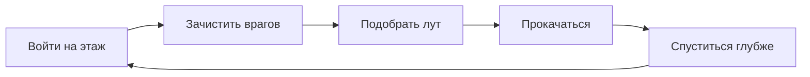
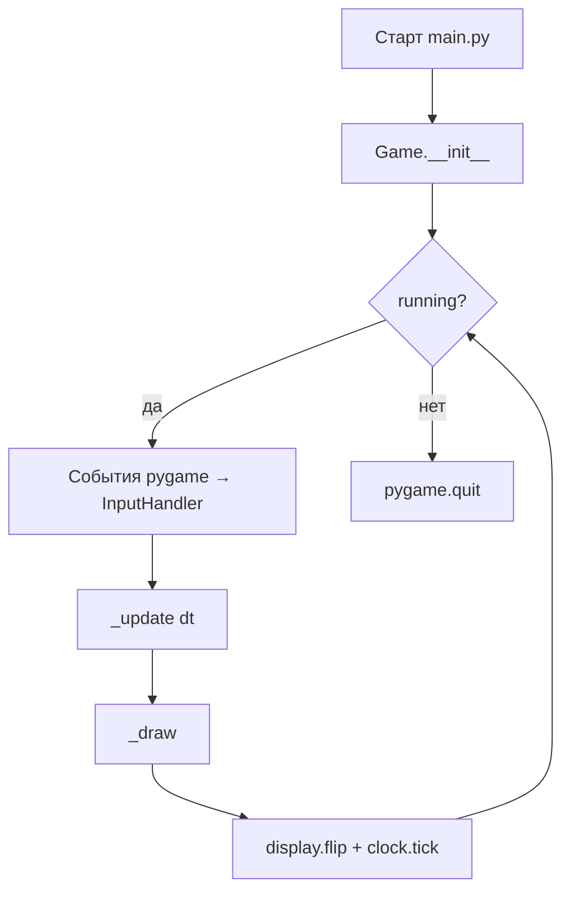
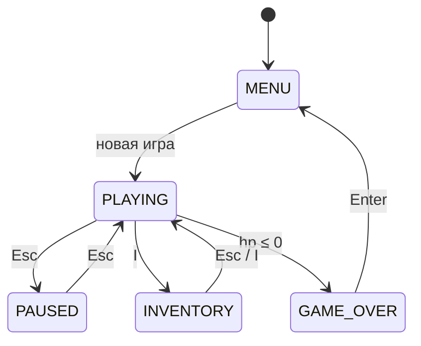
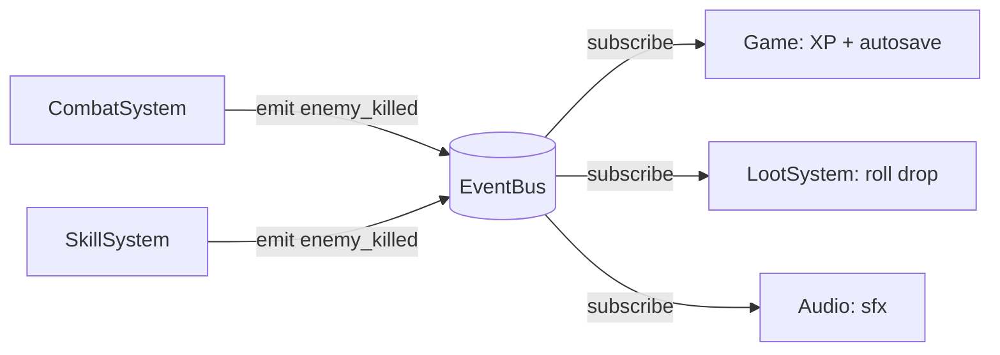
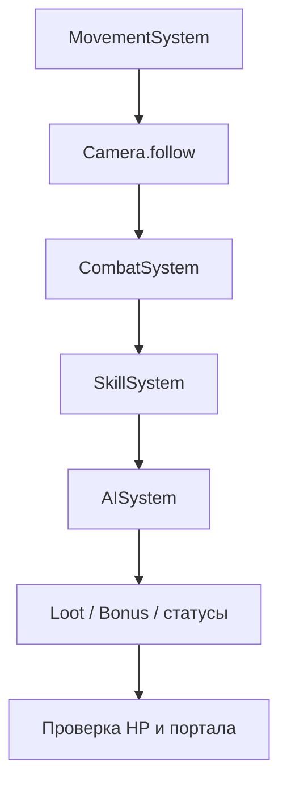
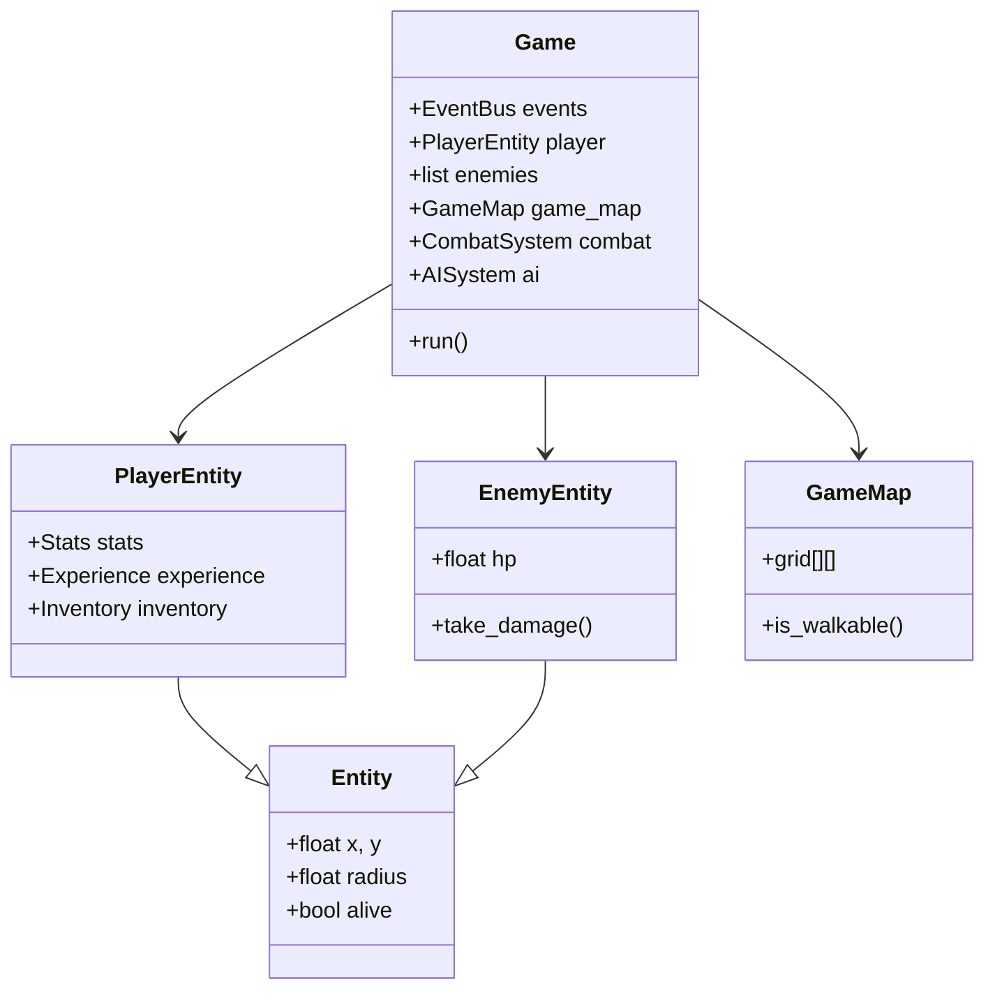
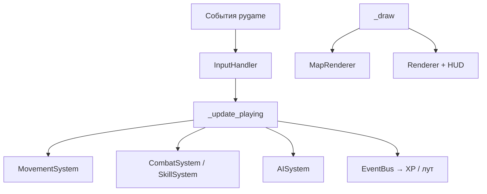
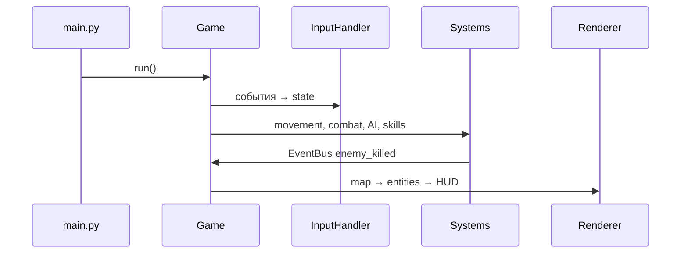
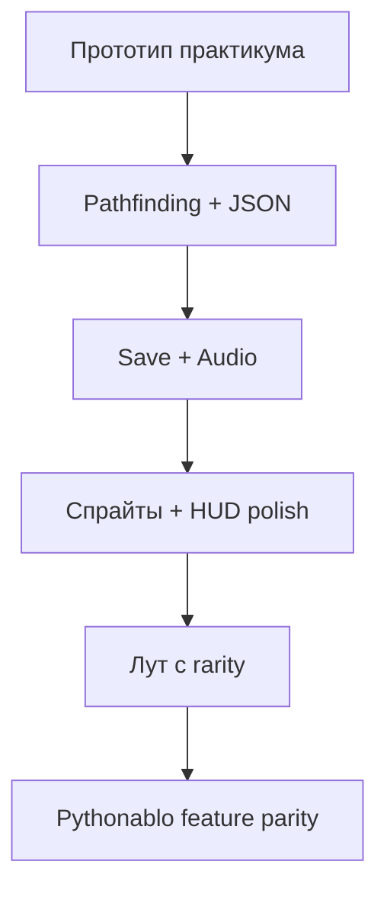

import ExternalCodeEmbed from '@site/src/components/ExternalCodeEmbed';


# Python — диаблоид

<span class="complexity-badge">Разработчику</span>
<span class="complexity-badge">Средний уровень</span>

<div class="callout callout--info">
  <div class="callout-title">Формат практикума</div>

  <div class="callout-body">
  Материалы трека приводятся к единому формату: <strong>полные листинги для копирования</strong> на каждом этапе, блок <strong>"Разбор"</strong> и раздел <strong>"Полная ревизия"</strong> в конце статьи.
  <ul>
    <li>Гарантированно запускаемые эталоны для сверки: <a href="https://github.com/Spirzen/BattleCity">Battle City</a>, <a href="https://github.com/Spirzen/Match3">Match3</a>, <a href="./3.md#full-revision">Ping Pong</a>, <a href="./4.md#full-revision">Racing</a>, <a href="./5.md#full-revision">Tetris</a>, <a href="./6.md#full-revision">диаблоид</a> (<code>#full-revision</code> в каждой статье).</li>
    <li>В этой статье готовая <a href="#full-revision">полная ревизия</a> (<code>#full-revision</code>) — этапы 0–18; этапы 19–22 (A*, JSON-враги, сохранения, звук) остаются опциональными расширениями.</li>
  </ul>
  </div>
</div>

## Как проходить практикум

<div class="callout callout--tip">
  <div class="callout-title">Если вы новичок в Pygame</div>

  <div class="callout-body">
  Не торопитесь к этапу 18. После каждого шага запускайте игру, пройдите чек-лист и прочитайте блок <strong>"Разбор"</strong> в конце этапа — там объяснено, <em>зачем</em> добавлены новые файлы и как они связаны с предыдущими. Не поняли термин (dataclass, Enum, EventBus) — загляните в разбор ещё раз после сборки этапа 10.
  </div>
</div>

1. Копируйте **целиком** файлы из блоков кода каждого этапа — без строк `# ...` и без "допишите сами".
2. После каждого этапа **запускайте** `python main.py` из корня папки `pythonablo/` и пройдите чек-лист **Самопроверка**.
3. Прочитайте **"Разбор"** под чек-листом — на всех этапах 0–18 он есть; это главная "лекция" к коду.
4. Если код не запускается — откройте [Полную ревизию](#full-revision) и сравните **имя файла и импорты**; типичные ошибки — в разделе [Отладка](#debugging).
5. После этапа 18 сверьте весь проект с [Полной ревизией файлов](#full-revision) или скопируйте эталон целиком и поиграйте, затем вернитесь к своим правкам.

Эталоны других треков с тем же форматом: [Battle City](https://github.com/Spirzen/BattleCity), [Tetris](./5.md#full-revision), [Racing](./4.md#full-revision).

---

## О практикуме

**Диаблоид** (hack and slash, action-RPG) — вид сверху или изометрия, клик по врагам, лут, прокачка, процедурные подземелья. В этом практикуме соберём **узнаваемый прототип** на **Python 3** и **Pygame** — от чёрного окна до боя, лута, уровней и простого меню. Полная версия с NPC, легендарками и ареной — в репозитории [Pythonablo](https://github.com/Spirzen/Pythonablo).

### Четыре столпа жанра

| Столп | Что даёт игроку | Что реализуем в практикуме |
|-------|-----------------|----------------------------|
| **Бой** | постоянное давление, тактика дистанции | удар по курсору, рывок, огненный шар |
| **Лут** | "ещё один забег ради шмотки" | дроп с врагов, зелья, экипировка |
| **Прокачка** | рост силы персонажа | XP, level-up, бонусы от предметов |
| **Исследование** | новые этажи и карта | процедурные комнаты, портал вниз |

Узнаваемый **core loop** diabloида выглядит так:



Каждый этап практикума добавляет один элемент этого цикла или инфраструктуру под него (рендер, ввод, сохранение состояния).

<div class="callout callout--info">
  <div class="callout-title">Для кого материал</div>

  <div class="callout-body">
  Нужны базовые Python (классы, dataclass, списки) и Pygame из статьи <a href="/encyclopedia/5-languages/5-02-python/312">Разработка игр на Python</a>. Каждый этап — <strong>запускаемый код</strong>: после шага проект можно запустить и увидеть новую механику. Графика на первых этапах — примитивы Pygame; спрайты подключим позже.
  </div>
</div>

**Управление в финальной версии практикума**

| Клавиша / мышь | Действие |
|----------------|----------|
| `W` `A` `S` `D` или стрелки | Движение |
| ЛКМ (удержание) | Атака в сторону курсора |
| `Пробел` | Рывок |
| `1` или `F` | Огненный шар |
| `I` | Инвентарь |
| `E` | Портал / подбор предмета |
| `Esc` | Пауза / меню |

**Маршрут чтения**

1. [Архитектура](#architecture) — слои, изометрия, машина состояний, шина событий.
2. [Зависимости и структура папок](#dependencies) — окружение и целевая раскладка файлов.
3. [Этап 0 — минимальный запуск](#stage-0) — окно и игровой цикл.
4. Этапы 1–18 — по одной подсистеме за шаг.
5. [Бонусные этапы 19–22](#stage-19) — pathfinding, data-driven враги, сохранения, звук.
6. [Полная ревизия файлов](#full-revision) — проверенный эталон для копирования целиком.
7. [Типичные ошибки и отладка](#debugging).
8. [Итоговая самопроверка и расширения](#final-checklist).

### Карта этапов

| Этап | Тема | Новая механика | Зависит от |
|------|------|----------------|------------|
| 0 | Цикл Pygame | окно, выход | — |
| 1 | `config.py` | константы, enum | 0 |
| 2 | Entity | игрок в данных | 1 |
| 3 | Renderer + Camera | изометрия, камера | 1–2 |
| 4 | InputHandler | WASD, мышь | 0 |
| 5 | LevelGenerator | процедурная карта | 1 |
| 6 | Collision + Movement | ходьба без прохода сквозь стены | 3–5 |
| 7 | MapRenderer | рисование подземелья | 3, 5 |
| 8 | CombatSystem | удар по дуге | 4, 6 |
| 9 | AISystem | враги, chase | 5–8 |
| 10 | EventBus + XP | level-up | 8–9 |
| 11 | LootSystem | дроп на землю | 10 |
| 12 | Inventory | экипировка | 11 |
| 13 | SkillSystem | огненный шар | 8, 10 |
| 14 | HUD | полоски HP/MP | 2, 10 |
| 15 | Menu + GameState | меню, пауза | 4 |
| 16 | Порталы | смена этажа | 5, 9 |
| 17 | Dash | рывок, серия ударов | 6, 8 |
| 18 | `Game` class | сборка проекта | все |
| 19* | Pathfinding | A* вместо прямого chase | 9 |
| 20* | `enemies.json` | враги из данных | 9 |
| 21* | SaveManager | сохранение прогресса | 10–16 |
| 22* | AudioSystem | процедурный SFX | 10 |

\* — бонусные этапы после базового прототипа.

<div class="callout callout--tip">
  <div class="callout-title">Готовый проект</div>

  <div class="callout-body">
  Если хотите сразу поиграть в полную версию — клонируйте <a href="https://github.com/Spirzen/Pythonablo">Pythonablo</a>, установите зависимости и запустите <code>python main.py</code>. Практикум ниже объясняет, <strong>как такой проект собирается с нуля</strong>, шаг за шагом.
  </div>
</div>

---

<span id="architecture"></span>
## Архитектура

Прежде чем писать код, зафиксируем **что из чего состоит** и **как данные текут по кадру**. Целевая архитектура совпадает с [Pythonablo](https://github.com/Spirzen/Pythonablo) — один процесс, Pygame, без сети.

### Игровой цикл

Любая игра на Pygame крутит один и тот же цикл. В диаблоиде порядок шагов важен — сначала ввод и логика, потом отрисовка.



На каждом кадре внутри **обновления** (состояние `PLAYING`) выполняется цепочка:

1. `MovementSystem` — движение игрока и рывок.
2. `Camera.follow` — камера за игроком.
3. `CombatSystem` — атака по ЛКМ, таймеры ударов.
4. `SkillSystem` — снаряды и AoE.
5. `AISystem` — преследование и атака врагов.
6. `LootSystem` / `BonusSystem` — дроп и подбор (через `EventBus`).
7. Проверка HP, порталов, смены этажа.

### Слои приложения

| Слой | Пакет | Ответственность |
|------|-------|-----------------|
| **Точка входа** | `main.py` | `Game().run()` |
| **Оркестрация** | `core/` | Цикл, `GameState`, `config`, `EventBus` |
| **Движок** | `engine/` | Рендер, камера, ввод, звук, спрайты |
| **Мир** | `world/` | Карта, генерация, коллизии, pathfinding |
| **Сущности** | `entities/` | Игрок, враги, предметы на земле, NPC |
| **Данные игрока** | `player/` | Статы, инвентарь, экипировка, опыт, навыки |
| **Системы** | `systems/` | Бой, AI, лут, умения, эффекты |
| **Интерфейс** | `ui/` | Меню, HUD, инвентарь, пауза |
| **Сохранения** | `save/` + `data/` | JSON-сохранение, шаблоны врагов и предметов |

Слой **систем** меняет состояние сущностей; слой **engine** только рисует и читает ввод. Так проще добавлять новых врагов и предметы без правок рендера.

### Изометрические координаты

Мир храним в **тайловых координатах** `(wx, wy)` — float, центр клетки `(tx + 0.5, ty + 0.5)`. Экран — изометрия через линейное преобразование:

```
Экран (sx, sy) = f(wx, wy, cam_x, cam_y)

  sx = (wx - wy) * (ISO_TILE_W / 2) - cam_x + SCREEN_W / 2
  sy = (wx + wy) * (ISO_TILE_H / 2) - cam_y + SCREEN_H / 2 - offset
```

Обратное преобразование (`screen_to_world`) нужно для **прицеливания атаки по курсору**.

```
Мир (тайлы)                    Экран (изометрия)
┌───┬───┬───┐                       ╱╲
│   │   │   │                      ╱  ╲
├───┼───┼───┤        →            ╱    ╲
│   │ @ │   │                    ╱  @   ╲
├───┼───┼───┤                   ╱________╲
│   │   │   │
└───┴───┴───┘
```

Рекомендуемые константы (все модули берут их из `core/config.py`):

| Константа | Значение | Смысл |
|-----------|----------|-------|
| `SCREEN_WIDTH` × `SCREEN_HEIGHT` | 1280×720 | Окно |
| `FPS` | 120 | Целевой FPS (можно 60 на слабом ПК) |
| `ISO_TILE_W` × `ISO_TILE_H` | 64×32 | Ромб тайла на экране |
| `MAP_WIDTH` × `MAP_HEIGHT` | 61×46 | Размер карты в тайлах |
| `PLAYER_SPEED` | 310 | Скорость бега |
| `ATTACK_ARC` | π (180°) | Полукруг удара |

### Машина состояний

Игра переключает экраны через `GameState`:



На этапах 0–12 работаем только в `PLAYING`. Меню и инвентарь добавим на этапах 15–16.

### EventBus — связь систем без спагетти

Когда враг умирает, нужно начислить опыт, бросить лут, проиграть звук, обновить счётчик убийств. Вместо прямых вызовов десятка функций из `CombatSystem` используем **pub/sub**:



| Событие | Кто эмитит | Кто слушает |
|---------|------------|-------------|
| `enemy_killed` | combat, skills | Game, loot, audio |
| `enemy_hit` | combat | effects, streak |
| `attack_swung` | combat | audio |
| `item_dropped` | loot | Game (список на земле) |
| `player_died` | combat, Game | переход в GAME_OVER |

### Время кадра `dt` и фиксированный шаг

Вся логика движения, кулдаунов и регенерации завязана на **`dt`** — секунды с прошлого кадра:

```python
dt = min(clock.tick(FPS) / 1000.0, 0.05)
```

Ограничение `0.05` (50 ms) защищает от "скачка" физики после паузы отладчика или лагов ОС. Скорость в `MovementSystem` умножается на `dt`, поэтому при 30 FPS и 120 FPS игрок проходит **одинаковое расстояние в секунду**.

| Величина | Формула в коде | Смысл |
|----------|----------------|-------|
| Смещение за кадр | `speed * dt * 0.012` | коэффициент 0.012 подгоняет тайловые единицы |
| Кулдаун атаки | `attack_timer -= dt` | секунды до следующего удара |
| Реген HP | `hp += regen * dt` | восстановление в секунду |

### Порядок update и draw в `PLAYING`

В полном [Pythonablo](https://github.com/Spirzen/Pythonablo) порядок `_update_playing` строго зафиксирован — нарушение ломает геймплей (например, враг бьёт до того, как игрок успел отойти):



**Отрисовка** — снизу вверх (дальний план → игрок → HUD):

1. фон и тайлы карты;
2. предметы на земле;
3. враги;
4. снаряды и эффекты;
5. игрок;
6. дуги ударов;
7. HUD и оверлеи меню.

В изометрии сущности на **большем** `wx + wy` рисуются **позже** (ближе к камере). На этапе 7 достаточно фиксированного порядка "карта → враги → игрок"; для сложных сцен добавьте сортировку:

```python
drawables = [(e.x + e.y, e) for e in enemies if e.alive]
drawables.append((player.x + player.y, player))
drawables.sort(key=lambda t: t[0])
for _, ent in drawables:
    draw_entity(ent)
```

### Целевая структура файлов

К **этапу 6** достаточно нескольких модулей. К **этапу 18** проект выглядит так:

```
pythonablo/
├── main.py
├── requirements.txt
├── core/
│   ├── config.py
│   ├── event_bus.py
│   └── game.py              # главный цикл (этап 18)
├── engine/
│   ├── renderer.py
│   ├── camera.py
│   ├── input_handler.py
│   └── map_renderer.py
├── world/
│   ├── tile.py
│   ├── map.py
│   ├── level_generator.py
│   └── collision.py
├── entities/
│   ├── entity.py
│   ├── player.py
│   └── enemy.py
├── player/
│   ├── stats.py
│   ├── experience.py
│   ├── inventory.py
│   └── equipment.py
├── systems/
│   ├── movement_system.py
│   ├── combat_system.py
│   ├── ai_system.py
│   ├── loot_system.py
│   └── skill_system.py
├── ui/
│   ├── hud.py
│   └── menu.py
├── data/
│   ├── enemies.json
│   └── items.json
└── assets/                  # спрайты (опционально)
```

<div class="callout callout--tip">
  <div class="callout-title">Почему "системы", а не один god-class</div>

  <div class="callout-body">
  <code>CombatSystem</code> знает про дугу удара и урон; <code>AISystem</code> — про pathfinding. <code>Game</code> только вызывает их по порядку и хранит списки <code>enemies</code>, <code>ground_items</code>. Новый тип врага — правка <code>data/enemies.json</code> и шаблон в AI, без переписывания HUD.
  </div>
</div>

### Диаграмма объектов



---

<span id="dependencies"></span>
## Зависимости и подготовка окружения

### Требования

- **Python 3.10+** (аннотации `str | None`, `match` по желанию).
- **Pygame ≥ 2.5.0** — единственная внешняя зависимость.

### Установка

```bash
mkdir pythonablo && cd pythonablo
python -m venv .venv
```

Активация виртуального окружения:

- **Windows (PowerShell):** `.venv\Scripts\Activate.ps1`
- **Linux / macOS:** `source .venv/bin/activate`

```bash
pip install pygame
python -c "import pygame; print('Pygame', pygame.ver)"
```

Файл `requirements.txt`:

```
pygame>=2.5.0
```

### Клонирование эталона

Если хотите сверять свой код с готовым проектом:

```bash
git clone https://github.com/Spirzen/Pythonablo.git
cd Pythonablo
python -m venv .venv
.venv\Scripts\Activate.ps1    # Windows
# source .venv/bin/activate   # Linux / macOS
pip install -r requirements.txt
python main.py
```

Учебный прототип из практикума **не обязан** совпадать с репозиторием построчно — мы сознательно упрощаем генерацию, AI и лут. Репозиторий — **ориентир архитектуры** и источник идей для бонусных этапов.

### Первичная структура

На **этапе 0** создайте только `main.py`. Пакеты `core/`, `engine/`, `world/` и остальные добавляем по ходу — в каждом пакете нужен пустой `__init__.py` (можно оставить файл пустым).

<div class="callout callout--warning">
  <div class="callout-title">Импорты между пакетами</div>

  <div class="callout-body">
  Запускайте игру из корня проекта: <code>python main.py</code>. Тогда <code>from core.config import FPS</code> работает без установки пакета в site-packages.
  </div>
</div>

---

<span id="stage-0"></span>
## Этап 0 — минимальный запускаемый код

**Цель** — окно, цикл событий, выход по крестику и `Esc`, стабильные 60 FPS.

Создайте `main.py`:


<ExternalCodeEmbed example="python/sp-9-9-04-razrabotka-igr-praktikum-razrabotki-igr-6-001" title="Этап 0 — минимальный запускаемый код" minHeight={534} />


Запуск:

```bash
python main.py
```

### Разбор

`pygame.init()` подготавливает дисплей, ввод и таймер — **до** `set_mode`, иначе окно может не создаться. Цикл `while running` — каркас любой игры на Pygame:

1. **События** — `pygame.event.get()` — закрытие окна, клавиши, мышь.
2. **Отрисовка** — `fill` заливает фон; без него на экране остаются "хвосты" прошлых кадров.
3. **`display.flip()`** — показывает нарисованный кадр пользователю.
4. **`clock.tick(FPS)`** — ждёт, пока не пройдёт 1/60 секунды; без этого цикл крутится на тысячи FPS и грузит процессор.

На этапе 18 этот же порядок переедет в `Game.run()`, а `main.py` останется из трёх строк. Пока **не удаляйте** цикл — только дополняйте его.

**Самопроверка этапа 0**

- [ ] Окно 1280×720 открывается без traceback.
- [ ] Фон тёмно-синий, без мерцания.
- [ ] `Esc` и крестик закрывают программу.

На следующих этапах **не удаляем** цикл — постепенно переносим логику в класс `Game`.

<div class="callout callout--note">
  <div class="callout-title">Почему 60 FPS на старте, 120 в финале</div>

  <div class="callout-body">
  На этапе 0 достаточно 60 — проще отладка. В <code>config.py</code> полного проекта стоит <code>FPS = 120</code> для плавности dash и серии ударов. Можно оставить 60 на всём прототипе, если железо слабое.
  </div>
</div>

---

<span id="stage-1"></span>
## Этап 1 — константы и конфигурация

**Цель** — один источник правды для размеров, скоростей и enum-состояний.

Создайте `core/__init__.py` (пустой) и `core/config.py`:


<ExternalCodeEmbed example="python/sp-9-9-04-razrabotka-igr-praktikum-razrabotki-igr-6-002" title="Этап 1 — константы и конфигурация" minHeight={720} />


Обновите `main.py` — заголовок окна из конфига:


<ExternalCodeEmbed example="python/sp-9-9-04-razrabotka-igr-praktikum-razrabotki-igr-6-003" title="Этап 1 — константы и конфигурация" minHeight={570} />


**Самопроверка**

- [ ] Заголовок окна "Pythonablo — этап 1".
- [ ] Изменение `FPS` в `config.py` меняет плавность анимации (если добавите движущийся объект позже).

Проверка импорта без окна (опционально):

```bash
python -c "from core.config import TITLE, FPS; print(TITLE, FPS)"
```


### Разбор

**Зачем отдельный `config.py`.** Вместо "магических чисел" вроде `1280` по всему коду — одно место, где лежат размеры окна, скорости и цвета. Меняете `PLAYER_SPEED` — меняется поведение везде, где импортирован конфиг.

- **`BASE_DIR`** — корень проекта; пригодится для `assets/` и `data/` на бонусных этапах.
- **`GameState` и `TileType`** — перечисления (`Enum`): состояние игры и тип тайла задаются именованными константами, а не строками `"menu"` / `"wall"`.
- **`FPS = 60`** — целевая частота кадров; `clock.tick(FPS)` в `main.py` привязывает цикл к этому значению.
- **Цвета `UI_*`** — кортежи `(R, G, B)` от 0 до 255; HUD на этапе 14 возьмёт их отсюда.

На этом этапе игра по-прежнему рисует только текст — но уже **импортирует** настройки из пакета `core`, как в больших проектах.
---

<span id="stage-2"></span>
## Этап 2 — базовая сущность и игрок

**Цель** — dataclass `Entity`, `PlayerEntity` со статами, позиция в мире.

`entities/__init__.py`, `entities/entity.py`:


<ExternalCodeEmbed example="python/sp-9-9-04-razrabotka-igr-praktikum-razrabotki-igr-6-004" title="Этап 2 — базовая сущность и игрок" minHeight={444} />


`player/__init__.py`, `player/stats.py`:

```python
from dataclasses import dataclass


@dataclass
class Stats:
    max_hp: float = 150.0
    hp: float = 150.0
    max_mana: float = 80.0
    mana: float = 80.0
    damage: float = 18.0
```

`entities/player.py`:


<ExternalCodeEmbed example="python/sp-9-9-04-razrabotka-igr-praktikum-razrabotki-igr-6-005" title="Этап 2 — базовая сущность и игрок" minHeight={444} />


В `main.py` создайте игрока в центре карты (пока без карты — координаты `(30.5, 23.5)`):

```python
from entities.player import PlayerEntity
player = PlayerEntity(30.5, 23.5)
```

**Самопроверка**

- [ ] `PlayerEntity` создаётся, `player.hp == 150`.
- [ ] `player.distance_to(other)` возвращает корректное расстояние.

```bash
python -c "from entities.player import PlayerEntity; p=PlayerEntity(30.5,23.5); assert p.hp==150; print('OK')"
```


### Разбор

**Сущность (Entity)** — любой объект в мире с координатами `x`, `y`. Координаты **float**, не целые: центр клетки `(5, 3)` в коде часто `(5.5, 3.5)` — так проще двигаться плавно между тайлами.

- **`@dataclass`** — Python сам создаёт `__init__` для полей; меньше шаблонного кода, чем у обычного класса.
- **`PlayerEntity`** наследует `Entity` и добавляет статы, таймер атаки и скорость — **игрок = сущность + данные персонажа**.
- **`player/stats.py`** — HP, мана и урон отдельно от "кто где стоит": позже level-up и зелья трогают только `Stats`.
- **`distance_to`** — понадобится для подбора лута и портала: "рядом" = расстояние меньше порога.

Пока игрок **не рисуется** и **не двигается** — вы только создаёте объект в памяти. Визуализация подключится на этапе 3.
---

<span id="stage-3"></span>
## Этап 3 — изометрический рендер и камера

**Цель** — преобразование world ↔ screen, отрисовка игрока кругом, камера следует за целью.

`engine/__init__.py`, `engine/renderer.py` (минимум):


<ExternalCodeEmbed example="python/sp-9-9-04-razrabotka-igr-praktikum-razrabotki-igr-6-006" title="Этап 3 — изометрический рендер и камера" minHeight={534} />


`engine/camera.py`:


<ExternalCodeEmbed example="python/sp-9-9-04-razrabotka-igr-praktikum-razrabotki-igr-6-007" title="Этап 3 — изометрический рендер и камера" minHeight={354} />


В цикле `main.py`:

```python
from engine.camera import Camera
from engine.renderer import Renderer

renderer = Renderer(screen)
camera = Camera()

# в update:
camera.follow(player.x, player.y, dt)
# в draw:
screen.fill((12, 14, 26))
renderer.draw_entity_circle(player.x, player.y, camera.x, camera.y, 14, (80, 200, 120))
```

Добавьте расчёт `dt`:

```python
dt = min(clock.tick(FPS) / 1000.0, 0.05)
```

**Самопроверка**

- [ ] Зелёный круг виден по центру экрана при старте.
- [ ] При ручном изменении `player.x += 0.1` каждый кадр камера плавно следует (движение добавим на этапе 6).

### Проверка изометрии в REPL

Убедитесь, что `screen_to_world` — обратная функция к `world_to_screen`:

```python
from engine.renderer import world_to_screen, screen_to_world
cam_x, cam_y = 100.0, 200.0
wx, wy = 30.5, 22.0
sx, sy = world_to_screen(wx, wy, cam_x, cam_y)
back = screen_to_world(sx, sy, cam_x, cam_y)
assert abs(back[0] - wx) < 0.01 and abs(back[1] - wy) < 0.01
```

Если assert падает — перепроверьте знаки в формулах и offset `- 80` по Y (сдвиг игрового поля под HUD).


### Разбор

**Изометрия** — карта выглядит "ромбом", хотя в памяти это обычная прямоугольная сетка тайлов. Функции `world_to_screen` и `screen_to_world` переводят координаты туда-обратно; без обратного преобразования прицеливание мышью на этапе 8 будет мимо.

- **`Renderer`** — всё, что рисуется **кругами и примитивами** в координатах мира (игрок, враги, снаряды).
- **`Camera.follow`** — камера не прыгает к игроку, а **догоняет** его (`smooth * dt`): картинка приятнее глазу.
- **`dt`** — время кадра в секундах; умножая скорость на `dt`, получаем одинаковое движение при 60 и 120 FPS.
- **Смещение `- 80` по Y** в формуле экрана — место под полоски HUD сверху.

Зелёный круг — заглушка героя; спрайты из `assets/` можно подставить позже, не меняя логику координат.
---

<span id="stage-4"></span>
## Этап 4 — ввод и InputHandler

**Цель** — централизованная обработка клавиш и мыши; состояние `InputState` на кадр.

`engine/input_handler.py`:


<ExternalCodeEmbed example="python/sp-9-9-04-razrabotka-igr-praktikum-razrabotki-igr-6-008" title="Этап 4 — ввод и InputHandler" minHeight={720} />


В цикле событий:

```python
inp = InputHandler()
# KEYDOWN → inp.on_key_down(event.key)
# KEYUP → inp.on_key_up(event.key)
# MOUSEBUTTONDOWN/UP/MOTION → соответствующие методы
# в конце кадра: inp.end_frame()
```

**Самопроверка**

- [ ] Удержание `W` выставляет `inp.state.up is True`.
- [ ] ЛКМ выставляет `attack` и однокадровый `attack_pressed`.

<div class="callout callout--tip">
  <div class="callout-title">Held vs pressed</div>

  <div class="callout-body">
  <code>attack</code> — пока ЛКМ зажата (серия ударов на этапе 17). <code>attack_pressed</code> — один кадр после нажатия (удобно для UI-кликов). Сбрасывайте <code>*_pressed</code> в <code>end_frame()</code>, иначе событие "залипнет" на несколько кадров.
  </div>
</div>


### Разбор

**InputHandler** собирает ввод **один раз за кадр** в объект `InputState`. Игровая логика читает `inp.state.up`, а не опрашивает клавиатуру в десяти местах — проще отлаживать и добавлять паузу.

| Флаг | Смысл для новичка |
|------|-------------------|
| `up`, `left`, … | **Удерживается**, пока клавиша зажата — для движения |
| `attack_pressed`, `dash_pressed` | **Один кадр** после нажатия — для "нажал E один раз" |
| `attack` | **Пока зажата ЛКМ** — серия ударов на этапе 17 |
| `skill_pressed` | Строка `"fireball"` или `None` — какое умение нажали в этом кадре |

**`end_frame()`** в конце кадра сбрасывает одноразовые флаги. Если забыть — `interact_pressed` сработает каждый кадр, пока палец не отпустит клавишу (эффект "залипания").
---

<span id="stage-5"></span>
## Этап 5 — тайлы и процедурная карта

**Цель** — сетка тайлов, генератор комнат и коридоров, старт и выход.

`world/tile.py`:


<ExternalCodeEmbed example="python/sp-9-9-04-razrabotka-igr-praktikum-razrabotki-igr-6-009" title="Этап 5 — тайлы и процедурная карта" minHeight={534} />


`world/level_generator.py` (упрощённая версия — 4–6 комнат, L-коридоры):


<ExternalCodeEmbed example="python/sp-9-9-04-razrabotka-igr-praktikum-razrabotki-igr-6-010" title="Этап 5 — тайлы и процедурная карта" minHeight={720} />


`world/map.py`:


<ExternalCodeEmbed example="python/sp-9-9-04-razrabotka-igr-praktikum-razrabotki-igr-6-011" title="Этап 5 — тайлы и процедурная карта" minHeight={318} />


При старте игры:

```python
game_map = GameMap(floor=1, seed=42)
player.x, player.y = game_map.start_tile[0] + 0.5, game_map.start_tile[1] + 0.5
```

**Самопроверка**

- [ ] `GameMap(1, 42)` дважды подряд даёт одинаковую карту (фиксированный seed).
- [ ] `start_tile` и `exit_tile` — walkable.

### Как работает генератор

Алгоритм **rooms + corridors** — классика roguelike:

1. Случайные прямоугольные комнаты без пересечения (padding 2 тайла).
2. Центры комнат соединяются L-образными коридорами.
3. Старт — центр первой комнаты; выход — центр самой удалённой комнаты (манhattan distance).

В [Pythonablo](https://github.com/Spirzen/Pythonablo) добавлены расширение chokepoints (`_widen_chokepoints`), лестница вверх на этажах > 1 и шанс арены — см. `world/level_generator.py`.

```
Комнаты (пример)          После коридоров
┌────┐     ┌───┐          ┌────┐     ┌───┐
│ S  │     │   │          │ S──┼─────┤   │
└────┘     │   │    →     └────┘     │ E │
           └───┘                     └───┘
```


### Разбор

**Карта** — двумерный список `grid[ty][tx]` — у каждой клетки тип (`FLOOR`, `WALL`, …) и флаг `walkable`.

- **`LevelGenerator`** — процедурная генерация: каждый запуск с **одним и тем же `seed`** даёт **ту же** карту — удобно для отладки (`seed=42`).
- **Комнаты + L-коридоры** — простой roguelike-приём: сначала прямоугольники, потом соединение центров.
- **`start_tile` / `exit_tile`** — координаты **целых** тайлов `(x, y)`; игрок встаёт в **центр** клетки: `x + 0.5`, `y + 0.5`.
- **`GameMap.is_walkable`** — единая проверка "можно ли сюда встать"; коллизии и спавн врагов используют её же.

Раздел "Как работает генератор" выше — углубление; для первого прохождения достаточно понять: **карта создаётся кодом, а не нарисована в редакторе**.
---

<span id="stage-6"></span>
## Этап 6 — коллизии и движение

**Цель** — скольжение вдоль стен, игрок не проходит сквозь `WALL`.

`world/collision.py`:


<ExternalCodeEmbed example="python/sp-9-9-04-razrabotka-igr-praktikum-razrabotki-igr-6-012" title="Этап 6 — коллизии и движение" minHeight={606} />


`systems/movement_system.py`:


<ExternalCodeEmbed example="python/sp-9-9-04-razrabotka-igr-praktikum-razrabotki-igr-6-013" title="Этап 6 — коллизии и движение" minHeight={516} />


Подключите в цикле: `movement.update(player, game_map, inp.state, dt)`.

**Самопроверка**

- [ ] `WASD` двигает круг по полу.
- [ ] Игрок останавливается у стены, не проваливается в void.

`move_slide` делит перемещение на **субшаги** и пробует скольжение по осям X и Y отдельно — игрок "едет" вдоль стены, а не застревает в углу. Радиус `ENTITY_RADIUS = 0.34` — компромисс между узкими коридорами и ощущением "толстого" героя.


### Разбор

**Почему не `x += dx` напрямую.** Игрок — круг с радиусом `ENTITY_RADIUS`. Перед шагом проверяем **несколько точек** вокруг центра (`can_occupy`).

- **`move_slide`** делит перемещение на **много маленьких шагов** и при ударе о стену пробует сдвинуться только по X или только по Y — отсюда **скольжение** вдоль угла, а не застревание.
- **`MovementSystem`** переводит WASD в вектор, нормализует его (диагональ не быстрее прямой) и вызывает `move_slide`.
- **`facing_angle`** обновляется при движении — позже удар пойдёт "куда шли", если курсор не двигали.

Если герой всё ещё проходит сквозь стены — проверьте, что в цикле вызывается именно `movement.update(...)`, а не ручное изменение `player.x`.
---

<span id="stage-7"></span>
## Этап 7 — отрисовка карты в изометрии

**Цель** — ромбы тайлов, стены темнее пола, маркер портала.

`engine/map_renderer.py`:


<ExternalCodeEmbed example="python/sp-9-9-04-razrabotka-igr-praktikum-razrabotki-igr-6-014" title="Этап 7 — отрисовка карты в изометрии" minHeight={660} />


Порядок отрисовки в `_draw`:

1. `map_renderer.draw(game_map, camera.x, camera.y)`
2. `renderer.draw_entity_circle(player, ...)`

**Самопроверка**

- [ ] Видны комнаты и коридоры "ромбами".
- [ ] Портал выхода оранжевый, игрок поверх пола.


### Разбор

**Порядок отрисовки важен.** Сначала пол (`MapRenderer.draw`), потом сущности поверх — иначе пол перекроет игрока.

- **`MapRenderer`** рисует **ромб** из четырёх точек вокруг центра тайла; `VOID` пропускаем — "пустота" не рисуется.
- **Цвета:** пол тёмно-синий, стена ещё темнее, **выход (портал)** — оранжевый: игрок учится искать его на карте.
- **`MapRenderer` не знает про игрока** — только сетка; так проще менять стиль карты, не трогая бой.

На этом этапе вы впервые **видите своё подземелье** целиком; камера с этапа 3 следует за героем по коридорам.
---

<span id="stage-8"></span>
## Этап 8 — ближний бой (полукруглый удар)

**Цель** — ЛКМ бьёт по направлению курсора; урон врагам в дуге 180°.

`entities/enemy.py`:


<ExternalCodeEmbed example="python/sp-9-9-04-razrabotka-igr-praktikum-razrabotki-igr-6-015" title="Этап 8 — ближний бой (полукруглый удар)" minHeight={318} />


`systems/combat_system.py`:


<ExternalCodeEmbed example="python/sp-9-9-04-razrabotka-igr-praktikum-razrabotki-igr-6-016" title="Этап 8 — ближний бой (полукруглый удар)" minHeight={720} />


В игровом цикле:

```python
from engine.renderer import screen_to_world
mouse_world = screen_to_world(*inp.state.mouse_pos, camera.x, camera.y)
if inp.state.attack:
    combat.try_attack(player, enemies, mouse_world)
player.attack_timer = max(0, player.attack_timer - dt)
combat.update(dt)
```

Отрисовка дуги (в `Renderer`):

```python
def draw_slash(self, slash, cam_x, cam_y) -> None:
    import pygame, math
    sx, sy = world_to_screen(slash.x, slash.y, cam_x, cam_y)
    r = 48
    start = -slash.angle + math.pi / 2
    end = start + math.pi
    rect = pygame.Rect(sx - r, sy - r, r * 2, r * 2)
    pygame.draw.arc(self.screen, (255, 220, 120), rect, start, end, 3)
```

**Самопроверка**

- [ ] При клике по врагу появляется жёлтая дуга.
- [ ] Враг теряет HP только если стоит перед игроком в секторе удара.

### Математика сектора удара

Удар — **сектор круга**, а не круг целиком (как в Diablo — удар "перед" героем):

1. **Дистанция** — `dist <= SLASH_RANGE + enemy.radius`.
2. **Угол** от игрока к врагу: `ea = atan2(dy, dx)`.
3. **Разница** с направлением удара: `diff = normalize(ea - angle)` в диапазоне `[-π, π]`.
4. Попадание, если `abs(diff) <= ATTACK_ARC / 2` (полукруг 180°).

```
        враг B (мимо)
              ×
             /
    игрок ● ------> angle
             \
              × враг A (попал)
```

Добавьте **floating damage** — список `(x, y, текст, timer)` в `CombatSystem`, рисуйте числа над врагом с затуханием `timer -= dt`. В Pythonablo это `damage_numbers` в `systems/combat_system.py`.

На этапе 10 подключите `EventBus` к `CombatSystem`:

```python
class CombatSystem:
    def __init__(self, events: EventBus) -> None:
        self.events = events
        ...
```


### Разбор

**Ближний бой — сектор, не круг.** Урон получают только враги **перед** героем в дуге 180° (`ATTACK_ARC`) и **на дистанции** `SLASH_RANGE`.

1. Направление удара — от игрока **к курсору** (`atan2`).
2. Для каждого врага считаем угол "игрок → враг" и сравниваем с углом удара.
3. **`attack_timer`** не даёт бить каждый кадр — пауза `attack_cooldown` между ударами.

- **`SlashEffect`** — короткая жёлтая дуга на экране: обратная связь "удар прошёл".
- **`EnemyEntity.take_damage`** — урон вычитается из `hp`; при `hp <= 0` — `alive = False` (пока без EventBus; на этапе 10 добавим событие смерти).

Раздел "Математика сектора удара" ниже — для тех, кто хочет понять формулы; в коде достаточно скопировать `_apply_slash_damage`.
---

<span id="stage-9"></span>
## Этап 9 — враги и простой AI

**Цель** — спавн на walkable-тайлах, преследование игрока, контактный урон.

`systems/ai_system.py` (упрощённо — без pathfinding, прямой chase):


<ExternalCodeEmbed example="python/sp-9-9-04-razrabotka-igr-praktikum-razrabotki-igr-6-017" title="Этап 9 — враги и простой AI" minHeight={720} />


После создания `GameMap`:

```python
enemies = ai.spawn_enemies(game_map, floor=1)
```

Рисуйте врагов красным кругом; мёртвых пропускайте.

**Самопроверка**

- [ ] На карте ~12 врагов.
- [ ] Враги идут к игроку и наносят урон при соприкосновении.
- [ ] Убитый враг (`alive=False`) исчезает с экрана.

### Полоска HP над врагом

Мини-HUD над каждым живым врагом сильно улучшает читаемость боя:

```python
def draw_enemy_hp(renderer, enemy, cam_x, cam_y) -> None:
    import pygame
    from engine.renderer import world_to_screen
    sx, sy = world_to_screen(enemy.x, enemy.y, cam_x, cam_y)
    w, h = 36, 5
    x = int(sx - w // 2)
    y = int(sy - 28)
    pygame.draw.rect(renderer.screen, (40, 20, 24), (x, y, w, h))
    if enemy.max_hp > 0:
        fill = int(w * max(0, enemy.hp) / enemy.max_hp)
        pygame.draw.rect(renderer.screen, (220, 60, 60), (x, y, fill, h))
```

Прямой chase ломается за стенами — враг упирается в угол. **Этап 19** добавляет A* pathfinding.


### Разбор

**AISystem** делает две вещи: **спавн** при старте этажа и **update** каждый кадр.

- **Спавн** — случайные клетки, но только `walkable` и не на старте/выходе; `random.Random(floor * 999)` даёт повторяемый набор для этажа.
- **Chase (преследование)** — враг каждый кадр шагает **прямо к игроку** через `move_slide`. За стеной враг **упрётся** — это нормально для учебной версии; обход добавит **этап 19 (A*)**.
- **Контактный урон** — если дистанция `< 0.15`, игрок теряет HP пропорционально `dt` (урон в секунду, а не "−100 за касание").

Красные круги без HP-бара читаются плохо — фрагмент `draw_enemy_hp` в статье стоит добавить в `_draw`, когда подключите врагов.
---

<span id="stage-10"></span>
## Этап 10 — EventBus и опыт

**Цель** — отделить "враг умер" от последствий; уровни и полоска XP.

`core/event_bus.py`:


<ExternalCodeEmbed example="python/sp-9-9-04-razrabotka-igr-praktikum-razrabotki-igr-6-018" title="Этап 10 — EventBus и опыт" minHeight={336} />


`player/experience.py`:


<ExternalCodeEmbed example="python/sp-9-9-04-razrabotka-igr-praktikum-razrabotki-igr-6-019" title="Этап 10 — EventBus и опыт" minHeight={462} />


Добавьте в `player/stats.py` рост при level-up:

```python
def on_level_up(self) -> None:
    self.vitality = getattr(self, "vitality", 10) + 2
    self.max_hp += 12
    self.hp = self.max_hp
    self.max_mana += 6
    self.mana = self.max_mana
    self.damage += 2
```

В `CombatSystem._apply_slash_damage` после `enemy.take_damage`:

```python
if enemy.hp <= 0:
    enemy.alive = False
    self.events.emit("enemy_killed", enemy=enemy, killer=player)
```

Подписка в `Game` или временно в `main.py`:

```python
def on_enemy_killed(enemy, killer, **kw):
    if killer is None:
        return
    xp = 12 + game_map.floor * 2
    ups = killer.experience.add_xp(xp)
    for _ in range(ups):
        killer.stats.on_level_up()
    events.emit("level_up", player=killer, levels=ups)  # для звука на этапе 22
```

Добавьте `experience: Experience = field(default_factory=Experience)` в `PlayerEntity`.

**Самопроверка**

- [ ] После нескольких убийств растёт `player.experience.xp`.
- [ ] При level-up HP и урон увеличиваются.

<div class="callout callout--info">
  <div class="callout-title">Один emit — много подписчиков</div>

  <div class="callout-body">
  Событие <code>enemy_killed</code> слушают XP, лут, счётчик убийств и аудио. Новый слушатель (например, квест "убей 10") добавляется одной строкой <code>events.subscribe(...)</code> без правки <code>CombatSystem</code>.
  </div>
</div>


### Разбор

**EventBus (шина событий)** — паттерн "один сигнал — много слушателей". `CombatSystem` не знает про XP и лут: он только **`emit("enemy_killed", ...)`**.

- **`subscribe`** — "когда враг умер, вызови мою функцию".
- **`Experience.add_xp`** — копит опыт; при переполнении порога — level-up и новый порог (`xp_to_next * 1.19 + 5`).
- **`stats.on_level_up`** — восстанавливает HP/ману и поднимает урон — игрок **чувствует** рост силы.

Так бой, лут (этап 11) и звук (этап 22) **не переплетаются** в одном файле: каждый модуль подписывается на нужные события.
---

<span id="stage-11"></span>
## Этап 11 — лут на земле

**Цель** — дроп с шансом, предметы лежат на полу, подбор по `E`.

`entities/item.py`:

```python
from dataclasses import dataclass
from entities.entity import Entity


@dataclass
class GroundItem(Entity):
    item_id: str = "gold"
    label: str = "Золото"
    color: tuple[int, int, int] = (255, 215, 60)
```

`systems/loot_system.py`:


<ExternalCodeEmbed example="python/sp-9-9-04-razrabotka-igr-praktikum-razrabotki-igr-6-020" title="Этап 11 — лут на земле" minHeight={372} />


В `Game` / `main`:

```python
ground_items: list[GroundItem] = []

def on_item_dropped(item, **kw):
    ground_items.append(item)

events.subscribe("item_dropped", on_item_dropped)
```

Подбор:

```python
if inp.state.interact_pressed:  # клавиша E в InputHandler
    for gi in ground_items:
        if player.distance_to(gi) < 1.2:
            player.stats.hp = min(player.stats.max_hp, player.stats.hp + 40)
            ground_items.remove(gi)
            break
```

Рисуйте лут маленьким ромбом или кругом `item.color`.

**Самопроверка**

- [ ] С убитых врагов иногда падает зелье.
- [ ] `E` рядом восстанавливает HP.


### Разбор

**Лут — отдельные объекты на карте.** После `enemy_killed` `LootSystem` с вероятностью `DROP_CHANCE` создаёт `GroundItem` и шлёт `item_dropped`.

- Список **`ground_items`** в `Game` — "что лежит на полу сейчас".
- **Подбор по `E`** — перебор предметов рядом с игроком; зелье сразу лечит, меч (этап 12) попадёт в инвентарь.
- **Рисование** — маленький цветной круг или ромб; `item.color` задаётся при создании.

Если лут никогда не падает — проверьте подписку `LootSystem` на `enemy_killed` и что бой действительно эмитит событие при смерти врага.
---

<span id="stage-12"></span>
## Этап 12 — инвентарь и экипировка (основа)

**Цель** — рюкзак, слоты оружия/брони, бонус к урону от предмета.

`player/inventory.py`:

```python
from dataclasses import dataclass, field


@dataclass
class Inventory:
    slots: list[str | None] = field(default_factory=lambda: [None] * 20)

    def add(self, item_id: str) -> bool:
        for i, s in enumerate(self.slots):
            if s is None:
                self.slots[i] = item_id
                return True
        return False
```

`player/equipment.py`:


<ExternalCodeEmbed example="python/sp-9-9-04-razrabotka-igr-praktikum-razrabotki-igr-6-021" title="Этап 12 — инвентарь и экипировка (основа)" minHeight={354} />


Расширьте `PlayerEntity.damage`:

```python
@property
def damage(self) -> float:
    return self.stats.damage + self.equipment.bonus("damage")
```

При подборе меча с земли — `inventory.add("sword_1")`; в UI (этап 15) — экипировка в слот `weapon` с `&#123;"damage": 8&#125;`.

**Самопроверка**

- [ ] Экипированный меч увеличивает урон по врагам.
- [ ] Рюкзак не принимает 21-й предмет.

### Панель инвентаря (overlay)

При `GameState.INVENTORY` мир продолжает рисоваться под полупрозрачной панелью:


<ExternalCodeEmbed example="python/sp-9-9-04-razrabotka-igr-praktikum-razrabotki-igr-6-022" title="Панель инвентаря (overlay)" minHeight={336} />


ЛКМ по слоту — экипировать в `weapon` / `chest`; повторное `I` или `Esc` — закрыть. В Pythonablo полноценный UI — `ui/inventory_ui.py` с tooltip и rarity-цветами.


### Разбор

**Инвентарь и экипировка — разные вещи.**

- **`Inventory.slots`** — 20 ячеек "что унесли с пола"; `add` ищет первую пустую.
- **`Equipment`** — что **надето** и даёт бонусы; `equip("sword_1", "weapon", &#123;"damage": 8&#125;)`.
- **`PlayerEntity.damage`** — базовый урон из `stats` **плюс** бонус оружия; UI и бой читают одно свойство.

Инвентарь на **`I`** (этап 18 в `Game`) — overlay поверх игры; клик по слоту в полной Pythonablo экипирует предмет — в практикуме меч может экипироваться сразу при подборе для простоты.
---

<span id="stage-13"></span>
## Этап 13 — активное умение (огненный шар)

**Цель** — трата маны, снаряд летит к курсору, урон при попадании.

`systems/skill_system.py`:


<ExternalCodeEmbed example="python/sp-9-9-04-razrabotka-igr-praktikum-razrabotki-igr-6-023" title="Этап 13 — активное умение (огненный шар)" minHeight={720} />


В цикле при `inp.state.skill_pressed == "fireball"`:

```python
skills.cast_fireball(player, enemies, mouse_world)
```

Реген маны: `player.stats.mana = min(max_mana, mana + 8 * dt)`.

Следующий шаг после огненного шара — **ударная волна (AoE)** вокруг игрока без прицеливания и **вихрь на ПКМ** (удержание, периодический урон). Обе механики уже реализованы в `SkillSystem` [Pythonablo](https://github.com/Spirzen/Pythonablo/blob/main/systems/skill_system.py) — можно перенести как этап 23.

**Самопроверка**

- [ ] `F` запускает оранжевый снаряд (круг).
- [ ] Без маны умение не срабатывает.


### Разбор

**Активное умение** — трата **маны**, создание **снаряда** в списке `projectiles`, полёт каждый кадр.

- **`cast_fireball`** — если маны мало, возвращает `False` и ничего не тратит.
- **Снаряд** — простой dataclass с позицией, скоростью `vx/vy` и `life` (самоуничтожается через 2 с).
- **Попадание** — расстояние от центра снаряда до врага `< sum радиусов`; урон один раз, снаряд исчезает.
- **Смерть от огненного шара** — в `update` передаётся `killer=player`, чтобы EventBus начислил XP (как при ударе мечом).
- **Реген маны** — `mana += 8 * dt` в `_update_playing` возвращает возможность кастовать.

Огненный шар на **`F`** или **`1`** — удобно держать врагов на дистанции, пока кулдаун ближнего удара на перезарядке.
---

<span id="stage-14"></span>
## Этап 14 — HUD

**Цель** — полоски HP/MP, уровень, номер этажа, иконки умений.

`ui/hud.py`:


<ExternalCodeEmbed example="python/sp-9-9-04-razrabotka-igr-praktikum-razrabotki-igr-6-024" title="Этап 14 — HUD" minHeight={462} />


Вызывайте `hud.draw(player, floor)` **после** отрисовки мира — HUD всегда поверх.

**Самопроверка**

- [ ] HP уменьшается при уроне от врагов.
- [ ] MP уменьшается после огненного шара.

Расширьте HUD **иконками умений** и подсказкой портала:

```python
def draw_skill_bar(self, player, portal_hint: str | None) -> None:
    import pygame
    font = pygame.font.SysFont("Segoe UI", 14)
    pygame.draw.circle(self.r.screen, (255, 120, 40), (SCREEN_WIDTH - 80, SCREEN_HEIGHT - 40), 18)
    label = font.render("F", True, UI_TEXT)
    self.r.screen.blit(label, (SCREEN_WIDTH - 86, SCREEN_HEIGHT - 48))
    if portal_hint:
        hint = font.render(portal_hint, True, (255, 204, 96))
        self.r.screen.blit(hint, (24, SCREEN_HEIGHT - 32))
```


### Разбор

**HUD рисуется последним** — поверх мира и врагов, иначе полоски HP окажутся под тайлами.

- **`_bar`** — сначала фон, потом закрашенная часть шириной `cur / max * w` — универсальная полоска для HP и MP.
- **Текст "Ур. N · Этаж F"** — игрок видит прогресс без консоли.
- **`draw_skill_bar`** — подсказка "нажми F" и текст "E — портал", когда рядом с выходом (подключится в `Game` на этапе 16).

Цвета HUD берутся из `config.py` — не дублируйте `(88, 228, 112)` в `hud.py`.
---

<span id="stage-15"></span>
## Этап 15 — меню и машина состояний

**Цель** — экран "Новая игра", пауза по `Esc`, game over.

`ui/menu.py` (фрагмент):


<ExternalCodeEmbed example="python/sp-9-9-04-razrabotka-igr-praktikum-razrabotki-igr-6-025" title="Этап 15 — меню и машина состояний" minHeight={336} />


В классе `Game`:

```python
self.state = GameState.MENU
self.menu_selected = 0

def _handle_events(self):
    if self.state == GameState.MENU and inp.state.menu_confirm:
        self._start_new_game()
        self.state = GameState.PLAYING
    if self.state == GameState.PLAYING and inp.state.menu_back:
        self.state = GameState.PAUSED
    if player.stats.hp <= 0:
        self.state = GameState.GAME_OVER
```

`_start_new_game()` создаёт `GameMap`, `PlayerEntity`, спавнит врагов.

Навигация меню стрелками и Enter:

```python
if self.state == GameState.MENU:
    if inp.menu_up:
        self.menu_selected = (self.menu_selected - 1) % 2
    if inp.menu_down:
        self.menu_selected = (self.menu_selected + 1) % 2
    if inp.menu_confirm:
        if self.menu_selected == 0:
            self._start_new_game()
            self.state = GameState.PLAYING
        else:
            self.running = False
```

**Самопроверка**

- [ ] Старт в меню; Enter начинает игру.
- [ ] Esc открывает паузу (можно нарисовать полупрозрачную плашку).


### Разбор

**Машина состояний (`GameState`)** — в каждый момент игра в одном режиме — меню, игра, пауза или game over. В `_update` и `_draw` ветвление по `self.state`.

- **`MENU`** — рисуем только `MenuUI`; Enter / стрелки выбирают пункт.
- **`PLAYING`** — вся логика боя и движения; Esc → **`PAUSED`**.
- **`GAME_OVER`** — HP игрока ≤ 0; Esc возвращает в меню.

**`_start_new_game()`** — одна функция создаёт карту, игрока и врагов: и "Новая игра", и будущий "Продолжить" (этап 21) смогут вызывать её же.
---

<span id="stage-16"></span>
## Этап 16 — этажи и портал

**Цель** — выход с этажа, переход `floor += 1`, новая генерация карты.

В `Game`:

```python
def _try_use_portal(self) -> None:
    if not self.game_map:
        return
    ex, ey = self.game_map.exit_tile
    if self.player.distance_sq_to(ex + 0.5, ey + 0.5) > 1.85 ** 2:
        return
    self.floor += 1
    self.game_map = GameMap(floor=self.floor, seed=1000 + self.floor)
    self.player.x = self.game_map.start_tile[0] + 0.5
    self.player.y = self.game_map.start_tile[1] + 0.5
    self.enemies = self.ai.spawn_enemies(self.game_map, self.floor)
    self.ground_items.clear()
```

Подсказка на HUD: "E — портал", когда игрок рядом.

Расширьте `InputHandler` — `interact_pressed` на `E`.

**Самопроверка**

- [ ] У оранжевого тайла выхода при `E` загружается этаж 2.
- [ ] Враги на этаже 2 чуть больнее.

Масштаб сложности по этажу (рекомендуемая формула):

```python
def floor_mult(floor: int) -> float:
    return 1.0 + (floor - 1) * 0.12

# в spawn:
hp = ENEMY_BASE_HP * floor_mult(floor)
count = int(ENEMIES_PER_FLOOR * (1 + floor * 0.05))
```

В Pythonablo каждый 3-й этаж — **босс-этаж** с усиленными врагами и отдельной музыкой; на этаже `(floor % 3) == 2` появляется **Кузнец**.


### Разбор

**Портал — тайл `EXIT` на карте**, не отдельная кнопка. Игрок подходит близко (`distance_sq_to` ≤ порога) и жмёт **`E`**.

- **`floor += 1`** — номер этажа для HUD и усиления врагов.
- **Новый `GameMap(..., seed=1000 + floor)`** — другая карта на каждом этаже.
- **`ground_items.clear()`** — лут не переносится между этажами (можно изменить в своём форке).

**`floor_mult`** — враги на глубине получают больше HP: `ENEMY_BASE_HP * floor_mult(floor)`. Игрок ощущает рост сложности без ручной правки каждого этажа.
---

<span id="stage-17"></span>
## Этап 17 — рывок и удерживаемая атака

**Цель** — `Space` — dash с кулдауном; удержание ЛКМ — серия ударов.

В `MovementSystem.try_dash` (см. полный код в [Pythonablo](https://github.com/Spirzen/Pythonablo/blob/main/systems/movement_system.py)):

```python
from core.config import DASH_COOLDOWN, DASH_DURATION, DASH_SPEED_MULTIPLIER

def try_dash(self, player, game_map, inp) -> bool:
    if player.is_dashing or player.dash_cooldown_timer > 0:
        return False
    # направление из WASD или вверх по умолчанию
    dash_dist = player.move_speed * DASH_SPEED_MULTIPLIER * DASH_DURATION * 0.012
    # move_slide на dash_dist
    player.is_dashing = True
    player.dash_timer = DASH_DURATION
    player.dash_cooldown_timer = DASH_COOLDOWN
    return True
```

В `_update_playing`:

```python
if inp.state.dash_pressed:
    movement.try_dash(player, game_map, inp)
if inp.state.attack:
    combat.try_attack(player, enemies, mouse_world)
```

Добавьте в `PlayerEntity` поля `is_dashing`, `dash_timer`, `dash_cooldown_timer`.

**Самопроверка**

- [ ] Рывок проскальзывает сквозь толпу, но не сквозь стены.
- [ ] Удержание ЛКМ наносит серию ударов с интервалом `attack_cooldown`.


### Разбор

**Dash (рывок)** — короткий **бurst** движения на `DASH_DURATION` с кулдауном `DASH_COOLDOWN`; направление из WASD или "вверх" по умолчанию.

- **`is_dashing`** — пока true, обычное WASD в `MovementSystem.update` не применяется (герой не "ползёт" во время рывка).
- **Тот же `move_slide`** — рывок **не проходит сквозь стены**, только быстрее протискивается по коридору.
- **Удержание ЛКМ** — каждый кадр с `attack=True` вызывает `try_attack`, но **`attack_timer`** ограничивает частоту ударов.

Серия ударов — **повторный вызов** одной и той же логики с кулдауном — простой и рабочий приём для прототипа.
---

<span id="stage-18"></span>
## Этап 18 — сборка класса `Game` и чистый `main.py`

**Цель** — вся логика в `core/game.py`; `main.py` — три строки.

`core/game.py` (скелет):


<ExternalCodeEmbed example="python/sp-9-9-04-razrabotka-igr-praktikum-razrabotki-igr-6-026" title="Этап 18 — сборка класса `Game` и чистый `main.py`" minHeight={720} />


Финальный `main.py`:

```python
from core.game import Game

if __name__ == "__main__":
    Game().run()
```

**Самопроверка**

- [ ] `main.py` — не больше 5 строк.
- [ ] Все этапы 1–17 работают внутри одного класса.

<div class="callout callout--tip">
  <div class="callout-title">Эталон этапа 18</div>

  <div class="callout-body">
  Скелет выше не содержит меню, портала, лута и dash — они собираются из этапов 11–17. Готовый проверенный проект целиком — в разделе <a href="#full-revision">Полная ревизия файлов</a>.
  </div>
</div>


### Разбор

**Класс `Game` — дирижёр оркестра.** В `__init__` создаются все системы; в `run()` — цикл Pygame из этапа 0, но вызовы разнесены по `_handle_events`, `_update`, `_draw`.



- **`main.py`** — только `Game().run()`: так проще тестировать и импортировать игру из других скриптов.
- **`_wire_events`** — подписки на `item_dropped` и `enemy_killed` в одном месте.
- **Полный эталон** со всеми деталями этапов 11–17 — в [Полной ревизии](#full-revision); скелет выше можно сверять построчно.

Если что-то работало по отдельности, а в `Game` "сломалось" — сравните порядок вызовов в `_update_playing` с [архитектурой](#architecture).
---

<span id="stage-19"></span>
## Этап 19 (бонус) — pathfinding A*

**Цель** — враги обходят стены по сетке walkable-тайлов.

`world/pathfinding.py` (упрощённый A*):


<ExternalCodeEmbed example="python/sp-9-9-04-razrabotka-igr-praktikum-razrabotki-igr-6-027" title="Этап 19 (бонус) — pathfinding A*" minHeight={678} />


В `AISystem.update` вместо прямого chase:

```python
from world.pathfinding import find_path

ex, ey = int(player.x), int(player.y)
sx, sy = int(enemy.x), int(enemy.y)
path = find_path(game_map, (sx, sy), (ex, ey))
if len(path) >= 2:
    nx, ny = path[1]
    tx, ty = nx + 0.5, ny + 0.5
    dx, dy = tx - enemy.x, ty - enemy.y
    dist = math.hypot(dx, dy) or 1.0
    mx = (dx / dist) * speed
    my = (dy / dist) * speed
    enemy.x, enemy.y = move_slide(game_map, enemy.x, enemy.y, mx, my)
```

<div class="callout callout--caution">
  <div class="callout-title">Производительность</div>

  <div class="callout-body">
  A* на 38 врагах каждый кадр дорог. Пересчитывайте путь раз в 0.3–0.5 с или только когда цель сменила тайл. В Pythonablo pathfinding вызывается с throttling внутри <code>AISystem</code>.
  </div>
</div>

**Самопроверка**

- [ ] Враг за стеной идёт в обход, а не упирается в угол.
- [ ] FPS не падает ниже 30 на карте 61×46.

---

<span id="stage-20"></span>
## Этап 20 (бонус) — враги из JSON

**Цель** — data-driven баланс без правки Python-кода.

Создайте `data/enemies.json`:

```json
{
  "enemies": [
    {"id": "fallen", "name": "Падший", "kind": "grunt", "base_hp": 38, "base_damage": 7, "base_speed": 90, "xp": 10, "weight": 3},
    {"id": "ghost", "name": "Призрак", "kind": "runner", "base_hp": 26, "base_damage": 9, "base_speed": 135, "xp": 14, "weight": 3},
    {"id": "brute", "name": "Зверь", "kind": "brute", "base_hp": 85, "base_damage": 14, "base_speed": 65, "xp": 22, "weight": 2}
  ]
}
```

В `AISystem`:


<ExternalCodeEmbed example="python/sp-9-9-04-razrabotka-igr-praktikum-razrabotki-igr-6-028" title="Этап 20 (бонус) — враги из JSON" minHeight={444} />


Полный список из 22 шаблонов — в [репозитории](https://github.com/Spirzen/Pythonablo/blob/main/data/enemies.json).

**Самопроверка**

- [ ] Изменение `base_hp` в JSON меняет живучесть без перекомпиляции.
- [ ] `weight` влияет на частоту появления типа.

---

<span id="stage-21"></span>
## Этап 21 (бонус) — сохранение игры

**Цель** — продолжить забег после перезапуска.

`save/save_manager.py`:


<ExternalCodeEmbed example="python/sp-9-9-04-razrabotka-igr-praktikum-razrabotki-igr-6-029" title="Этап 21 (бонус) — сохранение игры" minHeight={696} />


Сериализация игрока (минимум):

```python
def player_to_dict(player: PlayerEntity) -> dict:
    return {
        "x": player.x, "y": player.y,
        "hp": player.stats.hp, "max_hp": player.stats.max_hp,
        "level": player.experience.level,
        "xp": player.experience.xp,
    }
```

Автосейв в `Game` — каждые 5 убийств (как в Pythonablo):

```python
def _on_enemy_killed(self, enemy, killer, **kw):
    self.kills += 1
    if self.kills - self._last_autosave_kills >= 5:
        self._autosave()
        self._last_autosave_kills = self.kills
```

**Самопроверка**

- [ ] После сохранения в меню появляется "Продолжить".
- [ ] Этаж и HP восстанавливаются после `load`.

---

<span id="stage-22"></span>
## Этап 22 (бонус) — процедурный звук

**Цель** — SFX без внешних `.wav` файлов.

`engine/audio.py` (фрагмент):


<ExternalCodeEmbed example="python/sp-9-9-04-razrabotka-igr-praktikum-razrabotki-igr-6-030" title="Этап 22 (бонус) — процедурный звук" minHeight={696} />


Подписки в `Game._wire_events`:

```python
self.events.subscribe("attack_swung", lambda **_: self.audio.play("swing"))
self.events.subscribe("enemy_killed", lambda **_: self.audio.play("kill"))
self.events.subscribe("level_up", lambda **_: self.audio.play("level_up"))
```

**Самопроверка**

- [ ] Слышен короткий звук при ударе и level-up.
- [ ] Игра запускается без звука, если `mixer.init` недоступен.

---

<span id="debugging"></span>
## Типичные ошибки и отладка

| Симптом | Вероятная причина | Решение |
|---------|-------------------|---------|
| `ModuleNotFoundError: core` | запуск не из корня проекта | `cd pythonablo` → `python main.py` |
| Игрок "телепортируется" сквозь стены | нет субшагов в `move_slide` | проверьте цикл `steps = max(4, int(dist * 28))` |
| Удар бьёт в спину | неверный `normalize` угла | формула `(ea - angle + π) % 2π - π` |
| Курсор мимо цели | забыли `screen_to_world` | передавайте `camera.x/y` в преобразование |
| Враги не спавнятся | мало попыток / маленькая карта | увеличьте `max_attempts`, проверьте `can_occupy` |
| "Залипает" dash | `dash_pressed` не сбрасывается | вызывайте `input.end_frame()` каждый кадр |
| FPS просел после A* | path каждый кадр на всех врагах | throttle 0.4 с, кэш пути |
| Чёрный экран в MENU | `_draw` выходит до отрисовки мира | проверьте `GameState` в `_update` / `_draw` |

### Debug overlay

На время разработки рисуйте координаты и FPS:

```python
def draw_debug(screen, player, fps, state) -> None:
    import pygame
    font = pygame.font.SysFont("consolas", 14)
    lines = [
        f"fps={fps:.0f}  state={state.name}",
        f"player=({player.x:.2f}, {player.y:.2f})",
        f"hp={player.stats.hp:.0f}/{player.stats.max_hp:.0f}",
    ]
    for i, line in enumerate(lines):
        screen.blit(font.render(line, True, (180, 255, 180)), (8, 8 + i * 18))
```

Переключатель — `F3` или константа `DEBUG = True` в `config.py`.

### Баланс — с чего начать

| Параметр | Старт практикума | Pythonablo (ориентир) |
|----------|------------------|------------------------|
| `ENEMIES_PER_FLOOR` | 12 | 38 |
| `PLAYER_SPEED` | 310 | 310 |
| `ATTACK_COOLDOWN` | 0.42 с | 0.42 с |
| XP за убийство | 12 + floor×2 | из шаблона врага |
| `DROP_CHANCE` | 0.35 | ~0.35 + magic find |

Если игрок умирает слишком быстро — снизьте `ENEMY_BASE_DAMAGE` или поднимите `regen`. Если скучно — больше врагов или меньше `attack_cooldown`.

---

<span id="full-revision"></span>
## Полная ревизия файлов

Код проверен командой `python -c "from core.game import Game"`. Скопируйте **все** файлы ниже в папку `pythonablo/` (структура каталогов как в дереве) и запустите `python main.py`.

<div class="callout callout--info">
  <div class="callout-title">Как пользоваться ревизией новичку</div>

  <div class="callout-body">
  <ol>
    <li>Создайте пустую папку <code>pythonablo</code>, внутри — <code>python -m venv .venv</code> и <code>pip install -r requirements.txt</code>.</li>
    <li>Копируйте файлы **по одному** из блоков ниже, сохраняя пути (<code>core/config.py</code>, <code>entities/player.py</code>, …).</li>
    <li>После каждых 3–4 файлов запускайте <code>python main.py</code> — так проще найти, где опечатка.</li>
    <li>Под каждым блоком — строка <strong>Разбор</strong>: коротко, что делает файл; не пропускайте, если впервые видите модуль.</li>
  </ol>
  </div>
</div>

Раздел охватывает **этапы 0–18** — изометрия, карта, бой, враги, XP, лут, огненный шар, HUD, меню, портал и dash. Этапы 19–22 (A*, JSON-враги, сохранения, звук) — опциональные расширения поверх этого эталона.

```
pythonablo/
├── requirements.txt
├── main.py
├── core/__init__.py (empty)
├── core/config.py
├── core/event_bus.py
├── core/game.py
├── engine/__init__.py (empty)
├── engine/renderer.py
├── engine/camera.py
├── engine/input_handler.py
├── engine/map_renderer.py
├── entities/__init__.py (empty)
├── entities/entity.py
├── entities/player.py
├── entities/enemy.py
├── entities/item.py
├── player/__init__.py (empty)
├── player/stats.py
├── player/experience.py
├── player/inventory.py
├── player/equipment.py
├── world/__init__.py (empty)
├── world/tile.py
├── world/level_generator.py
├── world/map.py
├── world/collision.py
├── systems/__init__.py (empty)
├── systems/movement_system.py
├── systems/combat_system.py
├── systems/ai_system.py
├── systems/loot_system.py
├── systems/skill_system.py
├── ui/__init__.py (empty)
├── ui/hud.py
├── ui/menu.py
```

### `requirements.txt`

**Разбор.** Список зависимостей для `pip install -r requirements.txt`. Других библиотек, кроме Pygame, в базовом прототипе нет.

```
pygame>=2.5.0
```

### `main.py`

**Разбор.** Точка входа: Python создаёт `Game` и вызывает `run()`. Весь Pygame-цикл спрятан внутри класса — так принято в зрелых проектах.

```python
from core.game import Game

if __name__ == "__main__":
    Game().run()
```

### `core/__init__.py`

**Разбор.** Пустой файл — помечает core/ как пакет.

```python

```

### `core/config.py`

**Разбор.** "Справочник чисел" игры — размер окна, скорости, урон, цвета HUD, enum состояний. Любой баланс начинайте с правок здесь.


<ExternalCodeEmbed example="python/sp-9-9-04-razrabotka-igr-praktikum-razrabotki-igr-6-031" title="`core/config.py`" minHeight={720} />


### `core/event_bus.py`

**Разбор.** Очередь подписчиков: модуль A `emit('enemy_killed')`, модули B и C `subscribe` — без `import` друг друга.


<ExternalCodeEmbed example="python/sp-9-9-04-razrabotka-igr-praktikum-razrabotki-igr-6-032" title="`core/event_bus.py`" minHeight={336} />


### `core/game.py`

**Разбор.** Самый большой файл — FSM (меню/игра/пауза), сборка систем, `_update_playing` и `_draw`. Если правите поведение — чаще всего правите здесь.


<ExternalCodeEmbed example="python/sp-9-9-04-razrabotka-igr-praktikum-razrabotki-igr-6-033" title="`core/game.py`" minHeight={720} />


### `engine/__init__.py`

**Разбор.** Пустой пакет engine/.

```python

```

### `engine/renderer.py`

**Разбор.** Математика изометрии и отрисовка примитивов. Бой и AI **не** рисуют сами — только просят Renderer.


<ExternalCodeEmbed example="python/sp-9-9-04-razrabotka-igr-praktikum-razrabotki-igr-6-034" title="`engine/renderer.py`" minHeight={720} />


### `engine/camera.py`

**Разбор.** Плавное следование камеры за игроком в изометрии.


<ExternalCodeEmbed example="python/sp-9-9-04-razrabotka-igr-praktikum-razrabotki-igr-6-035" title="`engine/camera.py`" minHeight={336} />


### `engine/input_handler.py`

**Разбор.** Весь ввод клавиатуры/мыши в одном месте; `end_frame()` обязателен каждый кадр, иначе "залипают" E и dash.


<ExternalCodeEmbed example="python/sp-9-9-04-razrabotka-igr-praktikum-razrabotki-igr-6-036" title="`engine/input_handler.py`" minHeight={720} />


### `engine/map_renderer.py`

**Разбор.** Ромбы тайлов пола, стены и портала.


<ExternalCodeEmbed example="python/sp-9-9-04-razrabotka-igr-praktikum-razrabotki-igr-6-037" title="`engine/map_renderer.py`" minHeight={696} />


### `entities/__init__.py`

**Разбор.** Пустой пакет entities/.

```python

```

### `entities/entity.py`

**Разбор.** Базовый dataclass — позиция, радиус, distance_to.


<ExternalCodeEmbed example="python/sp-9-9-04-razrabotka-igr-praktikum-razrabotki-igr-6-038" title="`entities/entity.py`" minHeight={462} />


### `entities/player.py`

**Разбор.** Игрок — статы, XP, инвентарь, экипировка, dash-таймеры.


<ExternalCodeEmbed example="python/sp-9-9-04-razrabotka-igr-praktikum-razrabotki-igr-6-039" title="`entities/player.py`" minHeight={624} />


### `entities/enemy.py`

**Разбор.** Враг с HP и take_damage.


<ExternalCodeEmbed example="python/sp-9-9-04-razrabotka-igr-praktikum-razrabotki-igr-6-040" title="`entities/enemy.py`" minHeight={336} />


### `entities/item.py`

**Разбор.** Предмет на земле — id, подпись, цвет.

```python
from dataclasses import dataclass

from entities.entity import Entity


@dataclass
class GroundItem(Entity):
    item_id: str = "gold"
    label: str = "Золото"
    color: tuple[int, int, int] = (255, 215, 60)
```

### `player/__init__.py`

**Разбор.** Пустой пакет player/.

```python

```

### `player/stats.py`

**Разбор.** HP/MP/урон и рост при level-up.


<ExternalCodeEmbed example="python/sp-9-9-04-razrabotka-igr-praktikum-razrabotki-igr-6-041" title="`player/stats.py`" minHeight={408} />


### `player/experience.py`

**Разбор.** XP, порог следующего уровня, add_xp.


<ExternalCodeEmbed example="python/sp-9-9-04-razrabotka-igr-praktikum-razrabotki-igr-6-042" title="`player/experience.py`" minHeight={426} />


### `player/inventory.py`

**Разбор.** 20 слотов рюкзака.

```python
from dataclasses import dataclass, field


@dataclass
class Inventory:
    slots: list[str | None] = field(default_factory=lambda: [None] * 20)

    def add(self, item_id: str) -> bool:
        for i, slot in enumerate(self.slots):
            if slot is None:
                self.slots[i] = item_id
                return True
        return False
```

### `player/equipment.py`

**Разбор.** Слоты оружия/брони и бонусы к статам.


<ExternalCodeEmbed example="python/sp-9-9-04-razrabotka-igr-praktikum-razrabotki-igr-6-043" title="`player/equipment.py`" minHeight={354} />


### `world/__init__.py`

**Разбор.** Пустой пакет world/.

```python

```

### `world/tile.py`

**Разбор.** Тип тайла и фабрики floor/wall/start/exit.


<ExternalCodeEmbed example="python/sp-9-9-04-razrabotka-igr-praktikum-razrabotki-igr-6-044" title="`world/tile.py`" minHeight={516} />


### `world/level_generator.py`

**Разбор.** Процедурное подземелье — комнаты, коридоры, фиксированный `seed` для повторяемой отладки.


<ExternalCodeEmbed example="python/sp-9-9-04-razrabotka-igr-praktikum-razrabotki-igr-6-045" title="`world/level_generator.py`" minHeight={720} />


### `world/map.py`

**Разбор.** Обёртка над генератором, is_walkable.


<ExternalCodeEmbed example="python/sp-9-9-04-razrabotka-igr-praktikum-razrabotki-igr-6-046" title="`world/map.py`" minHeight={318} />


### `world/collision.py`

**Разбор.** can_occupy и move_slide со субшагами.


<ExternalCodeEmbed example="python/sp-9-9-04-razrabotka-igr-praktikum-razrabotki-igr-6-047" title="`world/collision.py`" minHeight={720} />


### `systems/__init__.py`

**Разбор.** Пустой пакет systems/.

```python

```

### `systems/movement_system.py`

**Разбор.** WASD-движение и dash через move_slide.


<ExternalCodeEmbed example="python/sp-9-9-04-razrabotka-igr-praktikum-razrabotki-igr-6-048" title="`systems/movement_system.py`" minHeight={720} />


### `systems/combat_system.py`

**Разбор.** Удар сектором 180° + визуальная дуга; при смерти врага — событие на шину, не прямой вызов лута.


<ExternalCodeEmbed example="python/sp-9-9-04-razrabotka-igr-praktikum-razrabotki-igr-6-049" title="`systems/combat_system.py`" minHeight={720} />


### `systems/ai_system.py`

**Разбор.** Спавн врагов на проходимых клетках и простой chase; за стеной враг застрянет — это исправляет бонусный A*.


<ExternalCodeEmbed example="python/sp-9-9-04-razrabotka-igr-praktikum-razrabotki-igr-6-050" title="`systems/ai_system.py`" minHeight={720} />


### `systems/loot_system.py`

**Разбор.** Дроп зелья/меча по событию enemy_killed.


<ExternalCodeEmbed example="python/sp-9-9-04-razrabotka-igr-praktikum-razrabotki-igr-6-051" title="`systems/loot_system.py`" minHeight={552} />


### `systems/skill_system.py`

**Разбор.** Огненный шар — мана, снаряд, урон при попадании.


<ExternalCodeEmbed example="python/sp-9-9-04-razrabotka-igr-praktikum-razrabotki-igr-6-052" title="`systems/skill_system.py`" minHeight={720} />


### `ui/__init__.py`

**Разбор.** Пустой пакет ui/.

```python

```

### `ui/hud.py`

**Разбор.** Полоски HP/MP, уровень, этаж, иконка F, подсказка портала.


<ExternalCodeEmbed example="python/sp-9-9-04-razrabotka-igr-praktikum-razrabotki-igr-6-053" title="`ui/hud.py`" minHeight={720} />


### `ui/menu.py`

**Разбор.** Главное меню, пауза, game over.


<ExternalCodeEmbed example="python/sp-9-9-04-razrabotka-igr-praktikum-razrabotki-igr-6-054" title="`ui/menu.py`" minHeight={624} />


### Разбор финальной архитектуры

**Поток одного кадра** (состояние `PLAYING`):



| Пакет | Роль простыми словами |
|-------|------------------------|
| `core/` | "Мозг": цикл, настройки, события |
| `engine/` | "Глаза и руки": рисование, камера, клавиатура/мышь |
| `world/` | "Подземелье": карта, стены, генерация |
| `entities/` | "Кто есть на карте": игрок, враги, предметы |
| `player/` | "Лист персонажа": статы, рюкзак, уровень |
| `systems/` | "Правила": как двигаются, бьют, дропают лут |
| `ui/` | "Интерфейс поверх игры": меню и полоски HP |

- **`main.py`** — только точка входа; вся логика в **`core/game.py`**, чтобы не искать код по десяти файлам в корне.
- **EventBus** — бой не импортирует лут: при смерти врага летит событие, а XP и дроп подписаны отдельно.
- **Изометрия** — координаты мира в `entities`, перевод на экран только в `engine/renderer.py`.
- **Коллизии** — один `move_slide` для игрока, врагов и рывка; не дублируйте проверки стен.
- **Портал** — оранжевый тайл `EXIT`; `E` рядом → новый `GameMap` и `floor + 1`.

**Управление в эталоне:** WASD — ходьба; ЛКМ — удар; удержание ЛКМ — серия; Space — рывок; F — огненный шар; E — подбор / портал; I — инвентарь; Esc — пауза; Enter — меню.

---
<span id="final-checklist"></span>
## Итоговая самопроверка проекта

Сверьте поведение с [полной ревизией](#full-revision) или пройдите пункты ниже.

| # | Критерий | Да / нет |
|---|----------|----------|
| 1 | Окно 1280×720, стабильный FPS | |
| 2 | Процедурная карта — комнаты и коридоры | |
| 3 | Игрок ходит по WASD, не проходит сквозь стены | |
| 4 | ЛКМ — удар по направлению курсора | |
| 5 | Враги спавнятся и преследуют | |
| 6 | EventBus, XP и level-up | |
| 7 | Лут на земле и подбор | |
| 8 | Огненный шар тратит ману | |
| 9 | HUD с HP/MP и этажом | |
| 10 | Меню, пауза, game over | |
| 11 | Портал на следующий этаж | |
| 12 | Код разбит по пакетам `core/`, `engine/`, `world/`, … | |
| 13 | Рывок и серия ударов работают | |
| 14 | `main.py` ≤ 5 строк, логика в `Game` | |
| 15 | (бонус) A* обходит стены | |
| 16 | (бонус) Враги из `data/enemies.json` | |
| 17 | (бонус) Сохранение / загрузка | |
| 18 | (бонус) Звук на событиях EventBus | |

### Сравнение с полным Pythonablo

После прохождения практикума у вас — **учебный прототип**. Репозиторий [Pythonablo](https://github.com/Spirzen/Pythonablo) добавляет поверх этой базы:

| Подсистема | В практикуме | В Pythonablo |
|------------|--------------|--------------|
| Генерация | Простые комнаты | Арена, босс-этажи, cache этажей |
| AI | Прямой chase | Pathfinding, способности врагов |
| Лут | Зелья | Rarity, аффиксы, легендарки, сеты |
| Навыки | Огненный шар | 4 умения + улучшения + вихрь ПКМ |
| UI | HUD + меню | Инвентарь, кузнец, древо пассивов |
| Звук | — | Процедурный audio в `engine/audio.py` |
| Сохранения | — | `save/save_manager.py`, автосейв |

### Идеи для расширения (самостоятельно)

- Подключить спрайты из `assets/` через `engine/sprite_catalog.py` — `player.png`, `enemy_normal.png`.
- Редкость лута — normal / magic / rare / legendary с цветами из `RARITY_COLORS` в `config.py`.
- **Вихрь** на ПКМ — удержание, трата маны, урон по радиусу каждые 0.12 с (`SkillSystem` в Pythonablo).
- **Кузнец и Наставник** — NPC на этажах, экраны `ui/merchant_ui.py` и `ui/skill_tree_ui.py`.
- **События этажа** — орда, защита жителя (`systems/encounter_system.py`).
- **Режим арены** — волны каждые 30 с (`world/arena_generator.py`, `ARENA_ROUND_DURATION`).
- **Легендарные предметы** — замена умения (`core/legendary_defs.py`, `systems/legendary_skills.py`).
- **Кэш этажей** — `floor_cache` и `floor_states` в `Game`, возврат лестницей вверх.

### Мини-роадмап после практикума



<div class="callout callout--info">
  <div class="callout-title">Дальнейшее чтение</div>

  <div class="callout-body">
  Диаграммы архитектуры полной игры — в <a href="https://github.com/Spirzen/Pythonablo/blob/main/docs/architecture.md">docs/architecture.md</a> репозитория. Жанр и референсы — в разделе <a href="/encyclopedia/1-basics/1-18-kompyuternye-igry/intro">Компьютерные игры</a>. База Pygame — <a href="/encyclopedia/5-languages/5-02-python/312">Разработка игр на Python</a>.
  </div>
</div>

---

См. также: [Практикум разработки игр — о разделе](/encyclopedia/9-spinoff/9-04-razrabotka-igr/praktikum-razrabotki-igr/intro) · [Разработка игр на Python](/encyclopedia/5-languages/5-02-python/312) · [шутер и спрайты в Lab](/lab/Примеры/1132#shooter) · [Pythonablo на GitHub](https://github.com/Spirzen/Pythonablo).

---
