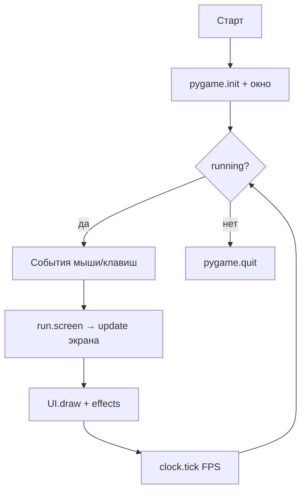
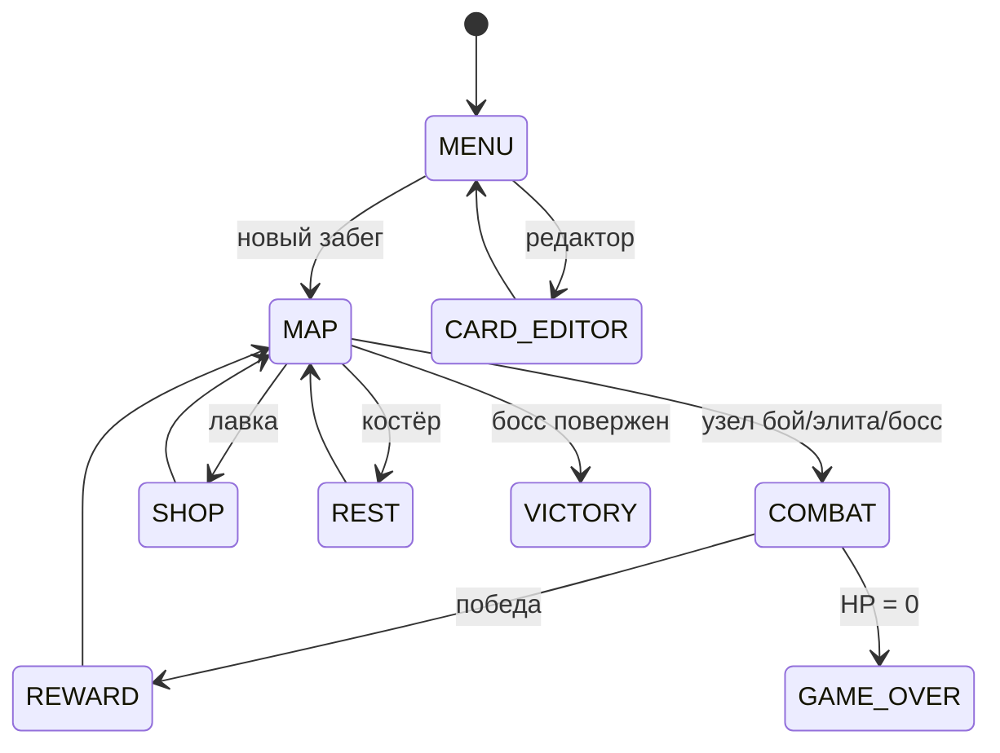
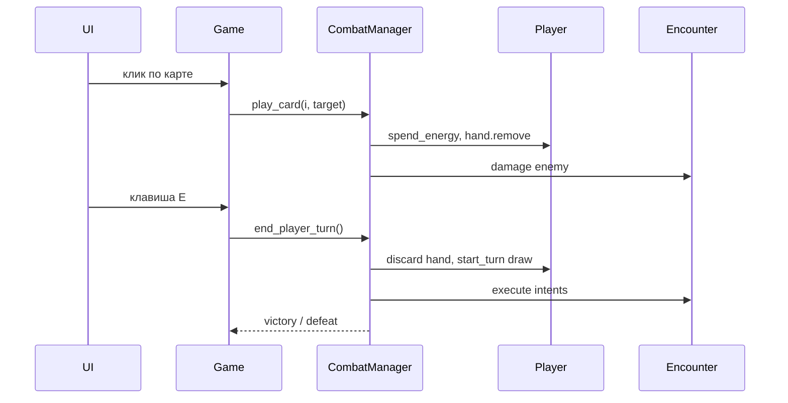
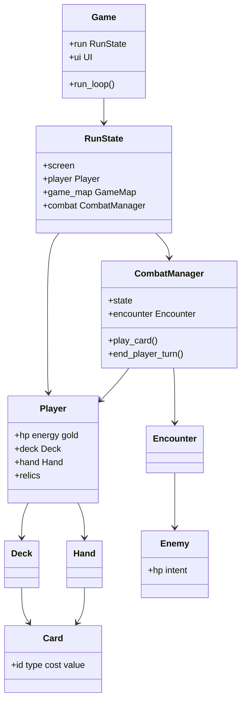
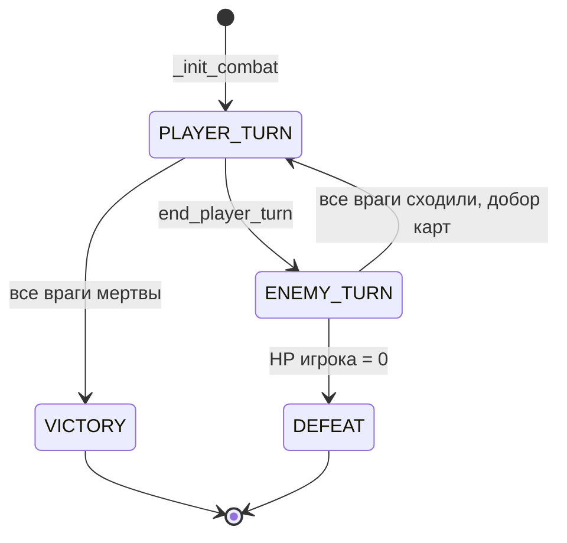
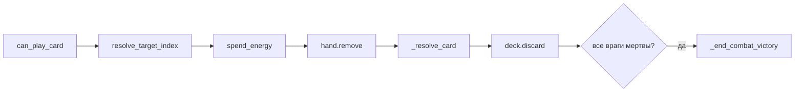
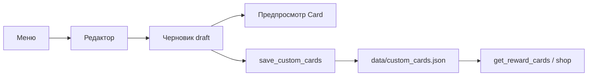

import ExternalCodeEmbed from '@site/src/components/ExternalCodeEmbed';


# Python — карточная стратегия

<div class="article-tags">
  <span class="tag tag-inprogress">В РАЗРАБОТКЕ</span>
</div>

<span class="complexity-badge">Разработчику</span>
<span class="complexity-badge">Средний уровень</span>

<div class="callout callout--info">
  <div class="callout-title">Формат практикума</div>

  <div class="callout-body">
  Материалы трека приводятся к единому формату: <strong>полные листинги для копирования</strong> на каждом этапе, блок <strong>"Разбор"</strong> и раздел <strong>"Полная ревизия"</strong> в конце статьи.
  <ul>
    <li>Гарантированно запускаемые эталоны для сверки сейчас: <a href="https://github.com/Spirzen/BattleCity">Python — Battle City</a> (GitHub), <a href="https://github.com/Spirzen/Match3">Python — Match3</a> (GitHub, <code>match3.py</code>), <a href="./3.md#full-revision">Python — Ping Pong</a> (<code>#full-revision</code>).</li>
    <li>Раздел полной ревизии в этой статье ещё в работе — идите по этапам по порядку; если код перестал запускаться, сравните проект с этими эталонами.</li>
  </ul>
  </div>
</div>

## Как проходить практикум

- Копируйте **целиком** файлы из блоков кода каждого этапа.
- После каждого этапа **запускайте** проект (команда указана в главе) и пройдите чек-лист самопроверки.
- Если застряли — методология в разделе [Практикум разработки игр — о разделе](./intro.md); для сверки готовые треки [Battle City](https://github.com/Spirzen/BattleCity), [Match3](https://github.com/Spirzen/Match3) и [Ping Pong](./3.md#full-revision).

---

## О практикуме

Соберём **карточный roguelike** в духе *Slay the Spire* с темпом боя ближе к *Hearthstone* — колода, рука, энергия на ход, несколько врагов, намерения, карта путей между боями, награды и реликвии. Стек — **Python 3.10+** и **Pygame 2.5+**, без стороннего игрового движка.

<div class="callout callout--info">
  <div class="callout-title">Эталонный проект</div>

  <div class="callout-body">
  Полная реализация с 66+ картами, редактором, звуком и мета-прогрессом — репозиторий <a href="https://github.com/Spirzen/AutoBattler">Spirzen/AutoBattler</a> ("Тени Шпиля"). Практикум ведёт к той же архитектуре папок и модулей; на каждом этапе код <strong>запускается</strong>, даже если это только меню или один бой на прямоугольниках.
  </div>
</div>

<div class="callout callout--info">
  <div class="callout-title">Для кого материал</div>

  <div class="callout-body">
  Нужны классы, списки, словари, базовый JSON и знакомство с Pygame из статьи <a href="/encyclopedia/5-languages/5-02-python/312">Разработка игр на Python</a>. Опыт deckbuilder-ов полезен, но не обязателен — механики вводим по одной.
  </div>
</div>

**Управление в финальной версии практикума**

| Действие | Управление |
|----------|------------|
| Клик по карте, врагу, узлу карты, кнопкам | **Мышь** |
| Завершить ход в бою | **E** |
| Меню / выход из редактора | **Esc** |

**Маршрут чтения**

1. [Архитектура](#architecture) — экраны, бой, данные.
2. [Зависимости и структура папок](#dependencies).
3. [Этап 0 — минимальный запуск](#stage-0).
4. Этапы 1–14 — ядро забега и боя.
5. [Этапы 15–16](#stage-15) — реестр эффектов и редактор карт (как в эталоне).
6. [Моддинг и отладка](#modding) · [Итоговая самопроверка](#final-checklist).

Имя папки в примерах — `auto_battler/`. Параллельно держите клон [AutoBattler](https://github.com/Spirzen/AutoBattler) (`F:\Projects\Games\AutoBattler` или `git clone`) и сверяйте одноимённые файлы после каждого этапа.

### Что получится в конце

| Результат | Описание |
|-----------|----------|
| **Играбельный забег** | меню → карта узлов → бои → награда → костёр/лавка → босс |
| **Чистая архитектура** | логика без Pygame в `classes/`, контент в `data/*.json` |
| **Мост к эталону** | те же имена экранов, `CombatManager`, `RunState`, что в "Тенях Шпиля" |

Ориентир по времени (с перерывами, без полировки графики):

| Блок | Этапы | Часы |
|------|-------|------|
| Окно и данные | 0–3 | 2–4 |
| Бой без UI | 4–7 | 4–6 |
| Pygame и забег | 8–11 | 6–10 |
| Мета и контент | 12–16 | 4–8 |
| **Итого** | 0–16 | **16–28** |

---

<span id="architecture"></span>
## Архитектура

Карточный roguelike строится вокруг **забега** (run): карта узлов → события → сражения → усиление колоды → босс. Каждый бой — отдельная подсистема со своим конечным автоматом; между боями колода и реликвии сохраняются, HP и золото тоже.

### Жанровые опоры

| Идея | Откуда в жанре | Как реализуем |
|------|----------------|---------------|
| Карта путей | *Slay the Spire* | `GameMap`, узлы `combat` / `rest` / `shop` … |
| Энергия и рука каждый ход | *Hearthstone*, *Slay the Spire* | `Player.energy`, добор в `CombatManager` |
| Намерения врагов | *Slay the Spire* | `Enemy._plan_intent()`, иконка на UI |
| Несколько врагов | *Darkest Dungeon*, STS (редко) | `Encounter`, выбор цели атаки |
| Реликвии | STS | пассивные объекты на `Player.relics` |
| Контент в данных | моддинг | `data/cards.json`, `enemies.json` |

### Игровой цикл Pygame



Класс `Game` в `main.py` — **оркестратор**: он не считает урон карт напрямую, а делегирует `RunState` и `CombatManager`.

### Экраны забега (конечный автомат UI)



Поле `RunState.screen` переключает ветки в `Game._handle_click` и `UI.draw_*`. Логика боя живёт в `CombatManager`, пока `screen == combat`.

### Слои приложения

| Слой | Ответственность | Модули |
|------|-----------------|--------|
| **Данные** | Карты, враги, реликвии из JSON | `data/*`, `card_catalog.py` |
| **Модель** | Сущности и правила без Pygame | `card.py`, `player.py`, `enemy.py`, `combat.py`, `relic.py` |
| **Забег** | Карта, золото, смена экранов | `game_state.py`, `map.py` |
| **Представление** | Рисование, хитбоксы | `ui.py`, `widgets.py`, `effects.py` |
| **Вход** | Клики, клавиши | `main.py` → `Game` |

Правило для поддерживаемости: **урон и блок считаются в `CombatManager`**, UI только вызывает `play_card(index)` и `end_player_turn()`.

### Поток данных в бою



### Целевая структура файлов

К концу практикума (и в [AutoBattler](https://github.com/Spirzen/AutoBattler)) дерево выглядит так:

```
auto_battler/
├── main.py                 # класс Game, цикл while
├── settings.py             # баланс, цвета, константы типов карт
├── locale.py               # строки UI (опционально с этапа 9)
├── requirements.txt
├── save_data.json          # создаётся игрой, в .gitignore
│
├── classes/
│   ├── card.py             # Card, Deck, Hand
│   ├── card_catalog.py     # загрузка JSON
│   ├── player.py
│   ├── enemy.py
│   ├── combat.py
│   ├── relic.py
│   ├── map.py
│   ├── game_state.py       # RunState, SaveSystem
│   ├── card_effects.py     # этап 15
│   ├── card_text.py        # подписи эффектов
│   ├── card_editor.py      # этап 16
│   ├── widgets.py          # поля ввода редактора
│   ├── ui.py               # отрисовка
│   ├── effects.py          # вспышки (опционально)
│   ├── audio.py            # звук (опционально)
│   └── transitions.py      # fade и баннеры (опционально)
│
└── data/
    ├── cards.json
    ├── enemies.json
    ├── relics.json
    └── custom_cards.json   # создаёт редактор
```

На **этапах 0–5** достаточно `main.py` + `settings.py` + один-два файла в `classes/`. Папку `data/` добавляем на **этапе 2**.

### Диаграмма классов (целевая)



<div class="callout callout--tip">
  <div class="callout-title">Почему JSON, а не код для каждой карты</div>

  <div class="callout-body">
  Дизайнер баланса правит <code>data/cards.json</code> без пересборки логики. Код знает <strong>типы</strong> (<code>attack</code>, <code>block</code>, <code>buff</code>…) и <strong>эффекты</strong> (<code>vulnerable</code>, <code>draw</code>…), а числа лежат в данных — так устроен и полный AutoBattler.
  </div>
</div>

### Глоссарий механик

| Термин | Значение в практикуме |
|--------|------------------------|
| **Забег (run)** | одна попытка пройти карту от старта до босса или смерти |
| **Колода (deck)** | все карты игрока; в бою делится на стопку добора и сброс |
| **Рука (hand)** | карты, которые можно разыграть сейчас (лимит 10) |
| **Энергия** | ресурс хода; восстанавливается в `start_turn` |
| **Броня (block)** | поглощает урон до конца хода (у игрока и врагов) |
| **Намерение (intent)** | запланированное действие врага на следующий его ход |
| **Энкаунтер** | группа врагов в одном бою |
| **Узел** | точка на карте путей (бой, лавка, костёр…) |
| **Реликвия** | пассивный артефакт на весь забег |
| **Мета-прогресс** | статистика и открытия между забегами в `save_data.json` |

### Конечный автомат боя

Отдельно от экранов UI у `CombatManager` три состояния хода:



Пока `state == player_turn`, принимаются `play_card` и клики по цели. Фаза врага **блокирует** ввод — в эталоне это же условие плюс `ScreenFade` / баннеры в `Game._input_blocked()`.

### Формулы урона и брони

Базовые правила совпадают с *Slay the Spire* и с `Player` / `Enemy` в AutoBattler:

| Ситуация | Формула |
|----------|---------|
| Атака по врагу | `урон = value + player.strength` (плюс модификаторы карт) |
| Входящий урон по игроку с **Уязвимостью** | `int(amount * 1.5)` |
| Входящий урон по игроку с **бронёй** | сначала вычитается `block`, остаток бьёт HP |
| **Слабость** у атакующего врага | урон врага уменьшается (в эталоне — в `Enemy._calc_damage`) |
| **Хрупкость (frail)** | получаемая броня ×0.75 |

Урон по врагу с бронёй: `dealt = max(0, amount - enemy.block)`, затем `enemy.block` уменьшается. **Пробивание** (`pierce` в `card_effects.py`) обходит броню и бьёт HP напрямую.

### Раскладка экрана боя (1280×720)

Эталон рисует зоны предсказуемо — удобно повторить на этапе 8:

```
┌────────────────────────────────────────────────────────────────┐
│  [HP] [Энергия] [Броня] [Золото]     реликвии (иконки)       │
├────────────────────────────────────────────────────────────────┤
│                                                                │
│     Враг 1          Враг 2          Враг 3                     │
│     [intent]        [intent]        [intent]                   │
│                                                                │
│                     журнал боя (последние 5–8 строк)           │
├────────────────────────────────────────────────────────────────┤
│              [карта][карта][карта][карта][карта]               │
│                                    [ Конец хода (E) ]          │
└────────────────────────────────────────────────────────────────┘
```

Константы размеров карт в эталоне — `CARD_WIDTH = 160`, `CARD_HEIGHT = 240`, `CARD_SPACING = 12` в `settings.py`. Рука центрируется по формуле из этапа 8.

### Карта этапов → файлы эталона

| Этап | Вы добавляете | Сверка в AutoBattler |
|------|---------------|----------------------|
| 0–1 | `main.py`, `settings.py` | `main.py`, `settings.py` |
| 2 | `Card`, `data/cards.json` | `classes/card.py`, `data/cards.json` |
| 3–4 | `Deck`, `Hand`, `Player` | `classes/card.py`, `classes/player.py` |
| 5 | `Enemy`, `Encounter` | `classes/enemy.py`, `data/enemies.json` |
| 6–7 | `CombatManager` | `classes/combat.py` |
| 8 | `UI.draw_combat` | `classes/ui.py` (фрагмент) |
| 9–11 | `RunState`, `GameMap` | `classes/game_state.py`, `classes/map.py` |
| 12–13 | реликвии, shop/rest | `classes/relic.py`, экраны в `main.py` |
| 14 | `SaveSystem`, `locale` | `classes/game_state.py`, `locale.py` |
| 15 | `card_effects.py` | `classes/card_effects.py` |
| 16 | редактор | `classes/card_editor.py`, `card_catalog.py` |

---

<span id="dependencies"></span>
## Зависимости и подготовка окружения

### Требования

- **Python 3.10+** (аннотации `list[Card]`, `int | None`).
- **Pygame 2.5+** — единственная внешняя зависимость в `requirements.txt` эталона.

### Установка

```bash
mkdir auto_battler && cd auto_battler
python -m venv .venv
```

Активация:

- **Windows (PowerShell):** `.venv\Scripts\Activate.ps1`
- **Linux / macOS:** `source .venv/bin/activate`

```bash
pip install pygame
python -c "import pygame; print('Pygame', pygame.ver)"
```

`requirements.txt`:

```
pygame>=2.5.0
```

### Клон эталона для сверки

```bash
git clone https://github.com/Spirzen/AutoBattler.git
cd AutoBattler
pip install -r requirements.txt
python main.py
```

Окно **1280×720**, главное меню на русском. Практикум можно проходить **параллельно** в `auto_battler/`, сверяя готовые модули с одноимёнными файлами в репозитории.

### Пакет `classes` и `.gitignore`

Создайте пустые файлы, чтобы импорты `from classes.card import …` работали стабильно:

```
auto_battler/
├── classes/
│   └── __init__.py      # можно оставить пустым
```

`.gitignore` в корне учебного проекта:

```
.venv/
__pycache__/
*.pyc
save_data.json
data/custom_cards.json
```

В AutoBattler `save_data.json` и `custom_cards.json` тоже исключены из git — прогресс и кастомные карты локальны.

### Шрифты с кириллицей

Pygame по умолчанию может взять шрифт без русских букв. Эталон перебирает список:

```python
FONT_NAMES = ["segoeui", "arial", "tahoma", "calibri", "verdana"]

def pick_font(size: int, bold: bool = False):
    for name in settings.FONT_NAMES:
        path = pygame.font.match_font(name, bold=bold)
        if path:
            return pygame.font.Font(path, size)
    return pygame.font.SysFont(None, size)
```

Подключите `pick_font` на этапе 8 в `UI.__init__`.

<div class="callout callout--warning">
  <div class="callout-title">Кодировка JSON</div>

  <div class="callout-body">
  Файлы в <code>data/</code> сохраняйте в <strong>UTF-8</strong> с <code>ensure_ascii=False</code> при записи из Python — иначе кириллица в названиях карт сломается на Windows.
  </div>
</div>

---

<span id="stage-0"></span>
## Этап 0 — минимальный запускаемый код

**Цель** — окно 1280×720, цикл 60 FPS, выход по крестику и `Esc`. Размер совпадает с эталоном, чтобы дальше не перенастраивать UI.

`main.py`:


<ExternalCodeEmbed example="python/sp-9-9-04-razrabotka-igr-praktikum-razrabotki-igr-7-001" title="Этап 0 — минимальный запускаемый код" minHeight={588} />


**Самопроверка**

- [ ] Окно без traceback.
- [ ] `Esc` и крестик закрывают программу.
- [ ] Стабильные ~60 FPS (без `tick` кадр "улетает").

---

<span id="stage-1"></span>
## Этап 1 — настройки и палитра

**Цель** — вынести константы в `settings.py`, подготовить типы карт и цвета как в AutoBattler.

`settings.py`:


<ExternalCodeEmbed example="python/sp-9-9-04-razrabotka-igr-praktikum-razrabotki-igr-7-002" title="Этап 1 — настройки и палитра" minHeight={588} />


Обновите `main.py` — импорт `settings`, заливка фона, подпись этапа.

**Самопроверка**

- [ ] Все модули импортируют размеры только из `settings`.
- [ ] Цвета карт заданы один раз в `CARD_TYPE_COLORS`.

---

<span id="stage-2"></span>
## Этап 2 — модель карты и JSON

**Цель** — класс `Card`, загрузка базы из `data/cards.json`, фабрика `create_card`.

Создайте `data/cards.json` (минимальный набор):


<ExternalCodeEmbed example="json/sp-9-9-04-razrabotka-igr-praktikum-razrabotki-igr-7-003" title="Этап 2 — модель карты и JSON" minHeight={624} />


`classes/card.py`:


<ExternalCodeEmbed example="python/sp-9-9-04-razrabotka-igr-praktikum-razrabotki-igr-7-004" title="Этап 2 — модель карты и JSON" minHeight={720} />


Проверка из консоли (из корня `auto_battler/`):

```bash
python -c "from classes.card import create_starting_deck; print(len(create_starting_deck()), create_starting_deck[0].name)"
```

Ожидается `10 Удар`.

**Самопроверка**

- [ ] `FileNotFoundError` исчезает при запуске из корня проекта.
- [ ] У каждой карты есть `type`, `cost`, `value`.

### Справочник полей `cards.json` (эталон)

Практикум начинает с короткой записи; в [AutoBattler](https://github.com/Spirzen/AutoBattler/blob/main/data/cards.json) карты богаче. Основные поля класса `Card`:

| Поле | Тип | Роль |
|------|-----|------|
| `id` | string | ключ в базе, дубликаты в колоде допустимы |
| `name`, `description` | string | UI и подсказка |
| `type` | string | `attack`, `block`, `buff`, `debuff`, `draw`, `creature` |
| `cost` | int | энергия при розыгрыше |
| `value` | int | урон или величина эффекта по типу |
| `rarity` | string | `basic`, `common`, `uncommon`, `rare` |
| `block` | int | доп. броня на карте атаки |
| `draw` | int | добор при розыгрыше |
| `aoe` | bool | урон/дебафф по всем врагам |
| `effect`, `effect_value` | string, int | первый бонус (`vulnerable`, `poison`…) |
| `effect2`, `effect2_value` | string, int | второй бонус |
| `bonuses` | list[dict] | несколько эффектов в одной карте |
| `lifesteal`, `pierce` (через bonuses) | bool | флаги из `card_effects.py` |
| `kind` | string | `spell` / `creature` для редактора |
| `health` | int | "здоровье" существа → броня при розыгрыше |

Пример карты эталона с двумя эффектами (сокращённо):

```json
{
  "id": "uppercut",
  "name": "Апперкот",
  "type": "attack",
  "cost": 2,
  "value": 13,
  "effect": "vulnerable",
  "effect_value": 2,
  "effect2": "weak",
  "effect2_value": 1,
  "description": "Удар с ослаблением.",
  "rarity": "uncommon"
}
```

На этапе 15 эти поля обрабатывает `apply_on_play_bonuses`, а не разросшийся `if` внутри `play_card`.

---

<span id="stage-3"></span>
## Этап 3 — колода и рука

**Цель** — `Deck` (стопка добора, сброс, перетасовка) и `Hand` (лимит карт).

Дополните `classes/card.py` — классы `Deck` и `Hand` в том же файле, что и `Card`:


<ExternalCodeEmbed example="python/sp-9-9-04-razrabotka-igr-praktikum-razrabotki-igr-7-005" title="Этап 3 — колода и рука" minHeight={720} />


Тест:

```python
from classes.card import create_starting_deck, Deck, Hand

d = Deck(create_starting_deck())
h = Hand()
for c in d.draw(5):
    h.add(c)
print([c.name for c in h.cards], "осталось в колоде", len(d.draw_pile))
```

**Самопроверка**

- [ ] Пустая стопка добора перетасовывает сброс.
- [ ] Рука не принимает 11-ю карту при `MAX_HAND = 10`.

---

<span id="stage-4"></span>
## Этап 4 — игрок (HP, энергия, блок)

**Цель** — `Player` с боевым сбросом состояния и экономикой урона/брони.

`classes/player.py`:


<ExternalCodeEmbed example="python/sp-9-9-04-razrabotka-igr-praktikum-razrabotki-igr-7-006" title="Этап 4 — игрок (HP, энергия, блок)" minHeight={720} />


**Самопроверка**

- [ ] `reset_combat` возвращает все карты в колоду и тасует.
- [ ] Блок поглощает урон до обнуления HP.

---

<span id="stage-5"></span>
## Этап 5 — враг, намерение, энкаунтер

**Цель** — один враг с циклом намерений `attack` / `block`, загрузка из JSON.

`data/enemies.json`:


<ExternalCodeEmbed example="json/sp-9-9-04-razrabotka-igr-praktikum-razrabotki-igr-7-007" title="Этап 5 — враг, намерение, энкаунтер" minHeight={426} />


`classes/enemy.py` (упрощённо):


<ExternalCodeEmbed example="python/sp-9-9-04-razrabotka-igr-praktikum-razrabotki-igr-7-008" title="Этап 5 — враг, намерение, энкаунтер" minHeight={720} />


**Самопроверка**

- [ ] После хода врага видно **следующее** намерение (`_plan_intent` в конце).
- [ ] `Encounter.all_dead()` становится `True`, когда HP врага 0.

### Отображение намерений

В эталоне `locale.INTENT_LABELS` переводит `attack` → "Атака", `block` → "Защита", `buff` → "Усиление". Цвета — `INTENT_COLORS` в `enemy.py`. На UI рисуйте под портретом врага:

```python
label = INTENT_LABELS.get(enemy.current_intent, "?")
value = enemy.intent_value
color = INTENT_COLORS.get(enemy.current_intent, (200, 200, 200))
# иконка: красный клинок для attack, щит для block
```

Игрок всегда видит **следующий** ход врага — ключевое отличие deckbuilder от "чистого" автобаттлера без информации.

---

<span id="stage-6"></span>
## Этап 6 — CombatManager без UI

**Цель** — пошаговый бой в консоли или через `print` — розыгрыш карт, конец хода, ход врагов.

`classes/combat.py`:


<ExternalCodeEmbed example="python/sp-9-9-04-razrabotka-igr-praktikum-razrabotki-igr-7-009" title="Этап 6 — CombatManager без UI" minHeight={720} />


Запуск: `python -m classes.combat` (из корня, с пакетом `classes` как папкой; при необходимости добавьте пустые `classes/__init__.py`).

**Самопроверка**

- [ ] Атака тратит энергию и уходит в сброс.
- [ ] После `end_player_turn` враг бьёт, игрок добирает карты.
- [ ] Победа при `hp` врага ≤ 0.

### Цепочка `play_card` в эталоне

Когда учебный `CombatManager` обрастает механиками, перенесите разбор эффектов в отдельный метод — как в AutoBattler:



Тело `_resolve_card` в эталоне:

1. Собрать `targets` (один враг, AOE или случайный).
2. Нанести урон / выдать броню / призвать "существо".
3. Вызвать `apply_on_play_bonuses` для `effect` / `bonuses[]`.
4. Обработать `draw`, `energy_gain`, `self_damage`.
5. При флаге **Echo** — повторить удар.

Упрощённый скелет для этапа 15:

```python
def _resolve_card(self, card, target_index: int | None) -> list[str]:
    messages = []
    living = self.encounter.get_living_enemies()
    # ... урон / блок по type ...
    apply_on_play_bonuses(self, card, target_index, messages)
    if card.draw:
        for c in self.player.deck.draw(card.draw):
            self.player.hand.add(c)
    return messages
```

<div class="callout callout--tip">
  <div class="callout-title">Журнал боя</div>

  <div class="callout-body">
  Метод <code>_add_log</code> в эталоне обрезает список до 8 строк — UI всегда читает "хвост", без прокрутки.
  </div>
</div>

---

<span id="stage-7"></span>
## Этап 7 — несколько врагов и выбор цели

**Цель** — энкаунтер из 2–3 врагов, поле `selected_enemy_index`, атаки только по живым.

Расширьте `create_encounter`:

```python
def create_combat_encounter(node_type: str) -> Encounter:
    db = load_enemies()
    if node_type == "elite":
        return Encounter([Enemy(db[1], 1.4)])
    group = [Enemy(db[0]), Enemy(db[0])]
    return Encounter(group)
```

В `CombatManager` добавьте:


<ExternalCodeEmbed example="python/sp-9-9-04-razrabotka-igr-praktikum-razrabotki-igr-7-010" title="Этап 7 — несколько врагов и выбор цели" minHeight={372} />


В эталоне AutoBattler то же делает `CombatManager.card_needs_target` и клик по портрету врага перед картой.

### Генерация энкаунтера по этажу (эталон)

В `classes/enemy.py` функция `create_combat_encounter(is_elite, is_boss, floor)` подбирает состав и число врагов:

- **босс** — один из `hexaghost`, `slime_boss`, `guardian`;
- **элита** — `gremlin_nob` или `sentry`, множитель HP `1.1`;
- **обычный бой** — пул зависит от `floor`, от 1 до 3 врагов с весами.

Подключите упрощённую версию при входе в бой с карты:

```python
def start_combat_from_node(self, node):
    from classes.enemy import create_combat_encounter
    elite = node.type == settings.NODE_ELITE
    boss = node.type == settings.NODE_BOSS
    floor = node.floor
    enc = create_combat_encounter(elite, boss, floor)
    self.combat = CombatManager(self.player, enc)
    self.screen = self.SCREEN_COMBAT
```

**Самопроверка**

- [ ] Атака без живых врагов возвращает `False`.
- [ ] Можно переключить цель между двумя слизнями.
- [ ] На этаже 3+ иногда появляется два врага.

---

<span id="stage-8"></span>
## Этап 8 — боевой UI (рука, энергия, журнал)

**Цель** — один экран боя — прямоугольники карт, полоса HP, кнопка "Конец хода", журнал снизу.

`classes/ui.py` (фрагмент):


<ExternalCodeEmbed example="python/sp-9-9-04-razrabotka-igr-praktikum-razrabotki-igr-7-011" title="Этап 8 — боевой UI (рука, энергия, журнал)" minHeight={720} />


`main.py` — режим "только бой" для отладки:


<ExternalCodeEmbed example="python/sp-9-9-04-razrabotka-igr-praktikum-razrabotki-igr-7-012" title="Этап 8 — боевой UI (рука, энергия, журнал)" minHeight={720} />


**Самопроверка**

- [ ] Клик по карте с достаточной энергией наносит урон.
- [ ] `E` завершает ход, враг атакует, в журнале новые строки.
- [ ] Серая карта при нехватке маны (визуально темнее).

### Двухшаговый ввод (карта → цель)

В AutoBattler `Game._handle_click` для боя устроен так:

1. Клик по **врагу** — запомнить `combat.selected_enemy_index`.
2. Клик по **карте** — если карте нужна цель и враг не выбран при нескольких живых, розыгрыш отклоняется; иначе `play_card(index, selected_enemy_index)`.
3. Клик по кнопке "Конец хода" или клавиша **E** — `end_player_turn()`.

Учебный обработчик:


<ExternalCodeEmbed example="python/sp-9-9-04-razrabotka-igr-praktikum-razrabotki-igr-7-013" title="Двухшаговый ввод (карта → цель)" minHeight={372} />


Храните `last_hand_rects` / `last_enemy_rects` в `UI` после отрисовки — **те же координаты**, что при `draw`, иначе клики "мимо".

---

<span id="stage-9"></span>
## Этап 9 — RunState и главное меню

**Цель** — переключение `screen` между меню и боем, класс `Game` как в AutoBattler.

`classes/game_state.py`:


<ExternalCodeEmbed example="python/sp-9-9-04-razrabotka-igr-praktikum-razrabotki-igr-7-014" title="Этап 9 — RunState и главное меню" minHeight={498} />


`main.py` — кнопка "Новый бой (тест)" на меню и `RunState`.

Сверьте с `RunState` в [game_state.py эталона](https://github.com/Spirzen/AutoBattler/blob/main/classes/game_state.py) — там больше экранов (`reward`, `shop`, `rest`, `victory`).

**Самопроверка**

- [ ] Из меню вход в бой и возврат `Esc` (пока без карты).
- [ ] `RunState` не создаёт второй `CombatManager`, пока бой не закончен.

---

<span id="stage-10"></span>
## Этап 10 — процедурная карта узлов

**Цель** — `GameMap` с этажами и связями, клик по доступному узлу запускает бой.

`classes/map.py` (ядро):


<ExternalCodeEmbed example="python/sp-9-9-04-razrabotka-igr-praktikum-razrabotki-igr-7-015" title="Этап 10 — процедурная карта узлов" minHeight={720} />


Добавьте в `settings.py` константы `NODE_COMBAT`, `NODE_REST`, `NODE_BOSS`, `NODE_COLORS`.

В `RunState.start_new_run()`:

```python
from classes.map import GameMap

def start_new_run(self):
    self.player = Player()
    self.game_map = GameMap()
    self.combat = None
    self.screen = self.SCREEN_MAP
```

**Самопроверка**

- [ ] После первого узла доступны только соседи следующего этажа.
- [ ] Узел босса на последнем этаже.

### Веса узлов (эталон)

В `GameMap._random_node_type` эталон задаёт вероятности:

| Тип | Вес | Смысл |
|-----|-----|-------|
| `combat` | 45 | обычный бой |
| `elite` | 12 | сложный бой, лучшая награда |
| `rest` | 8 | лечение / кузница |
| `shop` | 10 | покупки |
| `treasure` | 8 | реликвия |
| `event` | 17 | случайное событие |

Каждый 5-й этаж (`f % 5 == 0`) в генераторе эталона принудительно получает **костёр** в одной из колонок — ритм "бой → бой → отдых".

Отрисовка карты — `UI.draw_map` — узлы по координатам `(floor, row)`, линии между `connections`, подсветка `available` / `completed`.

---

<span id="stage-11"></span>
## Этап 11 — связка карта → бой → награда

**Цель** — после победы экран `reward` с тремя картами на выбор, добавление в колоду.

`classes/card_catalog.py`:

```python

import random

from classes.card import load_card_database, create_card, Card


def get_reward_cards(count: int = 3, exclude_basic: bool = True) -> list[Card]:
    pool = load_card_database()
    if exclude_basic:
        pool = [c for c in pool if c.get("rarity") != "basic"]
    picks = random.sample(pool, min(count, len(pool)))
    return [create_card(p) for p in picks]
```

В `RunState`:

```python
SCREEN_REWARD = "reward"

def on_combat_victory(self):
    from classes.card_catalog import get_reward_cards
    self.reward_cards = get_reward_cards(3)
    self.screen = self.SCREEN_REWARD

def pick_reward(self, index: int):
    if 0 <= index < len(self.reward_cards):
        self.player.deck.add_to_draw(self.reward_cards[index])
    self.reward_cards = []
    self.screen = self.SCREEN_MAP
```

`Game` после `combat.combat_over` и `combat.victory` вызывает `run.on_combat_victory()`.

**Самопроверка**

- [ ] Колода растёт после выбора карты.
- [ ] Возврат на карту, текущий узел отмечен пройденным.

---

<span id="stage-12"></span>
## Этап 12 — реликвии

**Цель** — пассивный предмет на весь забег, срабатывание при старте боя.

`data/relics.json`:


<ExternalCodeEmbed example="json/sp-9-9-04-razrabotka-igr-praktikum-razrabotki-igr-7-016" title="Этап 12 — реликвии" minHeight={390} />


`classes/relic.py` + хуки в `CombatManager._init_combat` и после победы.

```python
def apply_relic_on_combat_start(player, relic):
    if relic.effect == "extra_draw":
        return relic.value  # добавить к STARTING_HAND в _init_combat
    return 0

def apply_relic_on_combat_end(player, relic, victory: bool):
    if victory and relic.effect == "heal_after_combat":
        player.heal(relic.value)
```

В `RunState.start_new_run` выдайте стартовую реликвию:

```python
from classes.relic import get_starter_relic
self.player.relics.append(get_starter_relic())
```

**Самопроверка**

- [ ] После победы HP растёт при `burning_blood`.
- [ ] Враги начинают бой с уязвимостью при `bag_of_marbles`.

---

<span id="stage-13"></span>
## Этап 13 — лавка и костёр

**Цель** — узлы `shop` и `rest` на карте.

| Узел | Логика |
|------|--------|
| **rest** | +30% `max_hp` или улучшение случайной карты в колоде |
| **shop** | покупка карты за 50 золота, удаление карты за 75 |

В эталоне экраны `SCREEN_SHOP`, `SCREEN_REST`, списки `shop_cards` / `shop_relics` в `RunState`.

Минимальный `rest`:

```python
def rest_heal(self):
    heal = max(1, int(self.player.max_hp * 0.3))
    self.player.hp = min(self.player.max_hp, self.player.hp + heal)
```

**Самопроверка**

- [ ] Золото уменьшается при покупке.
- [ ] На костре HP не превышает максимум.

---

<span id="stage-14"></span>
## Этап 14 — сохранения, локализация, полировка

**Цель** — мета-прогресс между забегами и вынос строк.

`SaveSystem` (как в эталоне):

- `total_runs`, `total_wins`, `best_floor`, `unlocked_cards`;
- файл `save_data.json` в корне, в `.gitignore`;
- `record_run_end(floor, won, kills)` при `GAME_OVER` / `VICTORY`.

`locale.py` — константы `MENU_NEW_RUN`, `COMBAT_YOUR_TURN`, подписи узлов. В AutoBattler весь видимый текст вынесен туда для единообразия.

Опциональные улучшения как в репозитории:

- `classes/audio.py` — процедурные звуки без файлов;
- `classes/effects.py` — вспышки урона, частицы победы;
- `classes/card_editor.py` — редактор кастомных карт → `data/custom_cards.json`;
- `classes/card_effects.py` — расширенные эффекты (~40 механик).

Рефакторинг `main.py` в класс `Game`:


<ExternalCodeEmbed example="python/sp-9-9-04-razrabotka-igr-praktikum-razrabotki-igr-7-017" title="Этап 14 — сохранения, локализация, полировка" minHeight={408} />


**Самопроверка**

- [ ] Второй забег показывает статистику в меню.
- [ ] `main.py` остаётся тонким контроллером.

---

<span id="stage-15"></span>
## Этап 15 — реестр эффектов (`card_effects.py`)

**Цель** — вынести десятки механик из `CombatManager` в модуль с явными идентификаторами, как в [card_effects.py](https://github.com/Spirzen/AutoBattler/blob/main/classes/card_effects.py).

### Зачем отдельный файл

| Проблема без реестра | Решение |
|---------------------|---------|
| `play_card` на 400+ строк | `_resolve_card` + `apply_on_play_bonuses` |
| дубли `if effect == "poison"` | константы `EFFECT_POISON`, таблица целей |
| сложно тестировать | вызов `apply_effect(combat, bonus, target)` из unit-теста |

### Минимальный реестр (5 эффектов)

Создайте `classes/card_effects.py`:


<ExternalCodeEmbed example="python/sp-9-9-04-razrabotka-igr-praktikum-razrabotki-igr-7-018" title="Минимальный реестр (5 эффектов)" minHeight={720} />


### Тики яда и кровотечения в `_enemy_phase`

Перед `execute_intent` у каждого врага:

```python
if getattr(enemy, "poison", 0) > 0:
    enemy.take_damage(enemy.poison)
    enemy.poison = max(0, enemy.poison - 1)
```

В эталоне аналогичные тики и **Execute** (×1.5 по раненым), **Lifesteal**, **Echo** уже подключены — добавляйте по одному `elif` в `_apply_one` и строку в `card_text.BONUS_LABELS`.

**Самопроверка**

- [ ] Карта только с `effect: "vulnerable"` в JSON работает без правки `combat.py`.
- [ ] `collect_card_bonuses` видит и `bonuses[]`, и legacy-поля `effect` / `effect2`.

---

<span id="stage-16"></span>
## Этап 16 — редактор карт и `custom_cards.json`

**Цель** — экран `SCREEN_CARD_EDITOR`, сохранение пользовательских карт в пул наград и магазина.

### Поток редактора



### Черновик и виджеты

`CardEditorState` хранит `draft — dict` с полями `name`, `description`, `cost`, `damage`, `health`, `kind`, `effect`. В эталоне ввод через `TextInput`, `NumberInput`, `OptionPicker` из `classes/widgets.py`.

Минимальное сохранение:


<ExternalCodeEmbed example="python/sp-9-9-04-razrabotka-igr-praktikum-razrabotki-igr-7-019" title="Черновик и виджеты" minHeight={408} />


`card_catalog.load_all_cards()` = `cards.json` + `custom_cards.json`. После сохранения новая карта попадает в `get_reward_cards()` без перезапуска, если каталог перечитывается при генерации награды.

### Подсказки на картах

`classes/card_text.py` строит строки для tooltip из механики — `build_tooltip_lines(card, player_energy)`. Подключите на этапе 8 при наведении: если `card.get_tooltip_lines(energy)`, рисуйте всплывающий прямоугольник над картой.

**Самопроверка**

- [ ] Карта из редактора появляется в награде после победы.
- [ ] `Esc` возвращает в меню без падения.
- [ ] `custom_cards.json` в `.gitignore`.

---

<span id="modding"></span>
## Моддинг и отладка

### Баланс в `settings.py`

Эталонные значения (можно копировать в учебный проект):

```python
STARTING_HP = 85
STARTING_ENERGY = 3
STARTING_GOLD = 99
STARTING_HAND = 5
DRAW_PER_TURN = 5
MAX_HAND = 10
```

### Новый враг

Запись в `data/enemies.json` (ключ — `id`):

```json
"jaw_worm": {
  "name": "Челюстной червь",
  "hp": 40,
  "attack_damage": 11,
  "intent_pattern": ["attack", "buff", "attack"],
  "buff_value": 3,
  "description": "Разгоняется и бьёт сильно."
}
```

В эталоне файл — объект `id → данные`, в учебнике на этапе 5 — массив; при слиянии с эталоном приведите формат к одному стилю.

### Новая реликвия

```json
{
  "id": "oddly_smooth_stone",
  "name": "Гладкий камень",
  "description": "+1 энергия в начале боя.",
  "effect": "extra_energy",
  "value": 1,
  "rarity": "common"
}
```

Обработчик `extra_energy` в `apply_relic_on_combat_start` увеличивает `player.max_energy` на время забега или даёт энергию в первый ход — сверьте с `classes/relic.py` эталона.

### Отладка без UI

```bash
python -c "
from classes.player import Player
from classes.combat import CombatManager
from classes.enemy import create_encounter
p = Player()
c = CombatManager(p, create_encounter('slime'))
c.play_card(0, 0)
c.end_player_turn()
print(c.log[-3:])
"
```

### Логирование кликов

На время этапа 8:

```python
if event.type == pygame.MOUSEBUTTONDOWN:
    print("click", event.pos, "hand", getattr(ui, "last_hand_rects", []))
```

Сравните координаты клика с `Rect` карт — расхождение на 1–2 px часто из-за `CARD_OVERLAP` в эталоне (карты наезжают друг на друга, хитбокс уже визуальной ширины).

<div class="callout callout--caution">
  <div class="callout-title">Смешение list и dict в enemies.json</div>

  <div class="callout-body">
  Учебный этап 5 использует <strong>массив</strong> врагов, эталон — <strong>словарь</strong> по id. Перед копированием контента из AutoBattler конвертируйте формат или унифицируйте <code>load_enemies()</code>.
  </div>
</div>

---

<span id="final-checklist"></span>
## Итоговая самопроверка и эталон

### Чек-лист учебного прототипа

| # | Критерий | Да / нет |
|---|----------|----------|
| 1 | Окно 1280×720, стабильный FPS | |
| 2 | Карты и враги грузятся из JSON | |
| 3 | Колода, рука, сброс, перетасовка | |
| 4 | Энергия, блок, уязвимость работают | |
| 5 | Несколько врагов, выбор цели атаки | |
| 6 | Намерения врагов видны до их хода | |
| 7 | Карта узлов, переход в бой | |
| 8 | Награда — добавление карты в колоду | |
| 9 | Хотя бы одна реликвия влияет на бой | |
| 10 | Код разбит на `classes/*` и `data/*` | |
| 11 | Реестр эффектов отделён от боя | |
| 12 | Редактор пишет в `custom_cards.json` | |

### Сравнение с AutoBattler

| Компонент | Практикум (минимум) | [AutoBattler](https://github.com/Spirzen/AutoBattler) |
|-----------|---------------------|--------------------------------------------------------|
| Карт в базе | 3–10 + custom | 66+ |
| Эффекты | 5+, рост до ~40 | `card_effects.py`, `ALL_EFFECT_IDS` |
| Этажей карты | 8 | 15 (`GameMap.FLOORS`) |
| Враги | 2–3 id | 9 + боссы в JSON |
| Реликвии | 1–2 | 15 в `relics.json` |
| Редактор карт | этап 16 | `card_editor.py` + виджеты |
| Звук | — | процедурный `audio.py` |
| Переходы UI | — | `transitions.py`, `BannerQueue`, fade |
| Локализация | частично | `locale.py` целиком |

### Маршрут чтения эталона после практикума

Рекомендуемый порядок файлов в клоне:

1. `settings.py` — баланс и константы узлов.
2. `classes/card.py` → `card_catalog.py` → `card_effects.py` — данные и механика карт.
3. `classes/player.py` → `enemy.py` → `combat.py` — бой.
4. `classes/game_state.py` → `map.py` — забег.
5. `classes/ui.py` — отрисовка (большой файл, читайте по `draw_*`).
6. `main.py` — склейка экранов, `_handle_click`, звук и баннеры.

Полезные точки входа для экспериментов:

- изменить стартовую колоду — `create_starting_deck()` в `card_catalog.py`;
- усложнить обычные бои — `create_combat_encounter(..., floor=...)`;
- добавить баннер босса — `Game._on_screen_changed` при `NODE_BOSS`.

### Типичные ошибки

| Симптом | Вероятная причина | Что сделать |
|---------|------------------|-------------|
| Чёрный экран | нет `display.flip()` | вызов в конце цикла |
| Карты не кликаются | rect руки не совпадает с отрисовкой | храните `rect` в UI, передавайте в обработчик |
| Враг бьёт дважды за ход | `_plan_intent` не в конце `execute_intent` | планируйте намерение после действия |
| Колода "теряет" карты | при `reset_combat` не собрали discard | `get_all_cards()` как в эталоне |
| JSON не грузится | запуск не из корня | `cd auto_battler` или `_data_path()` от `__file__` |
| Бесконечный добор | нет лимита руки | `Hand.add` возвращает `False` |
| `play_card` всегда False при 2 врагах | нет выбранной цели | сначала клик по врагу |
| Эффект из JSON игнорируется | логика только в `attack`/`block` | этап 15, `apply_on_play_bonuses` |
| Кастомная карта не в награде | каталог не читает custom | `load_all_cards()` в `get_reward_cards` |

### Идеи для расширения (самостоятельно)

- **События** (`NODE_EVENT`) — случайный исход с риском HP/золота, как в эталоне `RunState` + `event_message`.
- **Существа** (`CARD_CREATURE`) — урон плюс `gain_block(health)` при розыгрыше.
- **Улучшение карт** на костре — копия карты с `upgraded: true` и +25% к `value`.
- **Достижения** в `SaveSystem.data["achievements"]`.
- **HoverAnimator** и вспышки урона из `effects.py` / `hover_anim.py`.
- Спрайты в `assets/` вместо `pygame.draw.rect`.
- Порт на **pygame-ce** при необходимости свежих сборок.

---

## Связанные материалы

- [Практикум разработки игр — о разделе](/encyclopedia/9-spinoff/9-04-razrabotka-igr/praktikum-razrabotki-igr/intro) — другие треки (Battle City, Tetris, diabloид).
- [Разработка игр на Python](/encyclopedia/5-languages/5-02-python/312) — Pygame, цикл, ввод.
- [Компьютерные игры — о разделе](/encyclopedia/1-basics/1-18-kompyuternye-igry/intro) — жанры deckbuilder и roguelike.
- Эталонный код — [github.com/Spirzen/AutoBattler](https://github.com/Spirzen/AutoBattler).

---
