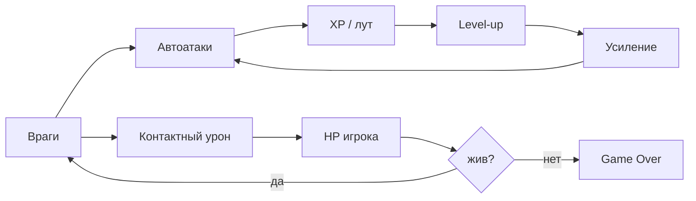
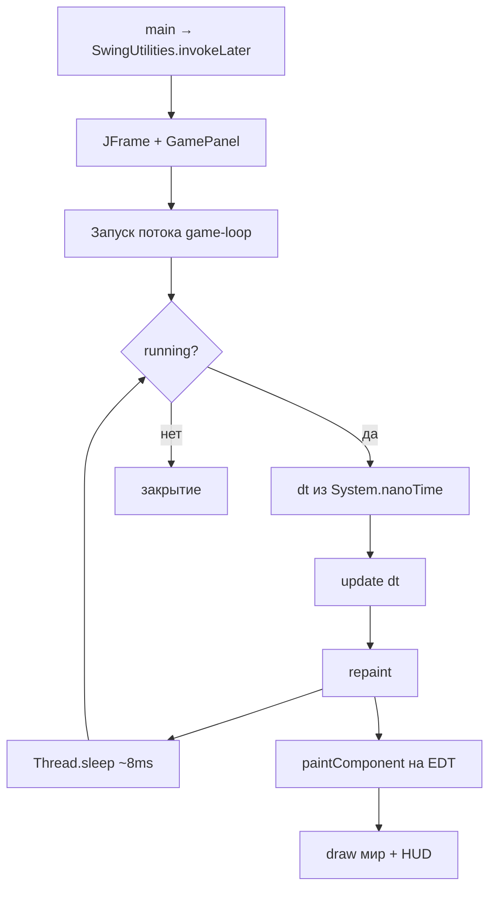
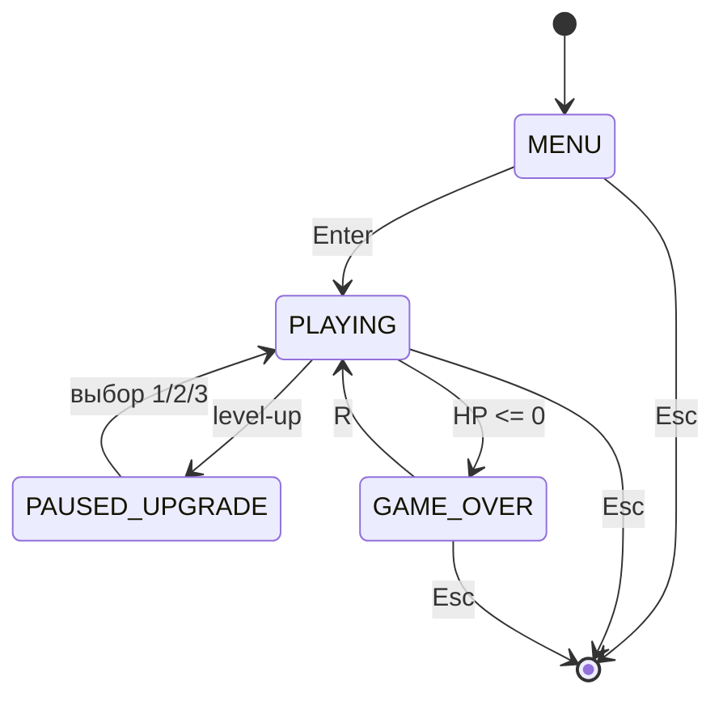
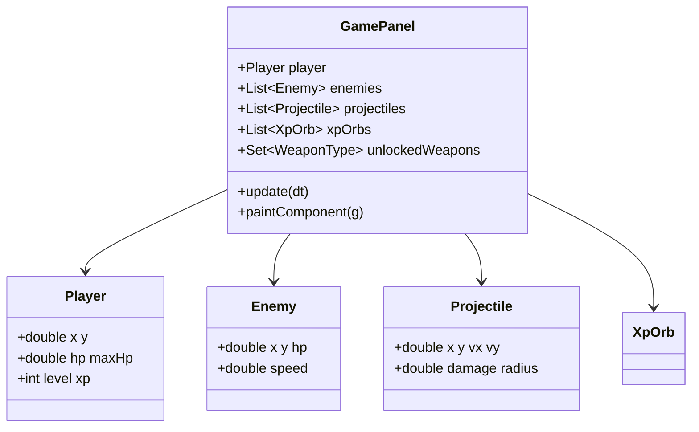

import ExternalCodeEmbed from '@site/src/components/ExternalCodeEmbed';


# Java — Java Survivors

<div class="article-tags">
  <span class="tag tag-inprogress">В РАЗРАБОТКЕ</span>
</div>

<span class="complexity-badge">Разработчику</span>
<span class="complexity-badge">Средний уровень</span>

<div class="callout callout--info">
  <div class="callout-title">Формат практикума</div>

  <div class="callout-body">
  Материалы трека приводятся к единому формату: <strong>полные листинги для копирования</strong> на каждом этапе, блок <strong>"Разбор"</strong> и раздел <strong>"Полная ревизия"</strong> в конце статьи.
  <ul>
    <li>Гарантированно запускаемые эталоны для сверки сейчас: <a href="https://github.com/Spirzen/BattleCity">Python — Battle City</a> (GitHub), <a href="https://github.com/Spirzen/Match3">Python — Match3</a> (GitHub, <code>match3.py</code>), <a href="./3.md#full-revision">Python — Ping Pong</a> (<code>#full-revision</code>).</li>
    <li>Раздел полной ревизии в этой статье ещё в работе — идите по этапам по порядку; если код перестал запускаться, сравните проект с этими эталонами.</li>
  </ul>
  </div>
</div>

## Как проходить практикум

- Копируйте **целиком** файлы из блоков кода каждого этапа.
- После каждого этапа **запускайте** проект (команда указана в главе) и пройдите чек-лист самопроверки.
- Если застряли — методология в разделе [Практикум разработки игр — о разделе](./intro.md); для сверки готовые треки [Battle City](https://github.com/Spirzen/BattleCity), [Match3](https://github.com/Spirzen/Match3) и [Ping Pong](./3.md#full-revision).

---

## О практикуме

**Vampire Survivors** и его клоны (**survivor-like**, **horde survival**) — арена сверху, волны врагов, **автоатаки** без прицеливания, опыт с поля и **пауза на выбор улучшений**. Полная реализация с десятками оружий, персонажами и сохранениями — в репозитории [Java Survivors](https://github.com/Spirzen/Java-Survivors) (локально: `F:\Projects\JVM\Java\Java Survivors`). Стек там — **Java 17**, **Swing**, **Java2D**, без сторонних игровых движков.

В этом практикуме соберём **узнаваемый прототип** с нуля — от пустого окна до врагов, магического болта, опыта, экрана прокачки, нескольких оружий, HUD и меню. Графика — круги и прямоугольники (как в ранней версии до спрайтов); в конце — карта расширений до уровня полного проекта.

<div class="callout callout--info">
  <div class="callout-title">Для кого материал</div>

  <div class="callout-body">
  Нужны базовый Java (классы, <code>enum</code>, коллекции, <code>List</code>, <code>Iterator</code>) и понимание ООП. Каждый этап — <strong>запускаемый код</strong>: после шага проект компилируется и показывает новую механику. Сборка — <strong>Maven</strong>; IDE — IntelliJ IDEA, VS Code с Extension Pack for Java или Cursor.
  </div>
</div>

**Управление в финальной версии практикума**

| Клавиша | Действие |
|---------|----------|
| `W` `A` `S` `D` или стрелки | Движение |
| `Пробел` | Рывок (dash) |
| `1` `2` `3` | Выбор улучшения на экране level-up |
| `Enter` | Старт с меню |
| `R` | Перезапуск после поражения |
| `Esc` | Выход |

**Маршрут чтения**

1. [Архитектура](#architecture) — как устроен проект до первой строки кода.
2. [Зависимости и структура](#dependencies) — JDK, Maven, пакеты.
3. [Этап 0 — минимальный запуск](#stage-0) — окно и игровой поток.
4. Этапы 1–18 — по одной (или паре) механик за шаг.
5. [Итоговая самопроверка](#final-checklist) — чек-лист и связь с полным репозиторием.

**Что должно получиться к этапу 18**

| Механика | Описание |
|----------|----------|
| Цикл | Отдельный поток + `dt`, отрисовка в `paintComponent` |
| Игрок | Круг, HP, реген, броня, движение по WASD |
| Враги | Спавн с краёв экрана, преследование, рост сложности |
| Оружие | Авто "магический болт", тройной залп, кольцо импульса |
| Опыт | Сферы XP, магнит, уровни, пауза на 3 улучшения |
| Урон | Снаряды, контакт, рывок с неуязвимостью |
| HUD | HP, полоска XP, время, счёт, волна |
| Состояния | Меню, игра, game over |

<div class="callout callout--tip">
  <div class="callout-title">Готовый проект</div>

  <div class="callout-body">
  Полная игра с персонажами, магазином и сохранениями — в <a href="https://github.com/Spirzen/Java-Survivors">Java Survivors</a>. Практикум ниже объясняет, <strong>как такой проект собирается с нуля</strong>; после этапа 18 можно построчно сравнить свой <code>com.survivors</code> с <code>com.diabloid</code> в репозитории.
  </div>
</div>

### Сводка этапов

| Этап | Тема | Новое в запуске |
|------|------|-----------------|
| [0](#stage-0) | Цикл | Окно, поток, `dt`, `repaint` |
| [1](#stage-1) | FSM | `GameState`, меню, `Esc` |
| [2](#stage-2) | Игрок | WASD, круг на арене |
| [3](#stage-3) | Враги | Спавн с краёв, преследование |
| [4](#stage-4) | Снаряды | Авто "магический болт" |
| [5](#stage-5) | Урон | Попадания, счёт, смерть врага |
| [6](#stage-6) | XP | Орбы, магнит, уровень |
| [7](#stage-7) | Перки | Пауза, 3 выбора, `1` `2` `3` |
| [8](#stage-8) | HUD | HP, XP, время, волна |
| [9](#stage-9) | Оружия | `WeaponType`, залп, кольцо |
| [10](#stage-10) | Выживание | Контакт, броня, реген |
| [11](#stage-11) | Рывок | Dash, i-frames |
| [12](#stage-12) | Juice | Цифры урона, частицы |
| [13](#stage-13) | Мета-ран | Game over, `resetRun` |
| [14](#stage-14) | Архетипы | SPEEDER, TANK, SHOOTER |
| [15](#stage-15) | Босс | Сложность по времени |
| [16](#stage-16) | Модули | `WeaponManager`, файлы |
| [17](#stage-17) | Арт | PNG, `MediaTracker` |
| [18](#stage-18) | Референс | Таблица фич полной игры |

### Чем survivor-like отличается от "обычного" шутера

| Аспект | Классический twin-stick | Survivor-like (VS, Java Survivors) |
|--------|-------------------------|-------------------------------------|
| Прицеливание | Игрок целится | Оружие само выбирает цель / паттерн |
| Прогресс в ране | Подбор на карте | Level-up с **выбором** из 3 карт |
| Давление | Волны по скрипту | Непрерывный спавн + рост `difficulty` по `worldTime` |
| Поражение | Жизни / чекпоинты | Один HP-бар, короткий рестарт |
| Сессия | 5–15 мин уровень | 10–30 мин один ран до смерти |

---

<span id="architecture"></span>
## Архитектура

Прежде чем писать код, зафиксируем **что из чего состоит** и **как данные текут по кадру**. Референсная архитектура совпадает с [Java Survivors](https://github.com/Spirzen/Java-Survivors): центральная панель владеет списками сущностей и вызывает обновление/отрисовку.

### Жанр и петля геймплея

Survivor-like строится на **положительной обратной связи**:

1. Враги приходят волнами → игрок убивает **автооружием**.
2. Выпадает **опыт** → уровень → **выбор перка** (сильнее).
3. Сложность растёт по **времени выживания** → нужны новые перки.
4. Смерть → короткий цикл "ещё раз".



### Игровой цикл (Swing)

В desktop-играх на Swing **нельзя** долго блокировать EDT (Event Dispatch Thread). В Java Survivors логика крутится в **отдельном потоке**, а перерисовка — через `repaint()` → `paintComponent`:



На каждом шаге **update** (если не меню и не пауза прокачки):

1. Увеличить `worldTime`, таймеры спавна и волн.
2. Движение игрока, реген HP.
3. Спавн врагов, ИИ преследования.
4. Кулдауны оружия → новые снаряды.
5. Движение снарядов, столкновения, смерть врагов → XP.
6. Магнит XP, проверка level-up.
7. Контактный урон, проверка game over.

### Слои приложения

| Слой | Ответственность | Примеры в полном проекте |
|------|-----------------|---------------------------|
| **Ввод** | Клавиши, мышь на экране улучшений | `KeyHandler`, `MouseHandler` |
| **Мир** | Размер арены, время, волны | `WIDTH`, `HEIGHT`, `worldTime`, `wave` |
| **Акторы** | Игрок, враги, снаряды, XP | `Player`, `Enemy`, `Projectile`, `XpOrb` |
| **Правила** | Урон, опыт, перки, оружие | `damageEnemy`, `addXp`, `rollUpgradeChoices` |
| **Представление** | Java2D, HUD, оверлеи | `paintComponent`, `Graphics2D` |
| **Мета** | Сохранения, персонажи, магазин | `SaveSystem`, `CharacterDef` (этап 18+) |

Слой **правил** не рисует напрямую — он меняет поля объектов; **paintComponent** только читает состояние.

### Координаты и коллизии

Арена — **пиксели**, начало `(0, 0)` в левом верхнем углу. Игрок и враги — **круги** `(x, y, radius)`. Столкновение двух кругов:

```java
static boolean circlesHit(double x1, double y1, double r1,
                          double x2, double y2, double r2) {
    double dx = x1 - x2;
    double dy = y1 - y2;
    double sum = r1 + r2;
    return dx * dx + dy * dy <= sum * sum;
}
```

Для производительности в горячих циклах используют `distanceSq` без `Math.sqrt`.

### Шаг времени `dt` и cap

`dt` — секунды с прошлого кадра. Без ограничения свёрнутое окно даёт скачок `dt` на секунды, и игрок "телепортируется" сквозь врагов:

```java
dt = Math.min(dt, 0.033); // не больше ~2 кадров при 60 FPS
```

Все перемещения и кулдауны записываются в форме `x += speed * dt`, `cooldown -= dt` — так игра ведёт себя одинаково на 60 и 120 Гц монитора.

### Порядок `update` на зрелом этапе

Фиксированный порядок снижает баги "снаряд попал до спавна врага":

```mermaid
sequenceDiagram
    participant Loop as game-loop
    participant U as update
    participant W as weapons
    participant S as spawner
    participant E as enemies
    participant P as projectiles
    participant X as xp

    Loop->>U: dt
    U->>U: worldTime, wave, dash
    U->>U: player.move + heal
    U->>W: updateWeapons
    U->>S: spawnEnemies
    U->>E: updateEnemies
    U->>P: updateProjectiles
    U->>X: updateXpOrbs + level-up?
    U->>U: contact damage, game over
```

### Карта репозитория Java Survivors

| Файл | Роль |
|------|------|
| `JavaSurvivors.java` | Точка входа → `DiabloidGame` |
| `DiabloidGame.java` | `JFrame`, вложенный `GamePanel`, цикл, отрисовка, 90% логики рана |
| `Player.java` | Статы, кулдауны всех оружий, `reset()` |
| `Enemy.java` / `EnemyKind.java` | Враг и архетип |
| `Projectile.java` | Снаряд игрока/врага, `pierce`, статусы |
| `WeaponType.java` | Все виды оружия (болт, молния, стихии…) |
| `WeaponManager.java` | Делегат `updateWeapons` |
| `EnemySpawner.java` | Делегат `spawnEnemies` |
| `SaveSystem.java` / `SaveData.java` | Мета-прогресс между ранами |
| `ParticleSystem.java` | Частицы и следы |

Учебный проект намеренно **не копирует** 1700 строк сразу — вы повторяете те же **списки + enum + пауза на upgrade**, расширяя по этапам.

### Конечный автомат (упрощённый)



В полном Java Survivors добавлены `UpgradeState.PAUSED_FOR_SHOP`, выбор персонажа и сохранение — см. [этап 18](#stage-18).

### Списки сущностей на кадре



### Целевая структура файлов

К **этапу 6** достаточно одного `SurvivorsGame.java` с вложенным `GamePanel`. Дальше **выносим классы** — как в репозитории `com.diabloid`:

```
java-survivors-lab/
├── pom.xml
└── src/main/java/com/survivors/
    ├── JavaSurvivors.java          # main
    ├── SurvivorsGame.java          # JFrame + GamePanel (этапы 0–10)
    ├── GameState.java
    ├── UpgradeState.java
    ├── WeaponType.java
    ├── Player.java                 # этап 14+
    ├── Enemy.java
    ├── EnemyKind.java
    ├── Projectile.java
    ├── XpOrb.java
    └── DamageNumber.java
```

Пакет в учебнике — `com.survivors`; в [полном проекте](https://github.com/Spirzen/Java-Survivors) — `com.diabloid` (историческое имя "Diabloid").

<div class="callout callout--tip">
  <div class="callout-title">Почему Swing, а не LibGDX</div>

  <div class="callout-body">
  Референсный репозиторий использует <strong>встроенный Java2D</strong> — нулевые внешние зависимости, один JAR после <code>mvn package</code>. LibGDX уместен для кроссплатформы и GPU-спрайтов; для понимания survivor-like логики Swing достаточен. Базовые <code>JFrame</code>, кнопки и EDT — <a href="/lab/Примеры/1143">Lab — Java Swing</a>; теория GUI — <a href="/encyclopedia/5-languages/5-03-java/311">JavaFX и GUI</a>.
  </div>
</div>

---

<span id="dependencies"></span>
## Зависимости и подготовка окружения

### Требования

- **JDK 17+** (как в `pom.xml` репозитория).
- **Maven 3.8+** (или встроенный Maven в IDE).
- Опционально — **Git** для клонирования референса.

### Создание проекта

```bash
mkdir java-survivors-lab && cd java-survivors-lab
```

`pom.xml` (совпадает по духу с [Java Survivors](https://github.com/Spirzen/Java-Survivors)):


<ExternalCodeEmbed example="xml/sp-9-9-04-razrabotka-igr-praktikum-razrabotki-igr-8-001" title="Создание проекта" minHeight={720} />


Папки:

```
src/main/java/com/survivors/
```

### Сборка и запуск

```bash
mvn -q compile exec:java -Dexec.mainClass="com.survivors.JavaSurvivors"
```

Или после упаковки:

```bash
mvn -q package
java -jar target/java-survivors-lab-1.0-SNAPSHOT.jar
```

### IntelliJ IDEA / Cursor

1. **File → Open** — папка с `pom.xml`.
2. Дождитесь индексации Maven (импорт JDK 17).
3. ПКМ по `JavaSurvivors.java` → **Run 'JavaSurvivors.main()'**.
4. **Working directory** — корень проекта (для `assets/` на этапе 17).

<div class="callout callout--info">
  <div class="callout-title">Потоки и EDT</div>

  <div class="callout-body">
  Если поставить весь <code>while (running)</code> в <code>main</code> без отдельного потока, Swing "замрёт". В практикуме логика — в <code>Thread</code> с именем <code>game-loop</code>, отрисовка — только через <code>repaint()</code> на EDT.
  </div>
</div>

### Палитра (единые цвета)

Вынесите цвета в `GameColors.java`, чтобы HUD и сущности не расходились:


<ExternalCodeEmbed example="java/sp-9-9-04-razrabotka-igr-praktikum-razrabotki-igr-8-002" title="Палитра (единые цвета)" minHeight={354} />


### Структура `assets/` (этап 17)

```
java-survivors-lab/
├── assets/
│   ├── player.png
│   ├── enemy_normal.png
│   ├── enemy_tank.png
│   └── background.jpg
└── src/main/java/...
```

Запускайте JAR из **корня**, где лежит `assets/`, иначе `Toolkit.getImage("assets/...")` вернёт пустую картинку.

<div class="callout callout--warning">
  <div class="callout-title">Кодировка исходников</div>

  <div class="callout-body">
  Сохраняйте <code>.java</code> в <strong>UTF-8</strong>. Русские строки в HUD и улучшениях иначе превратятся в "кракозябры" при сборке на Windows с неверной кодировкой по умолчанию.
  </div>
</div>

---

<span id="stage-0"></span>
## Этап 0 — минимальный запускаемый код

**Цель** — `JFrame`, тёмная панель, поток игрового цикла, стабильный `dt`, выход по закрытию окна.

`src/main/java/com/survivors/JavaSurvivors.java`:

```java
package com.survivors;

import javax.swing.SwingUtilities;

public final class JavaSurvivors {
    public static void main(String[] args) {
        SwingUtilities.invokeLater(SurvivorsGame::new);
    }
}
```

`src/main/java/com/survivors/SurvivorsGame.java`:


<ExternalCodeEmbed example="java/sp-9-9-04-razrabotka-igr-praktikum-razrabotki-igr-8-003" title="Этап 0 — минимальный запускаемый код" minHeight={720} />


**Самопроверка этапа 0**

- [ ] `mvn compile` без ошибок.
- [ ] Окно 960×540, тёмный фон, подпись на экране.
- [ ] Нет зависаний при перетаскивании окна (логика не в EDT).

<div class="callout callout--note">
  <div class="callout-title">Отладка FPS</div>

  <div class="callout-body">
  Временно рисуйте <code>1.div(dt)</code> в углу экрана — если значение скачет ниже 30 при пустой сцене, ищите тяжёлую работу в <code>paintComponent</code> (там должна быть только отрисовка).
  </div>
</div>

---

<span id="stage-1"></span>
## Этап 1 — состояния игры и ввод

**Цель** — `enum GameState`, меню с `Enter`, выход `Esc`, заготовка `PLAYING`.

Добавьте `GameState.java`:

```java
package com.survivors;

public enum GameState {
    MENU, PLAYING, GAME_OVER
}
```

В `GamePanel` — поля и **полный** обработчик клавиш (на этапе 2 понадобятся `keyReleased`):


<ExternalCodeEmbed example="java/sp-9-9-04-razrabotka-igr-praktikum-razrabotki-igr-8-004" title="Этап 1 — состояния игры и ввод" minHeight={720} />


В `paintComponent` — текст меню:

```java
if (gameState == GameState.MENU) {
    g.drawString("JAVA SURVIVORS — Enter: старт", 280, HEIGHT / 2);
}
```

**Самопроверка**

- [ ] На старте видно меню; `Enter` переключает на пустую арену.
- [ ] `Esc` закрывает игру.

---

<span id="stage-2"></span>
## Этап 2 — игрок и движение

**Цель** — класс `Player`, WASD/стрелки, ограничение внутри экрана.

`Player.java`:


<ExternalCodeEmbed example="java/sp-9-9-04-razrabotka-igr-praktikum-razrabotki-igr-8-005" title="Этап 2 — игрок и движение" minHeight={534} />


В `GamePanel` — флаги клавиш и отрисовка круга:


<ExternalCodeEmbed example="java/sp-9-9-04-razrabotka-igr-praktikum-razrabotki-igr-8-006" title="Этап 2 — игрок и движение" minHeight={534} />


**Самопроверка**

- [ ] Синий круг двигается плавно, не выходит за края.

---

<span id="stage-3"></span>
## Этап 3 — враги и спавн с краёв

**Цель** — `Enemy`, список `enemies`, спавн по таймеру, преследование игрока.

`Enemy.java` (минимум):


<ExternalCodeEmbed example="java/sp-9-9-04-razrabotka-igr-praktikum-razrabotki-igr-8-007" title="Этап 3 — враги и спавн с краёв" minHeight={390} />


В `GamePanel`:


<ExternalCodeEmbed example="java/sp-9-9-04-razrabotka-igr-praktikum-razrabotki-igr-8-008" title="Этап 3 — враги и спавн с краёв" minHeight={720} />


Отрисовка врагов — красные круги.

**Самопроверка**

- [ ] Каждые ~0.5–1 с появляется новый враг с края.
- [ ] Враги сходятся к игроку.

---

<span id="stage-4"></span>
## Этап 4 — снаряды и магический болт

**Цель** — `Projectile`, автоатака по **ближайшему** врагу с кулдауном.

`Projectile.java`:


<ExternalCodeEmbed example="java/sp-9-9-04-razrabotka-igr-praktikum-razrabotki-igr-8-009" title="Этап 4 — снаряды и магический болт" minHeight={390} />


В `Player` добавьте `double shotCooldown = 0.2;`.

В `GamePanel`:


<ExternalCodeEmbed example="java/sp-9-9-04-razrabotka-igr-praktikum-razrabotki-igr-8-010" title="Этап 4 — снаряды и магический болт" minHeight={720} />


`updateProjectiles` и отрисовка (этап 4–5):


<ExternalCodeEmbed example="java/sp-9-9-04-razrabotka-igr-praktikum-razrabotki-igr-8-011" title="Этап 4 — снаряды и магический болт" minHeight={426} />


<div class="callout callout--tip">
  <div class="callout-title">Почему "ближайший" враг</div>

  <div class="callout-body">
  В <a href="https://github.com/Spirzen/Java-Survivors">Java Survivors</a> большинство снарядов летит к <code>findNearestEnemy()</code> — простая эвристика, которая ощущается как прицеливание без мыши. Паттерны вроде "кольцо импульса" стреляют во все стороны и не используют цель.
  </div>
</div>

**Самопроверка**

- [ ] Снаряды летят к ближайшему врагу без клика мыши.

---

<span id="stage-5"></span>
## Этап 5 — урон, смерть врага, очки

**Цель** — столкновение снаряд–враг, единая точка урона `damageEnemy`, счёт.


<ExternalCodeEmbed example="java/sp-9-9-04-razrabotka-igr-praktikum-razrabotki-igr-8-012" title="Этап 5 — урон, смерть врага, очки" minHeight={720} />


**Самопроверка**

- [ ] Враги исчезают от попаданий, счёт растёт.

---

<span id="stage-6"></span>
## Этап 6 — опыт, магнит, уровень

**Цель** — `XpOrb`, выпадение при смерти, притягивание, `level` / `xpToNext`.

`XpOrb.java`:

```java
package com.survivors;

public final class XpOrb {
    public double x, y;
    public final int value;
    public XpOrb(double x, double y, int value) {
        this.x = x; this.y = y; this.value = value;
    }
}
```

В `Player`:

```java
public int level = 1;
public int xp = 0;
public int xpToNext = 10;
public double magnetRadius = 90;
```

При убийстве врага: `xpOrbs.add(new XpOrb(e.x, e.y, e.xpValue));`


<ExternalCodeEmbed example="java/sp-9-9-04-razrabotka-igr-praktikum-razrabotki-igr-8-013" title="Этап 6 — опыт, магнит, уровень" minHeight={570} />


Поле `int pendingLevelUps` — используем на следующем этапе.

**Самопроверка**

- [ ] Зелёные/бирюзовые точки XP тянутся к игроку и исчезают при подборе.
- [ ] В консоли или HUD позже видно рост `level`.

---

<span id="stage-7"></span>
## Этап 7 — пауза на выбор улучшений

**Цель** — `UpgradeState`, три случайных перка, клавиши `1` `2` `3`.

`UpgradeState.java`:

```java
package com.survivors;

public enum UpgradeState {
    NONE, PAUSED_FOR_UPGRADE
}
```


<ExternalCodeEmbed example="java/sp-9-9-04-razrabotka-igr-praktikum-razrabotki-igr-8-014" title="Этап 7 — пауза на выбор улучшений" minHeight={624} />


В `Player` добавьте `damageMultiplier`, `attackSpeedMultiplier`, `flatDamageBonus` (по умолчанию `1.0` и `0`).

В `update` в начале:

```java
if (upgradeState == UpgradeState.PAUSED_FOR_UPGRADE) {
    return;
}
```

В `keyPressed`:

```java
if (upgradeState == UpgradeState.PAUSED_FOR_UPGRADE) {
    if (e.getKeyCode() == KeyEvent.VK_1 && upgradeChoices.size() > 0) pickUpgrade(0);
    if (e.getKeyCode() == KeyEvent.VK_2 && upgradeChoices.size() > 1) pickUpgrade(1);
    if (e.getKeyCode() == KeyEvent.VK_3 && upgradeChoices.size() > 2) pickUpgrade(2);
}
```

`pickUpgrade` и очередь нескольких уровней за раз:


<ExternalCodeEmbed example="java/sp-9-9-04-razrabotka-igr-praktikum-razrabotki-igr-8-015" title="Этап 7 — пауза на выбор улучшений" minHeight={372} />


Оверлей level-up (рисуется поверх арены, логика на паузе):

```java
private void drawUpgradeOverlay(Graphics2D g2) {
    g2.setColor(new Color(0, 0, 0, 170));
    g2.fillRect(0, 0, WIDTH, HEIGHT);
    g2.setFont(g2.getFont().deriveFont(Font.BOLD, 28f));
    g2.setColor(Color.WHITE);
    g2.drawString("LEVEL UP — выберите улучшение", 260, 120);
    g2.setFont(g2.getFont().deriveFont(Font.PLAIN, 20f));
    for (int i = 0; i < upgradeChoices.size(); i++) {
        g2.drawString((i + 1) + " — " + upgradeChoices.get(i), 280, 200 + i * 48);
    }
}
```

В `applyUpgrade` добавьте ветки для оружия (этап 9):

```java
case "Оружие: Тройной залп" -> unlockedWeapons.add(WeaponType.TRIPLE_CAST);
case "Оружие: Кольцо импульса" -> unlockedWeapons.add(WeaponType.PULSE_RING);
```

**Самопроверка**

- [ ] При level-up игра замирает, видны 3 варианта.
- [ ] После `2` бой продолжается, статы изменились.

---

<span id="stage-8"></span>
## Этап 8 — HUD (HP, XP, время, счёт)

**Цель** — полоски HP/XP, таймер `worldTime`, волна.


<ExternalCodeEmbed example="java/sp-9-9-04-razrabotka-igr-praktikum-razrabotki-igr-8-016" title="Этап 8 — HUD (HP, XP, время, счёт)" minHeight={552} />


В `shootMagicBolt` учитывайте множители:

```java
double damage = 18 * player.damageMultiplier + player.flatDamageBonus;
player.shotCooldown = Math.max(0.08, 0.35 / player.attackSpeedMultiplier);
```

Порядок отрисовки в `paintComponent` (снизу вверх):


<ExternalCodeEmbed example="java/sp-9-9-04-razrabotka-igr-praktikum-razrabotki-igr-8-017" title="Этап 8 — HUD (HP, XP, время, счёт)" minHeight={516} />


**Самопроверка**

- [ ] HUD читается поверх арены, не перекрывает игрока в центре.

---

<span id="stage-9"></span>
## Этап 9 — несколько оружий (enum)

**Цель** — `WeaponType`, `Set<WeaponType> unlockedWeapons`, тройной залп и кольцо импульса.

`WeaponType.java`:

```java
package com.survivors;

public enum WeaponType {
    MAGIC_BOLT, TRIPLE_CAST, PULSE_RING
}
```


<ExternalCodeEmbed example="java/sp-9-9-04-razrabotka-igr-praktikum-razrabotki-igr-8-018" title="Этап 9 — несколько оружий (enum)" minHeight={534} />


В `Player` добавьте отдельные кулдауны:

```java
public double tripleCooldown = 0.8;
public double pulseCooldown = 1.2;
public double damageMultiplier = 1.0;
public double attackSpeedMultiplier = 1.0;
public double flatDamageBonus = 0.0;
```

Полные реализации (адаптация из [Java Survivors](https://github.com/Spirzen/Java-Survivors)):


<ExternalCodeEmbed example="java/sp-9-9-04-razrabotka-igr-praktikum-razrabotki-igr-8-019" title="Этап 9 — несколько оружий (enum)" minHeight={720} />


Расширьте `Projectile` полем `public int pierce = 0;` — на [бонусном этапе](#bonus-mechanics) снаряд с `pierce > 0` не удаляется после первого попадания.

В пул `rollUpgradeChoices` добавьте строки оружия (только если ещё не разблокировано):

```java
if (!unlockedWeapons.contains(WeaponType.TRIPLE_CAST)) {
    pool.add("Оружие: Тройной залп");
}
if (!unlockedWeapons.contains(WeaponType.PULSE_RING)) {
    pool.add("Оружие: Кольцо импульса");
}
```

**Самопроверка**

- [ ] После выбора "Тройной залп" видны дополнительные снаряды с отдельным ритмом.

---

<span id="stage-10"></span>
## Этап 10 — контактный урон, броня, реген

**Цель** — урон при наложении кругов, `armorReduction`, пассивный хил.

В `Player`:

```java
public double regen = 1.5;
public double armorReduction = 0.1;

public void heal(double dt) {
    hp = Math.min(maxHp, hp + regen * dt);
}
```


<ExternalCodeEmbed example="java/sp-9-9-04-razrabotka-igr-praktikum-razrabotki-igr-8-020" title="Этап 10 — контактный урон, броня, реген" minHeight={462} />


**Самопроверка**

- [ ] При "объятии" толпой HP падает ступенями, не каждый кадр.

---

<span id="stage-11"></span>
## Этап 11 — рывок (dash)

**Цель** — `Пробел`, краткая неуязвимость, кулдаун (как `DASH_DURATION` в референсе).


<ExternalCodeEmbed example="java/sp-9-9-04-razrabotka-igr-praktikum-razrabotki-igr-8-021" title="Этап 11 — рывок (dash)" minHeight={588} />


Визуально — белая обводка `Ellipse2D` вокруг игрока на время рывка. В [Java Survivors](https://github.com/Spirzen/Java-Survivors) рывок также сбрасывает серию без урона (`noDamageTime`) — можно добавить для достижений в мета-сохранении.

**Самопроверка**

- [ ] Рывок проскальзывает сквозь орду без урона на ~0.15 с.

---

<span id="stage-12"></span>
## Этап 12 — всплывающий урон и частицы

**Цель** — `DamageNumber`, простые `Particle` при убийстве.

`DamageNumber.java`:


<ExternalCodeEmbed example="java/sp-9-9-04-razrabotka-igr-praktikum-razrabotki-igr-8-022" title="Этап 12 — всплывающий урон и частицы" minHeight={318} />


При `damageEnemy` добавляйте `damageNumbers.add(new DamageNumber(e.x, e.y - 10, String.format("%.0f", dmg)));`.

Обновление — `y -= 40 * dt`, `life -= dt`, удаление при `life <= 0`. Отрисовка — `g2.drawString`.

`Particle.java` и простой спавн при убийстве:

```java
package com.survivors;

public final class Particle {
    public double x, y, vx, vy;
    public double life = 0.5;
    public final java.awt.Color color;

    public Particle(double x, double y, double vx, double vy, java.awt.Color color) {
        this.x = x; this.y = y; this.vx = vx; this.vy = vy;
        this.color = color;
    }
}
```


<ExternalCodeEmbed example="java/sp-9-9-04-razrabotka-igr-praktikum-razrabotki-igr-8-023" title="Этап 12 — всплывающий урон и частицы" minHeight={462} />


В `damageEnemy` при смерти вызывайте `spawnKillParticles(enemy.x, enemy.y)`.

**Самопроверка**

- [ ] При попадании видны жёлтые цифры урона.

---

<span id="stage-13"></span>
## Этап 13 — меню, game over, перезапуск

**Цель** — сброс рана по `R`, экран поражения со статистикой.


<ExternalCodeEmbed example="java/sp-9-9-04-razrabotka-igr-praktikum-razrabotki-igr-8-024" title="Этап 13 — меню, game over, перезапуск" minHeight={390} />


`Player.reset()` — сброс статов рана (упрощённо):

```java
public void reset() {
    x = 480; y = 270;
    maxHp = 100; hp = 100;
    moveSpeed = 220;
    regen = 1.5;
    armorReduction = 0.1;
    magnetRadius = 90;
    damageMultiplier = 1.0;
    attackSpeedMultiplier = 1.0;
    flatDamageBonus = 0.0;
    level = 1; xp = 0; xpToNext = 10;
    shotCooldown = 0; tripleCooldown = 0; pulseCooldown = 0;
}
```

### Скелет `update` к этапу 13


<ExternalCodeEmbed example="java/sp-9-9-04-razrabotka-igr-praktikum-razrabotki-igr-8-025" title="Скелет `update` к этапу 13" minHeight={606} />


`paintComponent` для `GAME_OVER` — "Поражение", счёт, время, "R — заново".

**Самопроверка**

- [ ] После смерти `R` запускает чистый ран.

---

<span id="stage-14"></span>
## Этап 14 — типы врагов (enum)

**Цель** — `EnemyKind` — NORMAL, SPEEDER, TANK (упрощённо).

`EnemyKind.java`:

```java
package com.survivors;

public enum EnemyKind {
    NORMAL, SPEEDER, TANK, SHOOTER, BOSS
}
```

Поле `public EnemyKind kind = EnemyKind.NORMAL;` в `Enemy`. Пример `spawnEnemy` с вероятностями (как в референсе, упрощённо):


<ExternalCodeEmbed example="java/sp-9-9-04-razrabotka-igr-praktikum-razrabotki-igr-8-026" title="Этап 14 — типы врагов (enum)" minHeight={588} />


| Тип | Визуал | Поведение |
|-----|--------|-----------|
| NORMAL | красный | идёт к игроку |
| SPEEDER | оранжевый, меньше | быстрее |
| TANK | тёмно-красный, больше | медленный, много HP |
| SHOOTER | розоватый | держит дистанцию ~180px, стреляет |

ИИ стрелка (в `updateEnemies`):


<ExternalCodeEmbed example="java/sp-9-9-04-razrabotka-igr-praktikum-razrabotki-igr-8-027" title="Этап 14 — типы врагов (enum)" minHeight={336} />


Добавьте в `Enemy` поле `double attackCooldown = 0;` и в `Projectile` флаг `boolean fromEnemy = false`. В `updateProjectiles` обрабатывайте вражеские снаряды отдельно — урон игроку, как в [Java Survivors](https://github.com/Spirzen/Java-Survivors).

**Самопроверка**

- [ ] На поле смешаны разные силуэты, темп игры разнообразнее.

---

<span id="stage-15"></span>
## Этап 15 — усложнение спавна и босс (мини)

**Цель** — формула `difficulty` от `worldTime`, пачки врагов, редкий босс.

Спавн-таймер из референса (ускоряется со временем):


<ExternalCodeEmbed example="java/sp-9-9-04-razrabotka-igr-praktikum-razrabotki-igr-8-028" title="Этап 15 — усложнение спавна и босс (мини)" minHeight={354} />


Сигнатуру `spawnEnemy` измените на `spawnEnemy(double difficulty)` и используйте множитель в HP/скорости.


<ExternalCodeEmbed example="java/sp-9-9-04-razrabotka-igr-praktikum-razrabotki-igr-8-029" title="Этап 15 — усложнение спавна и босс (мини)" minHeight={426} />


Босс — большой HP, медленный, много XP. **Фаза 1** в полной игре — кольцо из 18 вражеских снарядов при `attackCooldown <= 0`; **фаза 2** — дополнительный спавн мелочи. Реализация — в `updateEnemies` для `EnemyKind.BOSS` в [DiabloidGame.java](https://github.com/Spirzen/Java-Survivors/blob/main/src/main/java/com/diabloid/DiabloidGame.java).

**Самопроверка**

- [ ] Раз в ~2 минуты появляется крупный враг сверху.

---

<span id="stage-16"></span>
## Этап 16 — разнесение по файлам и делегаты

**Цель** — повторить структуру [Java Survivors](https://github.com/Spirzen/Java-Survivors): вынести `Player`, `Enemy`, `Projectile`, оставить в `GamePanel` только оркестрацию.

Создайте тонкие обёртки (как в репозитории):

```java
final class EnemySpawner {
    private final SurvivorsGame.GamePanel game;
    void tick(double dt) { game.spawnEnemies(dt); }
}
```

```java
final class WeaponManager {
    private final SurvivorsGame.GamePanel game;
    void tick(double dt) { game.updateWeapons(dt); }
}
```

В `update(dt)`:

```java
weaponManager.tick(dt);
enemySpawner.tick(dt);
```

Это тот же приём, что `WeaponManager` / `EnemySpawner` в `com.diabloid` — **делегирование** без преждевременного раздувания одного файла на 1700+ строк.

**Самопроверка**

- [ ] Поведение идентично этапу 15, `DiabloidGame.java` / `SurvivorsGame.java` короче и читаемее.

---

<span id="stage-17"></span>
## Этап 17 — спрайты и фон

**Цель** — загрузка PNG из `assets/`, `MediaTracker`, fallback на круги.

Загрузка с ожиданием декодирования (как в `DiabloidGame.loadAssets`):


<ExternalCodeEmbed example="java/sp-9-9-04-razrabotka-igr-praktikum-razrabotki-igr-8-030" title="Этап 17 — спрайты и фон" minHeight={642} />


При ошибке загрузки — `imagesLoaded = false`, рисуем примитивы. Скопируйте ассеты из клонированного [Java Survivors](https://github.com/Spirzen/Java-Survivors) или нарисуйте 32×32 в любом редакторе.

**Самопроверка**

- [ ] С ассетами — спрайты; без папки `assets` — игра не падает.

---

<span id="stage-18"></span>
## Этап 18 — карта пути к полному Java Survivors

**Цель** — понять, что уже есть в репозитории и что добавить самостоятельно.

| Функция в [Java Survivors](https://github.com/Spirzen/Java-Survivors) | Класс / зона | В практикуме |
|-----------------------------------------------------------------------|--------------|--------------|
| 10+ персонажей с разным стартовым оружием | `CharacterDef`, выбор в меню | этап 18+ |
| Десятки `WeaponType`, стихии | `WeaponType`, `fireExtraWeapon` | частично (этап 9) |
| Цепная молния, пила | `LightningEffect`, `SawBladeEffect` | самостоятельно |
| Статусы burn/slow/poison | `StatusEffect`, `StatusEffectType` | самостоятельно |
| Магазин между волнами | `PAUSED_FOR_SHOP`, `rollShopChoices` | самостоятельно |
| Сохранение мета-прогресса | `SaveSystem`, `SaveData` | самостоятельно |
| Монеты на карте | `CoinPickup`, `runCoins` | самостоятельно |

Клонирование референса:

```bash
git clone https://github.com/Spirzen/Java-Survivors.git
cd Java-Survivors
mvn -q package
java -jar target/java-survivors-1.0-SNAPSHOT.jar
```

Сравните свой `com.survivors` с `com.diabloid` — совпадают имена паттернов (списки, `Iterator`, enum оружия, пауза на upgrade).

### Ветки перков в полной игре

В референсе улучшения разбиты по `PerkBranch` — **ATTACK**, **DEFENSE**, **SUPPORT**; на level-up предлагается **по одному** варианту с каждой ветки (до трёх строк на экране). Метод `rollUpgradeChoices()` в `DiabloidGame` — образец для расширения учебного пула.

### Магазин каждые 3 волны

`UpgradeState.PAUSED_FOR_SHOP` открывается при `wave % 3 == 0` — трата `runCoins` на постоянные бонусы (`permanentShopUpgrades`). Это мета-слой внутри рана, между "чистым" survivor-like и roguelike.

---

<span id="bonus-mechanics"></span>
## Бонус — пронзание, аура, цепная молния

После этапа 18 можно добавить три узнаваемых механики из [Java Survivors](https://github.com/Spirzen/Java-Survivors) без переписывания архитектуры.

### Пронзающие снаряды (`pierce`)

В `updateProjectiles` после `damageEnemy`:

```java
if (hit != null) {
    damageEnemy(hit, p.damage);
    if (p.pierce > 0) {
        p.pierce--;
    } else {
        it.remove();
    }
}
```

`shootPierceLance` — один луч с `pierce = 2` и повышенным уроном.

### Аура урона (`DAMAGE_AURA`)

Тик раз в ~0.28 с, урон всем врагам в радиусе `auraRadius` без снарядов:

```java
private void updateDamageAura(double dt) {
    player.auraTickCooldown -= dt;
    if (player.auraTickCooldown > 0) return;
    player.auraTickCooldown = 0.28;
    double r = player.auraRadius;
    double dmg = 7.5 * totalDamageMultiplier();
    for (Enemy e : new ArrayList<>(enemies)) {
        if (distSq(player.x, player.y, e.x, e.y) <= r * r) {
            damageEnemy(e, dmg);
        }
    }
}
```

### Цепная молния

Мгновенный урон по цепочке до трёх врагов + класс `LightningEffect` только для отрисовки линий между ними на 0.2 с. Логика выбора `second`/`third` в радиусе 210px — см. `castChainLightning()` в репозитории.

---

<span id="final-checklist"></span>
## Итоговая самопроверка проекта

| # | Критерий | Да / нет |
|---|----------|----------|
| 1 | Maven-сборка, `main` в манифесте shade | |
| 2 | Игровой цикл в отдельном потоке, capped `dt` | |
| 3 | Игрок двигается, не выходит за экран | |
| 4 | Враги спавнятся с краёв и преследуют | |
| 5 | Автоатака без клика по врагам | |
| 6 | XP, уровень, экран выбора 3 перков | |
| 7 | Минимум 2 дополнительных оружия через перки | |
| 8 | HUD — HP, XP, время, счёт | |
| 9 | Контактный урон, рывок, game over + restart | |
| 10 | Код разнесён по нескольким `.java` | |

### Типичные ошибки

| Симптом | Вероятная причина | Что сделать |
|---------|------------------|-------------|
| Чёрное окно, нет отрисовки | Логика только в потоке, забыли `repaint()` | После `update` вызывайте `repaint()` |
| Зависание при закрытии | `System.exit` без остановки потока | `running = false`, `interrupt` потока |
| Враги не умирают | Нет `break` после попадания снаряда | Один снаряд — один враг за шаг итератора |
| Level-up без паузы | Не проверяете `upgradeState` в начале `update` | Ранний `return` при `PAUSED_FOR_UPGRADE` |
| `ConcurrentModificationException` | Удаление из списка во вложенном `for` | `Iterator.remove()` |
| Кракозябры в HUD | CP1251 вместо UTF-8 | UTF-8 в IDE и `project.build.sourceEncoding` |

### Идеи для расширения

- **Мультивыстрел** — поле `multishotMultiplier` увеличивает число снарядов в `shootMagicBolt` (веер).
- **Сохранения** — `SaveData` + `ObjectOutputStream` в `save.json` (как `SaveSystem` в репозитории).
- **Персонажи** — `CharacterDef` со стартовым `WeaponType` и ценой разблокировки в монетах.
- **Звук** — `javax.sound.sampled`, короткие WAV в `assets/sfx/`.
- **Порт** на JavaFX или LibGDX — те же списки `enemies` / `projectiles`, другой рендер.

### Чек-лист "ощущение Vampire Survivors"

| Ощущение | Реализовано в практикуме? |
|----------|---------------------------|
| Толпа нарастает со временем | Этапы 3, 15 (`batch`, `difficulty`) |
| Становишься сильнее быстрее врагов | Этапы 6–9 (XP + оружие) |
| Решения на level-up | Этап 7 |
| Одна ошибка — наказание | Этап 10 |
| "Ещё один ран" | Этап 13 |
| Визуальный шум (juice) | Этап 12 |

---

## Связанные материалы

- [Практикум разработки игр — о разделе](/encyclopedia/9-spinoff/9-04-razrabotka-igr/praktikum-razrabotki-igr/intro) — другие треки (Python, TypeScript).
- [Java — о разделе](/encyclopedia/5-languages/5-03-java/intro) — синтаксис, JVM, инструменты.
- [Java Survivors на GitHub](https://github.com/Spirzen/Java-Survivors) — полная версия практикума.
- [TypeScript — TypeScript Survivors](/encyclopedia/9-spinoff/9-04-razrabotka-igr/praktikum-razrabotki-igr/10) — тот же жанр в браузере (в подготовке).
- [Игроведение — о разделе](/encyclopedia/9-spinoff/9-03-igrovaya-industriya/game-studies/intro) — жанры, механики, контекст индустрии.

---
