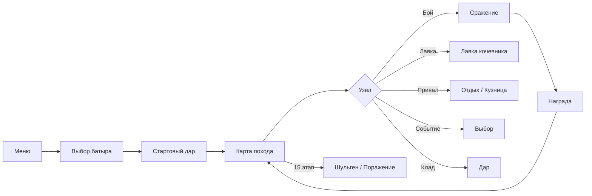
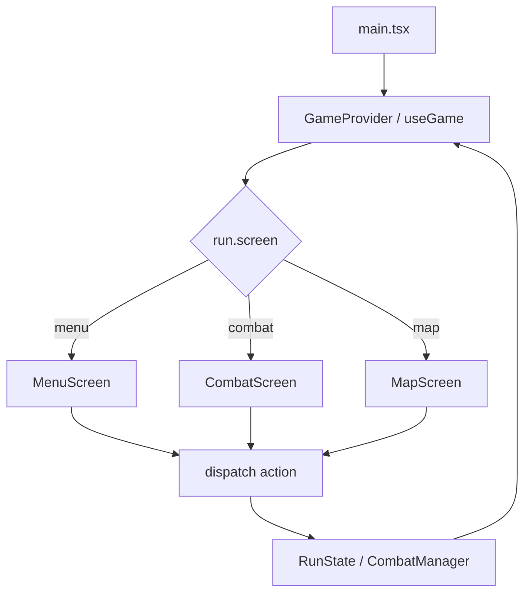
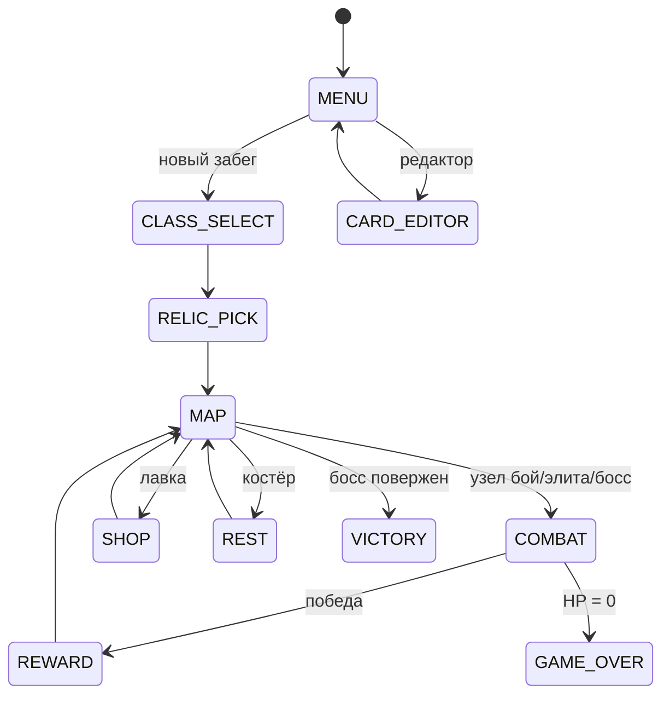
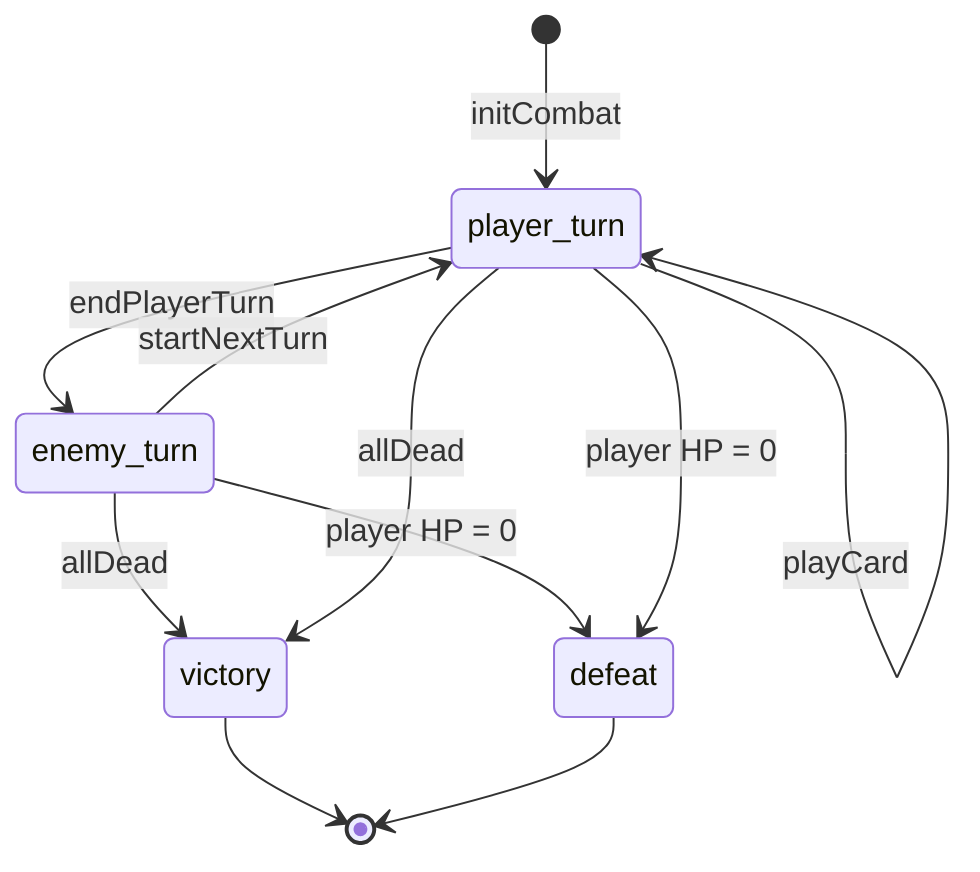
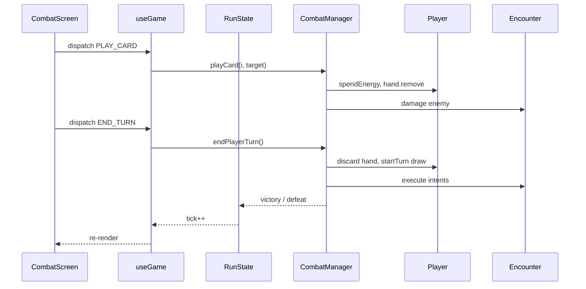
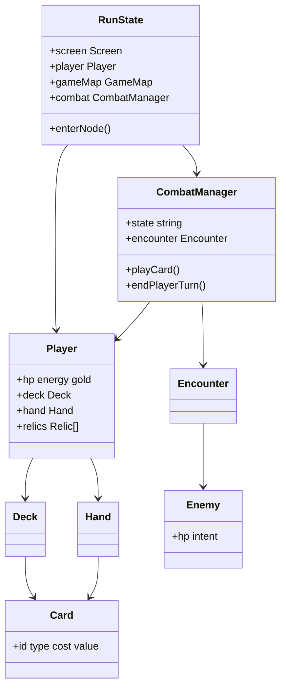
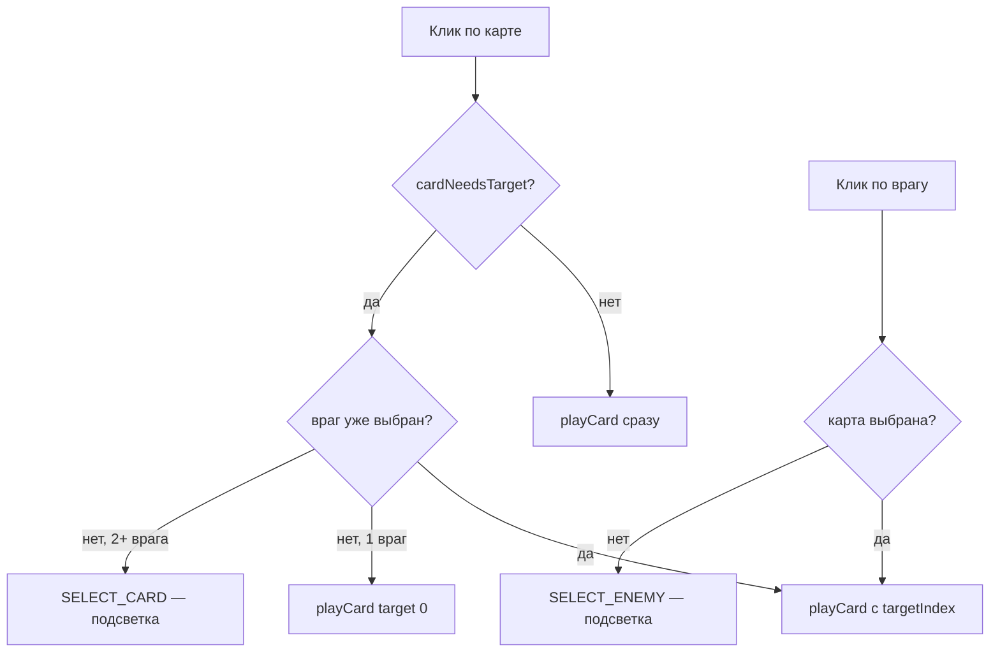

import ExternalCodeEmbed from '@site/src/components/ExternalCodeEmbed';


# TypeScript — OnlineCardGame

<div class="article-tags">
  <span class="tag tag-inprogress">В РАЗРАБОТКЕ</span>
</div>

<span class="complexity-badge">Разработчику</span>
<span class="complexity-badge">Средний уровень</span>

<div class="callout callout--info">
  <div class="callout-title">Формат практикума</div>

  <div class="callout-body">
  Материалы трека приводятся к единому формату: <strong>полные листинги для копирования</strong> на каждом этапе, блок <strong>"Разбор"</strong> и раздел <strong>"Полная ревизия"</strong> в конце статьи.
  <ul>
    <li>Гарантированно запускаемые эталоны для сверки сейчас: <a href="https://github.com/Spirzen/BattleCity">Python — Battle City</a> (GitHub), <a href="https://github.com/Spirzen/Match3">Python — Match3</a> (GitHub, <code>match3.py</code>), <a href="./3.md#full-revision">Python — Ping Pong</a> (<code>#full-revision</code>).</li>
    <li>Раздел полной ревизии в этой статье ещё в работе — идите по этапам по порядку; если код перестал запускаться, сравните проект с этими эталонами.</li>
  </ul>
  </div>
</div>

## Как проходить практикум

- Копируйте **целиком** файлы из блоков кода каждого этапа.
- После каждого этапа **запускайте** проект (команда указана в главе) и пройдите чек-лист самопроверки.
- Если застряли — методология в разделе [Практикум разработки игр — о разделе](./intro.md); для сверки готовые треки [Battle City](https://github.com/Spirzen/BattleCity), [Match3](https://github.com/Spirzen/Match3) и [Ping Pong](./3.md#full-revision).

---

## О практикуме

Соберём **карточный roguelike** в духе *Slay the Spire* прямо в браузере — колода, рука, энергия на ход, намерения врагов, процедурная карта из 15 этапов, награды, дары, лавка и привал. Стек — **TypeScript 5.8**, **React 19**, **Vite 6**; игровая логика — чистый TS без игровых движков, UI — React-компоненты.

<div class="callout callout--info">
  <div class="callout-title">Эталонный проект</div>

  <div class="callout-body">
  Полная реализация — <strong>"Приключения Урала Батыра"</strong>: карточный roguelike по [башкирскому эпосу "Урал-батыр"](https://skazki.rustih.ru/ural-batyr/), 76+ карт с лор-текстами, четыре батыра, три части эпоса на карте, 15 даров, 12 врагов (финал — Шульген), 9 событий, редактор карт, PWA и звук. Репозиторий <a href="https://github.com/Spirzen/OnlineCardGame">Spirzen/OnlineCardGame</a>. Играть онлайн — <a href="https://spirzen.github.io/OnlineCardGame/">spirzen.github.io/OnlineCardGame</a>. Практикум ведёт к той же архитектуре папок и модулей; на каждом этапе проект <strong>собирается и запускается</strong>, даже если это только меню или один бой на простых карточках.
  </div>
</div>

<div class="callout callout--info">
  <div class="callout-title">Для кого материал</div>

  <div class="callout-body">
  Нужны базовый JavaScript, знакомство с React (компоненты, хуки, props) и основы TypeScript из статей <a href="/encyclopedia/5-languages/5-01-javascript/intro">JavaScript — о разделе</a> и <a href="/encyclopedia/5-languages/5-01-javascript/30">TypeScript</a>. Опыт deckbuilder-ов полезен, но механики вводим по одной.
  </div>
</div>

**Управление в финальной версии практикума**

| Действие | Управление |
|----------|------------|
| Клик по карте, врагу, узлу карты, кнопкам | **Мышь** |
| Завершить ход в бою | **E** (или кнопка "Конец хода") |
| Меню / выход | Кнопки на экране |

**Маршрут чтения**

1. [Архитектура](#architecture) — экраны, бой, данные, React-слой.
2. [Зависимости и структура папок](#dependencies).
3. [Этап 0 — минимальный запуск](#stage-0).
4. Этапы 1–15 — одна механика за шаг.
5. [Итоговая самопроверка и эталон](#final-checklist).
6. [Справочник — отличия от эталона](#content-reference) — что перенести после базового прототипа.

Имя папки проекта в примерах — `online-card-game/`; локально можно клонировать [OnlineCardGame](https://github.com/Spirzen/OnlineCardGame) и сравнивать файлы после каждого этапа.

<div class="callout callout--tip">
  <div class="callout-title">Параллельный трек на Python</div>

  <div class="callout-body">
  Тот же жанр и та же архитектура модулей разобраны в главе <a href="/encyclopedia/9-spinoff/9-04-razrabotka-igr/praktikum-razrabotki-igr/7">Python — карточная стратегия</a> (эталон AutoBattler). Сравните <code>CombatManager</code> в TS и Python — правила боя совпадают, меняется только слой отрисовки (React вместо Pygame).
  </div>
</div>

### Что получится в эталоне

| Подсистема | Содержание |
|------------|------------|
| Батыры | Урал Батыр, Хумай, Акбузат, Янбирде — разные стартовые колоды |
| Карта | 15 этапов, три части эпоса, финал — Шульген |
| Бой | энергия, блок, сила, уязвимость, яд, оглушение, намерения, мульти-таргет |
| Контент | 76+ карт с лором, 15 даров, 12 врагов, 9 событий |
| Лор | эпос "Урал-батыр", развёрнутые тексты карт, врагов и встреч |
| Мета | localStorage, ежедневный seed, топ батыров |
| UX | PWA, звук, анимации, редактор карт, просмотр колоды |

### Игровой цикл (как в готовой игре)



### Карта этапов практикума

| Этап | Фокус | Запускается |
|------|-------|-------------|
| 0 | Vite + React | тёмная страница |
| 1–2 | settings, types, Card, JSON | палитра типов карт |
| 3–4 | Deck, Hand, Player | логика в консоли / тестах |
| 5–6 | Enemy, CombatManager | бой без UI |
| 7–9 | useGame, экраны, роутер | меню → заглушки |
| 8 | CombatScreen, CardView | **первый играбельный бой** |
| 10–11 | GameMap, награды | полный цикл узел → бой → карта |
| 12–13 | реликвии, классы, лавка, костёр | мета-прогрессия в забеге |
| 14 | RNG, stats, Vitest | детерминизм и сохранения |
| 15 | PWA, sfx, FX, редактор | уровень эталона |

### Мини-глоссарий deckbuilder

| Термин | Значение в коде |
|--------|-----------------|
| **Забег (run)** | одна попытка от меню до победы/смерти; объект `RunState` |
| **Колода (deck)** | все карты игрока; стопки `drawPile` + `discardPile` |
| **Рука (hand)** | карты, доступные в текущем ходу; `Player.hand` |
| **Энергия** | ресурс на розыгрыш карт за ход; `Player.energy` |
| **Блок** | временная броня до конца хода; `Player.block` |
| **Намерение (intent)** | что враг сделает на своей фазе; `Enemy.currentIntent` |
| **Реликвия** | пассивный предмет на весь забег; `Player.relics[]` |
| **Элита / босс** | бой с множителем HP; флаги в `enterNode` |

---

<span id="architecture"></span>
## Архитектура

Карточный roguelike — это **забег** (run): карта узлов → события → сражения → усиление колоды → босс. Бой — отдельная подсистема с собственным конечным автоматом. В браузерной версии React отвечает за **отображение**, а правила живут в модулях `src/game/` без привязки к DOM.

### Жанровые опоры

| Идея | Откуда в жанре | Как реализуем |
|------|----------------|---------------|
| Карта путей | *Slay the Spire* | `GameMap`, узлы `combat` / `rest` / `shop` … |
| Энергия и рука каждый ход | *Hearthstone*, *Slay the Spire* | `Player.energy`, добор в `CombatManager` |
| Намерения врагов | *Slay the Spire* | `Enemy.planIntent()`, иконка на UI |
| Несколько врагов | *Darkest Dungeon* | `Encounter`, выбор цели атаки |
| Реликвии | *Slay the Spire* | пассивные объекты на `Player.relics` |
| Контент в данных | моддинг | `data/cards.json`, `enemies.json` |

### Цикл приложения (React + Vite)



`App.tsx` — **оркестратор UI**: он не считает урон карт напрямую, а передаёт действия в `RunState` через `dispatch`. Перерисовка — через React Context и счётчик `tick`.

### Экраны забега (конечный автомат UI)



Поле `RunState.screen` переключает ветку в `GameRouter`. Логика боя живёт в `CombatManager`, пока `screen === 'combat'`.

### Конечный автомат боя

Внутри экрана `combat` работает отдельный автомат — UI его не дублирует, только читает `combat.state`:



Константы в `CombatManager` — `STATE_PLAYER_TURN`, `STATE_ENEMY_TURN`, `STATE_VICTORY`, `STATE_DEFEAT`. Флаг `combatOver` блокирует дальнейшие клики; `useGame` по нему вызывает `run.onCombatVictory()` или `run.onCombatDefeat()`.

### Слои приложения

| Слой | Ответственность | Модули |
|------|-----------------|--------|
| **Данные** | Карты, враги, реликвии из JSON | `src/data/*`, импорт в `card.ts` |
| **Модель** | Сущности и правила без React | `card.ts`, `player.ts`, `enemy.ts`, `combat.ts`, `relic.ts` |
| **Забег** | Карта, золото, смена экранов | `runState.ts`, `map.ts` |
| **Представление** | React-экраны и виджеты | `components/*` |
| **Состояние UI** | Context, dispatch, эффекты | `hooks/useGame.tsx`, `hooks/useFx.tsx` |

Правило для поддерживаемости: **урон и блок считаются в `CombatManager`**, React только вызывает `dispatch(&#123; type: 'PLAY_CARD', … &#125;)` и `dispatch(&#123; type: 'END_TURN' &#125;)`.

### Поток данных в бою



### Целевая структура файлов

К концу практикума (и в [OnlineCardGame](https://github.com/Spirzen/OnlineCardGame)) дерево выглядит так:

```
online-card-game/
├── index.html
├── vite.config.ts
├── tsconfig.json
├── tsconfig.app.json
├── package.json
├── public/
│   └── favicon.svg
└── src/
    ├── main.tsx                 # точка входа React
    ├── App.tsx                  # GameRouter, провайдеры
    ├── vite-env.d.ts
    ├── data/
    │   ├── cards.json
    │   ├── enemies.json
    │   └── relics.json
    ├── game/
    │   ├── types.ts             # CardData, Screen, …
    │   ├── settings.ts          # константы баланса
    │   ├── locale.ts            # строки UI
    │   ├── rng.ts               # seeded PRNG
    │   ├── card.ts              # Card, Deck, Hand
    │   ├── cardEffects.ts       # бонусы карт (этап 15+)
    │   ├── player.ts
    │   ├── enemy.ts
    │   ├── combat.ts
    │   ├── relic.ts
    │   ├── map.ts
    │   ├── runState.ts
    │   ├── classes.ts
    │   ├── upgrade.ts
    │   ├── events.ts
    │   ├── stats.ts             # localStorage
    │   ├── sfx.ts               # процедурный звук
    │   └── game.test.ts
    ├── hooks/
    │   ├── useGame.tsx          # Context + dispatch
    │   └── useFx.tsx            # анимации
    ├── components/
    │   ├── MenuScreen.tsx
    │   ├── MapScreen.tsx
    │   ├── CombatScreen.tsx
    │   ├── CardView.tsx
    │   ├── Screens.tsx          # reward, shop, rest …
    │   └── …
    └── styles/
        └── global.css
```

На **этапах 0–6** достаточно `src/game/` с несколькими файлами и одного экрана. Папку `data/` добавляем на **этапе 2**, React-компоненты — с **этапа 7**.

### Диаграмма классов (целевая)



### Справочник модулей `src/game/` (эталон)

| Модуль | Назначение |
|--------|------------|
| `runState.ts` | состояние забега, переходы между экранами, `enterNode`, лавка, костёр |
| `combat.ts` | пошаговый бой, `playCard`, `endPlayerTurn`, лог боя |
| `map.ts` | генерация 15 этажей, связи узлов, `selectNode` |
| `card.ts` / `cardEffects.ts` | карты, колода, ~40 эффектов при розыгрыше |
| `player.ts` | HP, энергия, статусы, колода, рука |
| `enemy.ts` | враги, намерения, элиты и боссы |
| `relic.ts` | реликвии и триггеры начала/конца боя |
| `upgrade.ts` | улучшение карт в кузнице |
| `rng.ts` | детерминированный PRNG с seed |
| `stats.ts` | статистика сессии в `localStorage` |
| `customCards.ts` | пользовательские карты из редактора |
| `events.ts` | случайные события на карте |
| `classes.ts` | определения классов персонажей |
| `locale.ts` | все строки интерфейса |
| `sfx.ts` | процедурный звук (Web Audio API) |

### Таблица действий `dispatch`

Все клики UI сводятся к дискретным действиям в `useGame.tsx`. Это упрощает отладку: достаточно поставить `console.log` в `applyAction`.

| `type` | Когда вызывается | Метод `RunState` / `CombatManager` |
|--------|------------------|-------------------------------------|
| `BEGIN_RUN` | "Новый забег" | `beginRunSetup(false)` |
| `BEGIN_DAILY` | "Ежедневный забег" | `beginRunSetup(true)` |
| `SELECT_CLASS` | выбор класса | `selectClass` |
| `PICK_STARTER_RELIC` | стартовая реликвия | `pickStarterRelic` → `startRunWithClass` |
| `SELECT_NODE` | клик по узлу карты | `gameMap.selectNode` → `enterNode` |
| `PLAY_CARD` | клик по карте в бою | `combat.playCard` |
| `END_TURN` | кнопка / клавиша E | `combat.endPlayerTurn` |
| `SELECT_CARD` / `SELECT_ENEMY` | выбор цели | поля `selectedCardIndex`, `selectedEnemyIndex` |
| `PICK_REWARD` / `SKIP_REWARD` | экран награды | `pickRewardCard` / `skipReward` |
| `REST_HEAL` / `OPEN_SMITH` / `SMITH_UPGRADE` | костёр | `restHeal`, `openSmith`, `smithUpgrade` |
| `BUY_CARD` / `BUY_RELIC` / `REMOVE_CARD` / `LEAVE_SHOP` | лавка | соответствующие методы с ценами |
| `PICK_EVENT` / `CONTINUE_EVENT` | случайное событие | `pickEventChoice`, `continueFromEvent` |
| `TOGGLE_DECK` | просмотр колоды | `deckModalOpen` |
| `GO_MENU` / `OPEN_STATS` / `OPEN_EDITOR` | навигация | `goToMenu`, `openStats`, `openCardEditor` |

### Схема записи карты в JSON

Минимальные поля — `id`, `name`, `type`, `cost`, `value`, `description`, `rarity`. Расширения из эталона:

| Поле | Тип | Пример | Эффект |
|------|-----|--------|--------|
| `effect` | string | `"vulnerable"` | статус при попадании |
| `effect_value` | number | `2` | сила эффекта |
| `effect2` | string | `"weak"` | второй статус |
| `aoe` | boolean | `true` | урон/дебафф по всем врагам |
| `block` | number | `5` | броня в дополнение к `value` |
| `draw` | number | `2` | добор карт |
| `energy_gain` | number | `1` | +энергия при розыгрыше |
| `lifesteal` | boolean | `true` | исцление от урона |
| `bonuses` | array | `[&#123;id, value, target&#125;]` | несколько эффектов через `cardEffects.ts` |
| `upgraded` | boolean | `true` | метка после кузницы |

Новую карту в эталоне достаточно добавить в `cards.json` — TypeScript подхватит её через `CardData` в `types.ts`.

<div class="callout callout--tip">
  <div class="callout-title">Данные карт в JSON</div>

  <div class="callout-body">
  Дизайнер баланса правит <code>src/data/cards.json</code> без переписывания логики. Код знает <strong>типы</strong> (<code>attack</code>, <code>block</code>, <code>buff</code>…) и <strong>эффекты</strong> (<code>vulnerable</code>, <code>draw</code>…), числа лежат в данных — так устроен и полный OnlineCardGame.
  </div>
</div>

<div class="callout callout--tip">
  <div class="callout-title">Логика без React</div>

  <div class="callout-body">
  Классы в <code>src/game/</code> тестируются через Vitest без jsdom. UI подписывается на изменения через Context — для бота или мультиплеера вызываются те же методы <code>CombatManager</code>.
  </div>
</div>

---

<span id="dependencies"></span>
## Зависимости и подготовка окружения

### Требования

- **Node.js 18+** (рекомендуется 20 LTS).
- **npm**, pnpm или yarn.
- Браузер с поддержкой ES2022.

### Создание проекта с нуля (альтернатива клону)

```bash
npm create vite@latest online-card-game -- --template react-ts
cd online-card-game
npm install
npm run dev
```

Vite откроет dev-сервер (обычно `http://localhost:5173`) с шаблонным React-приложением.

### Клон эталона для сверки

```bash
git clone https://github.com/Spirzen/OnlineCardGame.git
cd OnlineCardGame
npm install
npm run dev
```

Главное меню "Приключения Урала Батыра" на русском, кнопка "Новый поход". Практикум можно проходить **параллельно** в своей папке, сверяя готовые модули с одноимёнными файлами в репозитории.

### Зависимости эталона

`package.json` (основное):


<ExternalCodeEmbed example="json/sp-9-9-04-razrabotka-igr-praktikum-razrabotki-igr-9-001" title="Зависимости эталона" minHeight={480} />


На **этапах 0–12** достаточно React + Vite + TypeScript. PWA (`vite-plugin-pwa`) и Vitest добавим позже.

### `vite.config.ts` (минимум для этапа 0)

```typescript

import { defineConfig } from 'vite';
import react from '@vitejs/plugin-react';

export default defineConfig({
  plugins: [react()],
  base: './',
});
```

`base: './'` нужен для деплоя на GitHub Pages — относительные пути к ассетам.

### `tsconfig.app.json` — важные флаги

```json
{
  "compilerOptions": {
    "target": "ES2022",
    "lib": ["ES2022", "DOM", "DOM.Iterable"],
    "module": "ESNext",
    "moduleResolution": "bundler",
    "jsx": "react-jsx",
    "strict": true,
    "resolveJsonModule": true,
    "noEmit": true
  },
  "include": ["src"]
}
```

`resolveJsonModule: true` позволяет `import cards from '../data/cards.json'`.

<div class="callout callout--warning">
  <div class="callout-title">Кодировка JSON</div>

  <div class="callout-body">
  Файлы в <code>src/data/</code> сохраняйте в <strong>UTF-8</strong> — иначе кириллица в названиях карт сломается при сборке на Windows.
  </div>
</div>

### Деплой на GitHub Pages

После этапа 15 (или раньше, если нужна демо-ссылка):

```bash
npm run build
# содержимое dist/ — статический сайт
```

1. В репозитории GitHub включите **Pages** → Source: **GitHub Actions** или ветка `gh-pages` с папкой `/dist`. Workflow — [CI/CD рецепты](/lab/Примеры/1134), пошаговый кейс — [GitHub Pages](/lab/Кейсы/3).
2. В `vite.config.ts` обязательно `base: './'` — иначе на `username.github.io/RepoName/` не подгрузятся JS/CSS.
3. Проверка локально: `npm run preview` и открыть указанный URL.

<div class="callout callout--info">
  <div class="callout-title">Структура tsconfig</div>

  <div class="callout-body">
  В эталоне два файла — <code>tsconfig.json</code> (references) и <code>tsconfig.app.json</code> (компиляция <code>src/</code>). Тесты подключают <code>vitest/globals</code> через <code>types</code> в <code>tsconfig.app.json</code> или отдельный <code>tsconfig.node.json</code> для конфига Vite.
  </div>
</div>

### Рекомендуемая настройка редактора

- **VS Code / Cursor** — расширения ESLint (если добавите), Prettier; встроенный TypeScript language service подсветит ошибки `strict`.
- При сохранении включите format on save для единообразия кавычек в TSX.
- DevTools → вкладка **Components** (React DevTools) помогает отследить, перерисовался ли `CombatScreen` после `dispatch`.

---

<span id="stage-0"></span>
## Этап 0 — минимальный запускаемый код

**Цель** — Vite + React + TypeScript, тёмный экран с подписью этапа, hot reload при сохранении файлов.

<div class="callout callout--tip">
  <div class="callout-title">HMR и игровое состояние</div>

  <div class="callout-body">
  При hot reload React может пересоздать <code>GameProvider</code> и сбросить забег. Для проверки боевой логики на поздних этапах используйте полное обновление страницы (F5).
  </div>
</div>

### Файлы

`index.html`:

```html
<!doctype html>
<html lang="ru">
  <head>
    <meta charset="UTF-8" />
    <meta name="viewport" content="width=device-width, initial-scale=1.0" />
    <title>Карточный roguelike — этап 0</title>
  </head>
  <body>
    <div id="root"></div>
    <script type="module" src="/src/main.tsx"></script>
  </body>
</html>
```

`src/main.tsx`:

```typescript

import { StrictMode } from 'react';
import { createRoot } from 'react-dom/client';
import App from './App';
import './styles/global.css';

createRoot(document.getElementById('root')!).render(
  <StrictMode>
    <App />
  </StrictMode>,
);
```

`src/App.tsx`:

```typescript
export default function App() {
  return (
    <div className="app">
      <h1>Карточный roguelike</h1>
      <p>Этап 0 — проект собран, dev-сервер работает.</p>
    </div>
  );
}
```

`src/styles/global.css`:


<ExternalCodeEmbed example="css/sp-9-9-04-razrabotka-igr-praktikum-razrabotki-igr-9-002" title="Файлы" minHeight={444} />


На **этапе 15** замените фон на дизайн-систему эталона — CSS-переменные в `:root` (`--bg-deep`, `--gold`, `--font-display`), слои `.aurora` и `.stars` в `App.tsx`, шрифты Cinzel и Outfit из Google Fonts (см. `index.html` эталона).

### Запуск

```bash
npm run dev
```

**Самопроверка**

- [ ] Браузер открывается без ошибок в консоли.
- [ ] Изменение текста в `App.tsx` сразу видно на странице (HMR).
- [ ] `npm run build` завершается успешно.

---

<span id="stage-1"></span>
## Этап 1 — настройки и типы

**Цель** — вынести константы в `settings.ts`, описать типы карт и экранов в `types.ts`.

### `src/game/settings.ts`


<ExternalCodeEmbed example="typescript/sp-9-9-04-razrabotka-igr-praktikum-razrabotki-igr-9-003" title="`src/game/settings.ts`" minHeight={624} />


### `src/game/types.ts`


<ExternalCodeEmbed example="typescript/sp-9-9-04-razrabotka-igr-praktikum-razrabotki-igr-9-004" title="`src/game/types.ts`" minHeight={678} />


Обновите `App.tsx` — импортируйте `CARD_TYPE_COLORS` и покажите палитру типов карт цветными квадратами.

**Самопроверка**

- [ ] TypeScript не ругается на `strict: true`.
- [ ] Константы карт и узлов импортируются из одного файла `settings.ts`.

---

<span id="stage-2"></span>
## Этап 2 — модель карты и JSON

**Цель** — класс `Card`, загрузка базы из `src/data/cards.json`, фабрика `createCard`.

### `src/data/cards.json`


<ExternalCodeEmbed example="json/sp-9-9-04-razrabotka-igr-praktikum-razrabotki-igr-9-005" title="`src/data/cards.json`" minHeight={624} />


### `src/game/card.ts` (начало файла)


<ExternalCodeEmbed example="typescript/sp-9-9-04-razrabotka-igr-praktikum-razrabotki-igr-9-006" title="`src/game/card.ts` (начало файла)" minHeight={720} />


Проверка в консоли браузера или временном скрипте:

```typescript

import { createStartingDeck } from './game/card';

console.log(createStartingDeck().length, createStartingDeck()[0].name);
// 10 "Удар"
```

**Самопроверка**

- [ ] Импорт JSON работает (`resolveJsonModule`).
- [ ] У каждой карты есть `type`, `cost`, `value`.

---

<span id="stage-3"></span>
## Этап 3 — колода и рука

**Цель** — `Deck` (стопка добора, сброс, перетасовка) и `Hand` (лимит карт).

Дополните `src/game/card.ts`:


<ExternalCodeEmbed example="typescript/sp-9-9-04-razrabotka-igr-praktikum-razrabotki-igr-9-007" title="Этап 3 — колода и рука" minHeight={720} />


На **этапе 14** заменим `Math.random()` в `shuffle` на `rngInt` из `rng.ts` для детерминированных забегов.

**Самопроверка**

- [ ] Пустая стопка добора перетасовывает сброс.
- [ ] Рука не принимает 11-ю карту при `MAX_HAND = 10`.

---

<span id="stage-4"></span>
## Этап 4 — игрок (HP, энергия, блок)

**Цель** — `Player` с боевым сбросом состояния и экономикой урона/брони.

### `src/game/player.ts`


<ExternalCodeEmbed example="typescript/sp-9-9-04-razrabotka-igr-praktikum-razrabotki-igr-9-008" title="`src/game/player.ts`" minHeight={720} />


Временная заглушка `src/game/relic.ts` (полная версия на этапе 12):

```typescript
export class Relic {
  id: string;
  name: string;
  effect: string;
  value: number;

  constructor(data: { id: string; name: string; effect: string; value: number }) {
    this.id = data.id;
    this.name = data.name;
    this.effect = data.effect;
    this.value = data.value;
  }
}
```

**Самопроверка**

- [ ] `takeDamage(10)` при `block = 5` оставляет 45 HP из 50.
- [ ] `vulnerable = 2` умножает входящий урон ×1.5.

---

<span id="stage-5"></span>
## Этап 5 — враг и намерения

**Цель** — `Enemy` с циклом намерений, `Encounter` для группы врагов, данные из JSON.

### `src/data/enemies.json`


<ExternalCodeEmbed example="json/sp-9-9-04-razrabotka-igr-praktikum-razrabotki-igr-9-009" title="`src/data/enemies.json`" minHeight={390} />


### `src/game/enemy.ts` (ядро)


<ExternalCodeEmbed example="typescript/sp-9-9-04-razrabotka-igr-praktikum-razrabotki-igr-9-010" title="`src/game/enemy.ts` (ядро)" minHeight={720} />


**Самопроверка**

- [ ] После `executeIntent` намерение на **следующий** ход уже спланировано.
- [ ] `getLivingEnemies()` не возвращает мёртвых.

---

<span id="stage-6"></span>
## Этап 6 — менеджер боя

**Цель** — `CombatManager` — розыгрыш карт, ход игрока, фаза врагов, победа/поражение.

### Порядок одного полного хода

1. **Старт боя** — `initCombat` — `resetCombat`, добор `STARTING_HAND` карт, `turn = 1`.
2. **Фаза игрока** — `playCard` сколько угодно раз, пока хватает энергии; каждая карта → `resolveCard` → сброс в `discardPile`.
3. **Конец хода** — `endPlayerTurn`: сброс руки, `enemyPhase` для каждого живого врага (`executeIntent` + планирование следующего намерения).
4. **Проверки** — все враги мертвы → победа; HP игрока 0 → поражение.
5. **Новый ход** — `startNextTurn`: `player.startTurn`, добор `DRAW_PER_TURN`, снова фаза игрока.

В эталоне между шагами 3 и 5 вставлены хуки `processPlayerEndTurn` / `processPlayerStartTurn` из `cardEffects.ts` (реген, металлическая броня, шипы).

### `src/game/combat.ts` (упрощённая версия)


<ExternalCodeEmbed example="typescript/sp-9-9-04-razrabotka-igr-praktikum-razrabotki-igr-9-011" title="`src/game/combat.ts` (упрощённая версия)" minHeight={720} />


Проверка без UI — временный файл или Vitest:

```typescript

import { Player } from './player';
import { createCombatEncounter } from './enemy';
import { CombatManager } from './combat';

const p = new Player();
const c = new CombatManager(p, createCombatEncounter());
c.playCard(0, 0);
c.endPlayerTurn();
console.log(c.log);
```

**Самопроверка**

- [ ] Карта с `cost > energy` не розыгрывается.
- [ ] После "конец хода" враг атакует, игрок получает новую руку.
- [ ] HP = 0 переводит бой в поражение.

---

<span id="stage-7"></span>
## Этап 7 — React Context и главное меню

**Цель** — `useGame` с `RunState`, `dispatch` и первый экран `MenuScreen`.

### `src/game/runState.ts` (минимум)


<ExternalCodeEmbed example="typescript/sp-9-9-04-razrabotka-igr-praktikum-razrabotki-igr-9-012" title="`src/game/runState.ts` (минимум)" minHeight={354} />


### `src/hooks/useGame.tsx`


<ExternalCodeEmbed example="typescript/sp-9-9-04-razrabotka-igr-praktikum-razrabotki-igr-9-013" title="`src/hooks/useGame.tsx`" minHeight={720} />


<div class="callout callout--tip">
  <div class="callout-title">RunState в useRef</div>

  <div class="callout-body">
  <code>RunState</code> — мутабельный объект с десятками полей. Храним один экземпляр в <code>useRef</code>, а после каждого <code>dispatch</code> увеличиваем <code>tick</code>, чтобы React перерисовал дерево. Так устроен эталонный <code>useGame.tsx</code>.
  </div>
</div>

### `src/components/MenuScreen.tsx`


<ExternalCodeEmbed example="typescript/sp-9-9-04-razrabotka-igr-praktikum-razrabotki-igr-9-014" title="`src/components/MenuScreen.tsx`" minHeight={372} />


### `src/App.tsx` — роутер экранов


<ExternalCodeEmbed example="typescript/sp-9-9-04-razrabotka-igr-praktikum-razrabotki-igr-9-015" title="`src/App.tsx` — роутер экранов" minHeight={444} />


**Самопроверка**

- [ ] Кнопка "Новый забег" меняет экран на заглушку карты.
- [ ] В консоли нет предупреждений React о ключах или контексте.

---

<span id="stage-8"></span>
## Этап 8 — экран боя и карточки

**Цель** — `CombatScreen`, `CardView`, `PlayerHUD`; розыгрыш карт мышью.

### Выбор цели (таргетинг)

Когда врагов больше одного, атакующие карты требуют двух кликов — сначала карта, затем враг (или наоборот):



Логика в эталоне — `CombatScreen.onCardClick` / `onEnemyClick` и ветка `PLAY_CARD` в `useGame.tsx`:


<ExternalCodeEmbed example="typescript/sp-9-9-04-razrabotka-igr-praktikum-razrabotki-igr-9-016" title="Выбор цели (таргетинг)" minHeight={390} />


Клавиша **E** / **У** — `useEffect` с `keydown` в `CombatScreen` вызывает `dispatch(&#123; type: 'END_TURN' &#125;)`.

### `src/components/CardView.tsx`


<ExternalCodeEmbed example="typescript/sp-9-9-04-razrabotka-igr-praktikum-razrabotki-igr-9-017" title="`src/components/CardView.tsx`" minHeight={552} />


### `src/components/CombatScreen.tsx` (скелет)


<ExternalCodeEmbed example="typescript/sp-9-9-04-razrabotka-igr-praktikum-razrabotki-igr-9-018" title="`src/components/CombatScreen.tsx` (скелет)" minHeight={720} />


Расширьте `useGame.tsx` — добавьте действия `PLAY_CARD`, `END_TURN`, `SELECT_ENEMY`, `SELECT_CARD` (см. эталонный файл). В `RunState` добавьте поле `combat: CombatManager | null` и метод `startTestCombat()` для отладки:

```typescript

import { CombatManager } from './combat';
import { createCombatEncounter } from './enemy';

startTestCombat() {
  this.combat = new CombatManager(this.player, createCombatEncounter());
  this.screen = 'combat';
}
```

CSS для карт (фрагмент `global.css`):


<ExternalCodeEmbed example="css/sp-9-9-04-razrabotka-igr-praktikum-razrabotki-igr-9-019" title="`src/components/CombatScreen.tsx` (скелет)" minHeight={534} />


**Самопроверка**

- [ ] Клик по карте тратит энергию и обновляет HP врага.
- [ ] "Конец хода" запускает атаку врага и новый добор.
- [ ] Недоступные карты визуально отличаются (нет класса `--playable`).
- [ ] При двух врагах без выбранной цели карта только подсвечивается.
- [ ] Клавиша E завершает ход.

<div class="callout callout--info">
  <div class="callout-title">Эталон CardView</div>

  <div class="callout-body">
  В репозитории <code>CardView.tsx</code> оборачивает карту в <code>Tooltip</code> с детальным описанием, использует CSS-переменную <code>--card-accent</code>, варианты <code>hand</code> / <code>combat</code> / <code>reward</code> / <code>shop</code>. Компоненты <code>PlayerHUD</code> и <code>EnemyPanel</code> показывают полоски HP, блок, статусы и иконку намерения.
  </div>
</div>

---

<span id="stage-9"></span>
## Этап 9 — полный роутер экранов

**Цель** — как в эталонном `App.tsx` — словарь экранов, `BannerOverlay`, подключение всех заглушек.

Обновите `App.tsx`:


<ExternalCodeEmbed example="typescript/sp-9-9-04-razrabotka-igr-praktikum-razrabotki-igr-9-020" title="Этап 9 — полный роутер экранов" minHeight={480} />


Каждый экран — функциональный компонент с `useGame()`. Пустые экраны (`ShopScreen`, `RestScreen`) пока возвращают кнопку "На карту" с `dispatch(&#123; type: 'GO_MAP' &#125;)`.

**Самопроверка**

- [ ] Переключение `run.screen` меняет содержимое без перезагрузки страницы.
- [ ] Нет "мигания" при смене экрана (при желании добавьте CSS-переход как в эталоне `screen-wrap--transition`).

---

<span id="stage-10"></span>
## Этап 10 — процедурная карта

**Цель** — `GameMap` с 15 этажами, развилками и доступностью узлов.

### Веса типов узлов (эталон)

В `GameMap.randomNodeType` вероятности заданы явно — это баланс "скучных" боёв и редких элит:

| Тип узла | Вес | Примечание |
|----------|-----|------------|
| `combat` | 45 | основной контент |
| `elite` | 12 | с 3-го этажа (`floor < 3` → 0) |
| `event` | 17 | случайный текст + выбор |
| `shop` | 10 | трата золота |
| `treasure` | 8 | выбор реликвии |
| `rest` | 8 | лечение / кузница |

Каждый 5-й этаж (кроме первого и последнего) принудительно получает `rest` на первой колонке — предсказуемая передышка перед блоком сложнее.

### `src/game/map.ts` (ядро)


<ExternalCodeEmbed example="typescript/sp-9-9-04-razrabotka-igr-praktikum-razrabotki-igr-9-021" title="`src/game/map.ts` (ядро)" minHeight={720} />


### `src/components/MapScreen.tsx`


<ExternalCodeEmbed example="typescript/sp-9-9-04-razrabotka-igr-praktikum-razrabotki-igr-9-022" title="`src/components/MapScreen.tsx`" minHeight={660} />


Добавьте в `settings.ts` константы `NODE_COLORS` и `NODE_ICONS` (как в эталоне).

В `RunState.startNewRun()`:

```typescript

import { GameMap } from './map';

startNewRun() {
  this.player = new Player();
  this.gameMap = new GameMap();
  this.combat = null;
  this.screen = 'map';
}
```

**Самопроверка**

- [ ] После первого узла доступны только соседи следующего этажа.
- [ ] Узел босса на последнем этаже.

---

<span id="stage-11"></span>
## Этап 11 — связка карта → бой → награда

**Цель** — `enterNode`, победа переводит на экран `reward`, выбор карты добавляет её в колоду.

### `RunState.enterNode` и награды


<ExternalCodeEmbed example="typescript/sp-9-9-04-razrabotka-igr-praktikum-razrabotki-igr-9-023" title="`RunState.enterNode` и награды" minHeight={696} />


### `getRewardCards` в `card.ts`

```typescript
export function getRewardCards(count = 3): Card[] {
  const pool = cardDb.filter((c) => c.rarity !== 'basic');
  const shuffled = [...pool].sort(() => Math.random() - 0.5);
  return shuffled.slice(0, count).map((d) => createCard(d));
}
```

В `useGame` после `playCard`, если `combat.combatOver && combat.victory`, вызывайте `run.onCombatVictory()`.

### `completeNode` — завершение узла

Центральный метод эталона — вызывается после награды, лавки, костра, события:

```typescript
completeNode() {
  if (this.gameMap && this.pendingNode) {
    this.gameMap.completeCurrentNode();
    if (this.gameMap.isBossFloor() && this.pendingNode.completed) {
      this.recordRunEnd(true);
      this.screen = 'victory';
      return;
    }
  }
  this.screen = 'map';
  this.pendingNode = null;
  this.combat = null;
}
```

Победа над боссом на 15-м этаже → экран `victory` и запись в статистику. Любой другой узел → возврат на карту.

### `RewardScreen`


<ExternalCodeEmbed example="typescript/sp-9-9-04-razrabotka-igr-praktikum-razrabotki-igr-9-024" title="`RewardScreen`" minHeight={462} />


**Самопроверка**

- [ ] Колода растёт после выбора карты.
- [ ] Возврат на карту, текущий узел отмечен пройденным.

---

<span id="stage-12"></span>
## Этап 12 — реликвии и классы

**Цель** — стартовая реликвия, экраны `class_select` и `relic_pick`, хуки в начале боя.

### `src/data/relics.json`


<ExternalCodeEmbed example="json/sp-9-9-04-razrabotka-igr-praktikum-razrabotki-igr-9-025" title="`src/data/relics.json`" minHeight={390} />


### `src/game/relic.ts` — триггеры


<ExternalCodeEmbed example="typescript/sp-9-9-04-razrabotka-igr-praktikum-razrabotki-igr-9-026" title="`src/game/relic.ts` — триггеры" minHeight={714} />


В `CombatManager.initCombat()` после добора карт вызовите `applyRelicOnCombatStart` для каждой реликвии. В `onCombatVictory()` — `applyRelicOnCombatEnd`.

### Классы (`src/game/classes.ts`)


<ExternalCodeEmbed example="typescript/sp-9-9-04-razrabotka-igr-praktikum-razrabotki-igr-9-027" title="Классы (`src/game/classes.ts`)" minHeight={390} />


Поток забега: `menu` → `class_select` → `relic_pick` → `map` (как в эталонном `runState.ts`).

### Три класса (эталон `classes.ts`)

| Класс | HP | Стартовая колода (суть) |
|-------|-----|-------------------------|
| **Воин** ⚔ | 85 | 4× Удар, 4× Защита, Сокрушение, Железная волна |
| **Плут** 🗡 | 75 | 5× Удар, 3× Защита, Плечи напряг, Боевой транс |
| **Страж** 🛡 | 90 | 3× Удар, 5× Защита, Истинная стойкость, Пылающий гнев |

`createStartingDeck(classId)` читает массив `&#123; id, count &#125;` из `CLASSES` и разворачивает его в `Deck`.

**Самопроверка**

- [ ] После победы HP растёт при `burning_blood`.
- [ ] Враги начинают бой с уязвимостью при `bag_of_marbles`.
- [ ] Три класса дают разные стартовые колоды (расширьте `createStartingDeck(classId)`).

---

<span id="stage-13"></span>
## Этап 13 — лавка и костёр

**Цель** — узлы `shop` и `rest`, трата золота, лечение и кузница.

| Узел | Логика |
|------|--------|
| **rest** | лечение 25% max HP или экран `smith` (кузница) |
| **shop** | покупка карты за 50 золота, реликвии за 150, удаление карты за 75 |

`restHeal` в эталоне:

```typescript
restHeal() {
  this.player.heal(Math.floor(this.player.maxHp / 4));
  this.completeNode();
}
```

Покупка карты:

```typescript
buyCard(index: number) {
  const card = this.shopCards[index];
  if (!card || this.player.gold < 50) return;
  this.player.gold -= 50;
  this.player.addCardToDeck(card);
  this.shopCards.splice(index, 1);
}
```

### Улучшение карт (`src/game/upgrade.ts`)

```typescript

import type { Card } from './card';

export function upgradeCard(card: Card): Card {
  const up = card.copy();
  up.upgraded = true;
  if (up.type === 'attack') up.value += 3;
  else if (up.type === 'block') up.value += 3;
  else up.cost = Math.max(0, up.cost - 1);
  return up;
}
```

**Самопроверка**

- [ ] Золото уменьшается при покупке.
- [ ] На костре HP не превышает максимум.
- [ ] Улучшенная карта помечена `upgraded: true`.

---

<span id="stage-14"></span>
## Этап 14 — RNG, статистика, ежедневный забег

**Цель** — детерминированный PRNG с seed, сохранение мета-прогресса в `localStorage`.

### Ежедневный забег

`beginRunSetup(daily)` в `RunState`:

- обычный забег — `runSeed = randomSeed()` (XOR времени и `Math.random`);
- ежедневный — `runSeed = dailySeed()` = `YYYYMMDD` из текущей даты.

Один seed → одна и та же карта узлов, одни и те же награды и события у всех игроков в этот день. Отдельное поле `stats.dailyBestFloor` хранит рекорд именно для daily-режима.

```typescript
beginRunSetup(daily = false) {
  this.isDailyRun = daily;
  this.runSeed = daily ? dailySeed() : randomSeed();
  this.screen = 'class_select';
}

selectClass(classId: string) {
  setActiveRng(new SeededRNG(this.runSeed));
  // …
}
```

### `src/game/rng.ts`


<ExternalCodeEmbed example="typescript/sp-9-9-04-razrabotka-igr-praktikum-razrabotki-igr-9-028" title="`src/game/rng.ts`" minHeight={660} />


Замените `Math.random()` в `Deck.shuffle`, `GameMap.generate` и `getRewardCards` на функции из `rng.ts`.

### `src/game/stats.ts`


<ExternalCodeEmbed example="typescript/sp-9-9-04-razrabotka-igr-praktikum-razrabotki-igr-9-029" title="`src/game/stats.ts`" minHeight={516} />


В `RunState.recordRunEnd(won)` обновляйте `bestFloor`, `totalWins`, сохраняйте через `saveSessionStats`.

### Vitest

`src/game/game.test.ts`:


<ExternalCodeEmbed example="typescript/sp-9-9-04-razrabotka-igr-praktikum-razrabotki-igr-9-030" title="Vitest" minHeight={516} />


Добавьте в `vite.config.ts`:

```typescript
/// <reference types="vitest/config" />
export default defineConfig({
  // ...
  test: { globals: true },
});
```

```bash
npm test
```

**Самопроверка**

- [ ] Два забега с одним `runSeed` дают одинаковую карту узлов.
- [ ] Второй забег показывает статистику в меню.
- [ ] `npm test` проходит без ошибок.

---

<span id="stage-15"></span>
## Этап 15 — PWA, звук, эффекты, редактор (полировка)

**Цель** — довести прототип до уровня эталона — установка как приложение, UX, расширенный контент.

### PWA и offline

```bash
npm install -D vite-plugin-pwa
```

Фрагмент `vite.config.ts` из эталона:


<ExternalCodeEmbed example="typescript/sp-9-9-04-razrabotka-igr-praktikum-razrabotki-igr-9-031" title="PWA и offline" minHeight={426} />


После `npm run build` Chrome предложит "Установить приложение". Offline-кэш подхватывает уже загруженные ресурсы через Workbox.

### Звук (`src/game/sfx.ts`)

Процедурные звуки через **Web Audio API** — отдельные mp3 не нужны. Класс `SfxEngine` генерирует короткие осцилляторные "блипы":

| Метод | Когда |
|-------|-------|
| `click()` | любая кнопка меню |
| `attack()` | карта типа attack / creature |
| `block()` | карта block |
| `card()` | buff / debuff / draw |
| `turn()` | конец хода |
| `victory()` / `defeat()` | исход боя |
| `boss()` / `elite()` | баннер при входе в бой |
| `toggleMute()` | кнопка в меню |

Вызовы расставлены в `useGame.applyAction` — UI остаётся "глухим" к деталям синтеза.

### Эффекты (`src/hooks/useFx.tsx`)

Второй Context параллельно `useGame`:

- `spawn('damage', &#123; value, x, y &#125;)` — всплывающее число урона;
- `spawn('slash')`, `spawn('block')`, `spawn('heal')`;
- `shake()` — CSS-класс тряски на `.combat-area`;
- `useScreenTransition(screen)` — короткая анимация смены экрана.

`CombatScreen` хранит `prevHp` в `useRef` и при падении HP вызывает `spawn` + `shake`.

### Дизайн-система CSS

Эталонный `global.css` (~1600 строк) строится на переменных:

```css
:root {
  --bg-deep: #06040f;
  --gold: #ffd75a;
  --accent: #8c5ae0;
  --hp: #dc4650;
  --block: #4696dc;
  --energy: #ffc832;
  --font-display: 'Cinzel', Georgia, serif;
  --font-body: 'Outfit', system-ui, sans-serif;
}
```

Слои `.aurora` + `.stars` в `App.tsx` дают фон без Canvas. Карты используют `.card`, `.card--playable`, `.card--selected`; узлы карты — `.map-node`, `.map-node--available`.

### Редактор карт

Экран `card_editor` (`ExtraScreens.tsx`):

1. Форма — имя, тип, стоимость, значение, описание.
2. `customCards.ts` — `saveCustomCard`, `loadCustomCards` в `localStorage`.
3. `getRewardCards` / `getShopCards` объединяют базу JSON с кастомными картами (`custom: true`, rarity `custom`).

### Случайные события (`events.ts`)

Пять событий в массиве `GAME_EVENTS`. Каждое — `title`, `description`, массив `choices` с функцией `apply(player)`:

| id | Суть |
|----|------|
| `shrine` | +15 HP или золото за урон |
| `merchant` | подарок золота или зелье |
| `path` | риск через пропасть |
| `altar` | +1 max HP или +1 max energy |
| `trap` | гарантированный или 50% урон |

При входе в узел `event` — `rngPick(GAME_EVENTS)`, экран `EventScreen`, после выбора — `continueFromEvent` → `completeNode`.

### Модуль `cardEffects.ts` — карта расширения

После базового `resolveCard` подключите обработчики по одному. Группы эффектов в эталоне:

| Группа | Примеры `effect` / `bonus.id` |
|--------|-------------------------------|
| Статусы на враге | `vulnerable`, `weak`, `poison`, `burn`, `stun`, `mark` |
| Статусы на игроке | `strength`, `dexterity`, `frail`, `metallicize`, `thorns` |
| Урон | `pierce`, `double_hit`, `echo`, `lifesteal`, `execute` |
| Цикл хода | `end_turn_draw`, `end_turn_block`, `next_turn_energy`, `draw`, `energy` |
| Discard-механики | `discard_damage`, `discard_block`, `discard_draw` |

Точка входа — `applyOnPlayBonuses(combat, card, targetIndex, messages)`; конец хода — `processPlayerEndTurn` / `processPlayerStartTurn`.

<div class="callout callout--tip">
  <div class="callout-title">Как добавить один новый эффект</div>

  <div class="callout-body">
  1) Константа в <code>cardEffects.ts</code>. 2) Ветка в <code>applyBonus</code> или <code>resolveCard</code>. 3) Запись в <code>cards.json</code>. 4) Тест в <code>game.test.ts</code>. 5) Проверка в браузере на одном враге.
  </div>
</div>

### Локализация

`src/game/locale.ts` — объект `LOCALE` со всеми строками UI. Компоненты импортируют константы, а не литералы — удобно для будущего i18n.

**Самопроверка**

- [ ] "Установить приложение" доступно в Chrome после production-сборки.
- [ ] Звук отключается кнопкой в меню.
- [ ] Кастомная карта появляется в награде после сохранения в редакторе.
- [ ] Баннер "БОСС" / "ЭЛИТА" мигает при входе в бой (`BannerOverlay`).
- [ ] Модальное окно колоды (`DeckModal`) открывается с карты и из боя.

---

<span id="content-reference"></span>
## Справочник — отличия учебного прототипа от эталона

Если после этапа 14 прототип уже играбелен, используйте эту таблицу как чек-лист "что ещё перенести из репозитория":

| Файл эталона | Что добавляет |
|--------------|---------------|
| `cardEffects.ts` | ~40 эффектов, AOE, echo, discard-платежи |
| `events.ts` + `EventScreen` | 5 narrative-событий на карте |
| `customCards.ts` + `CardEditorScreen` | моддинг без пересборки |
| `sfx.ts` | звуковая обратная связь |
| `useFx.tsx` + `FxOverlay.tsx` | juice — числа урона, тряска |
| `DeckModal.tsx` | просмотр колоды в забеге |
| `ExtraScreens.tsx` | class/relic/stats/smith/editor |
| `stats.ts` + leaderboard | мета между сессиями |
| `global.css` (полный) | визуал уровня коммерческого web-roguelike |

### Формулы баланса (для самостоятельной настройки)

| Механика | Формула в коде |
|----------|----------------|
| Уязвимость | входящий урон × 1.5 (`Math.floor`) |
| Слабость | исходящий урон × 0.75 |
| Хрупкость | блок × 0.75 |
| Улучшение attack/block | `value += 3` |
| Улучшение прочих | `cost -= 1` (мин. 0) |
| Лечение на костре | `maxHp / 4` (эталон) |
| Цена карты в лавке | 50 з (− скидка реликвии) |
| Удаление карты | 75 з |

---

<span id="final-checklist"></span>
## Итоговая самопроверка и эталон

### Чек-лист учебного прототипа

| # | Критерий | Да / нет |
|---|----------|----------|
| 1 | `npm run dev` и `npm run build` без ошибок | |
| 2 | Карты и враги грузятся из JSON | |
| 3 | Колода, рука, сброс, перетасовка | |
| 4 | Энергия, блок, уязвимость работают | |
| 5 | Несколько врагов, выбор цели атаки | |
| 6 | Намерения врагов видны до их хода | |
| 7 | Карта узлов, переход в бой | |
| 8 | Награда — добавление карты в колоду | |
| 9 | Хотя бы одна реликвия влияет на бой | |
| 10 | Код разбит на `game/*`, `components/*`, `data/*` | |
| 11 | Vitest покрывает урон и upgrade | |
| 12 | Статистика сохраняется в localStorage | |
| 13 | Ежедневный seed даёт одинаковую карту | |
| 14 | События / редактор / PWA (этап 15) | |

### Порядок чтения эталона после практикума

1. `types.ts` + `settings.ts` — контракты.
2. `card.ts` → `player.ts` → `enemy.ts` — сущности.
3. `combat.ts` + `cardEffects.ts` — правила боя.
4. `runState.ts` + `map.ts` — забег.
5. `useGame.tsx` — мост UI ↔ логика.
6. `CombatScreen.tsx` + `CardView.tsx` — представление.
7. `global.css` — визуал.

### Сравнение с OnlineCardGame

| Компонент | Практикум (минимум) | [OnlineCardGame](https://github.com/Spirzen/OnlineCardGame) |
|-----------|---------------------|-------------------------------------------------------------|
| Карт в базе | 3–10 | 76+ с лор-текстами |
| Эффекты | удар, блок, уязвимость | ~40 в `cardEffects.ts` |
| Батыров | 1–3 (упрощённо) | 4 с уникальными колодами и цитатами из эпоса |
| Этапов карты | 8–15 | 15 в трёх частях эпоса |
| События / лор | базовые | 9 сцен + `acts.ts`, `expand-lore.mjs` |
| Редактор карт | этап 15 | полный UI + JSON |
| Звук | — | процедурный `sfx.ts` |
| PWA | этап 15 | Workbox + manifest |
| Переходы UI | базовые | баннеры элит и Шульгена, степная палитра |

После прохождения этапов откройте эталон и пройдите по файлам в порядке: `types.ts` → `card.ts` → `combat.ts` → `runState.ts` → `useGame.tsx` → `CombatScreen.tsx` — увидите те же швы, но с полным контентом и полировкой.

### Типичные ошибки

| Симптом | Вероятная причина | Что сделать |
|---------|------------------|-------------|
| Белый экран | ошибка TS/JS в консоли | откройте DevTools → Console |
| UI не обновляется после боя | забыли `setTick` в dispatch | каждый `dispatch` должен инкрементировать `tick` |
| Карты не кликаются | `canPlayCard` false | проверьте энергию и `STATE_PLAYER_TURN` |
| Враг бьёт дважды за ход | `planIntent` не в конце `executeIntent` | планируйте намерение после действия |
| Колода "теряет" карты | при `resetCombat` не собрали discard | `getAllCards()` как в эталоне |
| JSON не грузится | нет `resolveJsonModule` | проверьте `tsconfig.app.json` |
| HMR сбрасывает забег | hot reload пересоздаёт Provider | для теста забега — полная перезагрузка страницы |
| GitHub Pages — пустая страница | неверный `base` | `base: './'` в `vite.config.ts` |

### Идеи для расширения (самостоятельно)

- Статус-эффекты **яд**, **кровотечение**, **оглушение** — поля на `Enemy` и тики в `enemyPhase`.
- **Существа** (`CARD_CREATURE`) — карта остаётся на поле и атакует каждый ход.
- **События** на карте (`events.ts`) — текст и выбор с последствиями.
- **Таблица лидеров** — топ забегов в `SessionStats.leaderboard`.
- **Мультиплеер** — вынести `CombatManager` на WebSocket-сервер; UI остаётся тем же.

---

## Связанные материалы

- [Практикум разработки игр — о разделе](/encyclopedia/9-spinoff/9-04-razrabotka-igr/praktikum-razrabotki-igr/intro) — другие треки (Battle City, Python-карточная стратегия).
- [TypeScript](/encyclopedia/5-languages/5-01-javascript/30) — типы, интерфейсы, strict mode.
- [Веб-игры на HTML5 и Canvas](/encyclopedia/3-data-markup/3-09-html/22) — браузер как платформа для игр.
- [Python — карточная стратегия](/encyclopedia/9-spinoff/9-04-razrabotka-igr/praktikum-razrabotki-igr/7) — тот же жанр на Pygame для сравнения архитектуры.
- Эталонный код — [github.com/Spirzen/OnlineCardGame](https://github.com/Spirzen/OnlineCardGame) ("Приключения Урала Батыра"), играть — [spirzen.github.io/OnlineCardGame](https://spirzen.github.io/OnlineCardGame/).

---
